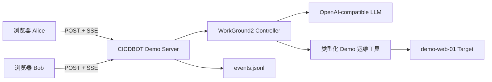

# CICDBOT 两天 Demo 计划
 
> **目标：** 单人配合 AI，在 2 个工作日内做出可现场演示的“团队版服务器 Codex”。  
> **产品设计依据：** [CICDBOT 产品设计文档](PRODUCT_DESIGN.md)  
> **约束：** Demo 只证明核心体验，不承担生产安全、扩展性和完整运维能力。

## 1. Demo 一句话

两名用户打开同一个 Web 运维任务，实时看到彼此和 AI 的操作；AI 调查一个故障中的 Demo 服务，生成恢复计划，等待其中一人批准，执行恢复并验证成功。

## 2. 唯一演示故事

演示对象固定为 `demo-web-01`，初始状态为“5xx 错误率升高”。

1. Alice 和 Bob 分别在两个浏览器窗口进入同一个共享任务。
2. Alice 输入：“调查 demo-web-01 的 5xx，并恢复服务。”
3. 两个窗口同时看到 Alice 的消息和 AI 开始工作。
4. AI 调用只读工具获取服务状态和最近日志。
5. AI 输出根因摘要，并提出“重启服务后验证”的两步计划。
6. 页面显示“待审批”；Bob 点击批准。
7. AI 调用受控的 `restart_service` 工具。
8. AI 再调用 `verify_service`，确认错误消失。
9. 两个窗口同时看到审批人、工具结果和“任务完成”。
10. 刷新页面后，时间线仍然存在。

这条链路同时展示四个卖点：LLM 运维、真实工具调用、人工审批、多人实时协作。

## 3. 验收标准

Demo 完成需要同时满足：

- 两个浏览器窗口使用不同显示名进入同一任务。
- 一方发送消息，另一方在 1 秒内看到。
- AI 使用真实配置的 OpenAI-compatible Provider 返回结果。
- AI 至少调用两个只读工具和一个需审批的写工具。
- 未批准前，写工具不会执行。
- 任意一方批准后，两个窗口都能看到审批人和执行过程。
- 故障恢复前后状态有明确变化。
- 页面刷新后可以恢复当前任务时间线。
- 提供“一键重置 Demo”按钮，可以重复演示。

## 4. 两天内做什么

### 必做

| 能力 | Demo 实现 |
|---|---|
| 工作区 | 固定一个 `Production Demo` 工作区 |
| 资源 | 固定一个 `demo-web-01` 服务 |
| 共享任务 | 固定一条任务，可重置 |
| 用户 | 进入页面时填写显示名，不做账号系统 |
| 团队可见 | 所有消息、评论、工具、审批和结果进入共享时间线 |
| AI | 复用 WorkGround2 Controller 和现有 Provider 配置 |
| 工具 | `inspect_service`、`read_recent_logs`、`restart_service`、`verify_service` |
| 审批 | `restart_service` 执行前显示一次批准/拒绝 |
| 实时通信 | HTTP 写入 + SSE 广播 |
| 持久化 | 单进程内存快照 + 追加 JSONL；启动时回放 |
| Web | 单页三栏布局，原生 HTML/CSS/JS，嵌入 Go 二进制 |

### 明确不做

- 登录、用户数据库、OIDC、LDAP、RBAC。
- PostgreSQL、Redis、消息队列、分布式 Worker。
- 多工作区、多任务、任务搜索和分页。
- 通用 SSH、WebShell、文件编辑和任意命令执行。
- Kubernetes、监控平台、CI/CD、Runbook。
- Lease、自动重试、补偿、双人审批和完整故障恢复。
- Provider 管理页面、模型路由、成本统计。
- 审计导出、通知、移动端和高可用部署。
- 生产环境连接和真实凭据管理。

需求评审时，任何新增项默认进入 MVP 文档，不能进入两天 Demo。

## 5. Demo 架构



### 组件说明

- **CICDBOT Demo Server：** Go HTTP 服务，保存唯一任务快照，给所有浏览器广播事件。
- **WorkGround2 Controller：** 负责 Agent 会话、模型请求、工具调用和审批中断。
- **Demo 运维工具：** 只有四个类型化动作，不开放 Bash。
- **Demo Target：** 独立的小型 HTTP 服务，能稳定复现故障、重启和恢复。
- **JSONL：** 只用于刷新恢复和重复演示，不承担数据库职责。

## 6. Demo Target

`demo-web-01` 使用一个独立的轻量 Go 进程或容器，保持可控状态：

| 接口 | 初始结果 | 重启后结果 |
|---|---|---|
| `GET /status` | unhealthy，5xx 高 | healthy，5xx 为 0 |
| `GET /logs` | 返回 upstream timeout 日志 | 返回 service recovered 日志 |
| `POST /restart` | 将目标切换为 healthy | 幂等返回当前 healthy 状态 |
| `POST /reset` | 恢复 unhealthy | 用于下一次演示 |

工具只调用这些接口。`POST /restart` 使用固定 operation ID 去重，重复批准或网络重试不会重复产生状态变化。

## 7. 共享任务模型

Demo 仅需要一个内存对象：

```go
type DemoTask struct {
    ID              string
    Status          string
    Running         bool
    PendingApproval string
    Events          []DemoEvent
    LastSequence    int64
}

type DemoEvent struct {
    ID        string
    Sequence  int64
    Type      string
    Actor     string
    RequestID string
    Payload   any
    CreatedAt time.Time
}
```

### 事件类型

- `actor.joined`
- `message.sent`
- `agent.message`
- `tool.started`
- `tool.completed`
- `plan.proposed`
- `approval.requested`
- `approval.approved`
- `approval.rejected`
- `action.started`
- `action.completed`
- `verification.completed`
- `task.completed`
- `demo.reset`

所有事件在一个互斥入口中分配递增 `sequence`，先追加 JSONL，再广播给 SSE 客户端。浏览器携带最后序号重连，服务端补发缺失事件。

## 8. 最小 API

| 方法 | 路径 | 作用 |
|---|---|---|
| `GET` | `/` | Demo 单页 |
| `GET` | `/api/demo` | 当前任务、资源和完整时间线 |
| `GET` | `/api/events?after=` | 补读事件 |
| `GET` | `/api/events/stream?after=` | SSE 实时事件 |
| `POST` | `/api/messages` | Alice/Bob 向共享任务发送消息 |
| `POST` | `/api/comments` | 团队评论，不触发 Agent |
| `POST` | `/api/approvals/:id` | 批准或拒绝当前操作 |
| `POST` | `/api/reset` | 重置任务和 Demo Target |

所有 POST 接受 `request_id`。同一个 `request_id` 重复提交时返回第一次处理结果。

## 9. 页面只做三个区域

```text
┌────────────────┬────────────────────────────────┬──────────────────┐
│ 固定工作区     │ 共享任务时间线                 │ demo-web-01      │
│ demo-web-01    │ Alice / Bob / AI / Tool        │ 状态与最近日志   │
│ Alice、Bob在线 │ 计划 + 审批按钮 + 输入框       │ 当前执行输出     │
└────────────────┴────────────────────────────────┴──────────────────┘
```

视觉直接参考 [工作台线框图](docs/images/cicdbot-workspace-wireframe.png)，只实现主层级，不追求高保真细节。

## 10. 建议文件结构

```text
CICDBOT/
├── DEMO_PLAN_2D.md
├── cmd/cicdbot-demo/main.go
├── internal/demo/
│   ├── server.go
│   ├── task.go
│   ├── events.go
│   ├── agent.go
│   └── tools.go
├── internal/demotarget/target.go
├── web/
│   ├── index.html
│   ├── app.js
│   └── style.css
└── data/events.jsonl
```

编码时可以合并小文件。Demo 优先直白，避免为了目录好看拆出空壳 Manager。

## 11. 两天排期

### 第一天：共享任务和 AI 跑通

| 时间 | 工作 | 退出条件 |
|---|---|---|
| 09:00–10:00 | 建立 Demo 入口、嵌入静态页面 | `go run` 可打开页面 |
| 10:00–12:00 | 单任务状态、事件追加、SSE 广播 | 两个窗口能互相看到消息 |
| 13:00–15:00 | 接入 WorkGround2 Controller 和 Provider | 页面可以收到真实 LLM 流式回复 |
| 15:00–17:00 | 实现 Demo Target 和两个只读工具 | AI 能检查状态和读取日志 |
| 17:00–18:00 | 固化 Agent 提示和演示问题 | 同一句演示输入能稳定生成计划 |

### 第二天：审批、执行和演示稳定性

| 时间 | 工作 | 退出条件 |
|---|---|---|
| 09:00–11:00 | 实现 `restart_service`、审批卡片 | 未批准不能重启，批准后可执行 |
| 11:00–12:00 | 验证工具和任务完成事件 | 恢复结果能显示在两个窗口 |
| 13:00–14:30 | JSONL 回放、事件补读、Demo 重置 | 刷新不丢时间线，可重复演示 |
| 14:30–16:00 | 三栏页面、状态和错误提示 | 演示信息清楚，无明显布局问题 |
| 16:00–17:00 | 自动测试关键 API 和幂等行为 | 核心测试通过 |
| 17:00–18:00 | 完整彩排、修复、写启动说明 | 连续演示 3 次成功 |

## 12. 时间红线和降级顺序

为了确保两天交付，按以下顺序降级：

1. 第一天 12:00 前双窗口 SSE 未跑通：取消 JSONL，先只保留内存状态。
2. 第一天 15:00 前 Controller 嵌入未跑通：让 Demo Server 代理现有 `workground2 serve` 的 `/submit`、`/events`、`/approve`。
3. 第一天结束前 Demo Target 未跑通：工具先使用进程内确定性状态机，API 结构保持不变。
4. 第二天 14:30 前回放未完成：刷新后从内存快照恢复，不再实现磁盘回放。
5. 页面视觉只保留结构和状态颜色，停止所有动画、图表和响应式优化。

真实 LLM、共享时间线和审批执行三项不允许降级；缺少任意一项就不称为 CICDBOT Demo。
 
## 13. 演示前检查

- Provider 配置和网络可用。
- Demo Target 已重置为 unhealthy。
- 打开 Alice、Bob 两个独立浏览器窗口。
- 清空旧 JSONL 或点击重置。
- 预热一次模型请求，避免首次连接延迟。
- 连续完成三轮“调查 → 计划 → 审批 → 执行 → 验证”。
- 准备 `DEMO_MODE=scripted` 应急模式，仅在外部 LLM 临时不可用时使用，并明确说明这是演示保障模式。

## 14. 两天后的判断

Demo 结束后只回答三个问题：

1. 团队是否觉得“所有人看到同一条 AI 运维时间线”有价值？
2. AI 调查、人工批准、受控执行这一流程是否自然？
3. 团队愿意优先接入真实 SSH/Linux，还是 Kubernetes/日志平台？

三个问题获得正向答案后，再从 [MVP 实施方案](MVP_IMPLEMENTATION_PLAN.md) 中挑选下一阶段能力，不直接把 Demo 代码包装成生产系统。
