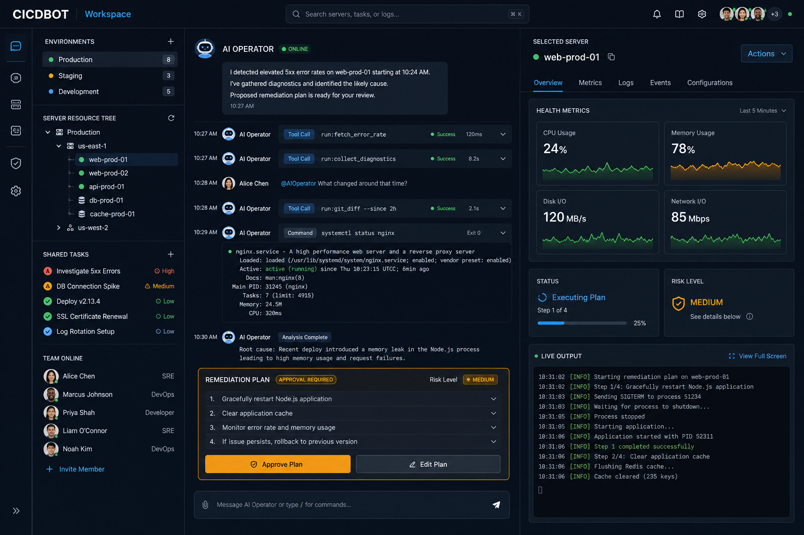
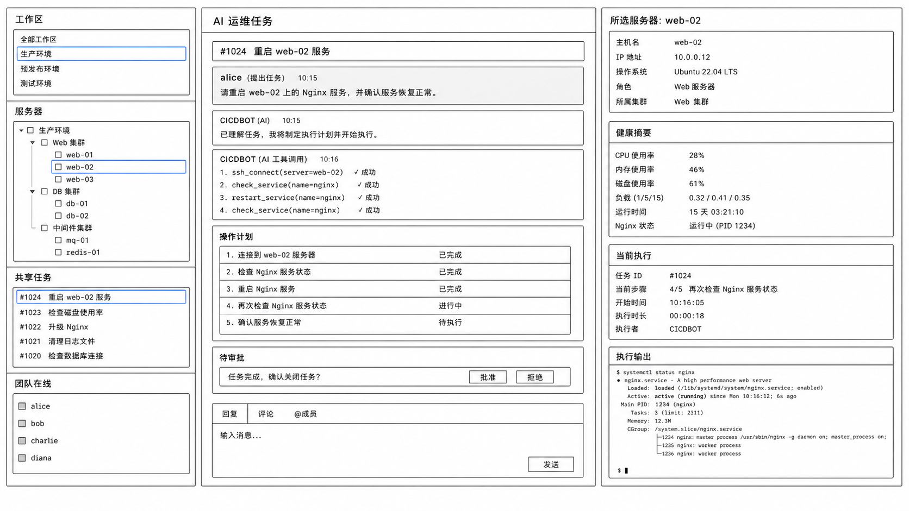
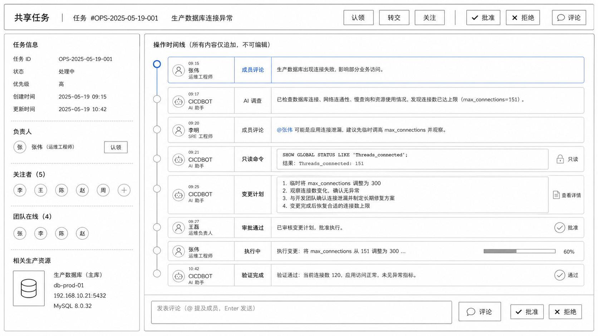
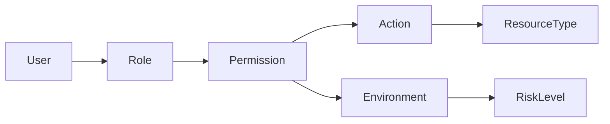

# CICDBOT 产品设计文档

> **文档状态：** 初稿 / 待评审  
> **目标读者：** 产品负责人、架构师、后端/前端开发工程师、运维团队、安全团队  
> **产品一句话定义：** CICDBOT 是部署在服务器上的团队运维 AI Agent 平台 — 多人、AI Agent 和定时任务在同一共享工作区内协作完成日常运维、故障排查和变更执行。
> **配套实施文档：** [CICDBOT MVP 实施方案](MVP_IMPLEMENTATION_PLAN.md)
> **两天验证方案：** [CICDBOT 两天 Demo 计划](DEMO_PLAN_2D.md)

---

## 目录

1. [背景与机会](#1-背景与机会)
2. [产品愿景、目标与非目标](#2-产品愿景目标与非目标)
3. [目标团队与角色权限](#3-目标团队与角色权限)
4. [核心领域层级](#4-核心领域层级)
5. [Codex 概念 → 运维产品形态映射](#5-codex-概念--运维产品形态映射)
6. [信息架构与页面设计](#6-信息架构与页面设计)
7. [团队协作设计](#7-团队协作设计)
8. [核心用户流程](#8-核心用户流程)
9. [功能优先级与范围边界](#9-功能优先级与范围边界)
10. [状态机设计](#10-状态机设计)
11. [总体架构](#11-总体架构)
12. [LLM 接入层](#12-llm-接入层)
13. [Tool Gateway 与连接器](#13-tool-gateway-与连接器)
14. [数据模型](#14-数据模型)
15. [权限与安全](#15-权限与安全)
16. [API 与实时事件](#16-api-与实时事件)
17. [非功能要求](#17-非功能要求)
18. [成功指标、风险与待确认决策](#18-成功指标风险与待确认决策)

---

## 1. 背景与机会

### 背景

运维团队每天面对大量重复性工作：日志排查、配置检查、重启服务、扩容、回滚、告警响应。传统运维工具（堡垒机、WebSSH、Jenkins、Kibana、Prometheus）各管一段，缺乏统一的协作工作台。运维人员通常在聊天群、工单系统、堡垒机和监控面板之间来回切换。

AI Agent 已在代码生成和辅助编程方面展现出强大能力。但当前主流 AI 编程助手面向单用户、本地文件编辑场景，无法直接应用于服务器运维领域。将 AI Agent 的能力引入运维场景，让团队在同一个工作区内共享任务上下文、实时协作，是一个明确的机会。

### 机会

- **团队协作缺口：** 现有 AI 编程产品是单人工具，不支持多人共看、共享任务、认领转交。运维天然是团队活动。
- **运维自动化缺口：** AI Agent 能做信息调查、生成计划，但缺乏安全执行运维操作的能力。Tool Gateway 模式可以分离"调查"和"执行"两个阶段。
- **审计合规需求：** 运维操作需要可追溯、可审批、可回滚。现有 AI 产品不提供审计日志和审批流。
- **持久的会话：** 故障排查可能持续数小时。用户关闭浏览器后，服务器端 Worker 继续运行，任务可恢复、可认领、可转交。

---

## 2. 产品愿景、目标与非目标

### 愿景

成为运维团队**首选的协作式 AI 运维工作台**——让任何规模的运维团队在同一个空间中，借助 AI Agent 的调查能力和受控执行机制，安全高效地完成日常运维和故障排查。

### 目标

1. **团队共享工作区：** 多人实时共享任务上下文，消除信息孤岛。
2. **AI 辅助调查：** LLM 自主执行信息收集、日志分析、配置比对，输出结构化调查结果。
3. **安全变更执行：** 高风险操作经审批后由 Tool Gateway 执行，凭据不进入 LLM 上下文。
4. **持久运行：** 任务在服务端持续运行，不依赖浏览器连接。
5. **审计完备：** 所有操作携带完整上下文，可追溯、可对账、可回放。

### 非目标

- 不提供通用代码编辑功能（不替代 IDE）
- 不提供泛聊天或即时通讯功能（不替代 Slack/飞书）
- 不提供运维监控数据采集（对接已有监控系统，不重复造轮子）
- 不提供 CI/CD 流水线引擎（对接已有 CI/CD 系统）
- 不提供配置管理数据库（CMDB，对接已有资产管理系统）
- 不做多租户 SaaS 平台（单租户部署模式优先）

### 设计原则

| 原则 | 说明 |
|---|---|
| **幂等优先** | 所有变更操作可重复执行，不产生错误副作用 |
| **容错优先** | 默认网络抖动、部分失败、乱序、迟到数据都会发生 |
| **允许重试** | 失败后安全重试，不进入不可恢复状态 |
| **状态可恢复可观测** | 中间状态可发现、可定位、可恢复 |
| **最终一致** | 优先可回补、可对账、可补偿的方案 |
| **失败显式暴露** | 不静默吞错，失败可观察、可重试、可恢复 |
| **凭据隔离** | 密钥和凭据不被送进 LLM 上下文 |

---

## 3. 目标团队与角色权限

### 目标团队

| 团队规模 | 适用场景 |
|---|---|
| 3-5 人运维小组 | 日常运维、告警响应 |
| 10-20 人运维/基础设施团队 | 多环境管理、变更审批、交接班 |
| 混合团队（Dev + Ops） | 故障排查需要开发配合时共享工作区 |

### 角色与权限

| 角色 | 权限范围 | 默认能力 |
|---|---|---|
| **观察者**（Observer） | 只读查看工作区、任务、执行输出和环境状态 | 不可发送消息、不可操作、不可审批 |
| **操作员**（Operator） | 发送消息、创建任务、认领任务、执行已审批的变更 | 不可审批高风险操作、不可修改权限 |
| **审批人**（Approver） | 操作员全部能力 + 审批/拒绝高风险操作 | 不可修改系统配置和角色 |
| **管理员**（Admin） | 全部能力 + 管理工作区、环境、资源、角色、用户、连接器配置 | 管理面操作也进入审计 |
| **审计员**（Auditor） | 只读查看所有审计日志、操作记录、审批记录 | 不可进入工作区交互、不可查看密钥明文 |

---

## 4. 核心领域层级

```
组织 (Organization)
 └─ 工作区 (Workspace)
     ├─ 环境 (Environment) — 生产/预发/测试
     │   └─ 资源 (Resource) — 服务器、集群、数据库实例
     ├─ 共享任务 (SharedTask)
     │   ├─ 会话 (Session) — Agent 消息历史
     │   ├─ 计划 (Plan) — LLM 生成的结构化操作序列
     │   ├─ 审批 (Approval) — 高风险操作审批记录
     │   └─ 执行步骤 (ExecutionStep) — 单个操作执行记录
     ├─ Runbook — 可重复执行的运维剧本
     └─ 事件流 (EventStream) — 追加事件日志
```

| 领域概念 | 定义 | 生命周期 |
|---|---|---|
| **组织** | 部署实例的顶层实体；包含所有配置和成员 | 安装时创建 |
| **工作区** | 团队协作的基本单位；包含任务、环境、资源和成员列表 | 按需创建/归档 |
| **环境** | 逻辑环境分类（生产/预发/测试），影响操作风险级别 | 环境内资源按需注册 |
| **资源** | 可被操作的目标实体（host、k8s cluster、DB） | 注册/注销 |
| **共享任务** | 一次运维活动的核心实体；映射一条持久 Agent 会话 | 创建 → 进行 → 完成/取消/失败 |
| **会话** | Agent 消息历史（含 system prompt、工具调用、结果） | 与任务同生命周期 |
| **计划** | LLM 生成的结构化操作计划，含步骤列表和预期结果 | 调查后生成，执行后归档 |
| **审批** | 高风险操作的审批请求与结果 | 由审批人批准/拒绝后闭环 |
| **执行步骤** | 单个操作（命令/API 调用）的执行记录 | 创建 → 执行中 → 成功/失败/取消 |
| **事件** | 与领域状态同事务写入的追加历史，也是实时分发 Outbox | 追加，不变更 |
| **Runbook** | 预定义的可重复运维剧本（模板化计划） | 按需创建/更新/执行 |

---

## 5. Codex 概念 → 运维产品形态映射

| Codex 概念 | CICDBOT 产品形态 | 差异说明 |
|---|---|---|
| 单人会话 | 共享任务（SharedTask） | 任务对工作区所有成员可见，多人可操作 |
| 本地文件编辑 | 运维操作（Tool Gateway 执行） | 不修改本地文件，操作远程服务器 |
| 用户审批（Allow/Deny） | 审批流（Approval Flow） | 支持多人审批、生产环境双人审批 |
| 工具注册（MCP） | 连接器（Connector） | SSH/Linux、K8s、监控、CI/CD 等运维连接器 |
| 系统提示词 | 任务上下文（Task Context） | 含工作区、环境、资源信息 |
| 会话历史 | 持久化会话（Persistent Session） | 服务端存储，浏览器关闭后继续 |
| Agent Runner | 持久执行器（Persistent Executor） | 带心跳、超时、重试、排队、租赁 |
| 权限策略（Policy） | RBAC 权限模型 | 多角色、多环境、操作级权限 |
| 内存/文档 | 运维知识库（Ops Knowledge） | Runbook、环境文档、团队 Wiki 集成 |
| 事件 Sink | 共享事件流 + SSE/WebSocket | 多人实时订阅，断线补读 |

---

## 6. 信息架构与页面设计

### 信息架构

```
登录页 → 工作台（主界面）
          ├─ 左侧：工作区导航栏
          │   ├─ 工作区列表
          │   ├─ 环境管理
          │   └─ 资源管理
          ├─ 中央：任务区
          │   ├─ 当前任务聊天/消息流
          │   ├─ 消息编辑器（支持 @ 提及、/命令）
          │   ├─ 计划查看器（结构化操作计划）
          │   ├─ 审批对话框
          │   └─ 执行输出面板
          ├─ 右侧：协作面板
          │   ├─ 在线成员列表
          │   ├─ 任务认领/转交状态
          │   └─ 当前资源锁定状态
          └─ 底栏：全局状态
              ├─ 运行中的后台任务
              ├─ 待审批队列
              └─ 连接器健康状况
```

### 页面清单

| 页面 | 路由 | 说明 |
|---|---|---|
| 登录页 | `/login` | 身份认证 |
| 工作台 | `/workspaces/:id` | 主工作区域 |
| 任务详情 | `/workspaces/:id/tasks/:taskId` | 任务会话详情 |
| 计划视图 | `/workspaces/:id/tasks/:taskId/plan` | 结构化计划与执行状态 |
| 审批中心 | `/approvals` | 全局待审批列 |
| 工作区管理 | `/admin/workspaces` | 创建工作区、配置环境 |
| 资源管理 | `/admin/resources` | 注册/管理服务器、集群 |
| 连接器配置 | `/admin/connectors` | 配置 SSH/K8s/监控连接器 |
| 角色权限 | `/admin/rbac` | 角色管理和用户分配 |
| Runbook 管理 | `/admin/runbooks` | 运维剧本模板管理 |
| 审计日志 | `/audit` | 操作审计查询 |
| 系统设置 | `/admin/settings` | 全局配置、LLM Provider 配置 |

### 主工作台布局


*↑ 高保真视觉概念稿，用于表达产品整体氛围，不代表最终 UI*


*↑ 主工作台布局线框图，标注信息分区和交互区域*

**布局说明：**

- **左栏（工作区导航）：** 宽度 240px，可折叠。展示工作区树形结构：组织 → 工作区 → 环境 → 资源。
- **中央（任务区）：** 弹性宽度。从上到下依次为：任务标题栏 → 消息流（SSE 流式渲染） → 消息输入框（支持 Markdown、/命令、文件上传）。
- **右栏（协作面板）：** 宽度 280px，可折叠。在线成员、任务状态、资源锁定状态。
- **底栏（全局状态条）：** 高度 40px。固定显示运行中的后台任务数量、待审批数量和连接器状态指示。

---

## 7. 团队协作设计

CICDBOT 的核心差异化是团队协作。设计围绕"让所有人在同一空间、同一时间线、同一上下文工作"展开。

### 在线状态

- 成员头像/状态指示器显示在右栏
- 状态: 在线、忙碌（正在操作）、离开、离线
- 当前正在操作同一资源时显示"xx 也在查看此服务器"

### 共享时间线

- 所有事件（消息、工具调用、命令输出、审批、状态变化）按时间顺序出现在任务消息流中
- 每个事件标记 Actor（用户/Agent/系统）和时间戳
- 支持按类型/参与者/Actor 过滤时间线

### 认领与转交

- **认领（Claim）：** 操作员可以认领一个无人操作的共享任务，成为当前负责者
- **转交（Transfer）：** 当前负责者可以将任务转交给其他在线操作员
- 认领/转交时在时间线记录事件并通知新负责者
- 任务可以有多个关注者（Watcher），关注者收到任务状态更新通知

### 关注（Watch）

- 用户可以关注一个任务，接收该任务的事件通知
- 关注列表显式管理，可取消

### @提及

- 在聊天中输入 `@username` 可以指定通知目标
- 被提及的用户收到通知（页面内通知 + 可选外部通知）
- 支持 `@here` 通知工作区中所有在线成员

### 评论

- 用户可以在消息或步骤上添加评论
- 评论作为子线程展示，不打断主消息流
- 支持 Markdown 和 @提及

### 并发调查与资源变更 Lease

- 多个操作员可以同时在同一工作区查看不同任务
- 针对同一资源的变更操作通过 **Lease** 机制串行：操作员/Agent 在操作资源前获取租赁（Lease），其他操作员/Agent 看到"此资源正被 xx 操作"的提示
- Lease 自动超时释放（默认 15 分钟，可配置）

### 审批

- 高风险操作触发审批请求
- 审批请求在右栏待审批队列和中央消息流中同时展示
- 审批人批准/拒绝后在时间线记录审批事件

### 断线恢复

- 浏览器断开连接时，服务器端 Worker 继续运行
- 重新连接后，通过 SSE 或 WebSocket 补读断线期间的事件
- 补读范围：从上次收到的事件序号 + 1 到最新事件


*↑ 共享任务中的协作交互线框图*

---

## 8. 核心用户流程

### 流程 1：故障调查

```
1. 操作员在工作区创建共享任务，描述告警现象
2. Agent 接收任务上下文（环境、资源列表）
3. Agent 执行调查操作：
   a. SSH 登录目标服务器
   b. 执行诊断命令（top、df -h、journalctl 等）
   c. 检索日志（tail、grep、查询日志系统）
   d. 检查服务状态、进程、端口
4. Agent 汇总调查结果，输出结构化报告
5. 操作员查看报告，补充追问或修改调查方向
6. 步骤 2-5 循环直至找到根因
```

**涉及组件：** Agent Runtime → Tool Gateway → SSH Connector → 日志系统  
**Actor：** 操作员（发起）+ Agent（执行）+ 观察者（只读查看）

### 流程 2：计划 → 审批 → 执行

```
1. Agent 完成调查后，生成结构化变更计划
   - 计划包含步骤列表（每步：操作描述、命令/API、预期结果、风险级别）
2. 操作员审查计划，可编辑/调整步骤
3. 高风险步骤提交审批：
   a. 审批请求进入待审批队列
   b. 在线通知所有审批人
   c. 任意审批人批准/拒绝
   d. 生产环境高风险操作需双人审批
4. 审批通过后，执行器开始按顺序执行步骤
5. 每步执行后输出结果，操作员和 Agent 验证结果
6. 所有执行事件进入共享时间线和审计日志
```

**涉及组件：** Agent → Plan 生成器 → 审批服务 → Execution Engine → Tool Gateway → 连接器  
**Actor：** Agent（生成计划）+ 操作员（审查）+ 审批人（审批）+ 执行器（执行）+ 操作员/Agent（验证）

### 流程 3：交接

```
场景：值班操作员 A 调查到一半到下班时间，交接给 B
1. A 将任务转交给 B（Transfer）
2. 时间线记录转交事件
3. B 收到通知后认领任务
4. B 查看完整调查历史（消息、工具调用、输出）
5. B 可接续 A 未完成的操作，或重新执行失败的步骤
6. 任务状态和历史完整保留
```

**涉及组件：** 任务管理器 → 通知系统 → 事件流  
**Actor：** 操作员 A（转交方）+ 操作员 B（接收方）

### 流程 4：失败恢复

```
1. 执行步骤失败（命令返回非零、超时、连接断开）
2. 执行器将步骤标记为 failed，记录错误输出
3. Agent 分析失败原因
4. Agent 提出恢复建议（重试、跳过、回滚、替代方案）
5. 操作员选择恢复策略：
   a. 重试：重新执行该步骤（需确认幂等性）
   b. 跳过：跳到下一步
   c. 回滚：执行预定义的回滚操作
   d. 替代：替换为新的操作命令
6. 操作继续执行
```

**涉及组件：** Execution Engine → Agent（分析）→ Tool Gateway  
**Actor：** 执行器（失败）+ Agent（分析）+ 操作员（决策）

---

## 9. 功能优先级与范围边界

### 优先级定义

| 级别 | 定义 |
|---|---|
| **P0** | MVP 必须交付，无此功能产品不可用 |
| **P1** | 核心体验增强，建议在 MVP 中包含 |
| **P2** | 重要但不紧急，MVP 后迭代 |

### 功能清单

| 功能 | 优先级 | 说明 |
|---|---|---|
| 工作区创建和管理 | P0 | 基本的多工作区隔离 |
| 共享任务 CRUD | P0 | 创建、查看、认领、完成 |
| Agent 消息会话 | P0 | LLM 驱动的对话、工具调用显示 |
| SSH/Linux 连接器 | P0 | 命令行执行、文件读写 |
| 执行输出流式展示 | P0 | 实时显示 SSH 命令输出 |
| 批准/拒绝操作 | P0 | 高风险操作需审批 |
| 事件流 + SSE | P0 | 实时推送，断线补读 |
| 基本 RBAC（操作员+审批人+管理员） | P0 | 角色划分 |
| 审计日志 | P0 | 所有操作记录 |
| 计划生成与查看 | P0 | LLM 生成结构化计划 |
| 执行计划 | P0 | 按计划顺序执行步骤 |
| 任务转交 | P0 | 操作员间交接 |
| 任务关注 | P0 | 关注任务更新 |
| 评论 | P0 | 团队补充上下文和协作决策 |
| @提及 | P1 | 通知团队成员 |
| 资源 Lease | P0 | 同一资源的写操作串行化 |
| 生产环境双人审批 | P1 | 高安全要求 |
| Runbook 模板 | P2 | 可重复剧本 |
| Kubernetes 连接器（受控） | P2 | K8s 只读 + 受控操作 |
| 监控/日志连接器 | P0 | MVP 至少接入一个只读观测源 |
| 定时任务 | P2 | 定时触发运维任务 |
| WebSocket 替代 SSE | P2 | 双向通信优化 |
| 步骤级评论线程 | P2 | 在通用任务评论之上提供细粒度讨论 |
| CI/CD 对接 | P2 | 触发 Jenkins/GitLab CI |
| 外部通知（飞书/邮件） | P2 | 异步通知 |

### 范围边界

| 明确在范围内 | 明确不在范围内 |
|---|---|
| 服务器操作系统级操作 | 数据库字段级编辑 |
| 应用服务管理（启停、配置） | 代码提交和代码审查 |
| 日志查看和分析 | 项目管理/迭代规划 |
| 容器和集群状态查看 | 文件在线编辑/协同编辑 |
| 部署状态查看 | 通用 IM 聊天 |
| 告警初步响应 | 告警规则配置和监控采集 |
| 配置检查和变更 | 数据库表结构变更 |

---

## 10. 状态机设计

### 共享任务状态机

```mermaid
stateDiagram-v2
    [*] --> "idle"
    "idle" --> "running" : 操作员/定时器启动
    "running" --> "investigating" : Agent 开始调查
    "running" --> "planning" : Agent 生成计划
    "investigating" --> "planning" : 调查完成
    "planning" --> "awaiting_approval" : 计划包含高风险操作
    "planning" --> "executing" : 无高风险操作，直接执行
    "awaiting_approval" --> "executing" : 审批通过
    "awaiting_approval" --> "planning" : 审批拒绝，调整计划
    "executing" --> "verifying" : 步骤执行完成
    "verifying" --> "executing" : 验证通过，继续下一步
    "verifying" --> "failed" : 验证失败
    "executing" --> "failed" : 不可恢复错误
    "failed" --> "running" : 操作员恢复/重试
    "running" --> "completed" : 任务目标达成
    "completed" --> [*]
    "failed" --> [*] : 手动关闭
    "running" --> "cancelled" : 操作员取消
    "cancelled" --> [*]
```

### 计划状态机

```mermaid
stateDiagram-v2
    [*] --> "draft"
    "draft" --> "reviewing" : 操作员审查
    "reviewing" --> "approved" : 审批通过
    "reviewing" --> "rejected" : 审批拒绝
    "rejected" --> "draft" : 修改后重新提交
    "approved" --> "executing" : 开始执行
    "executing" --> "completed" : 全部步骤完成
    "executing" --> "partially_completed" : 部分步骤执行
    "executing" --> "failed" : 无法恢复的错误
    "completed" --> [*]
    "partially_completed" --> [*]
    "failed" --> [*]
```

### 审批状态机

```mermaid
stateDiagram-v2
    [*] --> "pending"
    "pending" --> "approved" : 审批人批准
    "pending" --> "rejected" : 审批人拒绝
    "pending" --> "expired" : 超时未审批
    "pending" --> "cancelled" : 发起人取消
    "approved" --> [*]
    "rejected" --> [*]
    "expired" --> [*]
    "cancelled" --> [*]
```

### 执行步骤状态机

```mermaid
stateDiagram-v2
    [*] --> "queued"
    "queued" --> "running" : 分配到执行器
    "running" --> "succeeded" : 执行成功且验证通过
    "running" --> "failed" : 执行失败/超时/错误
    "running" --> "cancelled" : 操作员/系统取消
    "succeeded" --> [*]
    "failed" --> "queued" : 允许重试
    "failed" --> "rollback" : 触发回滚
    "rollback" --> "rollback_succeeded"
    "rollback" --> "rollback_failed"
    "rollback_succeeded" --> [*]
    "rollback_failed" --> [*]
    "cancelled" --> [*]
```

---

## 11. 总体架构

### 架构总览


*↑ 系统架构线框图*

### 组件职责

| 组件 | 职责 | 基础 |
|---|---|---|
| **Web UI** | 浏览器 SPA，事件驱动渲染，严格从领域事件推导状态 | React / Vue |
| **HTTP/SSE Server** | 提供 REST API 和 SSE 事件流，认证与会话管理 | WorkGround2 `internal/serve` |
| **Controller** | 传输无关的会话生命周期管理，消息路由，审批管理 | WorkGround2 `internal/control` |
| **Agent Runtime** | LLM 请求、工具调度、上下文维护 | WorkGround2 `internal/agent` |
| **User Control Plane** | 多用户管理、会话管理、工作区选择、角色分配 | 新增 |
| **Task Manager** | 共享任务 CRUD、认领/转交/关注、任务状态管理 | 新增 |
| **Plan Engine** | 结构化计划生成、存储、版本管理 | 新增 |
| **Approval Service** | 审批请求创建、路由、通知、记录 | 新增 |
| **Execution Engine** | 操作队列、Lease、心跳、超时、重试、补偿、验证 | 新增（基于 WorkGround2 Runner） |
| **Tool Gateway** | 安全执行运维操作，凭据不进入 LLM 上下文 | 新增（基于 MCP Plugin 扩展） |
| **Event Log + Outbox** | 追加时间线事件、断线补读和可靠分发；当前状态由领域表持有 | PostgreSQL |
| **SSE/WS Hub** | 实时事件分发，断线补读 | WorkGround2 `event.Sink` / Broadcaster |
| **Auth Service** | 用户认证、Token 管理、Session 管理 | 新增 |
| **RBAC Service** | 角色定义、权限计算、策略执行 | 新增 |
| **Audit Service** | 操作日志记录、查询、导出 | 新增 |
| **Connector Registry** | 连接器注册、配置管理、健康检查 | 新增 |

### 数据流

```
用户（浏览器）
  │ POST /api/send { content, task_id, request_id }
  ▼
HTTP Server → Controller
  │ 验证身份 → 验证权限 → 记录审计
  ▼
User Control Plane → Task Manager → Agent Runtime
  │ 任务认领 → Agent 接收上下文 → 调用 LLM
  ▼
LLM Provider → 返回流式响应 / 工具调用
  │ 工具调用 → Tool Gateway（凭据隔离）
  ▼
Execution Engine → Connector（SSH/K8s/...）
  │ 执行结果 → 验证 → 事件记录
  ▼
Event Store（PostgreSQL）
  │ SSE/WebSocket 推送
  ▼
SSE Hub → 浏览器实时更新
  │ 所有在线用户看到同一事件流
```

---

## 12. LLM 接入层

### Provider/Router

| 概念 | 设计 |
|---|---|
| **Provider 抽象** | 复用 WorkGround2 `provider.Provider` 接口：OpenAI-compatible、Anthropic |
| **模型路由** | 按能力标签路由：长上下文调查、结构化推理、工具调用、经济型摘要 |
| **多 Provider 支持** | 配置多个 Provider 端点，健康检查自动切换 |
| **故障切换** | Provider 调用失败时，按先级尝试备用 Provider |
| **健康检查** | 定时探活（`/v1/models` 或专用健康端点），标记不可用 Provider |

### 上下文构建

| 上下文组件 | 来源 |
|---|---|
| 系统提示词 | 工作区配置 + 环境上下文 + 资源清单 + 安全策略 |
| 任务历史 | 当前共享任务的完整消息历史 |
| 工具定义 | 当前工作区启用的连接器工具列表 |
| 参考文档 | Runbook、运维知识库、环境文档 |
| 当前状态 | 资源状态、运行中的事件、锁定信息 |

### 成本与质量控制

| 机制 | 说明 |
|---|---|
| **Token 上限** | 单次请求 Token 上限可配置。调查类任务上限高，操作类上限低 |
| **成本告警** | 日/周/月 Token 消耗告警 |
| **模型降级** | 使用率超限自动切换到成本更低的模型 |
| **质量监控** | 关键操作（计划生成）记录模型名、耗时、Token 消耗 |

---

## 13. Tool Gateway 与连接器

### Tool Gateway 设计

Tool Gateway 是操作执行的安全闸门：

- 所有运维操作通过 Tool Gateway 执行
- 凭据存储在 Gateway 侧，不被送进 LLM 上下文
- LLM 调用工具时传入操作参数，Gateway 注入凭据
- 所有操作经过权限检查、审计记录、Lease 检查
- 高风险操作经审批后再由 Gateway 执行

### 首版连接器

| 连接器 | 操作 | 风险级别 | 状态 |
|---|---|---|---|
| **SSH/Linux** | 远程命令执行、文件读写、服务管理 | 低（只读命令）/ 高（写入命令） | MVP 完整 |
| **SSH/Linux File** | 远程文件读取、写入、比对 | 低（读）/ 高（写） | MVP 完整 |
| **Kubernetes** | Pod/Service/Deployment 状态查看 | 低 | P1 只读 |
| **Kubernetes** | 资源创建/更新/删除 | 高 | P1 |
| **HTTP API** | 调用外部系统 REST API | 按 API 定 | MVP 基础 |
| **SQL Query** | 数据库只读查询 | 低 | P1 |
| **日志/监控检索** | 对接一个现有观测平台查询日志或指标 | 低 | MVP 基础 |
| **CI/CD 触发** | 触发 Jenkins/GitLab CI Job | 中 | P2 |
| **Runbook** | 预定义运维剧本执行 | 按剧本定 | P2 |

---

## 14. 数据模型

### Event

核心追加事件表，用于共享时间线、审计关联、断线补读和可靠分发。工作区、任务、计划、审批、执行等关系表保存当前权威状态；状态更新与事件追加必须在同一数据库事务提交。MVP 不采用全量事件溯源重建业务状态。

| 字段 | 类型 | 说明 |
|---|---|---|
| event_id | UUID | PK，事件唯一 ID |
| event_type | VARCHAR(64) | 事件类型（task_created、tool_dispatched、step_failed 等） |
| event_version | INT | 事件 schema 版本 |
| aggregate_type | VARCHAR(64) | 聚合类型（task、plan、execution 等） |
| aggregate_id | UUID | 聚合 ID |
| sequence | BIGINT | 聚合内事件序号 |
| request_id | UUID | 幂等键，源头请求 ID |
| actor_id | UUID | 操作者（用户/Agent/系统） |
| workspace_id | UUID | 工作区 ID |
| task_id | UUID | 任务 ID |
| payload | JSONB | 事件数据 |
| timestamp | TIMESTAMPTZ | 事件产生时间 |
| created_at | TIMESTAMPTZ | 入库时间 |

### Operation

单个操作记录。

| 字段 | 类型 | 说明 |
|---|---|---|
| operation_id | UUID | PK |
| idempotency_key | VARCHAR(255) | UNIQUE，幂等键 |
| request_id | UUID | 源头请求 ID |
| actor_id | UUID | 操作发起者 |
| workspace_id | UUID | 工作区 |
| task_id | UUID | 所属任务 |
| resource_id | UUID | 操作目标资源 |
| execution_step_id | UUID | 所属执行步骤 |
| connector_type | VARCHAR(64) | 连接器类型（ssh、k8s、http） |
| action | VARCHAR(128) | 操作名称 |
| params | JSONB | 操作参数 |
| risk_level | VARCHAR(16) | low / medium / high / critical |
| status | VARCHAR(32) | queued / running / cancelling / succeeded / failed / cancelled / timed_out / manual_required |
| lease_id | UUID | 资源租赁 ID |
| lease_expires_at | TIMESTAMPTZ | 租赁到期时间 |
| result | JSONB | 执行结果 |
| error | TEXT | 错误信息 |
| retry_count | INT | 已重试次数 |
| max_retries | INT | 最大重试次数 |
| timeout_seconds | INT | 超时时间 |
| started_at | TIMESTAMPTZ | 开始执行时间 |
| completed_at | TIMESTAMPTZ | 完成时间 |
| created_at | TIMESTAMPTZ | 创建时间 |
| version | INT | 乐观锁版本号 |

### Approval 

| 字段 | 类型 | 说明 |
|---|---|---|
| approval_id | UUID | PK |
| request_id | UUID | 源头请求 ID |
| workspace_id | UUID | 工作区 |
| task_id | UUID | 任务 |
| plan_id | UUID | 所属计划 |
| operation_id | UUID | 待审批操作 |
| risk_level | VARCHAR(16) | low / medium / high / critical |
| status | VARCHAR(32) | pending / approved / rejected / expired / cancelled |
| requested_by | UUID | 审批发起人（Agent 或用户） |
| required_approvers | INT | 需要审批人数（生产高风险=2） |
| expires_at | TIMESTAMPTZ | 审批超时时间 |
| created_at | TIMESTAMPTZ | 创建时间 |

每位审批人的决定单独写入 `ApprovalDecision`，以 `(approval_id, approver_id)` 防止重复投票；审批聚合只保存当前状态和所需人数，避免多个审批人并发修改数组。

### ExecutionStep

| 字段 | 类型 | 说明 |
|---|---|---|
| step_id | UUID | PK |
| plan_id | UUID | 所属计划 |
| sequence | INT | 步骤序号 |
| title | VARCHAR(255) | 步骤标题 |
| description | TEXT | 步骤描述 |
| action | VARCHAR(128) | 操作（command、api_call 等） |
| params | JSONB | 操作参数 |
| expected_result | TEXT | 预期结果 |
| risk_level | VARCHAR(16) | 风险级别 |
| status | VARCHAR(32) | pending / running / succeeded / failed / skipped / cancelled |
| result | JSONB | 执行结果 |
| error | TEXT | 错误信息 |
| retry_count | INT | 重试次数 |
| rollback_action | JSONB | 回滚操作定义 |
| started_at | TIMESTAMPTZ | 开始时间 |
| completed_at | TIMESTAMPTZ | 完成时间 |

### SecretRef

凭据引用（凭据本身存储在外部密钥管理系统）。

| 字段 | 类型 | 说明 |
|---|---|---|
| secret_id | UUID | PK |
| name | VARCHAR(128) | 凭据名称 |
| secret_type | VARCHAR(32) | ssh_key / password / token / cert |
| vault_ref | VARCHAR(255) | 外部密钥管理系统的引用路径 |
| connector_type | VARCHAR(64) | 关联的连接器类型 |
| resource_id | UUID | 关联的资源 |
| rotation_policy | JSONB | 轮换策略 |
| created_by | UUID | 创建者 |
| created_at | TIMESTAMPTZ | 创建时间 |
| updated_at | TIMESTAMPTZ | 更新时间 |

### 其他核心表

- **organizations** — 组织信息
- **workspaces** — 工作区定义、配置
- **environments** — 环境定义（类型、风险级别）
- **resources** — 资源注册（host、k8s cluster）
- **shared_tasks** — 共享任务（标题、描述、状态、owner、claimant）
- **sessions** — Agent 会话（message 追加存储）
- **plans** — 结构化计划
- **runbooks** — Runbook 定义
- **users** — 用户信息
- **role_assignments** — 角色分配
- **leases** — 资源租赁记录
- **audit_logs** — 审计日志（与 Event 互补，按查询优化组织）

---

## 15. 权限与安全

### 权限模型

RBAC 模型，按"角色 → 操作 → 环境"维度控制：



- **角色：** Observer / Operator / Approver / Admin / Auditor
- **操作：** task.create / task.claim / approval.approve / execution.run / ...
- **环境：** production / staging / testing
- **风险级别：** low / medium / high / critical

### Prompt Injection 防护

| 防护措施 | 说明 |
|---|---|
| **凭据隔离** | SSH 密钥、Token 等凭据不进入 LLM 上下文 |
| **操作参数校验** | LLM 生成的工具参数经过 schema 校验和限制 |
| **命令白名单** | SSH 连接器对高危命令（rm、dd、mkfs）进行拦截 |
| **不可信证据隔离** | 日志、网页、工单和命令输出以不可信证据块进入上下文，禁止其中的文字提升为系统指令 |
| **工具能力收敛** | 模型只能调用当前任务、角色和环境共同允许的类型化工具，不接受输出内容动态扩大权限 |
| **操作确认** | 影响生产环境的操作默认要求审批 |

### 密钥管理

- 凭据存储在外部的密钥管理系统（Vault / AWS Secrets Manager / K8s Secrets）
- SecretRef 表仅存储引用路径和元数据
- Tool Gateway 运行时获取凭据，凭据在内存中解密，用后立即清除
- 支持凭据轮换通知

### 审计

| 审计要求 | 实现 |
|---|---|
| 所有操作可追溯 | 每个操作携带 actor_id、request_id、workspace_id、task_id |
| 操作前审计 | 权限检查通过/拒绝都记录 |
| 操作后审计 | 执行结果和错误记录 |
| 审批审计 | 审批请求、批准、拒绝全部记录 |
| 管理操作审计 | 配置修改、角色分配、用户管理全部记录 |
| 审计不可篡改 | 审计日志追加写入，不支持修改和删除 |

### 生产环境防护

- 生产环境高风险操作默认要求双人审批
- 生产环境资源操作默认加 Lease
- 生产环境不允许匿名或未认证操作
- 生产环境操作默认记录完整执行输出
- 连接器支持"仅生产环境只读"模式

---

## 16. API 与实时事件

### API 设计原则

- RESTful API，JSON 请求/响应
- 所有写操作携带 `Idempotency-Key`；服务端生成或接受 `request_id`（UUID v7）并返回当前结果，支持安全重试
- 认证方式：Bearer Token + Session Cookie
- 分页：Cursor-based 分页（`cursor` + `limit`）
- 错误响应统一格式：`{ "error": { "code": "...", "message": "..." } }`

### API 端点概览

| 领域 | 端点 | 说明 |
|---|---|---|
| **Auth** | `POST /api/auth/login` | 登录 |
| | `POST /api/auth/logout` | 登出 |
| | `POST /api/auth/refresh` | Token 刷新 |
| **Workspace** | `GET/POST /api/workspaces` | 列/创建工作区 |
| | `GET/PUT/DELETE /api/workspaces/:id` | 工作区详情/更新/删除 |
| | `GET/POST/DELETE /api/workspaces/:id/members` | 成员管理 |
| **Resource** | `GET /api/workspaces/:id/resources` | 资源列表 |
| | `POST /api/workspaces/:id/resources` | 注册资源 |
| | `GET/PUT/DELETE /api/resources/:id` | 资源详情/更新/删除 |
| **Task** | `GET/POST /api/workspaces/:id/tasks` | 任务列表/创建 |
| | `GET/PUT/DELETE /api/tasks/:id` | 任务详情/更新/删除 |
| | `POST /api/tasks/:id/claim` | 认领任务 |
| | `POST /api/tasks/:id/transfer` | 转交任务 |
| | `POST /api/tasks/:id/watch` | 关注/取消关注任务 |
| **Message** | `GET /api/tasks/:id/messages` | 消息历史 |
| | `POST /api/tasks/:id/messages` | 发送消息 |
| | `POST /api/tasks/:id/comments` | 添加评论 |
| **Plan** | `GET/POST /api/tasks/:id/plans` | 计划列表/生成计划 |
| | `GET/PUT /api/plans/:id` | 计划详情/修改 |
| | `POST /api/plans/:id/submit` | 提交审批 |
| **Approval** | `GET /api/approvals` | 待审批列表 |
| | `GET /api/approvals/:id` | 审批详情 |
| | `POST /api/approvals/:id/approve` | 批准 |
| | `POST /api/approvals/:id/reject` | 拒绝 |
| **Execution** | `POST /api/plans/:id/execute` | 开始执行计划 |
| | `GET /api/executions/:id` | 执行进度 |
| | `POST /api/executions/:id/cancel` | 取消执行 |
| | `POST /api/steps/:id/retry` | 重试步骤 |
| | `POST /api/steps/:id/skip` | 跳过步骤 |
| **Events** | `GET /api/events?cursor=&types=&task_id=&since=` | 查询历史事件 |
| | `GET /api/events/stream` | SSE 事件流 |
| **Audit** | `GET /api/audit-logs?actor=&resource=&action=&from=&to=` | 审计日志查询 |
| **Provider** | `GET/POST/PUT /api/admin/providers` | LLM Provider 配置管理 |

---

## 17. 非功能要求

### 可靠性

| 要求 | 指标 |
|---|---|
| 系统可用性 | 99.9%（不包含 LLM Provider 外部故障） |
| 操作幂等 | 所有变更操作重复执行安全，不产生错误副作用 |
| 状态持久化 | 领域状态与追加事件在 PostgreSQL 同一事务提交，不出现半完成状态 |

### 幂等

| 机制 | 说明 |
|---|---|
| **request_id** | 每个写请求携带唯一 request_id，服务端去重 |
| **重试安全** | 失败后重试不会重复执行/审批 |
| **补偿操作** | 失败操作支持定义回滚步骤 |

### 可恢复

| 场景 | 恢复策略 |
|---|---|
| 服务重启 | 重启后从未完成的任务继续执行，检查 Lease 状态 |
| 连接器超时 | 操作标记为失败，允许手动重试 |
| 浏览器断线 | 事件流补读断线期间丢失的事件 |
| Agent 进程崩溃 | 重启后读取任务、操作和 Lease 当前状态，再用事件记录核对与补发 |

### 可观测

| 维度 | 实现 |
|---|---|
| **指标** | Prometheus 指标：请求数、延迟、错误率、Token 消耗 |
| **日志** | 结构化日志（JSON 格式），所有组件统一格式 |
| **Trace** | OpenTelemetry 分布式追踪 |
| **审计** | 所有操作记录审计日志 |
| **告警** | 错误率、延迟、Token 消耗、审批超时 |
| **SLO** | API 响应 < 500ms P99（不含 LLM 延迟），Agent 调用可用性 > 99% |

### 性能与容量

| 指标 | 目标 |
|---|---|
| API 响应时间（P99） | < 500ms（不含 LLM 调用时间） |
| SSE 事件延迟（P99） | < 200ms |
| 事件存储 | 单日事件量 ≤ 10 万条，保留期 90 天 |
| 并发任务 / 工作区 | ≤ 20 个活动任务 |
| 并发 SSE 连接 | ≤ 500 |

### 备份

| 数据 | 备份策略 |
|---|---|
| PostgreSQL | 每日全量备份 + WAL 连续归档 |
| 密钥凭据 | 依赖外部密钥管理系统的备份策略 |
| 配置文件 | Git 版本管理 |

---

## 18. 成功指标、风险与待确认决策

### 成功指标

| 指标 | 衡量方式 | 目标 |
|---|---|---|
| 调查任务完成率 | Agent 完成调查且用户认可 | > 80% |
| 变更执行时间 | 从计划生成到执行完成 | 比手动操作缩短 50% |
| 审批效率 | 审批请求到响应的时间 | < 15 分钟 |
| 操作成功率 | 计划步骤执行成功率 | > 95% |
| 回滚率 | 需要回滚的执行比例 | < 5% |
| 用户采用率 | 团队周活跃用户 / 团队总人数 | > 70% |
| 审计覆盖率 | 应审计的操作覆盖率 | 100% |

### 风险

| 风险 | 影响 | 缓解措施 |
|---|---|---|
| LLM 生成错误操作 | 生产故障 | 高风险操作强制审批 + 操作参数校验 |
| 凭据泄露 | 安全事件 | 凭据不进 LLM 上下文 + 密钥管理系统 |
| Agent 失控循环 | 资源消耗/误操作 | 操作次数限制 + 超时 + 人工介入 |
| 审批成为瓶颈 | 变更延迟 | 审批超时机制 + 多审批人 + 通知 |
| SSH 连接不稳定 | 执行失败 | 重试 + 退避 + 超时 |
| LLM Provider 故障 | 调查中断 | 多 Provider 故障切换 |
| 用户误操作 | 不合规操作 | 权限最小化 + 审计 + 可回滚 |

### 产品边界

| 边界 | 说明 |
|---|---|
| CICDBOT 不做监控采集 | 对接已有 Prometheus/Datadog/ELK |
| CICDBOT 不做 CMDB | 对接已有资产管理系统 |
| CICDBOT 不做工单系统 | 事件可与 Jira/PagerDuty 对接，但内部不实现工单 |
| CICDBOT 不替代堡垒机 | 操作通过 Tool Gateway 执行，不提供原始 SSH 登录 |

### 待确认决策

| 编号 | 决策项 | 选项 |
|---|---|---|
| D1 | 前端框架 | React / Vue |
| D2 | 实时通信协议 | SSE（优先） / WebSocket |
| D3 | 密钥管理系统 | Vault / AWS Secrets Manager / K8s Secrets |
| D4 | 日志存储 | PostgreSQL JSONB / 独立日志系统（如 Elasticsearch） |
| D5 | 事件存储策略 | MVP 已定为关系状态表 + 同事务事件 Outbox；完整事件溯源仅在出现明确需求后评估 |
| D6 | 部署模式 | 单机 Docker Compose / 高可用 K8s（MVP 选 Docker Compose） |
| D7 | LLM 默认 Provider | OpenAI / DeepSeek / Anthropic / 自托管 |
| D8 | 用户认证 | OAuth 2.0 / LDAP / 本地密码 |
