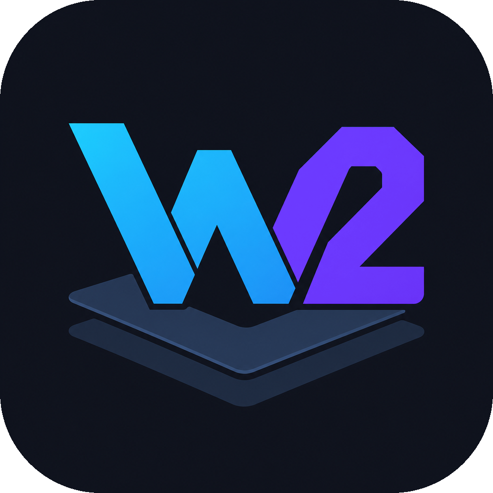

<p align="center">
  
</p>

<p align="center">
  <a href="./README.md">English</a>
  &nbsp;·&nbsp;
  <strong>简体中文</strong>
  &nbsp;·&nbsp;
  <a href="./docs/GUIDE.zh-CN.md">指南</a>
  &nbsp;·&nbsp;
  <a href="./docs/SPEC.md">规格</a>
</p>

# WorkGround2

WorkGround2 是一个本地优先的 AI 工程工作台。它把 CLI、桌面端、HTTP/SSE
前端和 IM Bot 接到同一套 Go agent 内核上，让模型、工具、权限、沙盒、记忆和
会话状态走同一条控制链。

它适合用来做真实项目里的日常工程任务：读代码、改代码、跑命令、管理 MCP
工具、保留会话上下文、回滚文件改动、接入本地或云端模型，并把桌面操作和命令行
自动化放在同一个工作流里。

## 核心能力

- **统一控制器**：CLI/TUI、`serve`、Wails 桌面端和 Bot 网关共享
  `control.Controller`，同一套模型、工具、权限和事件流在不同入口复用。
- **多模型 Provider**：支持 DeepSeek、OpenAI-compatible、Anthropic 和本地 CLI
  provider；模型、端点和密钥都通过配置管理。
- **MCP 与插件**：通过 stdio、Streamable HTTP 或 SSE 接入外部工具，工具名、
  只读标记、权限检查和输出压缩都进入统一 registry。
- **项目记忆**：加载 `WorkGround2.md`、`AGENTS.md`、用户全局记忆和自动记忆索引，
  把稳定项目规则放进会话前缀。
- **安全执行**：内置权限策略、沙盒、审批流、YOLO 模式、checkpoint 与 `/rewind`，
  适合在真实仓库里让 agent 执行可恢复的改动。
- **桌面工作台**：Wails + React 前端提供多会话、设置、provider 配置、审批、
  更新检查、诊断与可视化任务流。
- **远程入口**：Feishu/Lark/WeChat/QQ Bot 可以把 IM 消息转成本地 WorkGround2
  会话，仍然沿用桌面端和 CLI 的权限规则。
- **自动研究与 Memory v5**：提供本地研究任务状态、memory compiler 和内容无关的
  质量指标，用于长任务和跨会话复用。

## 快速开始

安装预编译 CLI：

```sh
npm i -g WorkGround2
WorkGround2 setup
WorkGround2
```

也可以直接执行一次性任务：

```sh
WorkGround2 run "解释这个项目的入口和模块关系"
WorkGround2 run --model deepseek-pro "给最近的改动做一次 code review"
echo "总结 README" | WorkGround2 run
```

最小配置示例：

```toml
default_model = "deepseek-flash"

[[providers]]
name        = "deepseek-flash"
kind        = "openai"
base_url    = "https://api.deepseek.com"
model       = "deepseek-v4-flash"
api_key_env = "DEEPSEEK_API_KEY"
```

配置优先级为 **命令行参数 > `./WorkGround2.toml` > 用户配置 >
内置默认值**。用户级配置默认位于：

- macOS/Linux：`~/.WorkGround2/config.toml`
- Windows：`%AppData%\WorkGround2\config.toml`

密钥保存在 WorkGround2 全局 `.env` 或系统凭据中；项目 `.env` 只用于工作区范围的
MCP/plugin `${VAR}` 展开。

## 桌面端

桌面端位于 `desktop/`，是一个独立 Go module。它用 Wails 打包本地窗口，React
前端通过 Go 绑定直接调用同一个控制器，事件通过 `agent:event` 推送回 UI。

开发桌面端：

```sh
cd desktop
wails dev
```

只开发前端：

```sh
cd desktop/frontend
pnpm install
pnpm dev
```

构建桌面端：

```sh
cd desktop
wails build
```

## 从源码构建 CLI

```sh
make build      # -> bin/workground2(.exe)
make cross      # -> dist/ 多平台产物
go test ./...
```

仓库主体是 Go 代码：

- `cmd/workground2`：CLI 入口。
- `internal/boot`：从配置装配运行时控制器。
- `internal/control`：会话生命周期、发送、取消、审批、压缩、回滚。
- `internal/agent`：模型请求、工具调用和上下文维护。
- `internal/tool` / `internal/plugin`：内置工具与 MCP 工具接入。
- `internal/config` / `internal/provider`：配置加载和模型后端。
- `desktop/`：Wails 桌面应用。
- `site/` 与 `workers/`：官网和 Cloudflare Workers 服务。

## 文档

- [指南](./docs/GUIDE.zh-CN.md)：配置、权限、沙盒、插件、斜杠命令、`@` 引用。
- [CLI 会话管理](./docs/CLI_SESSION.md)：从命令行列出、查看、重命名、删除和恢复
  对话会话。
- [CLI 桌面远程控制](./docs/CLI_DESKTOP.md)：从命令行创建会话、发送消息、
  处理审批并读取回复。
- [Bot 指南](./docs/BOT_GUIDE.zh-CN.md)：IM Bot 连接、审批、YOLO 和远程命令。
- [配置路径](./docs/CONFIG_PATHS.zh-CN.md)：用户配置、项目配置和密钥位置。
- [工具合约](./docs/TOOL_CONTRACT.zh-CN.md)：内置工具 schema 与回归保护。
- [Checkpoint 与 rewind](./docs/CHECKPOINTS.md)：编辑快照和回滚机制。
- [工程规格](./docs/SPEC.md)：架构、数据类型、registry 与路线图。

## License

MIT，见 [LICENSE](./LICENSE)。

## 来源

WorkGround2 源自 [Reasonix](https://github.com/esengine/deepseek-reasonix)。
