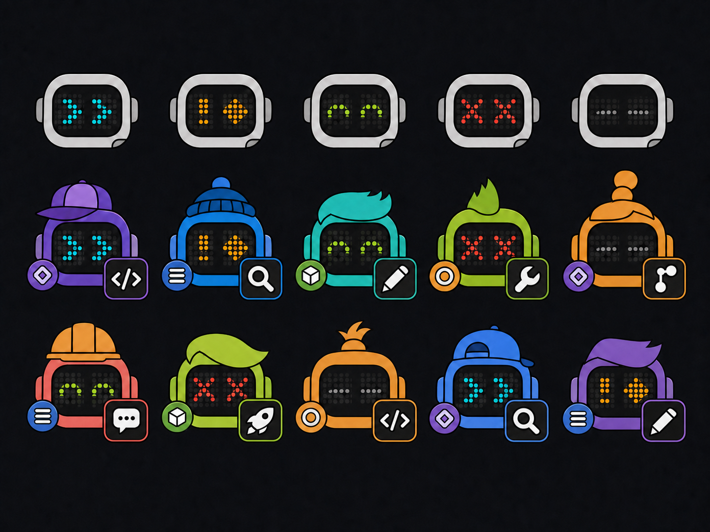

# WorkGround2 Agent Icon 设计规范（中文版）

> 本文定义 WorkGround2 会话列表使用的**可组合 Agent Icon** 系统：一个会话图标由四层独立信息叠加而成，每层只表达一个维度。面向设计与开发共同使用：设计师按此产出资源，开发者按此实现渲染与状态映射。

---

## 1. 目的

Agent Icon 用于 WorkGround2 会话列表，让用户**一眼区分**每个会话的：

- 身份（这个会话是谁）——由随机细节表达，无业务语义；
- 任务（这个会话在干什么）——由任务层工具表达；
- 所属 Workspace（在哪个空间里）——由 Workspace 徽标表达；
- 状态（现在进行得怎么样）——由 LED 点阵眼睛表达。

核心原则：**每一层只负责一个维度，禁止用同一个视觉变量表达多个维度。**

---

## 2. 组合图例



图例说明：

- **上排**：状态眼睛图例，列出运行、有问题、成功、失败、建议清理五种眼睛形态；
- **下两排**：完整组合示例，展示不同随机身份 × 任务工具 × Workspace 徽标 × 状态眼睛叠加后的实际效果。

---

## 3. 四层拆分

图标自下而上叠加四层，各层职责完全独立：

| 层级 | 名称 | 内容 | 视觉位置 | 语义 |
|---|---|---|---|---|
| 1 | 随机身份层 | 两组机器人头部模块 / 外壳颜色 | 机器人外壳与顶部 | 无业务语义，仅用于区分会话 |
| 2 | 任务层 | 大方形工具图形 | 右下 | 当前任务类别 |
| 3 | Workspace 层 | 小圆徽标 | 左下 | 所属 Workspace |
| 4 | 状态层 | LED 点阵眼睛 | 脸部（最高优先级） | 会话运行状态 |

- 四层独立：修改任意一层不影响其他层；身份变化不能暗示任务、Workspace 或状态。
- **禁止用同一视觉变量跨层表达语义**：外壳颜色只属于身份层；眼睛颜色只作为状态的第二编码；Workspace 颜色只出现在左侧徽标内。不能用外壳变色代替状态眼睛。

---

## 4. 状态眼睛表

眼睛是唯一的状态出口，采用**形状 + 颜色双编码**：形状可读性优先，颜色作为第二通道（例如色盲用户仍能通过形状分辨）。

固定点阵规格：每只眼使用固定 5×5 LED 点阵（暗灯珠底阵，未点亮的灯珠保持低亮可见），两种状态不可混淆。

| 状态 | 形状 | 颜色 | 适用阶段 |
|---|---|---|---|
| 运行中 | 双箭头（▶▶ 风格，指向右） | 青色 | 活动 |
| 有问题 | 警示（感叹号 / 菱形） | 琥珀色 | 活动 |
| 成功 | 弯眼（微笑弧线） | 绿色 | 终止 |
| 失败 | 叉眼（× 形） | 红色 | 终止 |
| 建议清理 | 低亮灰色横线（平直线） | 灰色（低亮） | 仅已终止且达到清理条件的会话 |

### 4.1 建议清理的特殊规则

- 建议清理**只用于已终止且达到清理条件**的会话；
- 未终止的会话即使空闲也不显示建议清理；
- 低于清理阈值时，已终止会话保持显示成功或失败，而不是提前变灰。

---

## 5. 状态优先与生命周期

状态由会话生命周期决定，眼睛随阶段切换：

```
活动阶段 ──► 显示「运行中」或「有问题」
终止阶段 ──► 显示「成功」或「失败」
达到清理条件 ──► 切换为「建议清理」
```

- 活动阶段：正在执行或等待中显示运行中；检测到异常显示有问题。
- 终止阶段：按最终结果显示成功或失败。
- **失败不可被静默覆盖**：失败状态的会话不允许被悄悄改成成功或建议清理，必须保持可见，直到用户明确处理。
- **问题状态需有可观察原因**：显示「有问题」的会话必须携带可查看的失败原因或错误上下文，不允许只有眼睛变色而无任何说明入口。

---

## 6. 表达原则

- **尺寸**：任务工具明显大于 Workspace 徽标（工具是主体，徽标是附属）。
- **位置**：工具固定右下，Workspace 徽标固定左下，不随身份变化移动。
- **优先级**：眼睛优先级最高，位于脸部；其他层不得遮挡眼睛。
- **无眼镜**：眼镜会与状态眼睛混淆，一律不绘制。
- **配件**：只使用与机器人同材质的天线、传感器、散热鳍、信号灯等原生头部模块；不得遮挡脸部或互相重叠。
- **风格**：扁平风格、纯色、粗轮廓，保证 24–32px 小尺寸下仍然可读。
- **稳定映射**：任务类型到工具图形必须是一对一的枚举映射；同一 Workspace 在所有会话中始终使用同一徽标，不依赖当前排序或打开顺序。

---

## 7. 随机化原则

- 身份随机结果由**稳定 seed** 生成，seed 取会话标识（如 `sessionId`），并在会话生命周期内持久化。
- 重复渲染、应用重启、断线重连后，同一会话的帽子/头发/颜色**不漂移**，始终一致。
- 帽子、头发、外壳颜色**不得暗示任务、Workspace 或状态**——它们是纯装饰性随机细节。
- 随机化只作用于身份层；任务工具、Workspace 徽标、状态眼睛由各自数据源决定，不参与随机。

---

## 8. 约束清单

| 约束 | 要求 |
|---|---|
| 小尺寸可读 | 24–32px 下仍可识别各层 |
| 任务图形 | 单一、粗线图形，**禁止多个工具**堆叠 |
| Workspace 徽标 | 位置、尺寸在所有会话间一致 |
| 状态出口 | 状态只由眼睛表达，禁止其他层表达状态 |
| 视觉手法 | 不使用渐变、阴影、3D、文字标签、眼镜 |
| 颜色编码 | 颜色不能成为唯一编码，必须配合形状/位置 |
| 数据来源 | 每层有单一数据来源（身份=seed，任务=任务类型，Workspace=空间，状态=会话生命周期） |

---

## 9. 组合公式与示例

### 9.1 组合公式

```
AgentIcon = 身份(seed) + 任务工具(任务类型) + Workspace徽标(空间) + 状态眼睛(生命周期)
```

身份随机、其余三层由业务数据驱动。身份、任务或 Workspace 映射缺失时使用各层定义好的中性占位；状态缺失属于异常，必须显示琥珀色问题眼并暴露原因，不能静默留空。

### 9.2 文字示例

**示例 A：两个「代码审查」任务，不同会话**

- 会话 A：红色棒球帽 + 金发 + 深蓝外壳；右下「放大镜」任务工具；左下蓝色 Workspace 徽标；青色双箭头眼睛（运行中）。
- 会话 B：绿色贝雷帽 + 黑发 + 浅灰外壳；右下同样「放大镜」任务工具；左下蓝色 Workspace 徽标；绿色弯眼（成功）。

两个会话任务工具相同（都是代码审查）、Workspace 相同，仅靠帽子/头发/外壳颜色即可区分身份，同时状态不同一望即知。

**示例 B：同一「部署」任务的两个实例**

- 实例甲：紫色毡帽 + 棕发 + 米白外壳；右下「火箭」任务工具；左下橙色 Workspace 徽标；琥珀色警示眼（有问题）。
- 实例乙：橙色鸭舌帽 + 银发 + 墨绿外壳；右下「火箭」任务工具；左下橙色 Workspace 徽标；青色双箭头眼（运行中）。

同类任务（同一任务工具 + 同一 Workspace）通过随机身份细节区分，避免会话列表出现“长得一模一样”的重复图标。

---

## 10. 实际美术资源

已按本规范提供可直接组合的 64×64 透明 PNG；SVG 仅作为结构元数据与平面参考，前端不加载 SVG：

- [开发交接文档](DEVELOPMENT_GUIDE.zh-CN.md) — 前端开发者实施入口：接入点、类型与算法、资源接入策略、测试与验收清单
- [资源使用说明](assets/README.md)
- [资源清单 manifest](assets/manifest.json)
- [全部资源目录预览](assets/previews/asset-catalog.png)
- [LED 动画逐帧预览](assets/previews/eye-animation-frames.png)
- [实际组合预览](assets/previews/combinations.png)
- [32px 可读性检查](assets/previews/small-size-check-2x.png)

资源包含两组各 15 个机器人原生头部模块、9 个外壳边框色、24 个常见任务工具，以及 5 种状态共 30 帧 LED 动画。为兼容已有稳定 seed，资源目录仍保留 `hats/`、`hair/` 两个历史槽位名，但内容已全部替换为机器人模块。母图位于 [imagegen-source](imagegen-source/)，由 ImageGen 重画；[generate-assets.mjs](generate-assets.mjs) 调用 [apply-imagegen-assets.mjs](apply-imagegen-assets.mjs) 完成透明抠图、64×64 对齐、外壳配色、工具切片和眼睛 sprite 生成，可重复执行。生产运行时只加载这些 PNG，不加载 SVG。
