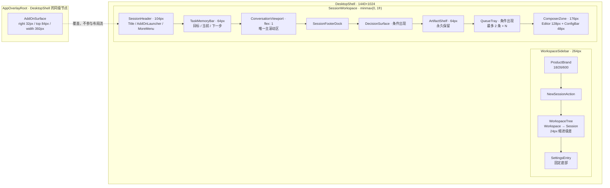
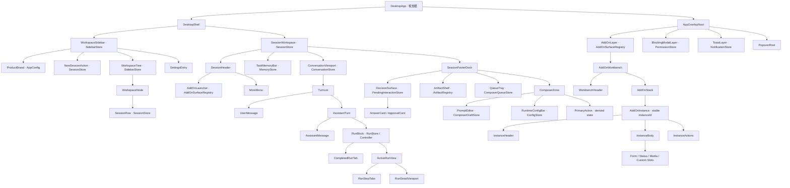
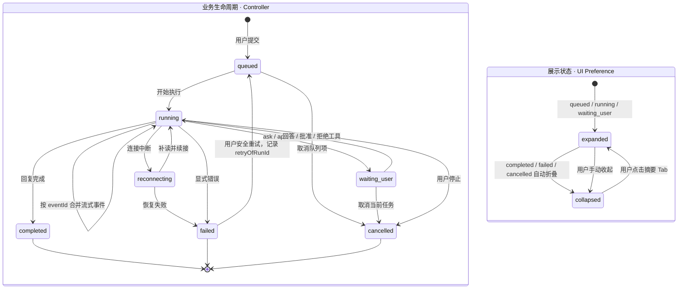
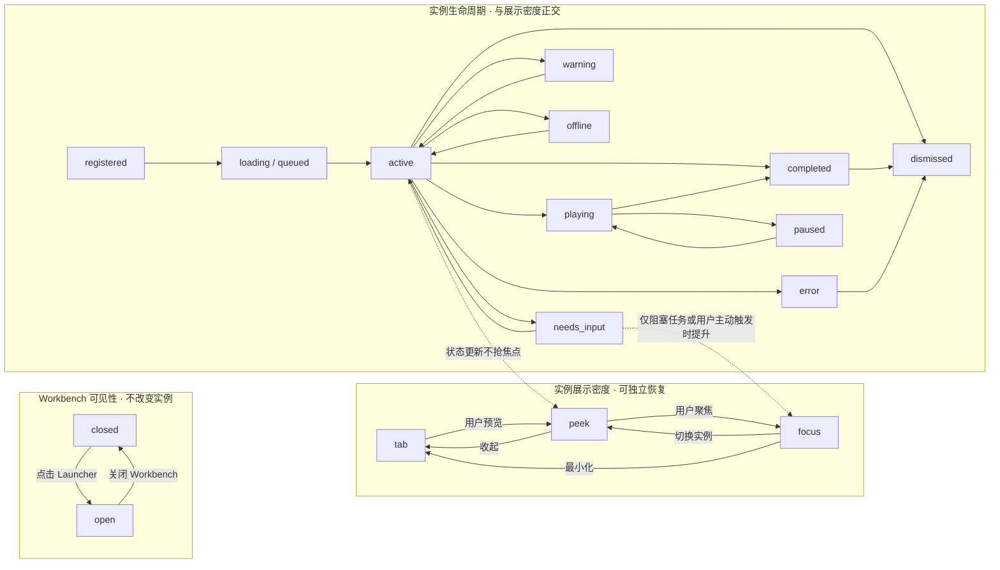
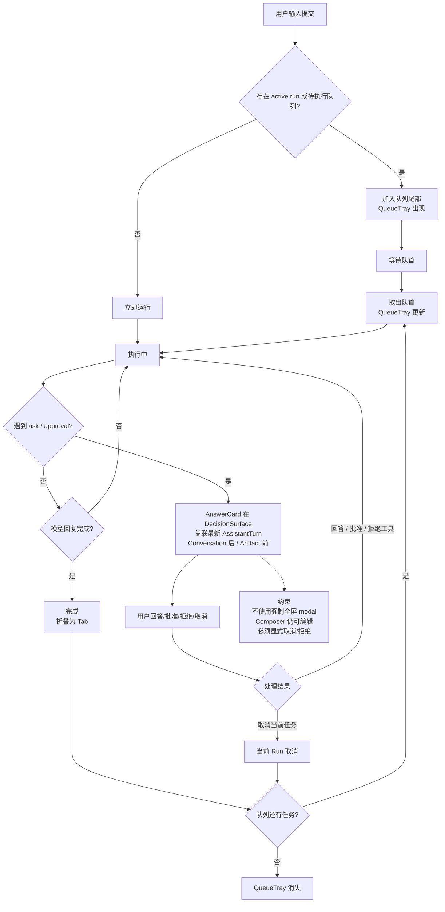
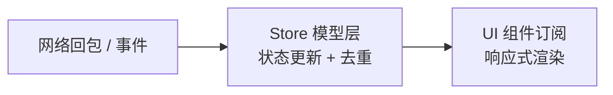

# WorkGround2 Desktop 用户界面设计规范

> 设计语言：**Obsidian Iris / 黑曜石 + 鸢尾紫**
>
> 本文定义 WorkGround2 Desktop 前端界面的目标设计体系，是设计、前端和后端实现的共同基准。它描述"建成后应该长什么样"，不一定反映当前代码状态。

---

## 目录

1. [文档目的、状态与基准](#1-文档目的状态与基准)
2. [页面总览与三层关系](#2-页面总览与三层关系)
3. [Mermaid 示意图](#3-mermaid-示意图)
4. [组件归属总表](#4-组件归属总表)
5. [1440×1024 基准几何与对齐规则](#5-14401024-基准几何与对齐规则)
6. [各区域逐项解剖](#6-各区域逐项解剖)
7. [字体规范](#7-字体规范)
8. [颜色规范](#8-颜色规范)
9. [形状、边界、图标、阴影与动效](#9-形状边界图标阴影与动效)
10. [状态规范](#10-状态规范)
11. [状态与数据所有权](#11-状态与数据所有权)
12. [z-index 与 Overlay 层级](#12-z-index-与-overlay-层级)
13. [响应式与窗口缩放](#13-响应式与窗口缩放)
14. [无障碍与键盘](#14-无障碍与键盘)
15. [设计验收清单](#15-设计验收清单)
16. [黄金固定夹具](#16-黄金固定夹具)
17. [必审状态视觉契约](#17-必审状态视觉契约)
18. [现有代码到目标映射](#18-现有代码到目标映射)
19. [分阶段实施顺序](#19-分阶段实施顺序)
20. [视觉 QA 验收契约](#20-视觉-qa-验收契约)

---

## 1. 文档目的、状态与基准

### 1.1 目的

- 为 WorkGround2 Desktop 提供一份可实现的 UI 设计规范，覆盖布局、组件归属、颜色、字体、状态、对齐、层级和响应式。
- 区分"视觉父级"和"状态所有者"——组件在 DOM 树中的位置不等于其数据归属。
- 使设计、前端和后端对界面行为形成一致理解。

### 1.2 状态

- **设计状态**：实施交接稿 v1。所有几何、颜色、字体、图标和交互规则已锁定，可直接交付前端实施。
- **实施状态**：与实际前端代码存在差异。本文是目标基准，不是当前实现说明。详见第 18 章现有代码到目标映射。
- **版本追踪**：实现若需偏离，先记录原因并更新本文，再进入代码变更。
- **实施就绪声明**：本文档已完成从设计稿到实现交接的转换。所有锁定值均以编号表格给出，黄金参考图为视觉调性总控。实施工程阶段新增的形态约束、渲染细节和边界值已写入手册对应章节。实施工程师应首先阅读第 19 章（分阶段实施顺序）以确定第一步做什么，然后按部就班执行。

### 1.3 设计基准

| 项目 | 值 |
|---|---|
| 设计选型 | Obsidian Iris（黑曜石 + 鸢尾紫） |
| 最终视觉参考 | `docs/assets/workground2-desktop-obsidian-iris-reference.png`（仓库相对路径，SHA256: DB276E8B5F1BB257664DD22D1D710E7D0B72ED0C0EE2AB9E486DFFC02D383D58） |
| Figma 实施标注板 | [WorkGround2 Desktop · Implementation Handoff](https://www.figma.com/design/sl7KYS0cJvVQ2Tosz08OsM) |
| 基准分辨率 | 1440 × 1024，统一归一到此基准 |
| 参考图原始像素 | 1487 × 1058（已锁，不再用作测量基准；所有数值以编号表格为准） |
| 基础网格 | 8px |
| 颜色方案 | 深色优先 |
| 布局引擎 | CSS Grid + Flexbox |
| 圆角风格 | 8px 常规，6px 小控件，10px 浮层 |
| 动效时长 | 120–180ms |
| 字体引擎 | 系统原生字体栈，无 Web Font 请求 |

**冲突优先级**：编号表格/Token 表中的锁定几何数值和行为规则优先于黄金参考图；当参考图因分辨率缩放或色彩空间差异显示不一致时，以表格值为准。黄金参考图控制整体构图和视觉基调（颜色的明度关系、空间感、组件密度），不得被表格值覆盖的排版范畴。三路冲突时：锁定量表 > 组件配方文本 > 黄金参考图。

### 1.4 非目标

- 不定义 CLI/TUI 界面。
- 不定义 HTTP/SSE 网页前端。
- 不定义移动端或平板端布局。
- 不定义插件/AddOn 的内部业务逻辑——仅定义 AddOn 在 UI 中的容器和交互方式。
- 不包含实现代码。

---

## 2. 页面总览与三层关系

页面在概念上分为三层，z-index 从主布局向系统强制层递增：

**Layer 0 — 主布局层 (z: 0–100)**
主布局层由 `DesktopShell` 承载，采用两列 Grid 布局：`264px` 固定宽度的 `WorkspaceSidebar` 和 `minmax(0, 1fr)` 伸缩的 `SessionWorkspace`。所有会话、对话、产物和输入组件都在此层。

**Layer 1 — 工作区浮层层 (z: 30–240)**
包括局部菜单、右键菜单、Dock 和 AddOn 浮层。AddOn 使用 `--z-addon-surface: 240`，高于普通工作区浮层，并以叠加方式出现在主布局之上，不参与正常布局流。

**Layer 2 — 启动与系统强制层 (z: 300–99999)**
包括 Startup Overlay、Blocking Modal（权限审批等强制对话框）、Toast 瞬态通知、Crash Overlay 等宿主级覆盖层。

**关键约束**：

- **AddOn 浮层** 视觉上覆盖 SessionWorkspace，但状态属于 Workspace/Window 级 `AddOnSurfaceRegistry`，不属于当前 Chat Message 或 Session。
- **Blocking Modal**（如权限审批）必须高于 AddOn 浮层，确保用户必须先处理权限问题。
- **Toast** 为正常工作态中的最高瞬态通知，不阻塞操作；Onboarding、性能报告提示和 Crash Overlay 仍可覆盖它。

---

## 3. Mermaid 示意图

### 3.1 页面布局与纵向分区



### 3.2 完整组件归属树（视觉父子 + 状态归属）



### 3.3 Run 生命周期状态图



### 3.4 AddOn Surface 密度/生命周期状态图



### 3.5 Queue + 等待用户流程图



---

## 4. 组件归属总表

| 组件 | 视觉父级 | 状态所有者 | 作用域 | 正常布局流 | 说明 |
|---|---|---|---|---|---|
| DesktopApp | — | — | Window | 是 | 窗口视觉根 |
| DesktopShell | DesktopApp | — | Window | 是 | Sidebar + SessionWorkspace 的两列 Grid |
| AppOverlayRoot | DesktopApp | — | Window | 否 | 所有跨区浮层的统一挂载根 |
| WorkspaceSidebar | DesktopShell | SidebarStore | Workspace | 是 | 左侧固定面板，264px |
| ProductBrand | WorkspaceSidebar | AppConfig | Window | 是 | 左上角产品图标和名称 |
| NewSessionAction | WorkspaceSidebar | SessionStore | Workspace | 是 | 新建会话按钮 |
| WorkspaceTree | WorkspaceSidebar | SidebarStore | Workspace | 是 | Workspace → Session 两级树容器 |
| WorkspaceNode | WorkspaceTree | SidebarStore | Workspace | 是 | 工作区节点及其子会话容器 |
| SessionRow | WorkspaceNode | SessionStore | Session | 是 | 会话行，第二级缩进并叠加状态标记 |
| SettingsEntry | WorkspaceSidebar | AppConfig | Window | 是 | 设置入口，固定在侧栏底部 |
| SessionWorkspace | DesktopShell | SessionStore | Session | 是 | 主内容区，`minmax(0, 1fr)` |
| SessionHeader | SessionWorkspace | SessionStore | Session | 是 | 104px 单行标题区 |
| AddOnLauncher | SessionHeader | AddOnSurfaceRegistry | Window | 是 | `AddOn · N` 入口及需处理计数 |
| MoreMenu | SessionHeader | SessionStore | Session | 是 | 当前会话的更多操作 |
| TaskMemoryBar | SessionWorkspace | MemoryStore | Session | 是 | 单行目标/当前/下一步 |
| ConversationViewport | SessionWorkspace | ConversationStore | Session | 是 | 唯一主滚动视口 |
| TurnList | ConversationViewport | ConversationStore | Session | 是 | 按 turnId 排列消息回合 |
| UserMessage | TurnList | ConversationStore | Session | 是 | 用户消息，右对齐，最大 70% |
| AssistantTurn | TurnList | ConversationStore | Session | 是 | 助手单轮响应容器 |
| AssistantMessage | AssistantTurn | ConversationStore | Session | 是 | 助手正文，左对齐，最大舒适 760px |
| RunBlock | AssistantTurn | RunStore / Controller | Session | 是 | 归属于产生它的 AssistantTurn |
| CompletedRunTab | RunBlock | RunStore + UI Preference | Session | 是 | 结束后自动折叠的小 Tab，高 40px |
| ActiveRunView | RunBlock | RunStore | Session | 是 | 运行中固定 160px，内部滚动 |
| RunStepTabs | ActiveRunView | RunStore + UI Preference | Session | 是 | 单步标签行 40px，溢出 `+N` |
| RunDetailViewport | ActiveRunView | RunStore | Session | 是 | 当前步骤详情与最近事件 |
| SessionFooterDock | SessionWorkspace | — | Session | 是 | Decision、Artifact、Queue、Composer 的底部停靠容器 |
| DecisionSurface | SessionFooterDock | PendingInteractionStore | Session | 条件 | 最新回合与 ArtifactShelf 之间的回答区 |
| AnswerCard / ApprovalCard | DecisionSurface | PendingInteractionStore | Session | 条件 | ask、approval、自由文本输入，可显式取消/拒绝 |
| ArtifactShelf | SessionFooterDock | ArtifactRegistry | Session | 是 | 单行产物架，永久 64px |
| ArtifactItem | ArtifactShelf | ArtifactRegistry | Session | 是 | 单个可恢复产物入口 |
| QueueTray | SessionFooterDock | ComposerQueueStore | Session | 条件 | 默认最多 2 条摘要，余量 `+N` |
| ComposerZone | SessionFooterDock | ComposerDraftStore | Session | 是 | 128px 编辑区 + 48px 配置条 |
| PromptEditor | ComposerZone | ComposerDraftStore | Session | 是 | 多行输入框及附件动作 |
| RuntimeConfigBar | ComposerZone | ConfigStore | Session | 是 | 模型/上下文/运行/交互/自动批准 |
| PrimaryAction | ComposerZone | 派生状态 | Session | 是 | 从 Draft + Run + Pending Interaction + Connection 派生发送/加入队列/本地保存 |
| AddOnLayer | AppOverlayRoot | AddOnSurfaceRegistry | Window | 否 | z=240 的应用级浮层层 |
| AddOnWorkbench | AddOnLayer | AddOnSurfaceRegistry | Window | 否 | 多实例浮层容器 |
| WorkbenchHeader | AddOnWorkbench | AddOnSurfaceRegistry | Window | 否 | `AddOn · N 活跃` + pin/minimize/close |
| AddOnStack | AddOnWorkbench | AddOnSurfaceRegistry | Window | 否 | 实例稳定排序与内部滚动容器 |
| AddOnInstance | AddOnStack | AddOnSurfaceRegistry + AddOn Host | Window/Workspace/Session | 否 | 以 stable instanceId 区分；panelId 标识面板类型 |
| InstanceHeader | AddOnInstance | AddOnSurfaceRegistry | 同实例 | 否 | icon/name/status + collapse；实例菜单承载关闭等次级动作 |
| InstanceBody | AddOnInstance | AddOn Host | 同实例 | 否 | 宿主控制的内容区 |
| Form/Status/Media/Custom Slot | InstanceBody | AddOn Host | 同实例 | 否 | 四种受控内容槽 |
| InstanceActions | AddOnInstance | AddOn Host | 同实例 | 否 | 主次操作、重试、提交等 |
| BlockingModalLayer | AppOverlayRoot | PermissionStore | Window | 否 | 权限等宿主强制模态 |
| PopoverRoot | AppOverlayRoot | OverlayStore | Window | 否 | AddOn 和主界面共用的菜单/选择器挂载根 |
| ToastLayer | AppOverlayRoot | NotificationStore | Window | 否 | 瞬态通知 |

---

## 5. 1440×1024 基准几何与对齐规则

### 5.1 尺寸锁定值

以下值为 **实施基准**，统一归一到 1440×1024 视觉图生成基准，数值为实现基准，响应式只由 token/断点调整，不得自由漂移：

| 区域 | 锁定值 | 说明 |
|---|---|---|
| Sidebar 宽度 | 264px | 固定宽度，含右侧 1px 分隔线 |
| Sidebar 水平/顶部内边距 | 24px / 20px | SettingsEntry 使用同一水平脊线 |
| Sidebar 树行高度 | 36px | Workspace 与 Session 共用，状态不改变行高 |
| Main 区域 | `minmax(0, 1fr)` | 剩余宽度全部给主区 |
| Main 左内边距 | 48px | 宽屏基准值 |
| Main 右内边距 | 32px | 宽屏基准值 |
| Main 底部下边距 | 32px | SessionFooterDock 最低点到主区底边 |
| Header 高度 | 104px | 仅标题行，无第二行 |
| Header 紧凑操作命中区 | 32×32px | AddOnLauncher 可更宽但保持 32px 高 |
| Memory Bar 高度 | 64px | 单行：目标/当前/下一步 |
| Conversation 内边距 | top 72px / bottom 32px | 水平边距继承 Main 48px/32px |
| Turn 间距 | 48px | 同一 Turn 内部元素间距 12–16px |
| Assistant 正文舒适宽度 | max 760px | 代码块可横向滚动 |
| UserMessage 宽度 | max 70% | 最小窗口下改为可用宽度减 32px |
| ActiveRunView 高度 | 160px | 矮窗口 120px；内部滚动 |
| CompletedRunTab 高度 | 40px | 点击切换展开/折叠 |
| Artifact Shelf 高度 | 64px | 永久保留，含空状态 |
| ArtifactItem 高度 | 32px | 图标 20px，项目间距 32px |
| SessionFooterDock 基准高度 | 240px | 顺序为 Decision → Artifact 64px → Queue → Composer 176px；Decision/Queue 条件出现 |
| Composer 高度 | 176px | PromptEditor 128px + RuntimeConfigBar 48px |
| QueueTray 高度 | auto | 默认最多 2 条，余量 +N |
| Queue 单行高度 | 36px | 次级操作不改变行高 |
| DecisionSurface 高度 | auto | 等待用户时出现，内容超高时内部滚动 |
| Composer 的 RuntimeConfigBar 高度 | 48px | 五项配置与 PrimaryAction 共用一行 |
| AddOn 浮层右侧偏移 | 32px | 锚定 Header AddOnLauncher，右边线对齐 |
| AddOn 浮层宽度 | 392px | 默认宽度，不再使用范围；响应式见第 13 章 |
| AddOn 浮层顶部偏移 | 84px | 位于 AddOnLauncher 下方约 16px，并与 104px Header 下部重叠 20px |
| AddOn 浮层最大高度 | `min(70vh, 可用高度)` | 可用高度由 top 与 SessionFooterDock 上缘共同计算 |
| WorkbenchHeader / InstanceHeader | 56px / 44px | 全局控制与实例控制分层 |
| AddOn Peek / Tab | 80px / 36px | Peek 展示摘要；Tab 仅一行 |
| AddOn 实例间距 | 8px | 同一 Workbench 内稳定纵向排列 |
| 基础网格 | 8px | 所有间距基准 |
| 微网格 | 4px | 极小间距调节 |

### 5.2 对齐规则

| 规则 | 锁定值 |
|---|---|
| 主区所有模块共享左对齐脊线 | 左边缘对齐 48px |
| 用户消息对齐 | 右对齐（气泡式），最大宽度 70% |
| 助手消息/正文对齐 | 左对齐（文本式），最大舒适宽度 760px |
| Run 窗口对齐 | 左对齐 |
| Sidebar 内部树行 | 左对齐，Workspace 与 Session 行有 24px 缩进级差 |
| AddOnLauncher 与 AddOn 浮层 | 右边线对齐 |
| 分割线 | 1px solid `--border`，Sidebar 右侧 |
| 当前 Session 行左侧指示条 | 3px × 32px |
| Main 底部下边距 | 32px | SessionFooterDock 最低点与主区底边之间的留白 |

### 5.3 组件内边距与间距配方

以下为各区域组件内部 padding、gap、border、radius 的锁定值：

| 区域 | 水平 padding | 垂直 padding | 内部 gap | border | radius |
|---|---|---|---|---|---|
| Sidebar 容器 | 24px（左右） | 20px（顶部） | 8px | 右侧 1px solid `--border` | — |
| ProductBrand 行 | 0 | 0 | 12px（图标与文字） | 无 | — |
| WorkspaceTree 节点 | 0 | 0 | 0 | 无 | 6px（行 hover/active） |
| SessionRow | 0 | 0 | 8px（会话标题与状态徽标） | 无 | 6px |
| SessionHeader | 0 | 0 | 0 | 无 | — |
| SessionFooterDock 容器 | 0 | 0 | 0（子组件按高度叠放） | 无 | — |
| ComposerZone | 0 | 0 | 0 | 顶部 1px solid `--border` | 8px（输入框） |
| RuntimeConfigBar | 0 | 0 | 8px（pill 之间） | 无 | 6px（pill） |
| AddOn Workbench | 0 | 0 | 8px（实例间距） | 1px solid `--border` | 10px（整体浮层） |
| WorkbenchHeader | 16px（左右） | 0（固定 56px） | 8px | 底部 1px solid `--border-soft` | — |
| InstanceHeader | 16px（左右） | 0（固定 44px） | 8px | 底部 1px solid `--border-soft` | — |
| ConversationViewport | 继承 Main 48px/32px | top 72px / bottom 32px | 48px（Turn 间距） | 无 | — |
| UserMessage | 16px（左右） | 12px（上下） | 8px | 无 | 8px |
| AssistantMessage | 0 | 0 | 12–16px（与 Run 之间） | 无 | — |
| CompletedRunTab | 12px（左右） | 0（固定 40px） | 8px | 无 | 6px |
| ActiveRunView | 12px | 8px | 8px | 1px solid `--border` | 8px |
| ArtifactShelf | 0 | 0（固定 64px） | 32px（项目间距） | 顶部 1px solid `--border-soft` | — |
| ArtifactItem | 8px（左右） | 0 | 8px | 无 | 6px |
| QueueTray | 12px | 8px | 8px | 顶部 1px solid `--border-soft` | 6px |
| DecisionSurface (AnswerCard) | 12px | 12px | 12px | 1px solid `--border` | 8px |
| PromptEditor | 12px | 8px | 8px | 1px solid `--border` | 8px |

### 5.4 Spacing Tokens

| Token | 值 | 用途 |
|---|---|---|
| 4px | 微间距 | 图标与文字 |
| 8px | 基础网格 | 基础单元 |
| 12px | 紧凑间距 | 标签内边距 |
| 16px | 标准间距 | 元素间 |
| 24px | 较大间距 | 分区间距、Sidebar 缩进级差 |
| 32px | 大间距 | Main 右侧 |
| 48px | 超大间距 | Main 左侧 |

### 5.5 响应式说明

- 上述锁定值在 1440px 窗口宽度下确保。具体断点调整见第 13 章。
- 不允许在断点之间做"流动式"缩放——应使用离散断点。

---

## 6. 各区域逐项解剖

### 6.1 Product/Sidebar（WorkspaceSidebar）

- 基准宽度 264px，水平 padding 24px。
- 树行高度 36–40px，当前 Session 行左侧指示条 3px × 32px。

**视觉元素**：

- **ProductBrand**：`32×32px` WorkGround2 产品图标 + `12px` 间距 + `WorkGround2` 文字 18/26/600；整行 `align-items: center`，不得使用占位产品名。
- **NewSessionAction**：新建会话按钮，位于 ProductBrand 下方。
- **WorkspaceTree**：两级树容器，Workspace → Session 行有 24px 缩进级差。
- **WorkspaceNode**：工作区图标 + 名称；点击展开下拉切换；当前工作区有选中态（`accent-soft` 背景）。
- **SessionRow**：会话标题（单行截断）+ 右侧状态徽标（running/queued/completed/failed）；当前会话有左侧 3px 活跃指示条（`accent`）和 `accent-soft` 背景高亮。运行状态用 status icon/text，不给整行 accent 背景；当前 selection 与业务状态独立叠加。
- **SettingsEntry**：设置入口，固定在侧栏底部。

**交互**：

- 点击 SessionRow 切换会话。

**非本轮设计范围**（未确认，不锁定）：
- 右键菜单、拖拽排序、标题 inline 编辑。

---

### 6.2 SessionHeader + AddOnLauncher + MoreMenu

- 高度 104px，单行主结构。
- 左侧：SessionTitle（24/32/600）。
- 右侧：AddOnLauncher（"AddOn · N" 徽标按钮）与 MoreMenu 按钮。
- Header 使用 `display:flex; align-items:center`；左右组以 `space-between` 分离，右侧控件 gap 8px。AddOnLauncher 高 32px、横向 padding 10px；MoreMenu 命中区 32×32px。
- 删除第二行的模型标识、上下文使用率、Session ID 等辅助信息。模型、上下文、运行状态、交互方式、自动批准都只在底部 RuntimeConfigBar。

---

### 6.3 TaskMemoryBar

- 高度 64px，**单行**。
- 格式：`目标：…  ·  当前：…  ·  下一步：…`，右侧可有"展开"。
- 使用 `display:flex; align-items:center`；三段 gap 16px，分隔点两侧各保留 8px；“展开”使用 `margin-left:auto`。
- 字段标签 600、值 400。
- 超出时优先保留"当前"和"下一步"，用省略号，不换行。
- 空状态下提示"暂无记忆"（`text-secondary`）。
- 切回 Session 时这一行必须首先可读。

---

### 6.4 ConversationViewport

- 占 Main 区域剩余高度（减去 Header、Memory Bar 和动态 SessionFooterDock），**内部 overflow-y: auto**。
- 流式 token 追加时不改变滚动位置；用户已滚动到历史消息时弹出"新消息"提示按钮。
- 不同 Turn 之间间距 48px；同一 Turn 内正文、RunBlock、TurnActions 之间为 12–16px。

#### 6.4.1 UserMessage

- 右对齐，最大宽度约 70%。
- 背景色 `surface-2`，圆角 8px。
- 无头像、无用户名标签。

#### 6.4.2 AssistantTurn / AssistantMessage / RunBlock

- **AssistantTurn** 是助手单轮响应的视觉容器，包含 AssistantMessage 和 RunBlock。
- **AssistantMessage** 左对齐，主体内容最大舒适宽度 760px，超过时自然换行。背景透明（继承 `main` 或 `canvas`）。无头像、无用户名标签。流式输出时内容不断增长，不重新布局已有元素。
- **RunBlock** 视觉归属于产生它的 AssistantTurn，与 AssistantMessage 同级位于 AssistantTurn 内。

---

### 6.5 CompletedRunTab + ActiveRunView + RunStepTabs + RunDetailViewport

#### 6.5.1 CompletedRunTab（折叠态）

- 高 40px，内容为 `运行完成 · N 步 · T 秒`。
- 点击展开查看完整 Run 步骤。
- 宽度与助手消息一致，左对齐。
- 颜色：`text-secondary`。

#### 6.5.2 ActiveRunView（展开态）

- 正常窗口固定高度 160px，矮窗口固定高度 120px，**内部 overflow-y: auto**——Run 步骤再多也不继续撑高界面。
- 顶部一行为 StepTabs：高 40px；已完成步骤收紧为小 Tab，溢出显示 `+N`。
- 当前运行区域只显示最近 3–4 条事件。
- 已完成步骤自动折为小 Tab；错误 Tab 保留 error icon + error 色；整轮完成自动折叠。
- 每步是一个 RunStepTab：左侧步骤编号 + 工具名，右侧状态徽标（completed/running/waiting/error）。
- Stop 按钮位于 ActiveRunView header；不得在 Composer 额外放置常驻 Stop 按钮。
- 流式 token/思考事件只更新当前步骤内容，不影响对话滚动位置，不顶走产物。

---

### 6.6 DecisionSurface + AnswerCard

- 视觉上属于 SessionFooterDock，并通过 `turnId` 关联最新 AssistantTurn。
- 位于 ConversationViewport 之后、ArtifactShelf 之前，因此首先承接最新模型问题，同时不改变对话滚动位置。
- 不是全屏 modal，不遮挡对话上下文。用户仍可编辑 Composer 中的下一条消息。
- 支持 `ask` 类型（单选/多选）、`approval` 类型（允许/拒绝）和自由文本。
- 回答、批准、拒绝和自由文本提交都在 AnswerCard 内完成；Composer 始终编辑“下一条消息”。
- Answer/Approval pending 必须可取消或拒绝；Escape 不得静默丢失输入。

---

### 6.7 ArtifactShelf + ArtifactItem + QueueTray

#### 6.7.1 ArtifactShelf + ArtifactItem

- 永久占位 64px，包括空状态。空时显示"产物 0"与低噪声空提示，不能 height:0。
- 单行水平排列，内部 overflow-x: auto。不换成卡片网格。
- 图标为低彩度统一线性类型图标，`text-secondary` 色，hover/active 用 `accent`。
- 每个 ArtifactItem 为 `20px 类型图标 + 单行文件名/入口名 + 可选状态标记`，最小命中区 32px。

**Artifact 类型图标**（概念名称，同一线性图标库提供）：

| 类型 | 概念图标名 |
|---|---|
| 代码文件 `.go/.ts/.js/.py` | FileCode |
| 图片 `.png/.jpg/.svg` | Image |
| 可执行文件 `.exe/.appimage` | Binary |
| 启动/重启脚本 `.bat/.cmd/.ps1` | TerminalSquare |
| 调试入口、Dev Server、Preview URL | Bug / ExternalLink |
| 测试包、安装包 | PackageCheck / Package |
| 压缩包 `.zip/.tar.gz` | Archive |
| URL/链接 | Link |
| 日志 `.log/.txt` | FileText |
| 视频/音频 | Film / AudioLines |

- 产物固定可见，不因 Run 或流式事件被顶走。
- 空架时保留空间，显示空状态文本。
- 点击使用类型对应的主动作：文件打开或定位、可执行文件/脚本运行、调试入口打开、媒体预览；危险或不可逆动作仍进入宿主审批。
- 次级动作放在上下文菜单：复制路径/链接、在文件管理器中显示、附加到输入、重新生成、移除失效入口。
- ArtifactItem 必须携带稳定 `artifactId`、来源 `runId`、scope、可用性和最后校验时间；重复产物事件按 `artifactId` 幂等更新，不生成重复入口。

#### 6.7.2 QueueTray

- 位于 ArtifactShelf 与 ComposerZone 之间。
- 默认展示最多 2 条单行摘要，余量用 `+N`。
- 支持编辑、移除、调整顺序，但次级操作 hover/focus 后出现。
- 无队列时完全隐藏（display:none）。

---

### 6.8 ComposerZone + RuntimeConfigBar + PrimaryAction

- 总高度 176px。
- **结构**：上部 PromptEditor 128px；下部 RuntimeConfigBar 48px。attachment action 位于编辑区左下，PrimaryAction 位于配置条最右侧。

- **PromptEditor**：多行 textarea，支持 `/` 斜杠命令、`@` 引用文件/MCP 资源、附件拖放。字号 16/24/400。

- **RuntimeConfigBar**：精确五项，横排 pill/toggle 控件组：
  - `DeepSeek-R1`（模型选择器）
  - `上下文 33%`（上下文使用率）
  - `运行中`（运行状态）
  - `用户选择`（交互模式）
  - `自动批准：低风险`（自动批准开关）
  - 以上为精确基准文案，不使用 Plan/Run/Goal、chat/ask、AutoApprove on/off 等替代文案。
  - 左侧五项按上列顺序排列，PrimaryAction 使用 `margin-left: auto` 右对齐；空间不足时按第 13 章收进“更多”。

- **PrimaryAction**（主按钮，accent 色带 `accent-foreground: #0A0712`）：
  - `idle` 状态：`发送`
  - `running` 状态：`加入队列`
  - `waiting_user` 状态：`加入队列`（回答操作留在 AnswerCard）
  - `offline` 状态：`保存到本地队列`
  - Stop 按钮在 Run header，不在 Composer 额外放置。
  - PrimaryAction 不拥有独立业务 Store；它由 ComposerDraftStore、RunStore、PendingInteractionStore 和 ConnectionState 共同派生。

---

### 6.9 AddOnLayer + AddOnWorkbench + AddOnInstance

#### 6.9.1 布局位置

- 浮层由 Header 的 AddOnLauncher 锚定：right 32px、top 84px、宽 392–440px（默认 392px）。它位于 Launcher 下方约 16px，并与 104px Header 下部重叠 20px。最大高度取 `min(70vh, viewport - top - FooterDock - 12px)`。
- 底边必须停在 Artifact/Composer 上方，避免挡住核心输入与产物。
- 不参与主布局流（position: fixed）。
- 默认只保持一个 Focus 实例；其余实例以 Peek 或 Tab 在同一 Workbench 内稳定纵向排列，不生成可自由漂移、互相遮挡的小窗口。Tab 是最小化密度。

#### 6.9.2 WorkbenchHeader + InstanceHeader

- **WorkbenchHeader** 高 56px：左侧 `AddOn · N 活跃`，右侧依次为 pin、minimize、close；它控制整个工作台，不替代实例操作。
- **InstanceHeader** 高 44px：左侧 icon/name，右侧 status + collapse；关闭、重新加载等低频动作放实例菜单，避免每行堆满图标。
- 状态信号由统一线性图标库提供：active(`accent`) / needs_input(`warning`) / error(`error`) / completed(`success`) / idle(`text-secondary`)。

#### 6.9.3 内容槽

四种预定义内容槽：

| 槽类型 | 用途 | 行为 |
|---|---|---|
| Form | 配置表单、登录等输入场景 | 滚动，保持表单状态 |
| Status | 进度条、状态信息 | auto-refresh，不定高 |
| Media | 图片/视频/音乐播放 | 收起时不暂停，可后台控制 |
| Custom | 插件自定义渲染 | 由 AddOn 注册时提供渲染器，沙箱化 |

#### 6.9.4 交互规则

- AddOnLayer 是应用级置顶浮层。Window/Workspace scope 的实例切 Session 不关闭；Session scope 的实例离开所属 Session 时隐藏但不销毁，切回后恢复。
- 排序稳定：`needs_input > pinned > firstActivated / explicit user order`。用户正在输入时不得因为状态刷新自动跳位。
- `needs_input` 只有"阻塞当前任务"或"用户主动触发"时自动 Focus。其他情况只置顶 Peek/提示，不抢焦点。
- 关闭 Workbench 只隐藏，不停止仍在运行的实例。
- 媒体类 AddOn 在 Tab 或 Peek 状态下继续播放，不丢状态。
- 登录/状态/图片/视频/音乐共享宿主外壳（标题栏 + 控制栏）。
- Custom 必须是宿主注册/沙箱化 renderer，禁止 AddOn 注入任意 HTML/JS、z-index 或全局快捷键。
- AddOn 内部 select/menu 挂统一 PopoverRoot，插件不得自设大 z-index。

---

## 7. 字体规范

### 7.1 UI 字体（Windows 优先）

```
Segoe UI Variable Text, Segoe UI, Microsoft YaHei UI,
Microsoft YaHei, Noto Sans SC, Arial, sans-serif
```

### 7.2 等宽字体

```
Cascadia Code, Cascadia Mono, Consolas, Liberation Mono,
ui-monospace, monospace
```

### 7.3 字号 Token

以下 token 是 **锁定值**。仅允许按第 13 章的离散断点切换，不做连续缩放，也不允许随意替换。仅使用 400/500/600 权重：

| Token | 字号 | 行高 | 权重 | 使用位置 |
|---|---|---|---|---|
| `text-xs / meta / status` | 12px | 18px | 400–500 | 时间戳、辅助元信息、徽标数字、AddOn form label |
| `text-run` | 12px | 20px | 400–500 | Run 日志、路径、工具事件 |
| `text-sm / control` | 13px | 20px | 500 | 控制标签、按钮文字、配置项文本、AddOn form label |
| `text-base / default` | 14px | 22px | 400–500 | 消息正文默认字号、侧栏会话行 |
| `text-lg / body` | 15px | 24px | 400 | 消息正文（舒适阅读）、内联代码 |
| `text-input` | 16px | 24px | 400 | 输入框、Composer 编辑区 |
| `text-xl / product` | 18px | 26px | 600 | 产品名称 |
| `text-2xl / screen-title` | 24px | 32px | 600 | 会话标题 |

### 7.4 字体使用规则

| 场景 | 字体栈 | 字号 Token |
|---|---|---|
| 会话标题 | UI 字体 | `screen-title` 600 |
| 产品名称 | UI 字体 | `product` 600 |
| 侧栏会话行 | UI 字体 | `default` 400 |
| 记忆行 | UI 字体 | `control` 400 |
| 用户消息 | UI 字体 | `body` 400 |
| 助手消息正文 | UI 字体 | `body` 400 |
| 代码块 | 等宽字体 | `control` 或 `default` 400 |
| 内联代码 | 等宽字体 | 继承行高 |
| 配置条 pill | UI 字体 | `control` 500 |
| AddOn 标题 | UI 字体 | `default` 600 |
| AddOn form label | UI 字体 | `meta` 500 |
| AddOn input | UI 字体 | `control` 400 |
| 时间戳/步骤数 | UI 字体 | `meta` 400 |
| Run 日志 | 等宽字体 | `text-run` 400 |
| 日志中的文件名/路径 | 等宽字体 | `text-run` 400 |
| 按钮文字 | UI 字体 | `control` 500 |

### 7.5 中文、英文、数字说明

- **中文**：使用 `Microsoft YaHei UI` 或 `Noto Sans SC` 渲染，确保 CJK 字符与西文行高一致。
- **英文/数字**：`Segoe UI` 或 `Segoe UI Variable Text`。
- **代码/日志**：`Cascadia Code` 提供连字支持，`Consolas` 作为无连字回退。
- 混合文本（中英混排）时，以 `font-size` 14px 为基准，行高 22px 确保中文行距舒适。
- 12px 时间戳、步骤数和可读占位符使用 `text-secondary`；`text-muted` 只用于禁用或不承载必要信息的装饰文字。

---

## 8. 颜色规范

### 8.1 暗色模式（默认）

以下颜色是为 **Obsidian Iris** 选型锁定的锁定值，不允许随意替换。

| 角色 | 值 | 用途 | 禁止事项 |
|---|---|---|---|
| `canvas` | `#08090C` | 最深背景，窗口最外层 | 不用于任何内容区域 |
| `sidebar` | `#0D0F14` | 侧栏背景 | 不用于主内容区 |
| `main` | `#0B0C10` | 主内容区背景 | 不用于浮层或卡片 |
| `surface-1` | `#12141A` | 卡片、面板、浮层基准背景 | 不用于按钮 |
| `surface-2` | `#171A22` | 二级表面（输入框、用户消息气泡） | 大面板不要用此色 |
| `border` | `#242833` | 标准分割线、边框 | 不用作文字 |
| `border-strong` | `#353A47` | hover、选中边界、拖拽边界 | 不用于静态大面积描边 |
| `border-soft` | `rgba(255,255,255,.07)` | 轻量分割线 | 不用于可交互元素边框 |
| `text-primary` | `#F3F4F6` | 主要文字 | 不用于禁用态或占位符 |
| `text-secondary` | `#A3A8B3` | 次要文字、时间戳、可读占位符 | 不用于正文内容 |
| `text-muted` | `#6F7582` | 禁用状态和纯装饰性元信息 | 不用于占位符、时间戳或可点击标签 |
| `accent` | `#8378F6` | 主操作色、选中态、焦点环、链接 | 不用于大面积背景 |
| `accent-strong` | `#9B92FF` | hover/active 增强 accent | 不用于静态文字 |
| `accent-soft` | `rgba(131,120,246,.12)` | 选中项背景、按钮弱背景 | 不用于文字 |
| `focus-ring` | `#9B92FF` | 2px 键盘焦点环 | 不得使用低透明度替代 |
| `accent-foreground` | `#0A0712` | accent 实心主按钮文字色 | 要求 AA 对比度 |
| `warning` | `#E9A93A` | 需注意的状态、队列徽标 | 不用于错误或成功 |
| `running/success` | `#35C98C` | 运行中指示、完成状态 | 不用于危险操作 |
| `error` | `#F06D6D` | 错误状态、失败步骤 | 不用于次要警告 |

### 8.2 高纯度色使用限制

- 高纯度色（accent、warning、running/success、error）仅用于：
  - 主操作按钮（发送/加入队列）——允许使用 `accent → accent-strong` 的克制双端渐变 + `accent-foreground` 文字
  - 当前选择/活跃指示条（accent）
  - 焦点环（accent）
  - 小型状态徽标（running/success/error/warning）
- 选中/hover 使用 `accent-soft`，不能大面积染色。
- Artifact 图标保持 `text-secondary`，只有 hover/active 用 accent。
- **禁止**：
  - 大面积纯色面板（如整块红色或绿色背景）
  - 渐变（仅 WorkGround2 Logo 与主操作按钮例外）
  - 发光效果（text-shadow、box-shadow 光晕、glow filter）
  - 彩色文字大段正文
  - 彩虹色/多色装饰

### 8.3 浅色模式（未来可选扩展，非锁定）

浅色模式不是本次选定视觉。以下仅为未来可能的扩展方向，未经锁定：

| 暗色 | 浅色参考 |
|---|---|
| `#08090C` | `#F6F4F1` |
| `#0D0F14` | `#FBF8F6` |
| `#0B0C10` | `#FAF8F6` |
| `#12141A` | `#FFFFFF` |
| `#171A22` | `#F2F5F9` |
| `#242833` | `rgba(0,0,0,.12)` |
| `rgba(255,255,255,.07)` | `rgba(0,0,0,.06)` |
| `#F3F4F6` | `#111827` |
| `#A3A8B3` | `#4B5563` |
| `#6F7582` | `#8A94A6` |
| `#8378F6` | `#2F5FA8` |

**声明**：浅色模式的色值、对比度、交互态和组件适配均未经设计确认，不应作为实施依据。

---

## 9. 形状、边界、图标、阴影与动效

### 9.1 圆角

| 元素 | 圆角 |
|---|---|
| 常规面板、卡片、浮层 | 8px |
| 小控件（按钮 pill、标签） | 6px |
| AddOn 浮层 | 10px |
| 输入框 | 8px |
| 列表行 | 6px |
| 胶囊/徽标 | `9999px`（仅真正的单行状态标记） |

- **不要**对所有容器无差别使用胶囊圆角。胶囊风格仅用于独立的状态标记（如 "running" 菊花、"3" 队列计数）。
- inline 区域无阴影。

### 9.2 边框

- 默认边框：1px solid `--border`（`#242833`）。
- 轻量分割线：1px solid `--border-soft`（`rgba(255,255,255,.07)`）。
- Sidebar 右侧分隔线：1px solid `--border`。
- 按钮 hover 边框：1px solid `--border-strong`。
- 焦点环：`0 0 0 2px var(--focus-ring)`；必要时增加 1px `main` 色隔离层，不占 layout。

### 9.3 图标

| 属性 | 锁定值 |
|---|---|
| 尺寸 | 16px（默认）/ 18px（状态栏）/ 20px（toolbar、SessionRow 图标） |
| 笔画宽度 | ~1.6px |
| 风格 | 线性（stroke-based），同一图标库 |
| 锁定图标库 | lucide-react `^1.21.0`（已在 `package.json` 中，代码中已大量使用） |
| 禁止 | emoji 作为功能图标、多色图标、装饰性动画图标、混用 Heroicons 等其他图标库 |

- 功能图标始终通过 `import { IconName } from "lucide-react"` 使用 `<IconName size={16} />` 渲染。
- 语义 Activity/Loader 使用 `lucide-react` 的 `<Loader2 className="animate-spin" />` 或等效，必须服从 `prefers-reduced-motion` 并始终配状态文字。

#### 9.3.1 各组件/状态精确图标映射

所有图标为 lucide-react 导出名称，大小默认 16px，特殊注明除外。

**Sidebar (WorkspaceSidebar)：**

| 位置 | 图标 | 大小 | 说明 |
|---|---|---|---|
| ProductBrand logo | `logo-symbol.png` 图片 | 32×32px | 非 SVG 图标，使用图片 |
| NewSessionAction | `SquarePen` | 18px | 新建会话 |
| WorkspaceNode 展开 | `ChevronDown` / `ChevronRight` | 16px | 展开/折叠 |
| WorkspaceNode 图标 | `Folder` / `FolderOpen` | 16px | 工作区 |
| SessionRow 运行中 | `Loader2` + animate-spin | 14px | 运行态 |
| SessionRow 队列 | `Clock` | 14px | 队列态 |
| SessionRow 失败 | `XCircle` | 14px | 错误态 |
| SettingsEntry | `Settings` | 18px | 设置 |

**Conversation / Transcript：**

| 位置 | 图标 | 大小 | 说明 |
|---|---|---|---|
| UserMessage (编辑) | `Pencil` | 16px | 编辑 |
| AssistantTurn header | `BrainCircuit` | 16px | 助手标记 |
| Message 附件(代码) | `FileText` | 16px | 代码附件 |
| Message 附件(目录) | `Folder` | 16px | 目录附件 |
| Message 附件(图片) | `Image` | 16px | 图片附件 |
| Message 固定 | `Pin` | 16px | 固定 |
| Message 重新生成 | `RotateCcw` | 16px | 重生成 |
| Message 展开/折叠 | `ChevronDown` / `ChevronRight` | 16px | 展开/折叠 |
| Turn 复制 | `Copy` | 16px | 复制 |
| Turn 到底部 | `ArrowDown` | 16px | 滚动到底 |

**ToolGroup / ToolCard：**

| 位置 | 图标 | 大小 | 说明 |
|---|---|---|---|
| ToolGroup 展开 | `ChevronRight` | 16px | 组展开 |
| ToolCard 展开 | `ChevronRight` | 14px | 卡片展开 |

**Run Tab / ActiveRunView：**

| 位置 | 图标 | 大小 | 说明 |
|---|---|---|---|
| Run 完成 | `CheckCircle2` | 16px | 绿色 |
| Run 错误 | `AlertCircle` | 16px | 红色 |
| Run 运行中 | `Loader2` + animate-spin | 16px | 旋转 |
| Run 停止 | `Square` | 16px | 停止 |
| Run 等待用户 | `CircleHelp` | 16px | 黄色 |
| Run 队列 | `Clock` | 14px | 队列 |
| Run 重试 | `RotateCcw` | 14px | 重试 |

**ComposerZone / RuntimeConfigBar：**

| 位置 | 图标 | 大小 | 说明 |
|---|---|---|---|
| PrimaryAction 发送 | `ArrowUp` | 18px | 发送 |
| PrimaryAction 加入队列 | `CornerDownRight` | 18px | 加入队列 |
| 模型选择器 | `Brain` | 16px | 模型切换 |
| 上下文使用率 | `Gauge` | 16px | 上下文 |
| 运行状态 | `Activity` | 16px | 运行中 |
| 交互模式 | `Shield` / `ShieldCheck` / `ShieldAlert` | 16px | 安全模式 |
| 自动批准 | `Check` / `X` | 16px | 批准开关 |
| 附件 | `Paperclip` | 16px | 附件 |
| 更多 | `SlidersHorizontal` | 16px | 次级配置 |
| 文件引用 | `FileText` | 16px | 文件引用 |
| 目标模式 | `Target` | 16px | Goal 模式 |
| 列表模式 | `List` | 16px | 列表 |
| 草稿删除 | `Trash2` | 14px | 删除 |

**StatusBar：**

| 位置 | 图标 | 大小 | 说明 |
|---|---|---|---|
| 模型 | `Brain` | 14px | 当前模型 |
| 上下文 | `Percent` | 14px | 上下文利用率 |
| Token | `Database` | 14px | Token 计数 |
| 缓存 | `Zap` | 14px | 缓存状态 |
| 成本 | `CircleDollarSign` | 14px | 费用统计 |
| 活动 | `Activity` | 14px | 活动指示 |
| 刷新 | `RefreshCw` | 14px | 重新加载 |

**AskCard / ApprovalModal：**

| 位置 | 图标 | 大小 | 说明 |
|---|---|---|---|
| 问题 | `CircleHelp` | 16px | ask 标记 |
| 批准 | `ShieldCheck` | 16px | 允许 |
| 拒绝 | `ShieldOff` | 16px | 拒绝 |
| 取消 | `X` | 16px | 取消 |
| 停止 | `Square` | 16px | 停止 |

**ArtifactShelf：**

| 类型 | 图标 | 大小 | 说明 |
|---|---|---|---|
| 代码文件 | `FileCode` | 20px | `.go/.ts/.js/.py` |
| 图片 | `Image` | 20px | `.png/.jpg/.svg` |
| 可执行文件 | `Binary` | 20px | `.exe/.appimage` |
| 脚本 | `TerminalSquare` | 20px | `.bat/.cmd/.ps1` |
| 调试入口 | `Bug` | 20px | Debug |
| URL 预览 | `ExternalLink` | 20px | Preview URL |
| 测试/安装包 | `PackageCheck` / `Package` | 20px | 包文件 |
| 压缩包 | `Archive` | 20px | `.zip/.tar.gz` |
| 链接 | `Link` | 20px | URL/链接 |
| 日志 | `FileText` | 20px | `.log/.txt` |
| 视频 | `Film` | 20px | 视频文件 |
| 音频 | `AudioLines` | 20px | 音频文件 |

**AddOn Workbench：**

| 位置 | 图标 | 大小 | 说明 |
|---|---|---|---|
| Pin | `Pin` | 16px | 固定 |
| Minus | `Minus` | 16px | 最小化 |
| Close | `X` | 16px | 关闭 |
| Collapse | `ChevronUp` / `ChevronDown` | 16px | 实例密度 |
| active | `Circle` (fill=accent) | 12px | 活跃 |
| needs_input | `CircleHelp` | 12px | 需要输入 |
| error | `AlertCircle` | 12px | 错误 |
| completed | `CheckCircle2` | 12px | 完成 |

#### 9.3.2 Logo 资产路径

以下为 `desktop/frontend/src/assets/` 中已有的 Logo 资产：

| 资产文件 | 位置 | 说明 |
|---|---|---|
| `logo-symbol.png` | StartupSplash | 启动闪屏 Logo |
| `logo-wordmark.png` | App.tsx / Welcome | 带文字 Logo |
| `logo.png` | OnboardingOverlay | 引导覆盖 Logo |
| `logo.svg` | 通用备选 | SVG 源文件 |
| `logo-symbol.svg` | 通用备选 | SVG 符号源文件 |
| `logo-wordmark.svg` | 通用备选 | SVG 带文字源文件 |

### 9.4 阴影

| 层级 | 阴影 |
|---|---|
| 内联区域（消息、面板、按钮） | 无阴影 |
| AddOn 浮层 | `0 14px 40px rgba(0,0,0,0.28)`（轻量阴影） |
| Command Palette / Menu | `0 12px 32px rgba(0,0,0,0.25)` |
| Toast | `0 8px 24px rgba(0,0,0,0.22)` |
| Blocking Modal 背景 | `rgba(0,0,0,0.5)` 半透明遮罩 |

### 9.5 动效

| 场景 | 时长 | 缓动 |
|---|---|---|
| 颜色/border hover | 120ms | ease-out |
| 弹窗/菜单进入/退出 | 180ms | decelerate / accelerate |
| Sidebar 折叠/展开 | 160ms | ease |
| AddOn 浮层显示/隐藏 | 180ms | ease-out |
| 面板滑动（drawer） | 180ms max | ease-standard |
| 大浮层淡入/淡出 | 180ms max | ease-standard |

- **所有常规动效 120–180ms，不超过 180ms**。复杂 Drawer 也不超过 180ms。
- **Run 流式事件不能引发布局跳动**。ActiveRunView 使用固定高度容器（~160px），内部 overflow。新步骤加入时不改变外部容器高度，不触发 ConversationViewport 重新布局。
- 倾向 `prefers-reduced-motion`：所有 `transition` 和 `animation` 时长应缩小到接近 0ms，可使用 CSS 变量覆盖。
- 除 WorkGround2 Logo 和主操作按钮的克制双端 accent 渐变外，禁止其他渐变；同时禁止 glow、glass、彩色大面板。

---

## 10. 状态规范

### 10.1 Session 状态

SessionRow 同时承载三个正交维度：`selected/default`（导航选择）、`idle/running/needs_input/queued/failed/completed`（执行状态）、`read/unread`（注意力）。当前选择不能覆盖运行或错误信号。

| 状态 | 视觉信号 | 可用操作 | 自动展开 | 恢复规则 |
|---|---|---|---|---|
| `selected` | 左侧 3px accent 指示条 + `accent-soft` 背景 | 当前会话操作 | — | 按稳定 sessionId 恢复 |
| `unread` | 标题字重 500 + 小型未读点/计数 | 点击查看 | 否 | 已读游标按 sessionId 持久化 |
| `idle` | 常规行 | 点击切换、编辑标题 | 否 | 正常切换 |
| `running` | 右侧 Activity/Loader 图标 + `text-secondary` 小徽标（**不给整行 accent 背景**） | 点击切换（实时查看） | 否 | 切换后继承运行状态 |
| `needs_input` | `warning` 图标 + “待回答”文字 | 切入后回答/拒绝 | 切入后展示，不自动抢会话 | 重连后重新展示 AnswerCard |
| `queued` | 队列计数徽标 | 可编辑队列 | 否 | 队列持久化，重连后重新获取 |
| `failed` | 行标记 `error` + 图标 | 可查看错误、重试 | 否 | 错误信息持久化 |
| `completed` | 常规行 + 完成时间 | 点击切换 | 否 | 正常切换 |

### 10.2 Run 状态

| 状态 | 视觉信号 | 可用操作 | 自动展开 | 恢复规则 |
|---|---|---|---|---|
| `queued` | 队列中灰色标签 | 编辑/删除/重排 | 否 | 队列持久化 |
| `running` | 高约 160px 活动窗口，内部滚动 | 查看步骤、展开日志 | 是（出现时） | 重连后恢复 ActiveRunView |
| `waiting_user` | Run 保持当前步骤；DecisionSurface 显示 `warning` 图标 + 明确文案 | 选择/输入/批准/拒绝/取消 | 是（出现时） | 重连后重新展示 AnswerCard |
| `reconnecting` | 固定高度 Run 内显示 “正在重连” + Activity 图标，不清空已有日志 | 停止、查看已有步骤 | 是 | 使用 runId 补读后回到 running 或 failed |
| `completed` | 折叠 Tab `"运行完成 · N 步 · T 秒"` | 点击展开 | 否 | 折叠 Tab 持久化在对话中 |
| `failed` | 折叠 Tab 标为 `error` 色 | 查看错误详情、安全重试 | 否 | 错误信息持久化；重试记录 retryOfRunId/requestId |
| `cancelled` | 折叠 Tab 使用 `text-secondary` + Cancel icon | 点击查看已执行步骤 | 否 | 已执行步骤保留 |

- 状态必须使用 icon + text，不用 unicode 字符或只靠颜色。
- 信号图标由统一线性图标库提供（success icon / error icon 等），不写 Unicode ✓/✕ 作为实现方式。

**ActiveRunView 高度锁定**：

- 运行中高度固定约 160px，内部 `overflow-y: auto`。
- 矮窗口固定为 120px；不得随事件数量继续增长。
- 完成后立即折叠为 CompletedRunTab（不保留 160px 空白高度）。

### 10.3 Queue 状态

| 状态 | 视觉信号 | 可用操作 |
|---|---|---|
| 无队列 | QueueTray 完全隐藏（display:none） | 无 |
| 有队列（≥1 项） | QueueTray 显示在 ArtifactShelf 与 Composer 之间，默认最多 2 条 | 编辑、删除、拖拽重排（次级操作 hover/focus 后出现） |
| 队列触发 | 运行结束自动发送队首 | 无（自动） |

队首开始执行时立即从 QueueTray 出队并进入所属 AssistantTurn 的 ActiveRunView；QueueTray 只保存尚未执行的项目，不复制 running/waiting_user 状态。

### 10.4 Waiting User 状态

| 状态 | 视觉信号 | 可用操作 | 恢复规则 |
|---|---|---|---|
| 等待选择（ask） | AnswerCard 在 DecisionSurface，通过 turnId 关联最新 AssistantTurn，包含选项 | 选择选项 + 确认/取消 | 按 interactionId 重新获取 |
| 等待批准（approval） | AnswerCard 包含工具名、参数、理由，可拒绝 | 允许/拒绝 | 按 interactionId 重新获取 |
| 等待自由文本 | AnswerCard 含文本输入框 | 输入并提交/取消 | 重连后重新获取 |
| 校验失败 | 对应字段 error icon + 就地错误文案；保留全部输入 | 修改后重试/取消 | 草稿保留 |
| 提交中 | 主操作 busy，其他冲突操作禁用 | 等待/取消（若后端允许） | 以 interactionId 查询结果 |
| 已完成 | 短暂完成反馈后收起 DecisionSurface | 无 | 结果写入所属 turn |

**禁止**：使用全屏暗幕遮罩强制用户先处理 AnswerCard。Composer 区域仍可继续编辑下一条输入。

Answer/Approval pending 必须可取消或拒绝；Escape 不得静默丢失输入。

### 10.5 AddOn 状态

AddOn 的展示密度与运行状态是两个正交维度。运行状态变化默认只更新当前密度中的图标/文字，不擅自改变浮层位置或焦点。

**Launcher 汇总状态**：

| 状态 | 文案与视觉 | 点击行为 |
|---|---|---|
| 无实例 | `AddOn` + puzzle 图标，无计数 | 打开空 Workbench/可用 AddOn 列表 |
| 有活动实例 | `AddOn · N`，`N` 为未 dismissed 实例数 | 打开并恢复 Workbench |
| 需用户处理 | `warning` 点 + 待处理计数，配 tooltip/无障碍文案 | 打开并聚焦首个阻塞实例 |
| 有错误 | `error` 点 + 错误计数，不覆盖 needs_input 优先级 | 打开错误实例摘要 |

**Workbench 可见性**：

| 状态 | 视觉信号 | 行为规则 | 恢复规则 |
|---|---|---|---|
| `closed` | AddOnLayer 不可见，Launcher 仍显示活动数/待处理数 | 仅隐藏 Workbench，不停止、释放或重排实例 | 再打开时恢复原密度和滚动位置 |
| `open` | Workbench 位于 Launcher 下方 | 可操作 Focus/Peek/Tab 实例 | Window 状态恢复 |

**展示密度**：

| 状态 | 视觉信号 | 可用操作 | 自动展开 | 恢复规则 |
|---|---|---|---|---|
| `tab` | AddOn 缩小为 Tab 标签，位于浮层底部 | 点击展开为 peek | 否 | — |
| `peek` | 预览窗口，较少高度 | 查看、收起、聚焦 | 否 | 保留上次滚动位置 |
| `focus` | 完整浮层窗口 | 完整交互 | 是（点击 AddOn 启动项时） | 保存状态 |

**运行状态**：

| 状态 | 视觉信号 | 可用操作 | 自动改变密度 | 恢复规则 |
|---|---|---|---|---|
| `registered` | 实例名 + 初始状态 | 查看/关闭 | 否 | 以 instanceId 查询 |
| `loading` | Skeleton/Activity 图标 + “正在加载” | 取消/关闭 | 否 | 以 instanceId 查询 |
| `queued` | 队列计数 + “排队中” | 查看/取消（如允许） | 否 | 队列状态补读 |
| `active` | Activity 图标 + 进度/当前阶段文字 | 查看、最小化 | 否 | 进度持续更新 |
| `needs_input` | `warning` 图标 + 明确所需输入 | 回答/提交/取消 | 仅阻塞任务或用户主动触发时升至 focus | 重连后恢复表单草稿 |
| `warning` | `warning` 图标 + 可恢复说明 | 查看、重试 | 否 | 保留输入和上下文 |
| `error` | `error` 图标 + 错误摘要 | 查看、重试、关闭 | 否 | 错误信息持久化 |
| `offline` | 离线图标 + “等待重连” | 查看缓存、取消 | 否 | 重连后安全重试/补读 |
| `completed` | success icon + 结果摘要 | 查看结果、关闭 | 否 | 结果可恢复 |
| `playing/paused` | Play/Pause 图标 + 时间 | 播放控制 | 否 | 恢复媒体位置 |
| `dismissed` | 从 Stack 移除；保留可审计结束记录 | 由触发源重新创建新实例 | 是，释放当前视图 | 不复用旧 instanceId 产生新副作用 |

**AddOn 排序规则**：`needs_input > pinned > firstActivated / explicit user order`。用户正在输入时不得因为状态刷新自动跳位。

### 10.6 Artifact 状态

| 状态 | 视觉信号 | 可用操作 | 恢复规则 |
|---|---|---|---|
| 空架 | “产物 0” + 低噪声空提示，保留 64px | 无 | 按 sessionId 查询 |
| `generating` | 类型图标 + Activity 图标 + 生成中文字 | 查看来源 Run | 按 artifactId 更新，不重复新增 |
| `ready` | 类型图标 + 名称，`text-secondary` | 打开/运行/定位/预览 | 启动时重新校验可用性 |
| `stale` | warning icon + “可能已过期” | 重新校验/重新生成/仍然打开 | 校验后转 ready/missing |
| `missing` | error icon + “文件不存在” | 定位来源/重新生成/移除入口 | 不静默删除历史记录 |
| `failed` | error icon + 失败摘要 | 查看错误/安全重试 | 保存失败原因和 requestId |

Artifact 的可用性与类型图标同时存在；状态不能覆盖类型识别。

### 10.7 Composer 状态

| 状态 | PrimaryAction 按钮文案 | 可用操作 |
|---|---|---|
| `idle`（无输入） | 禁用态 `发送` | 输入文本 |
| `idle`（有输入） | `发送`（accent 色） | 输入/提交 |
| `running` | `加入队列` | 编辑补充文本 |
| `waiting_user` | `加入队列` | Composer 编辑下一条消息；回答/拒绝在 AnswerCard 内提交 |
| `offline` | `保存到本地队列` | 保留草稿；重连后按 requestId 安全提交 |
| `submitting` | busy 状态，不重复显示第二个按钮 | 保留输入；禁止重复提交 |

### 10.8 通用控件状态

| 状态 | 视觉规则 | 行为规则 |
|---|---|---|
| `default` | 标准文字、边框和表面色 | 可操作 |
| `hover` | `border-strong` 或轻微表面提升，不改布局 | 鼠标提示，不作为唯一反馈 |
| `pressed` | accent/表面色加深，保持尺寸 | 单次触发；长按需单独定义 |
| `focus-visible` | 2px `focus-ring` | 键盘操作完整可见 |
| `selected` | `accent-soft` + 图标/文字 | 与 hover、业务状态可叠加 |
| `disabled` | `text-muted`，降低表面对比度 | 不接受输入；必须说明禁用原因 |
| `busy` | Activity 图标 + 动词进行时 | 幂等请求进行中，禁止重复触发 |
| `validation-error` | error icon + 就地文案 | 保留用户输入，聚焦首个错误字段 |
| `success` | success icon + 短暂明确反馈 | 不依赖绿色单独表达 |

---

## 11. 状态与数据所有权

### 11.1 状态分离原则

各状态源独立，互不混用：

| 状态域 | 所有者 | 说明 |
|---|---|---|
| App / Runtime Config | AppConfig + ConfigStore | 产品信息、模型、交互方式、自动批准策略等显式配置 |
| Connection | ConnectionState | online/offline/reconnecting；供 Run、Composer、AddOn 派生展示 |
| Sidebar/Workspace | SidebarStore | 工作区列表、当前工作区、侧栏折叠状态 |
| Session | SessionStore | 当前会话、会话列表，使用稳定 `sessionId` |
| Turn/Run | RunStore / Controller | 运行状态、步骤列表、流式输出缓冲区。以 `sessionId + turnId + runId` 标识；Run 业务状态属于 AssistantTurn / Controller，折叠属于 UI preference |
| Pending Interaction | PendingInteractionStore | ask/approval/自由文本，使用稳定 `interactionId + sessionId + turnId` |
| Artifact Registry | ArtifactRegistry | 产物列表，使用稳定 `artifactId`，按会话/工作区 scope 分组 |
| Composer Draft | ComposerDraftStore | 当前 Composer 草稿文本、附件 |
| Queue | ComposerQueueStore | 队列项目列表；每项使用稳定 `queueItemId + requestId` |
| AddOn Surface Registry | AddOnSurfaceRegistry | Workbench 可见性及实例密度、排序、固定和 scope；实例 key 为 `pluginId + panelId + instanceId`，并携带 `workspaceId + optional sessionId` |
| AddOn Host | Controller / AddOn Bridge | AddOn 业务数据、表单 schema、状态和动作结果；Registry 不复制业务真相 |
| Permission | PermissionStore | 仅宿主强制权限和安全审批；普通 ask/approval 归 PendingInteractionStore |
| Notification | NotificationStore | Toast 队列 |
| Overlay UI Preference | OverlayStore | Popover、菜单、焦点返回目标；不保存业务结果 |
| Memory | MemoryStore | 当前会话记忆行数据 |

PrimaryAction、SessionRow 组合徽标等纯展示状态必须从上述状态域派生，禁止再建立可独立写入的第二业务状态源。

### 11.2 数据流约束

网络回包/事件先进入 Store 模型层，再由 UI 订阅。不直接从回包操作 Panel 或组件。



- **事件上下文明确**：Run 事件携带 `sessionId + turnId + runId + eventId`；Interaction 携带 `interactionId`；Artifact 携带 `artifactId + sourceRunId`；AddOn 事件携带 `pluginId + panelId + instanceId + scope context`。
- **支持重复和乱序**：可重复初始化/注册；迟到数据补读；不依赖理想调用顺序。完成/失败/取消/重连都显式，已结束 Run 不被迟到事件拉回 running。
- **切 Session 处理**：切换时保存 Session/Run/ComposerDraft 的可恢复快照；切回时从单一可信源恢复运行态。Artifact、Queue、Memory、Draft 默认是 Session 级，Artifact 可额外声明 Workspace scope。AddOn 可声明 Window/Workspace/Session scope；切换时 Window/Workspace scope 不丢失，Session scope 暂时隐藏并在返回时恢复。
- **动作幂等**：发送、批准、AddOn 提交、Artifact 重新生成和队列重排都携带稳定 requestId；超时后允许查询状态并安全重试，禁止仅凭按钮点击次数生成业务副作用。

### 11.3 关键恢复场景

| 场景 | 恢复路径 |
|---|---|
| 重连后恢复运行中 Run | 使用 `runId` 重新获取流式缓冲区，重建 ActiveRunView |
| 切 Session 再切回 | 从缓存恢复 RunStore、ComposerDraftStore、ConversationStore |
| 重复/乱序事件 | 使用 `runId + eventId` 去重合并；迟到事件补插到正确位置；已结束 Run 不被拉回 running |
| Session 删除后重新加载 | 使用稳定 `sessionId`，不以文件路径或标题作为唯一 key |
| Pending Interaction 重连 | 使用 `interactionId` 查询处理结果；未完成则恢复输入草稿和 DecisionSurface |
| Artifact 路径失效 | 保留 ArtifactItem 历史，转为 stale/missing，允许重新校验或重新生成 |
| AddOn 实例在重连后恢复 | 使用 `pluginId + panelId + instanceId` 重建业务状态和展示密度，恢复表单草稿、滚动和媒体位置 |

---

## 12. z-index 与 Overlay 层级

### 12.1 分层总表

以下 z-index 值是 **锁定值**，按用途分层。新增层级需评审。

| 层 | z-index | 范围 |
|---|---|---|
| 主布局 | 0 | `.layout`, `.app` |
| 局部提升（sticky/handle） | 2–5 | 行内 sticky 元素、Resize handle |
| Layout resizer | 12–13 | Sidebar/Workspace 拖拽调整条 |
| 内联 sticky | 20 | 表头、滚动同步元素 |
| 局部背板/弹窗 | 30–31 | 局部 backdrop 和 popover |
| Workspace 浮层 | 40 | 工作区相关浮动面板 |
| App Chrome | 70 | 标题栏、顶栏 |
| Drawer 背板 | 90 | 抽屉遮罩 |
| Menu/背板 | 95–96 | 菜单及背景遮罩 |
| Dock | 100 | 底部 dock |
| 浮动菜单 | 110 | 右键菜单、下拉菜单 |
| Topic bar 菜单 | 210 | 工作区顶部主题栏菜单 |
| **AddOn 层** | **`--z-addon-surface: 240`** | 高于普通工作区浮层，低于 Startup/System 层 |
| Startup overlay | 300 | 启动闪屏 |
| Blocking Modal backdrop | 1199 | 仅遮挡 Modal 下方内容 |
| Blocking Modal surface | 1200 | 权限审批、强制对话框 |
| Popover | 1301 | 弹出提示 |
| Toast | 1302 | 瞬态通知 |
| Tooltip | 1302 | 工具提示 |
| Window resize | 1303 | 窗口调整边框 |
| Onboarding | 9999 | 首次引导覆盖 |
| Performance report prompt | 99998 | 性能报告提示 |
| Crash overlay | 99999 | 崩溃覆盖层 |

### 12.2 关键规则

- **AddOn 始终高于聊天/Run/Composer 和常规菜单**（240 vs 0–210），但低于 Startup Overlay 和宿主强制层。
- AddOn 内部 select/menu 挂统一 PopoverRoot（1301）；插件不得自设大 z-index。
- **Blocking Modal 遮罩** 位于 1199、Surface 位于 1200；显示时下层 AddOn 不可点击。
- Modal 打开时，只有该 Modal 自己的 Popover 可以进入 1301；主界面和 AddOn 的既有 Popover 必须关闭或设为 inert。
- **Toast** 不阻断操作，高于 modal 遮罩但低于 crash。
- 正常层级关系：`Menu` < `AddOn` < `Startup` < `BlockingModal` < `Popover/Toast` < `Crash`。
- 不允许随意添加新的 z-index 值。新浮层应复用上述 token；确需新增时必须先说明覆盖对象和被覆盖对象并评审。

---

## 13. 响应式与窗口缩放

### 13.1 基准断点

| 断点 | Sidebar | Main padding | AddOn | 说明 |
|---|---|---|---|---|
| ≥ 1200px | 264px | left 48px / right 32px | 392px | 完整布局 |
| 1024–1199px | 236px | left 32px / right 24px | 360px | Sidebar 略收窄 |
| 880–1023px | 默认折叠为抽屉 | 20px | `min(360px, calc(100vw - 32px))` | Sidebar 抽屉式 |
| < 880px | 抽屉 | 16px | 变为左右 16px 的 non-modal Top Sheet，底部止于 FooterDock 上方 | 最小布局 |

### 13.2 最小可用窗口

- **建议下限**：720 × 640。
- 避免页面整体水平滚动，局部 code / artifact / media 独立滚动。
- 矮窗口 < 800px：Run max-height 120px；AddOn 内部滚动。

### 13.3 缩放与内容裁剪

| 内容 | 缩放规则 |
|---|---|
| UserMessage | 最大宽度 70%，不溢出 |
| AssistantMessage | 宽度减边距，最大舒适 760px，代码块水平滚动 |
| ArtifactShelf | overflow-x: auto，不换行 |
| AddOn 浮层 | 宽度按断点调整，不固定 400px |
| Run view | 限高 160px（矮窗口 120px），内部 overflow-y: auto |
| Composer | 100% 字体缩放时高 176px；更大字体进入可访问布局并按内容增高，编辑区内部滚动 |

### 13.4 响应式 Token

- `--sidebar-width`: `264px` / `236px` / `0px`（抽屉）。
- `--main-padding-left`: `48px` / `32px` / `20px` / `16px`。
- `--main-padding-right`: `32px` / `24px` / `20px` / `16px`。
- `--addon-width`: `392px` / `360px` / `min(360px, calc(100vw - 32px))` / 全宽 Top Sheet。
- 字号缩放使用 `--font-scale` 系数（`1` 基准，支持 `0.94`/`1.08`/`1.18`/`1.32` 用户设置）。
- 支持 200% 字体缩放。
- RuntimeConfigBar 在窄宽时保留模型/运行/批准，其他项进入"更多"下拉。
- 字体缩放超过 132% 时启用可访问布局：Composer 和 DecisionSurface 允许增高，RuntimeConfigBar 收敛为三项主控 + “更多”，不得裁切文字或把操作移出键盘顺序。

---

## 14. 无障碍与键盘

### 14.1 对比度

- `text-primary` vs `main`（`#F3F4F6` 在 `#0B0C10` 上）：约 17.76:1。
- `text-secondary` vs `main`（`#A3A8B3` 在 `#0B0C10` 上）：约 8.20:1。
- `text-muted` vs `surface-1`（`#6F7582` 在 `#12141A` 上）：约 3.98:1，仅用于禁用态和不承载必要信息的装饰元信息；时间戳、占位符等可读文字改用 `text-secondary`。
- `accent` vs `main`（`#8378F6` 在 `#0B0C10` 上）：约 5.57:1，可用于链接和焦点文字。
- `accent-foreground` vs `accent`（`#0A0712` 在 `#8378F6` 上）：约 5.69:1，满足普通文字 AA。
- 所有可交互元素必须有可见的 focus ring。

### 14.2 状态信号（非纯色）

状态使用 icon + text，不用 unicode 字符或只靠颜色。由统一线性图标库提供：

- `running`：Activity/Loader 图标 + `text-secondary` 的“运行中”文字。
- `completed`：success icon + `success` 色。
- `failed`：error icon + `error` 色。
- `waiting_user`：问号图标 + `warning` 色边框。
- `queued`：数字徽标。

### 14.3 Focus Ring

- 焦点环使用 `box-shadow: 0 0 0 2px var(--focus-ring)`；深浅表面上都必须保持清晰可见。
- 出现在：按钮、输入框、选择器、列表项、可交互标签。
- 不对静态元素（面板、分割线、标签文字）添加 focus ring。
- 所有可交互元素的最小命中区 32×32px。

### 14.4 Tab 顺序

自然 DOM 顺序即为 tab 顺序：

1. Sidebar：NewSessionAction → WorkspaceTree（WorkspaceNode → SessionRow 列表）→ SettingsEntry；ProductBrand 仅在可操作时进入顺序
2. Main 顶部：SessionHeader 中实际可操作项（AddOnLauncher → MoreMenu）
3. MemoryBar 的“展开”操作（仅出现时）
4. ConversationViewport：按 Turn 顺序进入消息链接/按钮；展开的 Run 使用 tablist → tab → tabpanel
5. DecisionSurface（如出现）：问题说明 → 选项/输入 → 取消/拒绝 → 主提交
6. ArtifactShelf 项目
7. QueueTray（如出现）
8. ComposerZone：PromptEditor → ConfigBar 控件组 → PrimaryAction

Overlay 使用独立焦点分支：

- 通过 AddOnLauncher 打开 Workbench 后，焦点进入 WorkbenchHeader，再按稳定实例顺序进入 InstanceHeader → Body → Actions；关闭后返回 AddOnLauncher。
- 非模态 Workbench 不锁焦点，用户可用显式快捷键/关闭动作返回主界面。
- Blocking Modal 必须 focus trap；关闭后返回触发它的控件。Modal 外内容统一 inert。

### 14.5 Escape 行为

| 场景 | Escape 效果 |
|---|---|
| 窄屏侧栏抽屉打开 | 关闭抽屉并返回触发按钮焦点 |
| AddOn 浮层打开 | 先关闭内部 Popover；再次按下将 focus 降为 peek/tab，不能丢未保存表单 |
| Command Palette 打开 | 关闭 Palette |
| AnswerCard 出现 | 不能退出（必须回答或显式取消/拒绝整个提交）——不允许 Esc 静默绕过 |
| Blocking Modal | 不能退出（必须先处理） |
| Context Menu | 关闭菜单 |
| Toast | 无影响（Toast 自动消失） |

### 14.6 减少动态

- 用户启用系统 `prefers-reduced-motion` 时，所有过渡/动画时长变接近 0ms。
- 不使用自动播放装饰动画；Activity/Loader 在减少动态模式下改为静态图标 + 状态文字。
- 不使用闪烁或快速闪烁元素。

### 14.7 屏幕阅读器

- 所有图标按钮附带 `aria-label`。
- 状态变化使用 `aria-live="polite"` 区域广播，必须节流，不朗读每条日志。
- Run `aria-live=polite` 必须节流。
- 不隐藏语义 heading 结构。
- Workspace tree 使用 tree/treeitem + keyboard 角色。
- Run Step 使用 tablist/tab/tabpanel 角色（若单详情）。
- AddOn Workbench 默认非模态 region；只有宿主明确的独占决策才升级 dialog。
- 图片需提供替代文字，视频需要字幕，音频需要文字记录。
- 支持高对比度模式。
- 支持 200% 字体缩放。

---

## 15. 设计验收清单

### 15.1 核心体验

| 验收项 | 判定标准 |
|---|---|
| 切回 Session 能一眼恢复任务记忆 | Memory Bar 单行直显目标/当前/下一步 |
| Run 流式事件不顶走对话 | ActiveRunView 固定 160px 高度，内部滚动 |
| 产物固定可见 | ArtifactShelf 固定于对话和 Composer 之间，即使为空也保留 Shelf |
| AddOn 多实例有序 | focus/peek/tab 三态管理，排序稳定：needs_input > pinned > firstActivated，用户输入时不重排 |
| AddOn 不随 Session 切换丢失 | Window/Workspace scope 保持可见；Session scope 隐藏不销毁；关闭 Workbench 不停止实例 |
| 无队列时 Composer 区域整洁 | QueueTray 完全隐藏 |
| 等待用户不阻断页面 | AnswerCard 位于 Conversation 后、Artifact 前，不全屏遮罩；Composer 仍编辑下一条消息 |
| 状态可恢复 | 所有状态携带独立 ID，支持重连恢复 |
| 重连/重开不丢运行态 | runId / interactionId / artifactId / AddOn instanceId 可恢复 |

### 15.2 视觉验收

| 验收项 | 判定标准 |
|---|---|
| 整体颜色氛围 | 中性深色为主，accent 仅用于操作和焦点 |
| 渐变受控 | 仅 Logo 与主操作按钮允许克制的 accent 双端渐变；所有面板纯色填充 |
| 无发光效果 | 无 text-shadow / box-shadow 光晕 |
| 圆角一致 | 8px 常规 / 6px 小控件 / 10px 浮层 |
| 图标风格统一 | 线性 1.6px stroke，同一图标库，低彩度 |
| 排版干净 | 字号、行高、间距 token 一致 |

### 15.3 交互验收

| 验收项 | 判定标准 |
|---|---|
| 焦点环可见 | 所有交互元素有 2px `focus-ring` |
| Escape 路线清晰 | 关闭浮层、菜单、AnswerCard 显式取消/拒绝 |
| 拒绝全屏遮罩 | AddOn、AnswerCard 不强制全屏 |
| 动效适度 | 120–180ms，不引发布局重排 |
| 队列可编辑 | 编辑、删除、拖拽重排（次级操作 hover/focus 后出现） |
| Composer 按钮语义 | idle=发送 / running 或 waiting_user=加入队列 / offline=保存到本地队列；回答由 AnswerCard 提交 |

### 15.4 技术验收

| 验收项 | 判定标准 |
|---|---|
| 状态源单一 | UI 从 Store 推导，非直接操作 DOM |
| 事件上下文明确 | runId + eventId / interactionId / artifactId / pluginId + panelId + instanceId，幂等合并 |
| 重复/乱序安全 | 所有注册和初始化可重复执行；已结束 Run 不被迟到事件拉回 running |
| 组件归属表完整 | 每个组件有视觉父级和状态所有者 |
| z-index 分层可扩展 | 已有层级覆盖，新增需评审 |

## 16. 黄金固定夹具

本节给出黄金参考图 `docs/assets/workground2-desktop-obsidian-iris-reference.png` 对应的唯一固定示例数据。实施工程师必须按此填充界面，以锁定文本长度、组件数量、状态和换行位置。参考图属于设计意图基准；首个通过人工 overlay 验收的实现截图才成为后续自动像素回归基准。

### 16.1 示例 Workspace / Session

| 项目 | 值 |
|---|---|
| 当前 Workspace 名称 | `WorkGround2` |
| 次级 Workspace 名称 | `joyquant-db` |
| 当前 Session 标题 | `桌面信息架构重构` |
| 当前 Workspace 第一个 Session | `桌面信息架构重构`（当前，左侧 3px accent 指示条） |
| 当前 Workspace 第二个 Session | `任务执行进度组件` |
| 当前 Workspace 第三个 Session | `会话缓存策略` |
| 侧栏底部 SettingsEntry | `设置` |

### 16.2 记忆行（TaskMemoryBar）

`目标：重构桌面信息架构 · 当前：Artifact 模型已验证 · 下一步：实现持久化`

### 16.3 对话示例

**上段助手回复（左对齐，舒适宽度 760px）：**

`已调整为两级导航结构，核心路径保持不变。`

回复下方紧跟已完成 Run Tab：`运行完成 · 8 步 · 24 秒`。展开后的步骤标签依次为：`已读 1 个文件`、`思考 8 秒`、`delete_range task_test.go`、`+4`。

**下段助手回复：**

`好的，已制定持久化方案并完成 PoC 验证。`

`将采用本地存储并预留云端同步接口，确保数据一致性与恢复能力。`

`后续会输出设计文档与实现计划。`

**下段随附运行中 Run 块（ActiveRunView）：**

- 标题：`运行中 · 18 秒`，使用 `Loader2` 旋转图标并同时显示状态文字。
- 事件 1：`14:32:11  读取 internal/agent/task_test.go`
- 事件 2：`14:32:13  分析 delete_range 调用`
- 事件 3：`14:32:17  正在运行 go test ./internal/agent/...`
- 事件 4：`14:32:22  等待测试结果...`
- 容器高度固定为 160px；超出内容在 `RunDetailViewport` 内滚动。

### 16.4 Artifact 示例

| Artifact | 类型 | 图标 |
|---|---|---|
| `WorkGround2.exe` | 可执行文件 | `Binary` |
| `调试入口` | 调试入口 | `Bug` |
| `debug.bat` | 脚本 | `TerminalSquare` |
| `测试包.zip` | 测试/压缩包 | `PackageCheck` |

空状态下显示：`产物 0` 加低噪声空提示。

### 16.5 RuntimeConfigBar 示例

从左到右五项精确值：

| 项 | 值 | 图标 |
|---|---|---|
| 模型 | `DeepSeek-R1` | `Brain` |
| 上下文 | `上下文 33%` | `Gauge` |
| 运行状态 | `运行中` | `Activity` |
| 交互模式 | `用户选择` | `Shield` |
| 自动批准 | `自动批准：低风险` | `Check` |

PrimaryAction 按钮文案：`加入队列`（因为正在运行中）。

### 16.6 AddOn 三个实例

| 实例 | 密度 | 状态 | 标题 | 内容 |
|---|---|---|---|---|
| 实例 A | Focus | needs_input | 团队登录 | 登录表单，需要用户输入并提交 |
| 实例 B | Peek | active | 构建监控 | 构建进度 `47%` 与最近状态摘要 |
| 实例 C | Tab | active | 媒体预览 | `demo.mp4`，状态 `播放中`，折叠后继续播放 |

WorkbenchHeader：`AddOn · 3 活跃`，右侧 pin/minimize/close 按钮。

InstanceHeader：左侧 icon/name，右侧 status 小点（`accent`/`text-secondary`）。

---

## 17. 必审状态视觉契约

每个状态定义与黄金屏幕的 delta（差异）。实施方按此生成独立截图进行 QA。

### 17.1 Running（运行中）

| 属性 | 值 |
|---|---|
| Delta | ActiveRunView 中 StepTabs 显示旋转 `Loader2` + "运行中"，无 Run 完成标签 |
| 焦点目标 | ActiveRunView 的 Stop 按钮 |
| 滚动所有者 | ActiveRunView 内部（外部 ConversationViewport 不滚动） |
| 验收截图 | `accept-state-running.png` |

### 17.2 Completed / Expanded Run（完成展开）

| 属性 | 值 |
|---|---|
| Delta | ActiveRunView 中所有步骤有完成 `CheckCircle2` 绿色对勾；最后一步显示运行摘要和时间 |
| 焦点目标 | 首步 Tab |
| 滚动所有者 | ActiveRunView 内部 |
| 验收截图 | `accept-state-run-completed.png` |

### 17.3 Waiting User（等待用户）

| 属性 | 值 |
|---|---|
| Delta | DecisionSurface 出现，含 AnswerCard 提问（单选/多选）。Composer 仍可编辑，PrimaryAction 为"加入队列" |
| 焦点目标 | DecisionSurface 首选项 |
| 滚动所有者 | ConversationViewport（不滚动到 DecisionSurface 外部） |
| 验收截图 | `accept-state-waiting-user.png` |

### 17.4 Queue（队列）

| 属性 | 值 |
|---|---|
| Delta | QueueTray 出现在 ArtifactShelf 和 ComposerZone 之间，最多 2 条摘要 + `+N` |
| 焦点目标 | QueueTray 的第一条摘要（如可见） |
| 滚动所有者 | QueueTray 内部（无垂直滚动，水平扩展） |
| 验收截图 | `accept-state-queue.png` |

### 17.5 Run Error / Retry（运行错误/重试）

| 属性 | 值 |
|---|---|
| Delta | 错误步骤 Tab 显示 `AlertCircle` 红色图标 + 红色 error 色文字。折叠为 CompletedRunTab 时显示"运行失败 · N 步 · T 秒" |
| 焦点目标 | 错误 Tab / 重试按钮 |
| 滚动所有者 | ActiveRunView 内部 |
| 验收截图 | `accept-state-run-error.png` |

### 17.6 AddOn Focus / Peek / Tab

| 属性 | Focus | Peek | Tab |
|---|---|---|---|
| Delta | 全高 InstanceBody 可见，InstanceHeader 无折叠箭头 | InstanceBody 高度 80px 摘要预览，底部有"展开"提示 | 仅 InstanceHeader 44px 可见，其余折叠 |
| 焦点目标 | AddOn 体内首元素 | InstanceHeader 或"展开"按钮 | InstanceHeader |
| 滚动所有者 | AddOn 内部 | AddOn 内部（受限） | 无 |
| 验收截图 | `accept-addon-focus.png` | `accept-addon-peek.png` | `accept-addon-tab.png` |

### 17.7 AddOn Error（实例错误）

| 属性 | 值 |
|---|---|
| Delta | InstanceHeader 中状态圆点变红 `AlertCircle`。InstanceBody 显示错误描述和"重试"按钮 |
| 焦点目标 | 重试按钮 |
| 滚动所有者 | InstanceBody 内部 |
| 验收截图 | `accept-addon-error.png` |

### 17.8 Artifact Empty / Stale / Missing

| 属性 | Empty | Stale | Missing |
|---|---|---|---|
| Delta | ArtifactShelf 保留 64px 高度，显示"产物 0" | ArtifactItem 文字变为 `text-muted`，最后校验时间变灰 | ArtifactItem 显示 `AlertCircle` 警告图标 |
| 行为 | 无操作 | 可点击"重新校验" | 可点击"重新生成" |
| 验收截图 | `accept-artifact-empty.png` | `accept-artifact-stale.png` | `accept-artifact-missing.png` |

### 17.9 Offline / Reconnecting（离线/重连）

| 属性 | 值 |
|---|---|
| Delta | PrimaryAction 文案变为"保存到本地队列"。如果正在运行，Run 状态变为 reconnecting |
| 焦点目标 | PrimaryAction |
| 滚动所有者 | 无变化 |
| 验收截图 | `accept-state-offline.png` |

### 17.10 Narrow Window（窄窗口 < 880px）

| 属性 | 值 |
|---|---|
| Delta | Sidebar 折叠为抽屉。Main padding 降为 16px。AddOn 变为左右 16px 的 Top Sheet |
| 焦点目标 | Hamburger 菜单按钮 |
| 验收截图 | `accept-state-narrow.png` |

---

## 18. 现有代码到目标映射

以下映射基于 `desktop/frontend/src/` 中已验证的文件。标注"重用"表示可直接使用或微调；"重构"表示需修改以匹配新规范；"新增"表示当前不存在。

### 18.1 架构层

| 目标区域 | 当前文件 | 操作 | 依赖 |
|---|---|---|---|
| Store 模型层 | `store/layout.ts`（zustand） | 重用 | 无 |
| Store 模型层 | `store/addonDialog.ts`（zustand） | 重构 | 需扩展为完整 AddOnSurfaceRegistry |
| Store 模型层 | `store/overlays.ts`（zustand） | 重用 | 无 |
| Store 模型层 | `store/setState.ts` | 重用 | 无 |
| Run 模型 | 无独立 Store | **新增** | RunStore / Controller 接口 |
| AddOn Registry | 无独立 Store | **新增** | AddOnSurfaceRegistry |

### 18.2 布局层

| 目标组件 | 当前文件 | 操作 | 依赖 |
|---|---|---|---|
| DesktopShell | `App.tsx`（含 layout div） | 重构 | 拆分为独立 DesktopShell 组件 |
| WorkspaceSidebar | `App.tsx`（sidebar nav 部分） | 重构 | 提取为独立组件 |
| ProductBrand | `App.tsx` / `components/Welcome.tsx` | 重构 | 独立为 ProductBrand 组件 |
| NewSessionAction | `App.tsx`（sidebar__new 按钮） | 重构 | 独立组件 |
| WorkspaceTree | `components/ProjectTree.tsx` | 重构 | 当前为 topic/project 树，需适配 Workspace -> Session 两级结构，调 36px 行高 |
| SessionRow | `components/ProjectTree.tsx`（topic 行） | 重构 | 当前 30px tree-row-height，需改为 36px |
| SettingsEntry | `App.tsx`（Settings 按钮） | 重构 | 提取为独立组件 |

### 18.3 内容层

| 目标组件 | 当前文件 | 操作 | 依赖 |
|---|---|---|---|
| SessionHeader | `App.tsx`（header 区域） | 重构 | 提取 104px 独立组件 |
| AddOnLauncher | `App.tsx`（header 右侧） | 重构 | 分离为新组件 |
| MoreMenu | `App.tsx`（header 下拉） | 重构 | 分离 |
| TaskMemoryBar | 无独立组件 | **新增** | 基于 MemoryStore |
| ConversationViewport | `components/Transcript.tsx` | 重构 | 命名改为 ConversationViewport，调整 padding |
| TurnList / UserMessage / AssistantMessage | `components/Transcript.tsx` + `components/Message.tsx` | 重用 | 调整间距 token 和用户消息气泡色 |
| RunBlock / CompletedRunTab / ActiveRunView | 无对应组件；`components/ToolGroup.tsx` + `components/ToolCard.tsx` 渲染工具调用 | **新增** | RunStore 就绪后创建 RunBlock 包装器 |
| RunStepTabs | 无对应组件 | **新增** | RunBlock 子组件 |
| RunDetailViewport | `components/ToolCard.tsx`（工具详情） | 重构 | 嵌入 RunDetailViewport 容器 |

### 18.4 底部停靠层

| 目标组件 | 当前文件 | 操作 | 依赖 |
|---|---|---|---|
| SessionFooterDock | `App.tsx`（composer 周边区域） | 重构 | 提取为独立容器 |
| DecisionSurface | `App.tsx`（AskCard 渲染位置） | 重构 | 独立组件，条件出现 |
| AnswerCard | `components/AskCard.tsx` | 重用 | 调整样式匹配新色板 |
| ApprovalCard | `components/ApprovalModal.tsx` | 重构 | 从 Modal 改为 inline DecisionSurface 卡片 |
| ArtifactShelf | 无独立组件 | **新增** | ArtifactRegistry 就绪后创建 |
| QueueTray | 无独立组件 | **新增** | ComposerQueueStore 就绪后创建 |
| ComposerZone | `components/Composer.tsx` | 重构 | 高度改为 176px（128+48），调整按钮和配置条 |
| RuntimeConfigBar | `components/Composer.tsx`（内置） | 重构 | 拆为独立组件，五项精确排序 |
| PrimaryAction | `components/Composer.tsx`（发送按钮） | 重构 | 派生状态驱动文案 |

### 18.5 AddOn 层

| 目标组件 | 当前文件 | 操作 | 依赖 |
|---|---|---|---|
| AddOnLayer / AddOnWorkbench | 无对应组件 | **新增** | AddOnSurfaceRegistry |
| WorkbenchHeader | 无对应组件 | **新增** | 56px |
| AddOnStack | 无对应组件 | **新增** | 实例排序容器 |
| AddOnInstance | `components/addons/AddonPanelRenderer.tsx` | 重构 | 包装为 InstanceHeader + InstanceBody 结构 |
| InstanceHeader | 无对应组件 | **新增** | 44px |
| InstanceBody | `components/addons/AddonPanelRenderer.tsx` | 重用 | 作为 InstanceBody 内容插槽 |
| InstanceActions | `components/addons/AddonPanelRenderer.tsx`（InlineConfirmButton） | 重用 | 无变化 |
| AddOnDialogModal | `components/addons/AddOnDialogModal.tsx` | 重用 | 无变化 |
| BlockingModalLayer | `components/ApprovalModal.tsx` | 重构 | 改为独立 Modal 层，高于 AddOn |
| ToastLayer | `lib/toast.tsx` | 重用 | 无变化 |
| PopoverRoot | `components/AnchoredPopover.tsx` | 重用 | 无变化 |

### 18.6 样式层

| 目标 | 当前文件 | 操作 | 依赖 |
|---|---|---|---|
| CSS 变量（Obsidian Iris） | `styles.css`（当前 graphite 暗色 #ff6a3d accent） | **重构** | 增加 data-theme-style="iris" 完整变量块，accent=#8378F6 |
| 响应式断点 | `styles.css`（layout breakpoints） | 重用 | 已有响应式 grid |
| 圆角 | `styles.css`（--radius: 8px） | 微调 | 接近目标 |
| 字体 | `styles.css`（--font-ui） | 重用 | 已与目标一致 |
| z-index | `styles.css`（--z-* scale） | 微调 | 部分值已接近，需对齐到规范表 |

### 18.7 Store 层

| Store | 当前 | 操作 | 说明 |
|---|---|---|---|
| SidebarStore | 无 | **新增** | WorkspaceTree 状态 |
| SessionStore | `lib/session.ts` + `lib/types.ts`（SessionMeta） | 重构 | 扩展为完整 Store |
| ConversationStore | `lib/transcriptGrouping.ts`（warmLayerState） | 重构 | 包装为独立 Store |
| RunStore | 无 | **新增** | Run 执行状态 |
| MemoryStore | 无 | **新增** | 记忆行数据 |
| ComposerDraftStore | `components/Composer.tsx`（useState） | 重构 | 提取为 Zustand Store |
| ComposerQueueStore | 无 | **新增** | 队列状态 |
| ArtifactRegistry | 无 | **新增** | 产物注册表 |
| AddOnSurfaceRegistry | 无 | **新增** | AddOn 实例管理 |
| PermissionStore | `components/ApprovalModal.tsx`（props） | **新增** | 独立权限 Store |
| PendingInteractionStore | 无 | **新增** | ask/approval 交互 |
| ConfigStore | `lib/types.ts`（Mode, TokenMode, ToolApprovalMode） | 重构 | 扩展为独立 ConfigStore |
| NotificationStore | `lib/toast.tsx` | 重用 | 无变化 |

---

## 19. 分阶段实施顺序

按阶段执行。每阶段有明确的完成关卡和回滚边界——如果该阶段无法验证通过，回滚后不应影响上一阶段已部署的功能。

### 阶段 A：架构准备（无视觉变化）

| 步骤 | 内容 | 产出 |
|---|---|---|
| A1 | 新增 RunStore 和 Run 模型（`store/runStore.ts`） | RunStore 接口文档和实现 |
| A2 | 新增 AddOnSurfaceRegistry Store（`store/addonSurfaceRegistry.ts`） | Registry 接口文档和测试 |
| A3 | 新增 PendingInteractionStore、ComposerQueueStore、ArtifactRegistry | 三种 Store 就绪 |
| A4 | 新增 SidebarStore、MemoryStore、ConfigStore | 侧栏/记忆/配置 Store 就绪 |
| A5 | 现有 Store（layout、overlays、addonDialog）增加单元测试覆盖 | 测试通过 |

**完成关卡**：所有新 Store 有接口定义、状态迁移图和单元测试。进入 `desktop/frontend` 后执行 `npm.cmd run typecheck` 与覆盖新增 Store 的测试命令并通过。
**回滚边界**：仅 `store/` 目录下的新增 `.ts` 文件，不修改任何组件文件。回滚即删除新增文件。

### 阶段 B：CSS 变量迁移（Obsidian Iris 色板）

| 步骤 | 内容 | 产出 |
|---|---|---|
| B1 | 在 `styles.css` 中新增 `data-theme-style="iris"` 完整变量块 | 新色板 CSS |
| B2 | 验证 iris 色板各变量值（accent=#8378F6, canvas=#08090C 等） | 颜色变量表正确 |
| B3 | 实现色板切换机制，默认启用 iris | 无视觉回归 |
| B4 | 更新组件圆角、阴影、动效 token 到规范值 | 圆角/阴影一致 |

**完成关卡**：截图对比 graphite 和 iris 色板下的同一界面，确认 iris 色板准确。
**回滚边界**：仅 `styles.css` 变量定义。回滚即删除 iris 变量块，恢复 graphite 默认。

### 阶段 C：几何布局调整

| 步骤 | 内容 | 产出 |
|---|---|---|
| C1 | 将 Sidebar 行高从 30px 改为 36px，调整缩进 | 侧栏树行高度正确 |
| C2 | 提取 DesktopShell、WorkspaceSidebar、SessionWorkspace 为独立组件 | 布局组件化 |
| C3 | 实现 104px SessionHeader 组件（含 AddOnLauncher、MoreMenu） | Header 组件 |
| C4 | 实现 TaskMemoryBar 组件（64px 单行） | 记忆行 |
| C5 | 调整 ConversationViewport padding top 72px / bottom 32px | 滚动区边距匹配 |
| C6 | 提取 SessionFooterDock 容器，拆分为 DecisionSurface / ArtifactShelf / QueueTray / ComposerZone 插槽 | Footer 容器化 |

**完成关卡**：布局截图与黄金参考图各区域尺寸误差在 2px 以内。
**回滚边界**：新组件文件 + App.tsx 中 import 替换。回滚即恢复旧 `App.tsx` 和删除新组件文件。

### 阶段 D：Run 和工具调用 UI 更新

| 步骤 | 内容 | 产出 |
|---|---|---|
| D1 | 实现 RunBlock 包装器，包含 CompletedRunTab（40px）和 ActiveRunView（160px） | Run 折叠/展开组件 |
| D2 | 实现 RunStepTabs 组件（40px tab line） | 步骤标签组件 |
| D3 | 将 ToolCard 嵌入 RunDetailViewport | 工具详情在 Run 容器中 |
| D4 | 实现 QueueTray 组件（条件出现，最多 2+N） | 队列 UI 组件 |

**完成关卡**：运行一个工具调用，触发后 ActiveRunView 出现且高度固定 160px，完成后折叠为 40px CompletedRunTab。
**回滚边界**：Run 相关新组件文件。回滚即删除并恢复 App.tsx/Transcript.tsx 修改。Composer 功能不受影响。

### 阶段 E：AddOn 浮层平台

| 步骤 | 内容 | 产出 |
|---|---|---|
| E1 | 实现 AddOnLayer（position: fixed, z=240）+ AddOnWorkbench 容器 | 浮层容器 |
| E2 | 实现 WorkbenchHeader（56px）和 InstanceHeader（44px） | 标头组件 |
| E3 | 实现 AddOnStack 排序逻辑（needs_input > pinned > firstActivated） | 排序正确 |
| E4 | 将 AddonPanelRenderer 包装为 InstanceBody 内容槽 | 内容槽就位 |
| E5 | 实现 InstanceActions 及 focus/peek/tab 三态管理 | 密度切换 |

**完成关卡**：打开 AddOn，三个实例正确排序和缩放；AddOn 不遮挡 Composer；盖板关闭后实例不销毁。
**回滚边界**：AddOn 层新组件文件。回滚不涉及会话和 Run 功能。

### 阶段 F：Composer + RuntimeConfigBar 重构

| 步骤 | 内容 | 产出 |
|---|---|---|
| F1 | 调整 ComposerZone 高度为 176px（PromptEditor 128px + ConfigBar 48px） | 高度锁定 |
| F2 | 拆分 RuntimeConfigBar 为独立组件，5 项精确排序 | 配置条独立 |
| F3 | 实现 PrimaryAction 派生文案逻辑 | 语义按钮 |
| F4 | 实现 ArtifactShelf 组件（64px 永久占位） | 产物架 |

**完成关卡**：输入、发送、配置条操作正常。ArtifactShelf 即使为空也保留 64px。
**回滚边界**：Composer 相关组件文件。回滚即恢复旧 Composer.tsx。

### 阶段 G：颜色、图标、配色统一

| 步骤 | 内容 | 产出 |
|---|---|---|
| G1 | 用 lucide-react 图标替换所有残留的不一致图标 | 图标统一 |
| G2 | 验证所有颜色变量与 iris 色板一致 | 色板完整 |
| G3 | 实现所有状态契约（第 17 章）的外观 | 状态截图通过 |
| G4 | 验收截图对标 | QA 通过 |

**完成关卡**：所有 17 章状态截图生成并与参考图 overlay diff 验证。
**回滚边界**：仅样式文件和小图标替换，不涉及 Store 和组件结构。任何文件只需恢复到 git 状态。

---

## 20. 视觉 QA 验收契约

### 20.1 固定测试环境

| 参数 | 值 |
|---|---|
| 视口 | 1440 x 1024 px（截图基准） |
| DPI | 96 DPI (1x)，系统缩放 100% |
| 操作系统 | Windows 11（主要）/ macOS 14（交叉验证） |
| 浏览器/WebView | Wails WebView2（Windows），WKWebView（macOS） |
| 主题 | 暗色（`data-theme="dark"`），Obsidian Iris 色板 |
| 字体缩放 | 100%（`--font-scale: 1`） |
| 固定数据 | 第 16 章的黄金夹具 |
| 动态内容 | 动效暂停在确定帧；时间戳、计时器和进度值使用第 16 章固定值 |
| 截图工具 | Playwright 或等效确定性截图工具，PNG 无损格式 |

### 20.2 视觉检查方法

| 方法 | 操作 |
|---|---|
| 同状态截图 | 在固定环境中启用黄金夹具数据，截取全窗口截图 |
| 首次设计验收 | 将实现截图以 50% 透明度叠加黄金参考图，逐区检查构图、层级、密度、文本换行和状态；黄金参考图不直接作为自动像素阈值来源 |
| 几何公差 | 关键边界、宽高、间距的测量误差均不得超过 2px |
| 自动回归基线 | 首个通过人工验收的 `accept-golden.png` 固化为确定性像素基线；后续实现只与该基线做 Pixelmatch/Resemble.js 回归 |
| 自动回归阈值 | 排除明确遮罩区后，变化像素比例 <= 0.25%；任何结构性偏移仍按 >2px 直接失败 |
| 遮罩区 | 仅允许系统字体抗锯齿、窗口系统阴影等平台噪声；业务内容、状态、数量和布局不得遮罩 |

### 20.3 允许的差异（不视为回归）

- 亚像素字体渲染差异 <= 1px
- 中文/日文/韩文 CJK 字体因系统回退字体不同导致的小于 1px 的字形差异
- 窗口圆角与阴影在 WebView2 和 WKWebView 间的 <= 1px 渲染差异
- 系统级抗锯齿差异

### 20.4 禁止的差异（必须修复）

| 类型 | 判定标准 |
|---|---|
| 几何错位 | 任何组件位置偏移 > 2px |
| 边距/间距 | 组件内边距或间距与规范表偏差 > 2px |
| 颜色错配 | 任何语义色与规范值偏差 > 5%（在 CIELAB 色彩空间） |
| 字体缺失 | 字体栈回退导致字号/行高与规范表偏差 > 1px |
| 丢失状态 | 必审状态中任一状态无法通过截图验证 |
| 裁剪/溢出 | 文本或图标在组件边界外裁剪（预期 overflow 外） |
| 交互命中区 | 可交互元素 hitslop 不足 32x32px |
| 焦点环缺失 | 任一可交互元素 tab 后无 2px `focus-ring` |
| 缺失状态文字 | 仅靠颜色/图标表达状态，未配套文字 |

### 20.5 必截图验收集

| 编号 | 截图名称 | 状态 | 参考图位置 |
|---|---|---|---|
| S1 | `accept-golden.png` | 黄金夹具（第 16 章） | 整页 |
| S2 | `accept-state-running.png` | Running（17.1） | ActiveRunView 区域 |
| S3 | `accept-state-run-completed.png` | 完成展开（17.2） | Run 区域 |
| S4 | `accept-state-waiting-user.png` | 等待用户（17.3） | DecisionSurface 区域 |
| S5 | `accept-state-queue.png` | 队列（17.4） | QueueTray 区域 |
| S6 | `accept-state-run-error.png` | 错误/重试（17.5） | Run 区域 |
| S7 | `accept-addon-focus.png` | AddOn Focus（17.6） | AddOn 浮层 |
| S8 | `accept-addon-peek.png` | AddOn Peek（17.6） | AddOn 浮层 |
| S9 | `accept-addon-tab.png` | AddOn Tab（17.6） | AddOn 浮层 |
| S10 | `accept-addon-error.png` | AddOn Error（17.7） | AddOn 实例 |
| S11 | `accept-artifact-empty.png` | Artifact 空（17.8） | ArtifactShelf 区域 |
| S12 | `accept-artifact-stale.png` | Artifact Stale（17.8） | ArtifactItem |
| S13 | `accept-artifact-missing.png` | Artifact Missing（17.8） | ArtifactItem |
| S14 | `accept-state-offline.png` | 离线重连（17.9） | PrimaryAction 区域 |
| S15 | `accept-state-narrow.png` | 窄窗口（17.10） | 全页 720x640 |

### 20.6 无障碍验收

| 检查项 | 验证方法 | 通过标准 |
|---|---|---|
| 键盘导航 | Tab 遍历所有交互元素 | Tab 顺序匹配 14.4，所有元素可达 |
| 焦点环 | Tab 到每个按钮/输入/选择器 | 2px `--focus-ring` 可见 |
| Escape 路线 | 按 Escape 验证 14.5 行为 | 每个场景正确 |
| 屏幕阅读器 | NVDA / VoiceOver 朗读 | 所有图标按钮有 `aria-label`，状态变化广播 |
| 对比度 | 使用 axe DevTools 或 contrast checker | 符合 WCAG 2.1 AA（普通文字 >=4.5:1，大文字 >=3:1） |
| 字体缩放 | 设置 200% 字体缩放 | 内容不溢出，不丢失操作 |
| 减少动态 | 启用 `prefers-reduced-motion` | 所有动效接近 0ms |

### 20.7 最终签收清单

以下各项全部通过方可签署实施就绪：

- [ ] 黄金夹具截图 S1 通过 overlay diff（仅在允许差异范围内）
- [ ] 所有状态截图 S2-S15 生成且视觉符合规范描述
- [ ] 无禁止差异项
- [ ] 无障碍检查全部通过
- [ ] 第 18 章映射的所有"新增"组件已实现
- [ ] 第 18 章映射的所有"重构"组件已就绪
- [ ] 实施过程中未遗留占位实现、未决标记或临时修复注释
- [ ] 规范本文档已更新最后更新日期
- [ ] 最终签收人签署实施交接完成

---

> 本文定义的是目标设计体系。实施阶段应以此为准，如有偏差需更新此文后再改代码。
>
> **最后更新**: 2026-07-10
