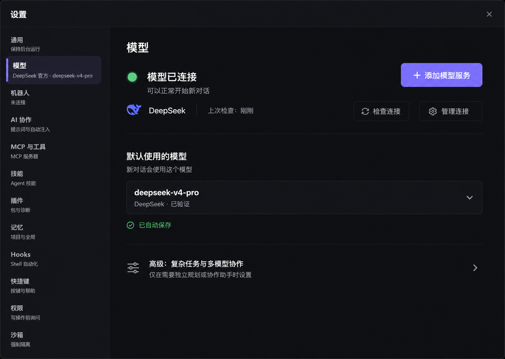
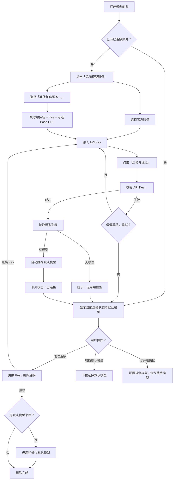

# WorkGround2 Desktop 模型配置 UX 设计交付文档

> 本文定义 WorkGround2 Desktop 的简化模型配置体验，是产品、设计和开发的共同基准。
>
> 视觉语言遵循 [DESKTOP_UI_DESIGN_SPEC.zh-CN.md](./DESKTOP_UI_DESIGN_SPEC.zh-CN.md)（Obsidian Iris / 深色优先 / 紫色强调 / 8px 网格），本文不重复定义全局设计 Token。

---

## 目录

1. [文档状态与背景](#1-文档状态与背景)
2. [目标、非目标与目标用户](#2-目标非目标与目标用户)
3. [设计原则](#3-设计原则)
4. [视觉稿](#4-视觉稿)
5. [页面信息架构](#5-页面信息架构)
6. [首次接入流程](#6-首次接入流程)
7. [连接状态与操作](#7-连接状态与操作)
8. [渐进披露规则](#8-渐进披露规则)
9. [关键文案表](#9-关键文案表)
10. [保存、幂等、重试与恢复](#10-保存幂等重试与恢复)
11. [数据与 UI 边界](#11-数据与-ui-边界)
12. [无障碍与键盘](#12-无障碍与键盘)
13. [响应式与降级](#13-响应式与降级)
14. [动效与反馈](#14-动效与反馈)
15. [验收标准](#15-验收标准)
16. [主路径流程图](#16-主路径流程图)

---

## 1. 文档状态与背景

| 项目 | 值 |
|---|---|
| 状态 | 实施交接稿 v1 |
| 依赖 | [DESKTOP_UI_DESIGN_SPEC.zh-CN.md](./DESKTOP_UI_DESIGN_SPEC.zh-CN.md)（全局视觉规范） |
| 目标版本 | WorkGround2 Desktop 下一迭代 |

**背景**：当前模型配置分散在 SettingsPanel 的 "models" 和 "access" 两个子标签中，暴露了 provider name、base_url、api_key_env、reasoning protocol、effort、子代理嵌套深度等大量技术字段。普通用户只需"选一个 AI 服务、填 Key、开始用"。本文定义该简化体验。

---

## 2. 目标、非目标与目标用户

### 目标

- 提供 ≤3 步的首次模型接入流程：选服务 → 填 Key → 自动完成。
- 连接状态一目了然：已连接 / 未配置 / 连接中 / 失败 / 不可用。
- 默认模型选择简单直接，不需要理解 provider/model 层级关系。
- 高级多模型协作对普通用户折叠隐藏，按需展开。

### 非目标

- 不重新设计 SettingsPanel 全局布局。
- 不改变后端 provider 配置存储模型。
- 不涉及 Bot/IM 网关的模型配置。
- 不涉及 CLI 模型配置。

### 目标用户

| 用户 | 特征 | 需求 |
|---|---|---|
| 新用户（首次启动） | 无任何配置 | 快速接入第一个 AI 服务 |
| 普通用户 | 日常使用，不关心技术细节 | 知道连接状态、切换默认模型 |
| 高级用户 | 需要多模型协作或自定义端点 | 展开高级区，配置多服务、planner、子代理 |

---

## 3. 设计原则

1. **连接状态优先**：页面顶部始终可见各服务的连接状态，不配置也能看到"未配置"。
2. **最少步数接入**：从打开设置到可用，核心路径 ≤3 步。
3. **自动优于手动**：API Key 校验成功后自动拉取模型列表、自动推荐默认模型。
4. **失败保留草稿**：校验失败不清空已填 Key，用户修正后重试。
5. **幂等连接**：重复添加同一服务不产生重复配置。
6. **渐进披露**：普通用户只看到官方服务名和 Key 输入；高级字段统一收入折叠区。

---

## 4. 视觉稿

最终视觉参考：

---

## 5. 页面信息架构

页面自上而下分为四个区域：

### 5.1 连接状态区（始终可见）

页面顶部先展示当前整体状态，让用户一眼确认“现在能不能用”：

- 状态指示器（色点 + 明确文字，例如“模型已连接”）
- 当前服务图标、服务名称和上次检查时间
- 次级操作“检查连接”“管理连接”

存在多个连接时，首页仍只展示当前默认模型所属服务；完整连接列表进入“管理连接”后查看，避免首页变成供应商清单。

### 5.2 "添加模型服务"主按钮

位于连接状态区右上方，与状态摘要同屏。它是页面唯一的高强调主按钮，始终可见，点击后在当前内容区展开接入流程。

**文案**：`+ 添加模型服务`

按钮使用全局 Primary Action Token，尺寸与对比度遵循全局视觉规范。

### 5.3 默认模型区

位于连接状态区下方，仅在有已连接服务时显示。

- 标签："默认使用的模型"
- 下拉选择器列出所有已连接服务的可用模型，按服务分组
- 当前默认模型高亮显示选中标记

### 5.4 高级区（折叠）

折叠按钮文案：`高级：复杂任务与多模型协作`

展开后包含：

- 规划模型选择（仅在有 ≥2 个已连接服务时可用）
- 协作助手使用的模型
- 协作助手思考深度
- 是否允许协作助手继续分派任务

折叠区默认收起。展开后若用户选择返回普通模式，折叠状态保持。

---

## 6. 首次接入流程

### 步骤 1：选择服务

点击“添加模型服务”后，在当前设置内容区展开服务选择面板；设置导航和关闭入口保持不变：

- 显示官方支持的服务列表（带图标），如 DeepSeek、OpenAI、Anthropic 等
- 每项显示服务名称和简短描述
- 底部有"其他兼容服务"入口（渐进披露，见第 8 章）

### 步骤 2：输入 API Key

选择服务后进入 Key 输入界面：

- 输入框 + 显示/隐藏切换
- 辅助链接："在哪里获取 API Key？"→ 打开对应服务的 Key 管理页面
- 主按钮："连接并继续"

### 步骤 3：自动校验与完成

点击"连接并继续"后：

1. 显示连接中状态（按钮显示 spinner + "检查连接…"）
2. 后端校验 Key 有效性
3. 校验成功后自动拉取可用模型列表
4. 自动推荐一个默认模型（优先选服务推荐的默认值，其次选第一个可用模型）
5. 显示成功结果：服务卡片状态变为"已连接"，模型列表就绪
6. 面板自动关闭，焦点回到默认模型选择器

**校验失败时**：错误信息内联显示在 Key 输入框下方，已填 Key 保留，允许修正后重试。

---

## 7. 连接状态与操作

### 状态清单

| 状态 | 指示器颜色 | 说明 | 用户操作 |
|---|---|---|---|
| 已连接 | 成功色 | API Key 有效，模型列表可用 | "管理连接"→ 可更换 Key / 删除 |
| 未配置 | 中性色 | 尚未添加可用服务 | "添加模型服务"→ 进入接入流程 |
| 连接中 | 品牌色 spinner | 正在校验 Key 或拉取模型 | 无操作，等待完成 |
| 连接失败 | 危险色 | Key 校验失败 | "检查连接"→ 回到 Key 输入，保留草稿 |
| 服务暂不可用 | 警告色 | 网络问题或服务端异常 | "重试" + 显示上次可用模型列表（带过期提示） |
| 密钥无效 | 危险色 | Key 被撤销或过期 | "重新连接"→ 进入 Key 输入 |
| 无可用模型 | 警告色 | Key 有效但账户无可用模型 | 显示原因，引导用户检查服务端配额 |
| 额度不足 | 危险色 | 账户余额/额度耗尽 | 显示原因，引导用户充值或切换服务 |

### 管理连接面板

点击"管理连接"进入：

- 只显示“密钥已保存”和来源，不显示或回填密钥明文
- "更换 Key"按钮
- "删除此连接"按钮——若为当前默认模型所属服务，先弹出替代选择
- 显示上次校验时间和模型数量

---

## 8. 渐进披露规则

### 普通用户默认视图

不显示以下字段：

- Provider name（内部标识符）
- `base_url`（自定义端点地址）
- `api_key_env`（环境变量名引用）
- 模型发现开关
- Reasoning protocol 选择
- Effort / reasoning 等协议参数
- 子代理嵌套深度和运行轮数

### "其他兼容服务"入口

位于服务选择面板底部，文案：`其他兼容服务…`

点击后展开表单，显示：

- 服务名称（自定义文本）
- API Key 输入
- Base URL（可选）
- API Key 环境变量名（可选）

此入口面向知道自己在做什么的高级用户。填入的信息与官方服务相同校验流程。

### 高级区内容可见性

- "高级：复杂任务与多模型协作"：有 ≥1 个已连接服务时始终可见（折叠）
- 规划模型选择：有 ≥2 个已连接服务时可用
- 协作助手模型选择：始终可用（默认“跟随默认模型”）
- “Planner”“subagent”“effort”等技术名称只放在补充说明中，不作为普通用户的主标签

---

## 9. 关键文案表

| 位置 | 中文文案 | 上下文 |
|---|---|---|
| 主按钮 | `+ 添加模型服务` | 连接状态区下方 |
| 服务选择标题 | `选择模型服务` | 服务选择面板 |
| Key 输入标签 | `API Key` | Key 输入 |
| Key 占位符 | `输入你的 API Key` | Key 输入 |
| 辅助链接 | `在哪里获取 API Key？` | Key 输入下方，外链 |
| 主操作按钮 | `连接并继续` | Key 输入底部 |
| 校验中 | `检查连接…` | 连接中状态 |
| 成功提示 | `连接成功，已自动选择默认模型` | 校验成功 toast |
| 错误提示 | `连接失败，请检查 API Key 后重试` | 校验失败内联 |
| 管理入口 | `管理连接` | 已连接卡片 |
| 更换 Key | `更换 API Key` | 管理连接面板 |
| 删除连接 | `删除此连接` | 管理连接面板 |
| 删除前提示 | `此服务当前为默认模型来源，请先选择替代模型` | 删除默认模型服务前 |
| 默认模型区标签 | `默认使用的模型` | 默认模型选择器 |
| 高级区折叠按钮 | `高级：复杂任务与多模型协作` | 默认模型区下方 |
| 规划模型标签 | `规划任务使用的模型` | 高级区；补充说明可标注 Planner |
| 协作助手标签 | `协作助手使用的模型` | 高级区；补充说明可标注 subagent |
| 思考深度 | `协作助手思考深度` | 高级区；不直接暴露 effort |
| 重试按钮 | `重试` | 服务暂不可用 |
| 服务不可用提示 | `服务暂时不可用，已显示上次可用模型` | 服务暂不可用时 |
| 无模型提示 | `未找到可用模型，请在服务端检查模型权限` | 无可用模型时 |
| 额度不足提示 | `API 额度不足，请充值或切换服务` | 额度不足时 |
| 其他服务入口 | `其他兼容服务…` | 服务选择面板底部 |
| Base URL 标签 | `API 地址（可选）` | 其他兼容服务表单 |
| Key 环境变量标签 | `环境变量名（可选）` | 其他兼容服务表单 |

---

## 10. 保存、幂等、重试与恢复

### 保存规则

- API Key 校验成功后才持久化：先校验，通过后写入配置。
- 校验失败不保存，但保留表单草稿（当前会话内）。
- 默认模型切换即时保存。

### 幂等规则

- 重复添加同一服务（相同 provider + 相同 API Key）不产生重复配置条目。
- 重复添加同一服务但不同 Key → 更新现有配置的 Key。
- 重复添加不同服务 → 正常新增。

### 重试规则

- 校验失败后，"连接并继续"变为"重试"，保留已填 Key。
- 服务暂不可用时，显示"重试"按钮，同时展示上次成功拉取的模型列表（带"数据可能已过期"提示）。
- 后台刷新模型列表失败时，沿用上次可用列表，并在服务卡片上显示黄色提示。

### 恢复规则

- 删除连接前若该服务为默认模型来源，弹出替代选择面板，用户必须选择新默认模型后才能删除。
- 切换默认模型到未连接的服务时，不允许操作并提示。

---

## 11. 数据与 UI 边界

遵循全局设计规范第 11 章的归属原则，本文只约束职责，不指定具体类名或前端状态库：

- **模型配置状态单一可信**：连接状态、模型列表、默认模型和高级配置由统一的模型配置状态层管理。
- **UI 订阅状态**：页面读取已确认状态，只在表单编辑期间持有局部草稿，不暴露内部可变集合给 UI 直接修改。
- **回包不直接操作 Panel**：API Key 校验、模型拉取等回包先进入模型配置状态层，UI 通过状态变化更新。
- **状态入口收敛**：添加连接、移除连接、切换默认模型等操作通过少数领域入口完成，并统一处理持久化、事件、缓存和错误状态。
- **乐观更新规则**：模型切换可乐观更新 UI，失败时回滚到上一个确认值。Key 校验不能乐观——必须等服务端确认。

---

## 12. 无障碍与键盘

遵循全局规范第 14 章，附加以下本页面特定要求：

### 键盘导航

| 操作 | 按键 |
|---|---|
| 在服务卡片间移动 | Tab / Shift+Tab |
| 打开服务选择面板 | Enter / Space（在"添加模型服务"上） |
| 选择服务 | Enter（在服务项上） |
| 关闭面板 | Escape |
| 展开/折叠高级区 | Enter / Space |
| 切换默认模型下拉 | Enter → ↑↓ 导航 → Enter 确认 |

### 屏幕阅读器

- 连接状态指示器必须有 `aria-label`，如 `"DeepSeek：已连接"`
- 连接中状态使用 `aria-live="polite"` 播报进度
- 校验失败时 `aria-live="assertive"` 播报错误信息
- 成功连接后播报"连接成功，已自动选择默认模型"

### 对比度

- 状态指示器色点必须配有文字，不能仅靠颜色区分状态
- 所有文字对比度符合 WCAG 2.1 AA（普通文字 ≥4.5:1，大文字 ≥3:1）

### 焦点管理

- 面板打开时焦点移入面板第一个可交互元素
- 面板关闭时焦点回到触发元素（"添加模型服务"或"管理连接"）
- 校验完成后焦点移到默认模型选择器

---

## 13. 响应式与降级

### 窄窗口（< 900px 宽度）

- 服务卡片从多列降为单列
- "添加模型服务"按钮宽度从固定改为 100%
- 高级区内容单列堆叠

### 极窄窗口（< 640px）

- 服务卡片精简为仅图标 + 状态色点 + 服务名，操作入口收入"…"菜单
- 默认模型选择器宽度 100%

### 缩放与重排

- 字体缩放到 200% 时内容不溢出、不丢失操作
- 所有卡片和按钮使用 `rem` 单位，尊重系统字体设置

---

## 14. 动效与反馈

遵循全局规范动效时长 120–180ms：

| 场景 | 动效 |
|---|---|
| 面板打开 | 垂直展开 + 淡入，150ms ease-out |
| 面板关闭 | 垂直收起 + 淡出，120ms ease-in |
| 状态切换 | 色点颜色渐变 180ms |
| 连接中 | spinner 无限旋转 + 按钮禁用 |
| 校验成功 | 绿色闪烁一次 + toast 通知 |
| 校验失败 | 输入框边框红色闪烁一次 + 错误文字滑入 |
| 高级区展开/折叠 | 高度过渡 150ms ease |
| 删除连接 | 卡片滑出 + 上方卡片填补，150ms |

`prefers-reduced-motion` 时所有动效时长降为 0ms。

---

## 15. 验收标准

### 必测流程

| 编号 | 场景 | 通过标准 |
|---|---|---|
| A1 | 首次启动，无任何配置 | 顶部明确显示“尚未连接模型服务”，并提供唯一高强调主按钮“添加模型服务” |
| A2 | 添加 DeepSeek，输入有效 Key | 校验成功 → 模型列表加载 → 自动推荐默认模型 → 卡片显示"已连接" |
| A3 | 添加 DeepSeek，输入无效 Key | 校验失败 → 错误提示显示 → Key 不清空 → 可重试 |
| A4 | 重复添加同一服务同一 Key | 不产生重复条目，状态保持"已连接" |
| A5 | 重复添加同一服务不同 Key | Key 更新，触发重新校验 |
| A6 | 删除默认模型所在服务 | 弹出替代选择面板 → 必须选择新默认模型 → 才能删除 |
| A7 | 后台模型刷新失败 | 沿用上次列表，显示黄色"数据可能已过期"提示 |
| A8 | 网络断开时校验 | 显示"服务暂不可用"+ 重试按钮 |
| A9 | 高级区展开 → 选择 Planner 模型 | Planner 模型选择器可用，选择生效 |
| A10 | "其他兼容服务"添加自定义端点 | 完整流程与官方服务一致 |
| A11 | 窄窗口 < 900px | 卡片单列，按钮 100%，无溢出 |
| A12 | 字体缩放 200% | 内容完整可见，操作可达 |
| A13 | 键盘完整操作 | Tab 遍历所有元素，Escape 关闭面板，Enter 确认选择 |
| A14 | 屏幕阅读器播报 | 状态变更正确播报，错误 assertive 播报 |

### 必测状态

每个已实现的服务卡片必须在以下状态中各截一张图：

- 未配置
- 连接中
- 已连接
- 连接失败（Key 无效）
- 服务暂不可用
- 无可用模型
- 额度不足

---

## 16. 主路径流程图

---

> 本文定义的是模型配置的目标 UX。实施时若有偏差，先更新此文再改代码。
>
> **最后更新**: 2026-07-12
