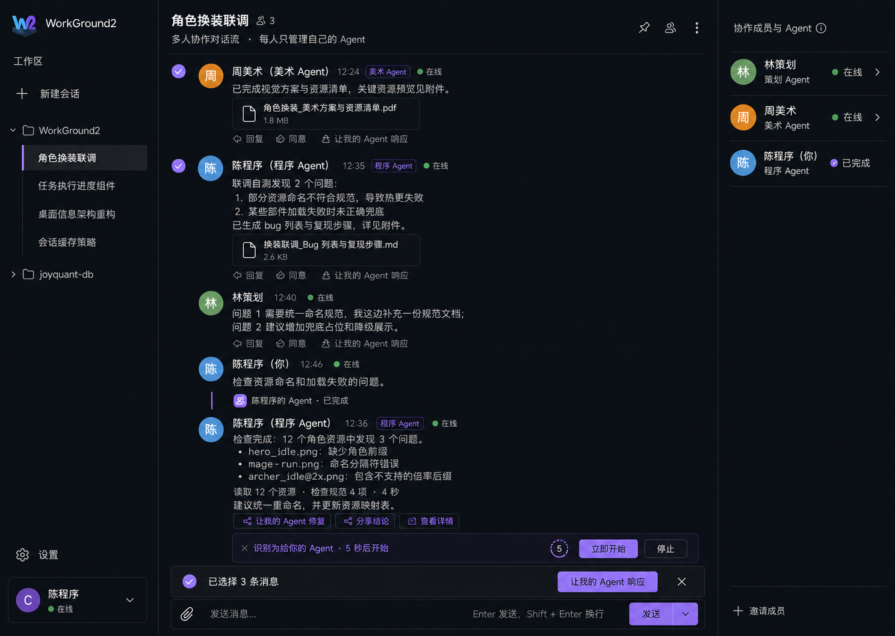

# WorkGround2 多人多 Agent 协作设计

> 文档状态：V1 产品与技术设计草案（2026-08-03）
>
> 本文定义 WorkGround2 的多人多 Agent 协作模式：每个参与者使用自己的 Client 和个人 Agent，在同一个 Room 中沟通、交换交付物、反馈问题并完成联调。每个人只直接控制自己的 Agent；其他成员可以提出意见和执行请求，接收方通过同意、采纳或授权让自己的 Agent 执行。
>
> 本文只定义目标体验、领域边界、首版连接方式和验收标准，不包含实现代码。

---

## 1. 背景

典型的软件协作中，不同成员拥有不同职责和本地工作环境：

- 后端开发使用自己的 Agent 实现接口。
- 前端开发使用自己的 Agent 接入接口并完成页面。
- 策划、设计、美术、程序分别拥有自己的资料、工具和 Agent。
- 主管提出目标、检查进度，职员使用各自 Agent 完成任务。

个人 Agent 能提高单人的执行效率，但跨角色沟通仍然依赖复制消息、人工整理上下文和重复描述问题。接口已经变更、资源已经更新、联调已经失败或修复已经完成，这些事实很难自动进入相关成员 Agent 的上下文。

本功能解决的核心问题是：

> 多个人继续拥有独立 Agent 和本地上下文，同时让意见、请求、交付物、问题和验证结果在相关 Client 之间自动拼接。

---

## 2. 核心主张

每个 Client 是一个独立闭包，它捕获并拥有：

~~~text
Clientᵢ = {
    Ownerᵢ       人
    Agentᵢ       个人 Agent
    Workspaceᵢ   本地代码、文档、资源和工具
    Contextᵢ     私有会话与任务历史
    Policyᵢ      权限、审批和自动接受策略
    Inboxᵢ       外部意见、请求和交付物
    Outboxᵢ      对外公开的结果
}
~~~

一个桌面实例可以同时拥有多个协作 Session。每个协作 Session 在 Client 闭包内形成更小的运行时闭包：

~~~text
CollaborationRuntime(sessionId) = {
    RoomConnection   独立连接、心跳和重连
    SharedCache      最近一次远端 Room 快照和增量
    Outbox           该 Room 尚未确认的本地更新
    AgentRuns        该 Session 发起的本地 Agent 执行
}
~~~

`sessionId → CollaborationRuntime` 是一对一关系；不同 Session 的连接、缓存、Outbox、AgentRun 和事件不能互相读取或覆盖。切换前台 Session 不会关闭其他 Room，其他协作连接继续在后台同步。

外部信息只能通过 Client 的公开入口进入：

~~~text
Receive()   接收协作信息
Accept()    本人同意、采纳或按本地策略接受
Execute()   调用自己的 Agent
Publish()   发布经过筛选和脱敏的公共结果
~~~

共享协作空间负责传递信息和保存公共事实。个人 Agent 的完整 Session、凭据、本地工具权限和原始推理保留在自己的 Client 内。

---

## 3. 目标与非目标

### 3.1 目标

- 支持 2 人、3 人和更多成员在一个 Room 中协作。
- 每个人默认只直接控制自己的 Agent。
- 人可以随时发言、回复、同意、采纳、拒绝和调整 Agent 指令。
- 其他人的意见可以一键交给自己的 Agent 处理。
- 可以选择一条或多条消息，让自己的 Agent 基于这些消息响应。
- 自己发送的消息经过轻量探测后，可以进入可撤销倒计时并自动交给自己的 Agent。
- 接口、资源、文档、Bug、修复和验证结果能够自动路由到相关成员。
- 重复消息、重连和重试不会重复启动 Agent 或重复产生副作用。
- V1 只需知道 Host IP、Port、Room 和可选 Token 即可加入。
- 同一桌面实例可同时连接多个 Room；每个 Room 都是一条归属于某个 Workspace 的普通 Session List 会话。
- Host 与加入者都将远端 Room 信息持久化为可更新的共享背景缓存；断线后仍可查看、引用并交给自己的 Agent 处理。

### 3.2 非目标

- V1 不实现账号系统、组织目录、云端 Relay 或公网发现。
- V1 不实现 mDNS、二维码邀请、自动扫描局域网 Host。
- V1 不实现自动选主和 Host 无感迁移。
- V1 不允许成员直接操作、取消或批准其他成员的 Agent。
- V1 不让 Agent 普通回复自动触发另一个 Agent，避免无界对话循环。
- V1 不同步个人 Agent 的完整历史、原始推理、凭据或全部工具输出。
- V1 不尝试用自然语言分类结果绕过用户权限和工具审批。

---

## 4. 术语

| 术语 | 含义 |
|---|---|
| Client | 一个参与者运行的 WorkGround2 客户端 |
| Client 闭包 | 人、个人 Agent、本地环境、私有上下文和权限策略的封装边界 |
| Host | 创建 Room 并承载公共事件流的 WorkGround2 Client |
| Room | 一条多人协作会话，拥有成员列表和公共时间线 |
| Member | 加入 Room 的人 |
| Personal Agent | 归属于某个 Member、运行在该 Member Client 内的 Agent |
| Timeline | Room 中所有人可见的公共信息流 |
| Contribution | 意见、问题、决定、交付物或验证结果 |
| AgentCommand | 明确发给自己 Agent 的本地执行指令 |
| AgentRequest | 希望另一成员让其 Agent 处理的请求 |
| AgentRun | AgentCommand 产生的一次具体执行 |
| Reference | AgentCommand 所引用的一条或多条 Timeline 信息 |

---

## 5. 整体模型

~~~mermaid
flowchart LR
    subgraph CA["Client A 闭包"]
        HA["A"]
        AA["A Agent"]
        WA["A Workspace / Context / Policy"]
        HA --> AA
        AA <--> WA
    end

    subgraph CB["Client B 闭包"]
        HB["B"]
        AB["B Agent"]
        WB["B Workspace / Context / Policy"]
        HB --> AB
        AB <--> WB
    end

    subgraph CC["Client C 闭包"]
        HC["C"]
        AC["C Agent"]
        WC["C Workspace / Context / Policy"]
        HC --> AC
        AC <--> WC
    end

    CA <--> R["Host Room\n公共时间线 / 成员 / 路由 / 游标"]
    CB <--> R
    CC <--> R
~~~

Host 是 Room 公共状态的唯一写入者。每个 Client 是自己 Personal Agent 状态的唯一写入者。

Room 可以知道某个 Agent 在线、运行中、等待确认或已经完成，但 Room 不拥有该 Agent 的完整 Session。

每个 Client 保存所加入 Room 的本地只读投影。Host 快照和事件仍是公共事实的权威来源，本地投影是允许过期、可被后续增量更新的共享背景缓存。网络中断不会清空该投影，也不会阻断基于缓存的本地 Agent 工作；离线产生的公共更新进入对应 Session 的 Outbox，重连后再与 Host 达成最终一致。

---

## 6. 权限模型

### 6.1 默认权限

| 操作 | 自己的 Agent | 其他成员的 Agent |
|---|---:|---:|
| 发送执行指令 | 允许 | 禁止 |
| 批准工具调用 | 允许 | 禁止 |
| 停止或取消执行 | 允许 | 禁止 |
| 查看公开状态和结果 | 允许 | 允许 |
| 对意见表示同意 | 允许 | 允许 |
| 将意见交给 Agent | 交给自己的 Agent | 需要目标所有者接受 |
| 请求 Agent 处理 | 直接执行 | 创建 AgentRequest |

主管、管理员和 Host 默认也不能穿透其他 Client 的闭包边界。角色可以影响可见范围、路由和优先级，但不自动获得 Personal Agent 控制权。

### 6.2 接收策略

每个成员可以设置自己的 AgentRequest 策略：

| 策略 | 行为 |
|---|---|
| 每次确认 | 默认；所有外部请求都由本人接受 |
| 可信只读 | 指定成员发来的只读请求可以自动接受 |
| 可信低风险 | 指定成员发来的低风险请求可以自动接受 |
| 仅本人 | 外部请求只进入 Inbox，不允许执行 |

任何自动接受策略都不能绕过该 Client 原有的工具审批、文件权限和安全策略。

---

## 7. 公共时间线类型

公共 Timeline 使用明确类型，触发行为由类型决定，不能依赖展示文本猜测。

| 类型 | 作用 | 是否直接触发 Agent |
|---|---|---:|
| ChatMessage | 人类聊天、讨论和状态说明 | 否 |
| Contribution | 意见、决定、交付物、问题和验证结果 | 否 |
| AgentCommand | 成员明确交给自己 Agent 的指令 | 是，仅目标 Agent |
| AgentRequest | 请求另一成员处理 | 否，等待目标成员接受 |
| AgentResult | Agent 发布的公开结果 | 否 |
| Reaction | 同意、反对、确认等态度 | 否 |
| SystemEvent | 加入、离开、断线、运行状态等 | 否 |

Contribution 进一步使用少量业务标签：

- proposal：意见或方案。
- decision：团队已经确认的结论。
- deliverable：接口、文档、资源、代码或其他交付物。
- issue：联调失败、Bug 或阻塞。
- fix_ready：修复已经完成，可以重试。
- verified：验证通过。
- question：需要其他成员回答。

普通 AgentResult 不会自动唤起另一个 Agent。只有人类明确操作、已接受的 AgentRequest，或当前成员预先授权的任务依赖，才可以创建新的 AgentCommand。

---

## 8. 聊天与 Agent 指令的区分

### 8.1 显式入口

Composer 默认发送 ChatMessage：

~~~text
┌──────────────────────────────────────────────┐
│ 检查一下 profile 接口为什么返回 500。        │
└──────────────────────────────────────────────┘
                         [发送] [交给我的 Agent]
~~~

- 发送：发布聊天，不触发 Agent。
- 交给我的 Agent：创建 AgentCommand。
- Enter：发送聊天。
- 可配置快捷键：立即交给自己的 Agent。

发送菜单可以提供：

- 团队聊天。
- 我的 Agent。
- 团队聊天，并交给我的 Agent。
- 请求某位成员的 Agent。

### 8.2 聊天仍可成为上下文

ChatMessage 不会立即启动 Agent，但可以被后续 AgentCommand 引用。

当用户点击“让我的 Agent 响应”时，系统根据引用读取权威消息内容、作者、顺序、关联任务和交付物，将必要上下文交给 Agent。无关聊天不会自动进入每个 Personal Agent 的 Session。

---

## 9. 轻量指令探测与倒计时

### 9.1 探测范围

IntentDetector 运行在发送者自己的 Client 内，只检查本人新发送的 ChatMessage。

它不能：

- 检查其他成员的消息后直接启动自己的 Agent。
- 替其他成员启动 Agent。
- 创建工具批准。
- 绕过现有权限策略。

### 9.2 分类结果

~~~text
chat         普通聊天
uncertain    可能希望自己的 Agent 处理
self_agent   高概率是给自己 Agent 的指令
~~~

对应行为：

| 结果 | UI 行为 |
|---|---|
| chat | 保持普通聊天 |
| uncertain | 显示“让我的 Agent 响应”建议 |
| self_agent | 创建 PendingIntent，并显示倒计时 |

高置信度的示例：

- “帮我检查这个接口的错误日志。”
- “把这三个资源重命名并更新映射。”
- “实现刚才讨论的缓存策略。”

应当抑制自动启动的示例：

- “小王，你检查一下这个接口。”
- “这个接口是不是有问题？”
- “接口已经修好了。”
- “大家觉得这个方案怎么样？”

### 9.3 倒计时

默认倒计时建议为 5 秒：

~~~text
✨ 识别为给你的 Agent 的指令 · 5 秒后开始

[立即开始] [编辑指令] [停止]
~~~

状态流：

~~~mermaid
stateDiagram-v2
    [*] --> Detected
    Detected --> Pending: 高置信度
    Detected --> Suggested: 不确定
    Detected --> Chat: 普通聊天
    Pending --> Started: 倒计时结束
    Pending --> Started: 立即开始
    Pending --> Dismissed: 停止
    Pending --> Detected: 消息被编辑
    Pending --> Cancelled: 消息被删除或 Client 关闭
    Suggested --> Started: 用户手动触发
~~~

关键约束：

- 倒计时结束前不创建 AgentCommand。
- 同一消息 revision 最多创建一个自动 AgentCommand。
- 用户停止后记录 dismissed，不能重新弹出倒计时。
- 编辑消息会取消旧 PendingIntent，并基于新 revision 重新探测。
- 删除消息、退出 Room 或关闭 Client 会取消 PendingIntent。
- Host 连接断开时暂停自动启动；恢复连接后要求用户手动继续。
- 自动开始只负责启动正常 Agent turn，后续工具调用仍受原审批模式控制。

### 9.4 可配置项

- 自动探测：开 / 关。
- 倒计时：3 秒 / 5 秒 / 10 秒。
- 不确定意图：仅提示 / 进入倒计时。
- 当前 Room 是否启用探测。

---

## 10. 手动让自己的 Agent 响应

### 10.1 单条信息

每条 ChatMessage、Contribution 和 AgentResult 都提供：

~~~text
[回复] [同意] [让我的 Agent 响应]
~~~

“让我的 Agent 响应”是明确操作，可以立即创建 AgentCommand，不再经过自动探测倒计时。

### 10.2 多条信息

用户可以进入多选模式：

~~~text
☑ 后端接口已经就绪
☑ 前端反馈 avatar 字段不一致
☑ 后端表示已经修复

已选择 3 条消息
[让我的 Agent 响应]
~~~

系统提供一个可选的补充指令：

~~~text
根据选择的信息，让我的 Agent：
[重新联调并验证 profile 功能                 ]

[开始]
~~~

AgentCommand 保存消息引用和补充意图：

~~~json
{
  "targetAgentId": "my-agent",
  "referenceIds": [
    "message-101",
    "message-108",
    "message-115"
  ],
  "instruction": "重新联调并验证 profile 功能",
  "trigger": "manual"
}
~~~

引用必须保持原始顺序、作者和 revision。消息较多时可以生成上下文摘要预览，但不能静默丢弃引用。

### 10.3 同意与执行

- 同意：只创建 Reaction。
- 同意并执行：创建 Reaction，同时为自己的 Agent 创建 AgentCommand。
- 请求对方执行：创建 AgentRequest。
- 对方接受并执行：由对方 Client 创建属于对方的 AgentCommand。

---

## 11. 自动拼接机制

自动拼接分成“信息路由”和“本地执行”两个阶段。

### 11.1 信息路由

每条 Contribution 可以携带：

| 字段 | 示例 |
|---|---|
| scope | frontend、backend、art、planning、shared |
| targets | 指定成员或角色 |
| relatedItem | profile、角色换装、资源导入 |
| dependencies | 依赖的接口、文件或交付物 |
| actionNeeded | 是否需要接收方处理 |
| revision | 契约或交付物版本 |

Room 根据显式 targets、scope、任务归属和依赖关系，将信息送到相关 Client Inbox。路由只决定谁应该看到，不能直接获得执行权。

### 11.2 本地上下文拼接

接收方执行 AgentCommand 时，CollabContextBuilder 收集：

- 当前指令明确引用的消息。
- 当前任务尚未消费的相关 Contribution。
- 依赖交付物的最新 revision。
- 已确认的团队决定。
- 尚未关闭的相关 issue。

生成类似以下上下文：

~~~text
<collaboration-context>
后端接口 revision 4 已就绪。
上一次 avatar 字段不一致问题已修复。
相关修复：backend abc123。
请重新运行 profile 前端集成测试。
</collaboration-context>
~~~

这些内容作为 turn 增量上下文进入本地 Agent，不能修改 cache-stable system prompt。

### 11.3 防止自动循环

- AgentResult 默认只发布结果，不自动触发其他 Agent。
- 自动后续执行只适用于本人已经接受的任务依赖。
- 同一个 Contribution ID 和 revision 只能消费一次。
- 一个 issue 的自动往返轮次应有上限，建议默认 3 轮。
- 超过上限、发生范围变化或出现契约冲突时转为人工确认。

---

## 12. 典型场景

### 12.1 双人前后端联调

~~~mermaid
sequenceDiagram
    participant A as A 后端 Client
    participant R as Room
    participant B as B 前端 Client

    A->>R: deliverable：Profile API revision 3
    R->>B: 路由到前端 Inbox
    B->>B: 同意并交给前端 Agent
    B->>R: issue：avatarUrl / avatar 不一致
    R->>A: 路由到后端 Inbox
    A->>A: 接受并交给后端 Agent
    A->>R: fix_ready：revision 4
    R->>B: 依赖更新
    B->>B: 已授权任务自动重新验证
    B->>R: verified：联调通过
~~~

双人联调是通用多人模型的最小实例：

~~~text
2 名成员 + 2 个 Client 闭包 + 2 个 Personal Agent + 1 个 Room
~~~

### 12.2 策划、美术、程序

1. 策划发布角色换装需求。
2. 美术和程序分别点击“同意并执行”。
3. 美术 Agent 发布资源和资源清单。
4. 程序 Agent 发现命名与加载规则不一致，发布 issue。
5. issue 自动进入美术 Inbox。
6. 美术接受后让自己的 Agent 修复。
7. 新资源 revision 自动通知程序 Client。
8. 程序 Agent 重新验证并发布 verified。

### 12.3 主管与职员

主管可以发布目标、任务请求、优先级和团队决定。请求进入目标职员 Inbox：

~~~text
主管请求你的 Agent 处理：
“检查本周所有角色资源是否符合导入规范”

[接受并执行] [修改后执行] [拒绝] [稍后处理]
~~~

职员仍然是其 Personal Agent 的控制者。团队可以按需启用“可信只读”或“可信低风险”策略。

---

## 13. V1 Host 连接设计

### 13.1 用户需要的信息

V1 加入 Room 只需要：

| 字段 | 必填 | 示例 |
|---|---:|---|
| Host IP | 是 | 192.168.1.25 |
| Port | 是 | 39170 |
| Room | 是 | role-switch |
| Token | 否 | team-demo-2026 |

加入界面：

~~~text
Host IP    [192.168.1.25          ]
Port       [39170                 ]
Room       [role-switch           ]
Token      [可选                  ]

[连接]
~~~

Host IP 可以是局域网 IPv4、IPv6 或可解析的主机名。Room 是 Host 上已创建的逻辑协作空间。

### 13.2 Host 创建 Room

Host 需要设置：

- 监听地址：默认由用户选择局域网网卡，也可以监听 0.0.0.0。
- Port：用户指定或使用默认端口。
- Room：同一 Host 内唯一。
- Token：可留空。
- Room 名称和可选说明。

Host 创建成功后展示可复制信息：

~~~text
Host:  192.168.1.25
Port:  39170
Room:  role-switch
Token: 未设置
~~~

### 13.3 Token 语义

- Token 是 Room 级共享加入凭据。
- Token 为空时，任何能够访问 Host 且知道 Room 的客户端都可以加入。
- Token 只用于加入校验，不赋予操作其他 Personal Agent 的权限。
- V1 Token 不提供传输加密能力。
- Token 不能为空白混淆值；空字符串和纯空格统一视为未设置。
- Host 修改 Token 后，已有连接可以保持到断线；新连接使用新 Token。

Token 为空且 Host 监听非回环地址时，UI 必须显示明确提示：

> 当前 Room 没有 Token，同一网络中知道地址和 Room 的客户端都可以加入。

### 13.4 连接过程

~~~mermaid
sequenceDiagram
    participant C as Client
    participant H as Host

    C->>H: POST /collab/v1/join
    Note over C,H: room + token + member + agent descriptor
    H->>H: 校验 Room 和 Token
    H->>H: 幂等创建或恢复 Member
    H-->>C: connectionSession + latestSequence
    C->>H: GET snapshot
    C->>H: GET SSE stream?after=latestSequence
    H-->>C: 成员、时间线和增量事件
~~~

用户只需输入四个连接字段。connectionSession、MemberID、重连游标等由客户端内部管理。

### 13.5 V1 传输

- HTTP JSON：创建命令、发布消息、接受请求和查询快照。
- SSE：接收 Room 实时事件。
- afterSequence：断线后的事件补读。
- Heartbeat：在线状态和失联检测。

V1 面向可信局域网使用。Token 为空或使用明文 HTTP 时，界面必须说明访问范围和风险。公网连接、TLS 自动证书和 Relay 留到后续版本。

### 13.6 连接状态

~~~text
disconnected → connecting → syncing → connected
                         ↘ failed
connected → reconnecting → syncing → connected
~~~

- 从未成功加入、尚无 Room 身份和共享背景缓存时，不允许基于远端信息启动 Agent。
- 已有共享背景缓存时，断线前已开始或断线后新发起的本地 AgentRun 都可以继续；界面必须显式标记背景可能不是最新版本。
- 待发布结果进入本地 Outbox。
- 重连后按 requestId 和 runId 幂等补发。
- Host 不可达时，用户仍可停止自己的 Agent。

---

## 14. V1 协议草案

### 14.1 最小端点

| 方法 | 路径 | 作用 |
|---|---|---|
| POST | /collab/v1/join | 加入或恢复 Room 成员 |
| POST | /collab/v1/leave | 主动离开 |
| GET | /collab/v1/rooms/{room}/snapshot | 获取当前权威快照 |
| GET | /collab/v1/rooms/{room}/events | 按 sequence 补读 |
| GET | /collab/v1/rooms/{room}/stream | SSE 实时增量 |
| POST | /collab/v1/rooms/{room}/commands | 提交消息、Reaction、Request 等命令 |
| POST | /collab/v1/heartbeat | 更新在线状态 |

### 14.2 命令信封

每个写请求至少携带：

~~~json
{
  "requestId": "client-a-000123",
  "room": "role-switch",
  "memberId": "member-a",
  "type": "chat.post",
  "payload": {}
}
~~~

Host 对 requestId 做持久幂等。相同 requestId 重复提交时返回第一次处理结果。

### 14.3 Room 事件

~~~json
{
  "eventId": "event-456",
  "sequence": 456,
  "room": "role-switch",
  "type": "contribution.published",
  "actorId": "member-a",
  "requestId": "client-a-000123",
  "causationId": "message-101",
  "createdAt": "2026-08-03T07:00:00Z",
  "payload": {}
}
~~~

所有持久事件在 Host 的单一入口中分配递增 sequence。客户端按 sequence 应用事件，发现缺口时停止增量应用并重新补读或拉取快照。

---

## 15. 状态、幂等与恢复

### 15.1 状态所有者

| 状态 | 权威所有者 |
|---|---|
| Room、成员、公共 Timeline | Host |
| Room 的本地共享背景缓存 | 各协作 Session Runtime（Host 快照/事件为权威来源） |
| Personal Agent Session | 对应 Client |
| 本地 Workspace 和工具状态 | 对应 Client |
| PendingIntent 和倒计时 | 发送者 Client |
| AgentCommand 和 AgentRun | Agent 所有者 Client |
| 公共 AgentRun 摘要 | Host Timeline |
| 未发送命令和结果 | Client Outbox |

### 15.2 幂等键

- ChatMessage：requestId。
- PendingIntent：messageId + messageRevision。
- AgentCommand：commandId。
- AgentRun：runId。
- AgentResult：runId + resultRevision。
- AgentRequest 接受：requestId + targetMemberId。
- Contribution 消费：contributionId + revision + targetAgentId。

### 15.3 失败恢复

- 消息已被 Host 接受但响应丢失：客户端用同一 requestId 重试。
- SSE 丢帧：通过 afterSequence 补读。
- Client 崩溃：重启后按 sessionId 分别恢复 Room 共享背景缓存、Outbox、未完成 AgentRun 和最后消费游标。
- Host 崩溃：重启后回放 Room EventStore；Client 重连并补发未确认命令。
- AgentResult 发布失败：结果保留在本地 Outbox，不能因为网络失败重新执行 AgentRun。
- 重复接受 AgentRequest：返回已有 AgentCommand，不创建第二次执行。

失败必须在 UI 中显式显示“未同步”“等待重连”“发布失败，可重试”等状态。

---

## 16. UI 设计

### 16.1 目标示意图

该图用于确定整体信息结构和关键交互，不作为最终像素级实施标注。

### 16.2 页面结构

~~~text
DesktopShell
├── 左栏：Workspace / Session List（个人与多人会话并列）
├── 中央：多人协作 Timeline
│   ├── Room 标题和在线人数
│   ├── ChatMessage / Contribution / AgentResult
│   ├── 消息操作：回复、同意、让我的 Agent 响应
│   ├── PendingIntent 倒计时
│   ├── 多选操作栏
│   └── Composer
└── 右栏：成员与 Personal Agent
    ├── 成员身份和角色
    ├── Agent 在线与运行状态
    └── 待接受 AgentRequest
~~~

### 16.3 视觉区分

- 人类聊天：普通头像和消息样式。
- Agent 公开结果：显示所有者名称、Agent 标签和运行状态。
- AgentCommand：显示“成员 → 自己的 Agent”。
- AgentRequest：显示目标成员和“等待接受”。
- PendingIntent：使用紧凑倒计时条，不遮挡 Timeline。
- 多选模式：被选消息显示统一选择标记，底部操作栏显示数量。
- 未同步信息：显示本地状态，不伪装为已经发布。
- 断线状态：保留缓存 Timeline 和成员投影，显示“共享背景缓存仍可用”，并允许本地 Agent 继续处理；新更新标记为待同步。

### 16.4 人的介入点

人在任何阶段都可以：

- 发送普通聊天。
- 回复或补充上下文。
- 对意见表示同意或反对。
- 停止自动开始倒计时。
- 编辑即将交给 Agent 的指令。
- 选择一条或多条信息让自己的 Agent 响应。
- 接受、修改、拒绝其他成员的 AgentRequest。
- 停止自己的 AgentRun。
- 对自己的工具调用进行批准。
- 对公共结果进行验证或反馈问题。

---

## 17. 与现有 WorkGround2 的边界

### 17.1 复用

- 每个 Personal Agent 继续由一个独立 Controller 驱动。
- Controller 继续负责 turn、取消、审批、工具调用、Session 和持久化。
- Desktop 已有的稳定 SessionID 继续作为本地 Agent Session 身份。
- eventwire.Event 可以作为 Agent 运行事件的内部载荷。
- HTTP + SSE 的已有经验可以用于 Room Transport。

### 17.2 新增边界

建议新增独立协作领域：

~~~text
internal/collab/
├── model.go       Room、Member、Timeline 类型
├── service.go     命令入口、权限和状态转换
├── store.go       Room 快照、事件和幂等结果
├── hub.go         SSE 分发和游标补读
├── host.go        Host 生命周期与连接
├── client.go      Client Inbox、Outbox 和重连
├── detector.go    本地轻量指令探测
├── bridge.go      AgentCommand 与 Controller 的桥接
├── context.go     协作上下文拼接
└── publish.go     Agent 结果筛选与脱敏
~~~

Room 位于 Controller 上层。Collab 服务不能接管 Controller 的 turn 生命周期，也不能让远端网络请求直接操作 Panel。

### 17.3 关键约束

- 多个成员不能共写同一个 Agent Session 文件。
- Host Room EventStore 与个人 Session EventLog 分离。
- Room Transport 的断线重连不能导致 AgentRun 重复执行。
- Desktop 以稳定 sessionId 路由 CollaborationRuntime；禁止使用进程级“当前 Room”隐式状态。
- 远端 Snapshot、消费游标和 Outbox 按 sessionId 隔离持久化，支持多 Room 后台连接和独立恢复。
- Agent 结果发布前经过独立脱敏和可见范围检查。
- 前端从 Room 快照和事件推导 UI，网络回包不直接操作具体消息组件。

---

## 18. V1 范围

### 18.1 必须完成

- Host 创建 Room。
- 使用 IP、Port、Room、可选 Token 直连。
- 成员与 Personal Agent 在线状态。
- 公共聊天和 Agent 结果 Timeline。
- 每个人只直接控制自己的 Agent。
- “同意”“同意并执行”“请求对方执行”。
- 单条和多条“让我的 Agent 响应”。
- 自己消息的轻量探测、建议和可停止倒计时。
- AgentRequest 的接受、修改和拒绝。
- 结构化 Contribution：意见、交付物、问题、修复和验证。
- requestId 幂等、sequence 补读、Outbox 重试。
- Host 和 Client 重启后的可恢复状态。
- 一个桌面实例同时连接多个 Room，各 Room 归属自己的 Workspace Session，并在后台独立同步。
- 断线或重启后继续使用持久化的共享背景缓存运行自己的 Agent，结果进入对应 Room 的 Outbox。

### 18.2 后续版本

- 局域网自动发现和二维码邀请。
- TLS、证书固定和公网 Relay。
- Host 手动迁移与加密副本。
- 组织账号、团队目录和集中 RBAC。
- Git、Figma、资源库等交付物专用适配器。
- 跨 Room 的任务和通知中心。
- 更细的自动接受策略与团队审批。

---

## 19. 验收标准

### 19.1 连接

- 两台机器输入相同 Host IP、Port、Room 和正确 Token 后能够进入同一 Timeline。
- Token 留空时可以连接，并展示无 Token 风险提示。
- Token 错误、Room 不存在和 Host 不可达均提供明确错误。
- 断线重连后不丢失已持久化消息，也不重复显示事件。
- 同一桌面同时连接 Room A 和 Room B 时，切换 Session 不会断开任一连接，消息、成员、事件和 Outbox 不会串 Room。
- Host 或加入者断线后仍能看到缓存的 Timeline，引用缓存消息运行自己的 Agent；离线结果重连后只补发到原 Room。

### 19.2 控制权

- A 不能直接启动、取消或批准 B 的 Agent。
- A 可以向 B 创建 AgentRequest。
- B 接受后，由 B Client 创建并执行 B 的 AgentCommand。
- Host 和主管身份不会默认获得其他 Agent 控制权。

### 19.3 聊天与指令

- 普通发送只产生 ChatMessage。
- “交给我的 Agent”只启动当前成员自己的 Agent。
- 高置信度探测进入倒计时，用户停止后不会执行。
- 编辑、删除、关闭 Client 或断开 Host 会取消或暂停待启动指令。
- 同一消息 revision 不会产生两个自动 AgentCommand。

### 19.4 多消息与协作

- 用户可以选择一条或多条 Timeline 信息创建一个 AgentCommand。
- 引用上下文保留作者、顺序和 revision。
- 双人前后端可以完成“交付接口 → 反馈问题 → 修复 → 重新验证”的闭环。
- 策划、美术、程序可以围绕同一任务发布交付物和问题。
- 无关角色的普通消息不会全部注入每个 Agent 的 Session。

### 19.5 故障与重试

- 相同 requestId 重复提交不会产生第二条消息。
- AgentResult 发布失败后可以重试，不会重跑 Agent。
- SSE 游标缺口能够通过补读或快照恢复。
- Host 重启后 Room Timeline 和成员身份可以恢复。
- 所有未同步、失败和等待状态均可观察并可安全重试。

---

## 20. 一句话总结

> 多人协作由多个独立 Client 闭包组成：信息在 Room 中自由流动，执行权保留在每个人自己的 Client 内；系统负责探测、引用、路由、拼接和恢复，人负责决定何时让自己的 Agent 行动。
