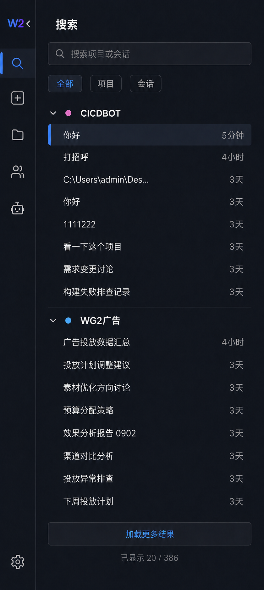
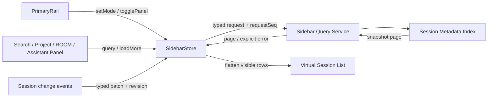

# WorkGround2 Desktop Session 侧栏详细设计

> 设计状态：已确认，可进入实现
>
> 视觉选型：搜索方案（第 2 版）
>
> 实施状态：尚未实现



## 1. 背景与目标

当前 Desktop 侧栏通过 `ListProjectTree()` 一次取得完整项目树，前端再对整棵树搜索、排序并递归渲染。Session 数量达到数千条后，会同时放大磁盘扫描、桥接序列化、前端计算、DOM 数量和刷新成本。

本设计将侧栏拆成“一级功能栏 + 二级内容栏”，并把 Session 列表改成可分页、可搜索、可虚拟化的数据视图。

目标：

- Session 数量增长时，首次打开侧栏的成本保持有界。
- 项目内 Session 不设置显示上限，用户可以持续“加载更多”。
- 搜索成为一级入口，可跨项目查找项目和 Session。
- 每个 Session 显示最后交互距现在的时间，例如 `5分钟`、`4小时`、`3天`。
- 刷新、重试、乱序回包和数据更新不会产生重复行、跳页或不可恢复状态。
- 保留现有 Session 打开、项目菜单、未读、运行状态、ROOM、助手和设置能力。

非目标：

- 本期不搜索消息正文，只搜索项目名、Session 标题和可展示路径。
- 本期不改变 Session 文件格式、会话生命周期或归档语义。
- 本期不重新设计主工作区、输入框和消息流。

## 2. 信息架构

### 2.1 两级侧栏

Desktop 左侧固定分为两层：

| 区域 | 宽度 | 作用 |
|---|---:|---|
| 一级功能栏 `PrimaryRail` | 56px | 全局功能切换，始终可见 |
| 二级内容栏 `SidebarPanel` | 304px | 展示搜索、项目、ROOM 或助手内容，可折叠 |

二级栏展开时侧栏总宽为 360px；折叠时只保留 56px 一级栏。主工作区使用剩余宽度，不在二级栏内部产生横向滚动。

窗口宽度小于 920px 时，二级栏改为覆盖主工作区的浮层，宽度保持 304px；点击主工作区、按 `Esc` 或使用 `W2<` 均可收起。

### 2.2 一级功能栏顺序

从上到下固定为：

1. `W2<` / `W2>`：W2 标识和箭头组成同一个控件。
2. 搜索。
3. 新建会话。
4. 项目。
5. ROOM。
6. 助手。
7. 设置：固定在底部。

约束：

- W2 与箭头处于同一点击区域，箭头紧贴 W2，视觉间距 6–8px。
- 二级栏展开时显示 `<`，折叠时显示 `>`。
- 不再保留单独的“显示/隐藏侧栏”图标。
- 搜索、项目、ROOM、助手属于互斥模式，同一时刻仅一个处于选中态。
- 新建会话和设置是动作入口，不占用二级栏选中态。
- 点击模式图标时，如果二级栏处于折叠状态，应同时展开并显示对应模式。
- 点击已选中的模式图标不折叠侧栏；折叠行为只由 `W2<` 控件触发。

## 3. 视觉与组件规格

视觉继续使用现有 Desktop 主题变量，不新增一套独立颜色。深色稿以 `--sidebar-bg`、`--sidebar-hover`、`--sidebar-active`、`--list-row-current-bg` 和 `--accent` 为基础；其他主题通过同一语义变量适配。

| 组件 | 规格 |
|---|---|
| 一级栏图标点击区 | 44 × 44px |
| 一级栏图标 | 20–22px，统一线性风格 |
| 一级栏选中指示 | 左侧 3 × 24px 强调色竖条 |
| W2 控件 | 48 × 44px，W2 与 12px 箭头紧凑排列 |
| 二级栏页标题 | 20px / 600，左右内边距 16px |
| 搜索框 | 高 40px，圆角 8px |
| 筛选项 | 高 32px，圆角 7px |
| 项目标题行 | 高 40px |
| Session 行 | 高 40px，左右内边距 12px |
| “加载更多”按钮 | 高 36px，占内容区整行 |
| 行间分隔 | 优先使用间距；项目组之间使用 1px 语义分隔线 |

Session 标题单行省略，右侧时间保留最小 48px，避免标题挤掉时间。完整标题和绝对时间通过 Tooltip 展示。

一级栏所有图标必须有 Tooltip 和 `aria-label`，不能只依赖图形传达含义。

## 4. 模式与交互

### 4.1 搜索模式

搜索是一级功能栏的第一项业务入口。进入后：

- 二级栏标题为“搜索”。
- 搜索框占首行，提示文本为“搜索项目或会话”。
- 下方提供“全部 / 项目 / 会话”三个互斥筛选项。
- 空查询展示最近访问的 Session，并按项目分组。
- 输入后等待 250ms 发起搜索；连续输入时取消旧请求，无法取消时通过请求序号忽略迟到回包。
- `全部`：同时返回匹配项目及其 Session，按项目分组。
- `项目`：仅显示项目结果；点击后切换到项目模式并定位该项目。
- `会话`：仅显示 Session，仍以项目标题分组，避免同名 Session 失去上下文。
- 结果默认按最后交互时间倒序；同一时间用稳定 Session ID 倒序打破并列。
- 底部显示“加载更多结果”和“已显示 n / total”。若总数不可快速取得，只显示“已显示 n”。

键盘行为：

- `Ctrl/Cmd + K`：打开搜索模式并聚焦输入框；如快捷键已被更高优先级功能占用，实现前需统一快捷键表。
- `↑ / ↓`：移动结果焦点。
- `Enter`：打开当前结果。
- `Esc`：输入框有内容时先清空；空内容时收起窄窗口浮层，常规窗口保持二级栏展开。

### 4.2 项目模式

项目模式只在首次进入时加载项目摘要，不加载所有 Session。

项目标题行包含：展开箭头、项目色点、文件夹图标、项目名、Session 总数和更多菜单。项目排序及置顶规则沿用现有行为。

展开项目时：

1. 若本地没有该项目第一页，加载最近 20 条 Session。
2. 成功后显示 Session 行和项目级“加载更多”。
3. 用户可重复加载后续页，不设 8 条或其他固定上限。
4. 折叠项目后保留已加载数据，但不渲染子行。
5. 再次展开时立即恢复；缓存被回收时重新加载第一页。

允许同时展开多个项目。为避免瞬间扫描大量目录，前台 Session 页请求并发上限为 4，超出的请求进入可取消队列。

### 4.3 ROOM 模式

ROOM 模式复用同一分页列表，只查询协作类 Session。数据识别以服务端规范化后的 `sessionKind=collaboration` 为准，不能由 UI 根据标题猜测。

结果可按所属项目分组；无项目 ROOM 归入“全局”。Session 行继续显示未读、运行状态和最后交互时间。

### 4.4 助手模式

助手模式复用同一分页列表，只查询助手类 Session。识别规则由服务端收敛，兼容当前 `sessionKind=assistant` 和历史来源字段，前端只消费统一类型。

### 4.5 新建会话与设置

- “新建会话”继续调用现有新建流程，不在侧栏设计中引入新的默认项目或运行参数。
- 新建成功后打开新 Session，并将其合并进相关项目第一页；重复事件按 Session ID 去重。
- “设置”继续打开现有设置界面，不改变当前二级栏模式；返回后恢复此前模式、展开项目和滚动位置。

## 5. Session 行

每行由以下信息组成：

1. 状态区：运行中、等待确认、失败、未读、置顶等现有状态。
2. 标题：优先显示用户标题，回退到现有本地化标题规则。
3. 最后交互时间：右对齐显示相对时间。
4. 行操作：鼠标悬停或键盘聚焦时出现现有更多菜单。

排序使用 `lastActivityAt`；缺失时回退到 `createdAt`。时间更新只修改行内容，不在用户滚动过程中立即重排列表，避免 Session 持续执行时列表跳动。

当新活动会改变排序时：

- 当前可见行原位更新时间和状态。
- 面板顶部出现轻量“列表有更新”提示。
- 用户点击提示、重新进入模式或回到列表顶部时，按新快照重排。

## 6. 相对时间规则

服务端统一返回 UTC Unix 毫秒时间戳，前端按本地时区显示。

| 时间差 | 显示 |
|---|---|
| 小于 60 秒 | `刚刚` |
| 1–59 分钟 | `n分钟` |
| 1–23 小时 | `n小时` |
| 1–29 天 | `n天` |
| 30 天以上且同年 | `M月D日` |
| 非同年 | `YYYY年M月D日` |
| 时间缺失 | `—` |

采用向下取整，例如 4 小时 59 分显示 `4小时`。未来时间戳按 0 处理并显示“刚刚”，同时记录可观察告警，避免客户端时钟漂移产生负数。

所有可见时间由一个面板级定时器在整分钟刷新；禁止每行创建独立定时器。窗口重新获得焦点时立即刷新一次。Tooltip 显示完整本地时间，例如 `2026-09-03 12:05:18`。

## 7. 分页、快照与虚拟化

### 7.1 分页规则

- 默认页大小：20。
- 允许页大小：10–50；服务端强制上限 50。
- 排序键：`effectiveActivityAt DESC, sessionId DESC`。
- Cursor 为不透明字符串，至少包含排序键和快照版本，调用方不得解析。
- 同一 Cursor 重试必须得到同一快照下的同一页，保证安全重试。
- 追加时按 Session ID 去重；较新版本覆盖旧版本。
- `nextCursor` 为空表示已到底，不再显示“加载更多”。

用户加载下一页期间产生的新 Session 或新活动不插入当前快照。UI 提示“列表有更新”，下一次刷新创建新快照。这样不会因实时重排导致重复或漏项。

### 7.2 加载状态

每个项目、模式或搜索条件都拥有独立分页状态：

```ts
type PageState<T> = {
  items: T[];
  nextCursor?: string;
  total?: number;
  snapshot: string;
  status: "idle" | "loading" | "ready" | "error";
  error?: string;
  requestSeq: number;
};
```

“加载更多”状态转换：

```text
ready -> loading -> ready
                  -> error -> loading（重试同一 cursor）
```

重复点击、重复回包和迟到回包均不能重复追加。加载失败时保留已有内容，在列表底部显示“加载失败，重试”，不使用空白页覆盖成功数据。

### 7.3 虚拟化与缓存

- 项目折叠时不创建子 Session DOM。
- 展开的项目和搜索结果先扁平化为可见行，再使用窗口虚拟化。
- DOM 中同时保留的列表行目标不超过 200，视口上下各预渲染 8 行。
- 行高固定为 40px；项目标题、错误行和加载行使用已知高度，保证滚动定位稳定。
- 已折叠项目的分页数据进入 LRU 缓存；缓存超过 2,000 个 Session 条目时优先回收最久未访问的折叠项目。
- 当前项目、当前 Session、展开项目和正在加载的页不可被回收。

## 8. 服务端模型与接口

### 8.1 核心模型

```go
type SidebarMode string

const (
    SidebarProjects   SidebarMode = "projects"
    SidebarRooms      SidebarMode = "rooms"
    SidebarAssistants SidebarMode = "assistants"
)

type SidebarGroup struct {
    ID             string `json:"id"`
    Kind           string `json:"kind"`
    Label          string `json:"label"`
    Root           string `json:"root,omitempty"`
    Color          string `json:"color,omitempty"`
    Icon           string `json:"icon,omitempty"`
    Pinned         bool   `json:"pinned,omitempty"`
    SessionCount   int    `json:"sessionCount"`
    LastActivityAt int64  `json:"lastActivityAt,omitempty"`
}

type SidebarSession struct {
    ID             string `json:"id"`
    GroupID        string `json:"groupId"`
    Title          string `json:"title"`
    SessionPath    string `json:"sessionPath"`
    SessionKind    string `json:"sessionKind,omitempty"`
    Status         string `json:"status,omitempty"`
    UnreadCount    int    `json:"unreadCount,omitempty"`
    Pinned         bool   `json:"pinned,omitempty"`
    CreatedAt      int64  `json:"createdAt,omitempty"`
    LastActivityAt int64  `json:"lastActivityAt,omitempty"`
    Revision       int64  `json:"revision"`
}

type SidebarSessionQuery struct {
    Mode      SidebarMode `json:"mode"`
    GroupID   string      `json:"groupId,omitempty"`
    Cursor    string      `json:"cursor,omitempty"`
    Limit     int         `json:"limit,omitempty"`
    RequestID string      `json:"requestId"`
}

type SidebarSessionPage struct {
    Items      []SidebarSession `json:"items"`
    NextCursor string           `json:"nextCursor,omitempty"`
    Total      *int             `json:"total,omitempty"`
    Snapshot   string           `json:"snapshot"`
}
```

搜索使用单独的意图型请求，避免调用方拼接隐式过滤条件：

```go
type SidebarSearchRequest struct {
    Query     string `json:"query"`
    Filter    string `json:"filter"` // all | projects | sessions
    Cursor    string `json:"cursor,omitempty"`
    Limit     int    `json:"limit,omitempty"`
    RequestID string `json:"requestId"`
}
```

公开入口：

- `ListSidebarGroups(mode)`：只返回项目或分组摘要。
- `ListSidebarSessions(query)`：返回指定模式或分组的一页 Session。
- `SearchSidebar(request)`：返回一页搜索结果及分组信息。

三者进入同一个 Controller 查询服务，再由 Wails Bridge 暴露；前端不得直接扫描 Session 目录或自行推断 Session 类型。

### 8.2 本地索引

以 Session `.meta` sidecar 为来源维护轻量只读索引，索引至少包含 Session ID、标题、项目、类型、路径、状态、未读数和时间戳。

- 启动时可从 sidecar 重建，索引损坏不能阻止用户打开已有 Session。
- 增量更新使用 upsert，按 Session ID 幂等。
- 删除使用 tombstone 或显式 remove，同一事件重复处理无副作用。
- 索引版本只单调递增，作为分页快照和事件版本。
- 索引不可用时，接口返回显式错误并允许重试；可后台自愈重建，不静默回退到每次全量扫描。

搜索仅查询索引中的标题、项目名和展示路径。路径匹配结果必须继续遵守现有隐私展示规则。

## 9. 前端状态与数据流

侧栏使用单一 `SidebarStore` 作为本地可信状态：

```ts
type SidebarStore = {
  panelOpen: boolean;
  activeMode: "search" | "projects" | "rooms" | "assistants";
  panelWidth: number;
  expandedGroups: Set<string>;
  groupPages: Map<string, PageState<SidebarSession>>;
  search: {
    query: string;
    filter: "all" | "projects" | "sessions";
    page: PageState<SearchResult>;
  };
  scrollByMode: Map<string, number>;
};
```

状态入口收敛为：`setMode`、`togglePanel`、`toggleGroup`、`loadFirstPage`、`loadMore`、`retryPage`、`applyPatch` 和 `refreshSnapshot`。组件不能直接修改分页数组。



持久化规则：

- 跨重启保存：`panelOpen`、`activeMode`、项目展开状态。
- 仅窗口生命周期保存：搜索词、搜索筛选、各模式滚动位置和已加载分页。
- 不持久化 Cursor；重启后总是建立新快照。

## 10. 事件、实时更新与恢复

当前 `project-tree:changed` 会触发全局 Session 缓存失效。新设计改为携带上下文的增量事件：

```ts
type SidebarIndexChanged = {
  revision: number;
  reason: "created" | "updated" | "deleted" | "renamed" | "reindexed";
  sessionIds: string[];
  groupIds: string[];
};
```

处理规则：

- `revision <= currentRevision`：视为重复或迟到事件，安全忽略。
- 已加载 Session：按 ID 合并最新字段，不重复创建。
- 未加载 Session：标记对应页有更新，不强行插入当前快照。
- 删除当前可见 Session：从列表移除并保持滚动锚点；若正在打开，沿用现有关闭/错误处理。
- 收到 `reindexed`：保留当前成功数据，后台请求新第一页；成功后原子替换，失败时保留旧数据并显示重试。
- Cursor 失效：自动重建第一页一次；仍失败则显式显示错误，用户可重试。

## 11. Loading、空状态与错误

| 场景 | 表现 |
|---|---|
| 首次加载 | 3–5 行与真实行高一致的骨架，占位不改变布局 |
| 加载更多 | 原列表保留，底部按钮进入加载态并禁用重复提交 |
| 项目无 Session | “这个项目还没有会话” + 新建会话入口 |
| 搜索无结果 | “没有找到匹配的项目或会话” + 清除搜索 |
| 首次加载失败 | 面板内错误说明 + 重试按钮 |
| 加载更多失败 | 列表底部内联错误 + 重试；已加载内容继续可用 |
| 索引重建中 | 显示“正在整理会话索引”，可继续打开已加载 Session |

错误信息需区分索引不可用、读取失败、Cursor 失效和请求取消。取消和迟到回包不显示 Toast；真实失败要进入可观察状态，不能只写 Console。

## 12. 无障碍与焦点

- 一级栏使用 `nav`，模式入口使用带 `aria-current="page"` 的按钮。
- `W2<` 使用 `aria-expanded` 和 `aria-controls` 描述二级栏状态。
- 项目标题使用 `aria-expanded`，并支持 `← / →` 折叠和展开。
- 列表采用 roving tabindex，保证数千条数据下 Tab 不会遍历每一行。
- 打开 Session 后焦点进入主工作区标题；返回侧栏时恢复到原 Session 行。
- 所有选中、运行、失败和未读状态不能只依赖颜色表达。
- 动效遵守 `prefers-reduced-motion`；侧栏展开/收起建议 160ms。

## 13. 现有代码到目标结构

| 现有位置 | 现状 | 目标调整 |
|---|---|---|
| `desktop/frontend/src/components/ProjectTree.tsx` | 同时负责获取整树、筛选、排序、状态和递归渲染 | 拆出 Store、模式面板、分页列表；保留项目与 Session 现有动作能力 |
| `desktop/frontend/src/components/desktop-ui/WorkspaceSidebar.tsx` | 单列品牌、新建、树、设置 | 改为 `PrimaryRail + SidebarPanel` 容器 |
| `desktop/frontend/src/components/HistoryPanel.tsx` | 独立加载历史 Session | 复用统一分页查询和 Session 行，避免第二套全量列表 |
| `desktop/frontend/src/lib/bridge.ts` | 暴露 `ListProjectTree()` 和完整 `ProjectNode` | 新增分组、分页、搜索类型和 Bridge 方法；旧接口迁移期保留 |
| `desktop/tabs.go` | `ListProjectTree()` 聚合全部目录和 Session | 抽出 Controller 查询服务和轻量索引；Wails 层只做适配 |
| `desktop/frontend/src/styles.css` | 单栏 Sidebar 尺寸与样式 | 增加一级栏、二级栏和虚拟列表语义样式，复用现有主题变量 |

建议新增前端模块：

```text
desktop/frontend/src/sidebar/
  SidebarShell.tsx
  PrimaryRail.tsx
  SidebarPanel.tsx
  SearchPanel.tsx
  ProjectPanel.tsx
  SessionList.tsx
  sidebarStore.ts
  sidebarTime.ts
```

`ProjectTree.tsx` 不继续扩张为同时管理搜索、分页、ROOM 和助手的超大组件。

## 14. 实施阶段

### 阶段 A：查询模型

- 建立统一 Session 元数据索引和三组查询接口。
- 为快照、Cursor、重复请求、乱序更新和索引重建补单元测试。
- 保留 `ListProjectTree()` 兼容入口，避免一次切换影响现有前端。

### 阶段 B：一级栏与状态容器

- 实现 56px 一级栏和 `W2< / W2>`。
- 接入搜索、项目、ROOM、助手模式和设置、新建动作。
- 保存展开状态与最后模式。

### 阶段 C：项目分页与虚拟化

- 项目摘要首屏不带 Session 子项。
- 接入每项目 20 条分页、“加载更多”、失败重试和 LRU。
- HistoryPanel 改用同一查询服务。

### 阶段 D：搜索与实时更新

- 接入跨项目搜索、筛选、请求取消和结果分页。
- 将全量 `project-tree:changed` 迁移为带版本的增量事件。
- 补齐列表更新提示、相对时间和焦点恢复。

### 阶段 E：清理与性能门禁

- 所有消费者迁移后移除前端全树搜索和隐藏子树递归渲染。
- 确认无旧消费者后再删除 `ListProjectTree()` 兼容路径。
- 用 10,000 个 Session 的本地夹具做性能和恢复测试。

## 15. 验收标准

### 15.1 功能

- 一级栏顺序严格为 `W2< / 搜索 / 新建会话 / 项目 / ROOM / 助手`，设置固定底部。
- W2 和箭头是同一控件；展开显示 `<`，折叠显示 `>`。
- 每个项目首次仅请求 20 条 Session，可重复加载直到 `nextCursor` 为空。
- 搜索、项目、ROOM、助手均使用服务端分页，不读取整棵 Session 树后再过滤。
- Session 行展示符合规则的最后交互相对时间，Tooltip 展示绝对时间。
- 新建、更新、删除、重命名、未读和运行状态能增量反映。
- 加载失败保留已有列表，用户可安全重试。

### 15.2 一致性与恢复

- 同一页重复返回两次，列表中不产生重复 Session。
- 第 N+1 次请求先于第 N 次返回时，只接受当前 `requestSeq` 的结果。
- 列表加载期间出现新活动，不导致当前分页漏项、重复或滚动跳动。
- 重建索引、切换项目、切换账号或删除数据后不残留旧 Session。
- 应用重启后不复用旧 Cursor，仍能恢复二级栏开关、模式和项目展开状态。

### 15.3 性能目标

- 10,000 个 Session 夹具下，首次进入项目模式只传输项目摘要，不传输全部 Session。
- 展开一个项目的首次响应最多包含 20 条 Session。
- 列表 DOM 行数在连续加载后仍不超过 200。
- 搜索输入期间主线程无明显长任务；旧请求不会覆盖新结果。
- 一条 Session 更新不会清空所有项目缓存或触发全目录重扫。

### 15.4 视觉回归

至少覆盖以下截图状态：

1. 搜索模式空查询。
2. 搜索有结果、无结果、加载更多、加载更多失败。
3. 项目折叠、首次加载、已加载多页、已到底。
4. ROOM 和助手模式。
5. 二级栏展开与仅剩一级栏的折叠状态。
6. 深色、浅色和至少一个自定义主题。
7. 920px 以下覆盖模式。

## 16. 已锁定决策

- 采用第 2 版搜索方案作为视觉基准。
- W2 和显隐箭头合并为紧凑控件 `W2< / W2>`。
- 一级栏常驻，二级栏可折叠。
- 搜索、新建会话、项目、ROOM、助手均位于一级栏，设置固定底部。
- 项目 Session 不设固定显示上限，使用每页 20 条的持续分页加载。
- 相对时间是 Session 行的固定信息，不放入悬停菜单。
- 列表更新优先保持滚动稳定，实时更新内容但延迟整体重排。
- 数据查询、类型识别、分页和索引归 Controller/数据层；UI 只管理展示状态。
