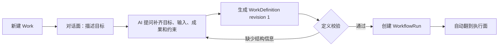
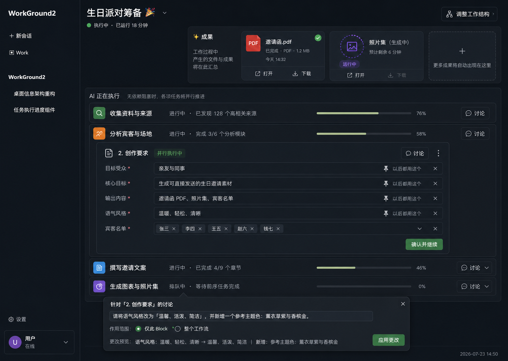
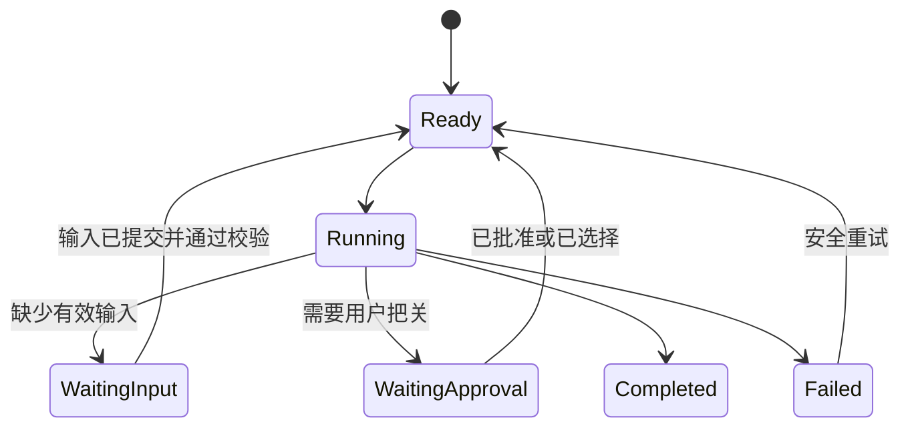
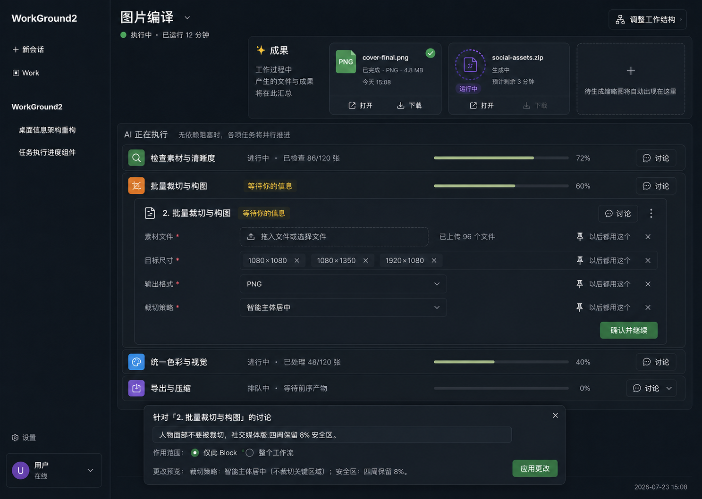
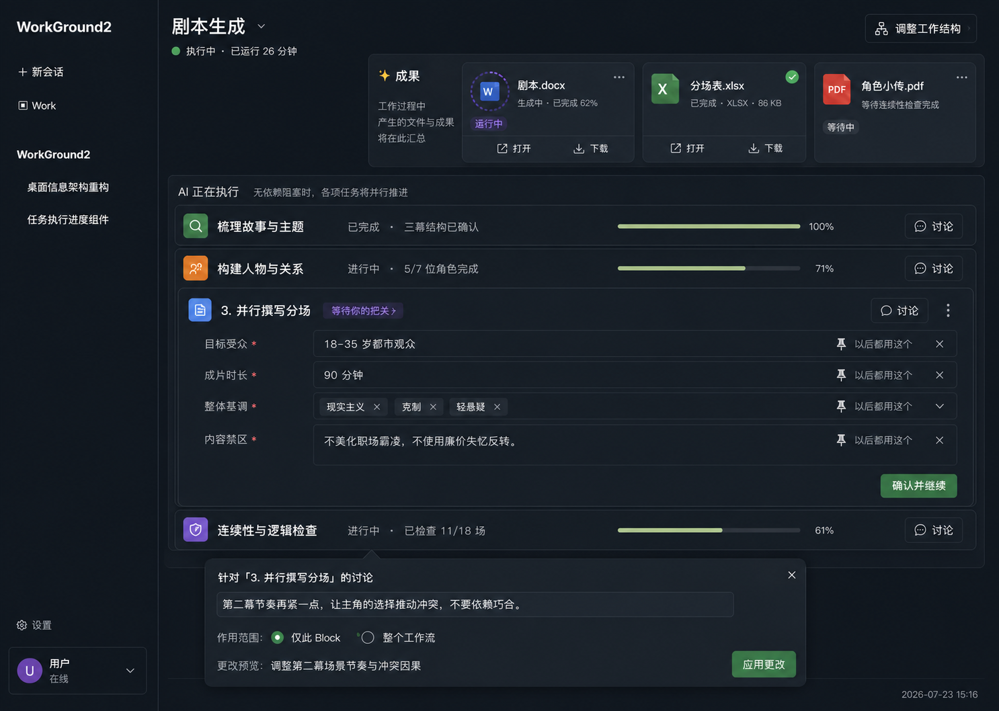
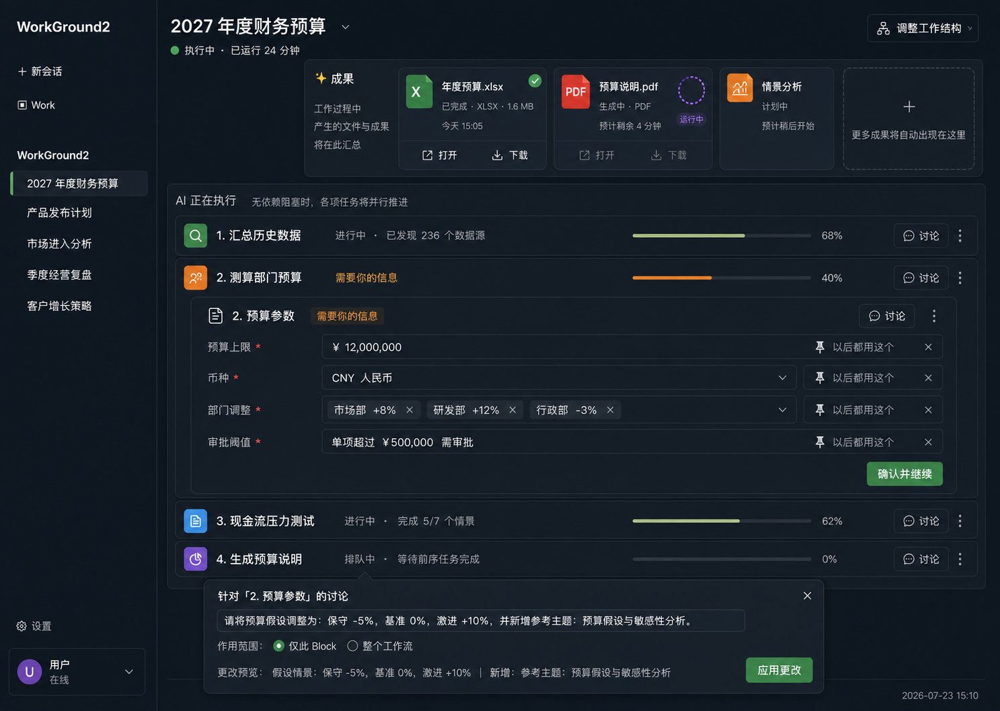
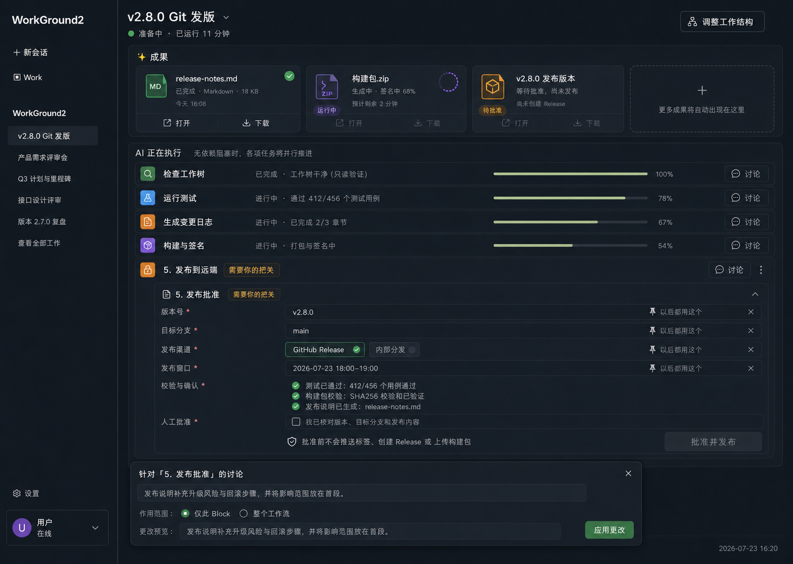
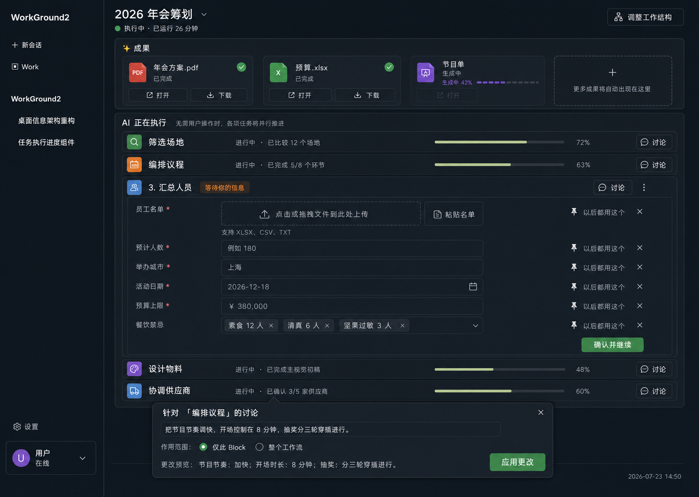

# Work 协作工作台 V2 产品与技术设计

> 文档状态：**V2 实施基线（2026-07-23）**
>
> 本文定义 WorkGround2 Work 的第二阶段产品模型：一个成果驱动、非流式的人机协作工作台。AI 负责持续执行，用户负责提供必要信息与关键把关。页面中的成果、任务和输入保持稳定位置，状态在原位置更新。
>
> [WORK_SYSTEM_DESIGN.zh-CN.md](./WORK_SYSTEM_DESIGN.zh-CN.md) 继续作为 V1 领域模型、持久化、历史、重执行和兼容基线。本文覆盖与 V2 创建流程、执行面、输入门、讨论补丁、成果架和并行调度相关的新增或调整行为；发生冲突时，V2 产品交互以本文为准，V1 的历史不可变、幂等、恢复和 Controller-first 约束继续有效。
>
> Ctrl_CC 实施追踪：Feature `feat_1784804783784_78d81337b5`，共 6 个阶段、19 个 AI Task；只有当前 active 阶段的任务允许领取。

---

## 1. 目标

### 1.1 产品目标

Work 是一个面向交付结果的 AI 工作平台：

- AI 持续完成资料收集、分析、创作、校验、构建和导出等工作。
- 用户只处理必要信息、关键选择、风险批准和最终验收。
- 工作页面保持稳定结构，新事件更新对应位置，不形成持续向上滚动的消息流。
- 产物从 Work 创建时就占据显著位置，即使文件尚未生成。
- 缺少名单、日期、文件、选择等信息时，用户直接在对应 Block 内补充。
- 独立节点并行执行；单个节点等待用户时，不暂停无依赖的其他节点。
- 对话用于生成或调整工作结构，Block 讨论用于局部指导。

### 1.2 成功标准

用户进入 Work 执行面后，能够在一个稳定页面中回答四个问题：

1. 最终要交付什么？
2. AI 当前正在做什么？
3. 哪些事项需要我提供信息或把关？
4. 结果已经生成到什么程度，在哪里打开？

### 1.3 非目标

- V2 不实现 Office 文件格式的自研高保真渲染器。
- V2 不引入 BPMN、通用规则 DSL 或可视化节点编辑器。
- V2 不把聊天记录作为执行面的主信息结构。
- V2 不让前端直接调度 Agent、工具或外部副作用。
- V2 不要求所有节点等待同一个全局阶段结束后再启动。
- V2 不改变归档 WorkRecord 的不可变语义。

---

## 2. 已确认的产品决策

| 编号 | 决策 |
|---|---|
| V2-1 | 新 Work 从现有 Session 对话结构开始，通过问题引导生成结构化 WorkDefinition。 |
| V2-2 | WorkDefinition 生成成功后自动翻到执行面；执行期间两面状态互相独立保留。 |
| V2-3 | 执行面使用固定 Block 画布，成果架、任务行、展开 Block 和讨论区均原位更新。 |
| V2-4 | 名单、日期、文本、文件、表单、用户选择等必要输入直接在对应 Block 内完成。 |
| V2-5 | 每个输入可以“以后都用这个”，对应 Cornerstone pin；用户可以随时取消。 |
| V2-6 | 每个 Block 右上角提供统一“讨论”入口，讨论区锚定在 Block 下方浮出。 |
| V2-7 | 讨论产生结构化补丁预览，用户显式选择“仅此 Block”或“整个工作流”后应用。 |
| V2-8 | 工作结构不合理时翻到对话面，通过自然语言生成新的 Definition revision。 |
| V2-9 | 等待用户输入不会自动翻到对话面，也不会阻塞无依赖的并行节点。 |
| V2-10 | 单个或多个文件结果始终位于突出成果架；未生成时使用保留槽位。 |
| V2-11 | Word、PPTX、Excel 默认展示文件卡、状态、摘要、缩略图和系统打开入口；PDF、图片、文本可应用内预览。 |
| V2-12 | 所有写操作携带 requestID 和 expectedRevision，支持幂等重试与冲突恢复。 |

---

## 3. 人机职责

### 3.1 AI 负责

- 分解工作并生成可执行定义。
- 启动所有依赖已满足的节点。
- 收集、分析、创作、处理、校验和导出。
- 主动发现缺失输入、风险和待批准动作。
- 在原位置更新任务状态、阶段结果和成果状态。
- 失败后按策略重试，无法安全重试时显式请求人工处理。
- 提供讨论补丁预览，说明影响范围和变更结果。

### 3.2 用户负责

- 提供 AI 无法推导或无权获取的必要信息。
- 选择偏好、目标、范围、日期、名单、预算等关键参数。
- 对高风险、不可逆或外部写操作进行批准。
- 在关键节点验收结果，提出局部意见或调整工作结构。
- 决定某个输入是否 pin 为 Cornerstone。

### 3.3 责任呈现原则

- 用户当前需要处理的事项必须与具体 Block、Task 和 Run 关联。
- 没有用户动作时，不展示空的“待处理”面板制造噪声。
- 每个请求说明“为什么需要”“影响哪些节点”“提交后会继续什么”。
- 用户输入提交后，节点自动重新评估并继续，无需再次启动整个 Work。

---

## 4. 核心体验

### 4.1 新建 Work

> **入口变更 (2026-07-27):** Work 现在是 Workspace 下的一种特殊 Session（`sessionKind: "work"`）。新建 Work 通过 ProjectTree 每个 Workspace 行旁的 Briefcase 按钮触发，不再使用独立的侧栏 Work 入口。点击已创建的 Work Session 直接打开 WorkCard，背面为该 Session 自己的对话面。



创建流程直接复用现有 Session 页面结构，保留 Transcript、Ask、Approval、Artifact、Queue 和 Composer。规划完成前，执行面可以存在但显示“正在形成工作结构”，不启动有副作用的节点。

### 4.2 执行面



```text
WorkWorkspace（外层固定）
├── 标题、运行状态、调整工作结构
└── WorkCard
    ├── Front：工作执行
    │   ├── WorkHeader
    │   ├── ResultShelf
    │   ├── ExecutionList
    │   │   ├── ExecutionRow
    │   │   └── ExpandedWorkBlock
    │   └── BlockDiscussionDrawer
    └── Back：工作对话
        └── 复用现有 Session 页面结构
```

执行面固定按以下顺序组织：

1. Work 标题、整体状态和“调整工作结构”。
2. 成果架：已完成、生成中、失败和保留槽位。
3. “AI 正在执行”列表：稳定任务行和局部进度。
4. 当前展开 Block：结构化输入、结果、状态和操作。
5. Block 讨论区：需要时锚定浮出。

### 4.3 必要输入

等待用户输入属于节点局部状态：



输入类型：

- 单行或多行文本
- 数字、金额和比例
- 日期、时间和时间范围
- 单选、多选和枚举
- 名单和可增删条目
- 表单对象
- 文件上传或已有 Artifact 选择
- 用户、团队或角色选择
- 风险批准与最终验收

每个输入包含：

- label、description、required、value schema
- validation、error、retry hint
- source、updatedAt、updatedBy
- pinEligible、cornerstoneID
- dependency impact

提交规则：

- `requestID` 保证重复提交不产生第二次副作用。
- `expectedRevision` 防止覆盖迟到更新。
- 输入校验失败保持草稿和错误信息。
- 提交成功后只唤醒受影响节点。
- pin 失败不回滚已成功的普通输入；错误独立暴露并允许重试。

### 4.4 Block 讨论

Block 讨论是附着于 Block 的短上下文协作：

1. 用户点击 Block 右上角“讨论”。
2. 系统打开锚定讨论区，并注入 workID、definitionRevision、runID、taskID、blockID 和 blockRevision。
3. 用户输入改进、指导或意见。
4. AI 返回结构化 `WorkPatchPreview`。
5. 用户选择作用范围：
   - `block`：只修改当前 Block 或当前运行实例。
   - `workflow`：生成新的 WorkDefinition revision，供当前及后续运行使用。
6. 用户点击应用；系统使用 requestID 和 expectedRevision 提交。

讨论目标按当前任务的输入 Block、Definition 声明 Block、稳定派生 Block 依次解析。稳定派生 ID 为 `v2-node-<NodeID 的 UTF-8 十六进制>`，不得使用 taskID 或输入 revision 伪造 Block 身份。对于升级前没有持久化 Block 的旧 Work，首次成功预览会将真实 Block 和补丁预览作为同一原子事件批次提交；规划失败或批次提交失败不留下半完成 Block，并允许使用同一请求安全重试。

Patch planner 必须获得目标 Block 的当前 `data` 和明确的 PatchPlan JSON 示例。模型首次返回自然语言或无效 JSON 时，planner 最多发起一次无副作用的严格 JSON 修复请求；修复仍失败则显式返回可重试错误，错误信息不得回显原始模型内容。

讨论输入可以实时生成预览，但不会直接写入 Work。补丁必须展示：

- 修改前后差异
- 影响 Block 和下游节点
- 是否会使已完成节点失效
- 是否需要重新执行
- 是否影响 Cornerstone、Artifact 或外部副作用

### 4.5 调整工作结构

以下情况翻到对话面：

- 新增、删除或重排工作节点。
- 修改节点依赖关系。
- 改变成果类型或交付标准。
- 将局部讨论应用到整个工作流且影响结构。
- 当前定义无法表达用户真实目标。

以下情况停留在执行面：

- 补名单、日期、文件、文本或选择。
- 修改当前 Block 的参数。
- 处理批准、风险确认和最终验收。
- 重试当前节点。
- 查看成果、错误或局部讨论。

定义调整采用 copy-on-write：

1. 当前 revision 持续服务已启动节点。
2. 对话面生成候选 revision。
3. 系统展示 definition diff 和运行影响。
4. 用户应用后原子切换 revision。
5. 已完成节点按输入 digest 和依赖 digest 判定保留、失效或重跑。

### 4.6 Work Session 归属

每个 Work 绑定一个唯一的 Work Session（`sessionKind: "work"`），Session 的 BranchMeta 持久化 `workId`。Work Session 在 ProjectTree 中与普通 Session 同树展示，但有独立的 Briefcase 图标和 `work_session` / `global_work_session` 节点类型。

- **创建：** `CreateWorkSession(scope, workspaceRoot, requestId)` 复合创建 Session 并调用 `BeginWorkPlanning`。同一 `requestId` 重复调用返回已有 Session/Work，每次新的创建意图使用新的 `requestId`。
- **恢复：** 切换会话或重启后，Tab 从 BranchMeta 自动恢复 `sessionKind` 和 `workId`，打开对应 WorkCard。
- **生命周期：** Session 重命名/移入回收站/恢复时，BranchMeta 随 `.jsonl` 一起移动，Session-Work 关系不悬空。
- **失败处理：** Session 已创建但 Work 规划失败时，Tab 保留 `sessionKind: "work"` 和创建 `requestId`；重试复用同一幂等键，不重复创建 Session。

---

## 5. 成果架

### 5.1 目标

成果架表达最终交付物及其当前状态，不要求所有文件都能在应用内完整渲染。

### 5.2 ArtifactSlot

```go
type ArtifactSlot struct {
    ID              string
    WorkID          string
    DefinitionRev   int64
    Title           string
    Kind            string
    ExpectedCount   int
    Required        bool
    State           ArtifactSlotState
    ArtifactRefs    []ArtifactRef
    Progress        *float64
    Summary         string
    Error           *ArtifactError
    Revision        int64
}
```

建议状态：

- `reserved`：定义已声明，文件尚未创建。
- `generating`：正在生成或转换。
- `ready`：至少一个可用产物已完成。
- `partial`：部分产物完成，部分失败或等待。
- `failed`：生成失败，可重试。
- `stale`：上游输入变化，现有文件可查看但需要重建。

### 5.3 预览分级

| 类型 | 默认能力 |
|---|---|
| 图片、文本、Markdown | 应用内直接预览 |
| PDF | WebView2 或 PDF.js 预览 |
| DOCX | 文件卡、摘要、缩略图、系统打开；按需转 PDF |
| PPTX | 文件卡、页数、缩略图、系统打开；按需转 PDF 或逐页图片 |
| XLSX | 文件卡、Sheet 摘要、系统打开；按需转表格 HTML 或 PDF |
| ZIP、构建包、二进制 | 文件卡、清单、校验摘要、系统打开或定位 |

转换要求：

- 按文件内容 digest 缓存。
- 异步执行并允许安全重试。
- 转换失败不改变原 Artifact 的可用状态。
- 转换器缺失时降级到系统打开。
- 不把本地文件上传到第三方服务，除非用户明确选择并批准。

---

## 6. 并行执行语义

### 6.1 默认规则

WorkflowDef 使用显式依赖 DAG：

- 节点在所有必需依赖满足后进入 `ready`。
- 调度器尽快启动全部 `ready` 节点。
- `waiting_input`、`waiting_approval` 和 `failed` 只阻塞依赖当前节点的下游。
- 无依赖分支继续执行。
- 全局门只用于确有全局风险的场景，例如发布批准或最终交付确认。

### 6.2 Task 状态

```text
pending
ready
running
waiting_input
waiting_approval
completed
failed_retryable
failed_terminal
canceled
invalidated
```

### 6.3 恢复与乱序

- 调度决策基于后端投影，UI 不自行推断可运行节点。
- Task 完成、输入提交和讨论补丁事件均携带 revision 和 requestID。
- 迟到完成事件在 digest 不匹配时进入 `stale_result`，不得覆盖新版结果。
- 重启后从事件日志重建 ready set，已存在 receipt 的外部动作不重复执行。
- 外部副作用结果不确定时进入 `waiting_approval`，由用户选择重试、跳过或补偿。

---

## 7. V2 领域增量

V1 模型继续保留，V2 增加以下明确对象：

### 7.1 WorkDefinitionRevision

```go
type WorkDefinitionRevision struct {
    WorkID          string
    Revision        int64
    ParentRevision  int64
    Status          DefinitionStatus
    Goal            string
    Nodes           []NodeDef
    ArtifactSlots   []ArtifactSlotDef
    InputSpecs      []InputSpec
    CreatedBy       string
    CreatedAt       time.Time
    Digest          string
}
```

### 7.2 WorkInput

```go
type WorkInput struct {
    ID              string
    WorkID          string
    RunID           string
    TaskID          string
    BlockID         string
    SpecID          string
    Value           json.RawMessage
    State           InputState
    CornerstoneID   string
    Revision        int64
    UpdatedAt       time.Time
}
```

### 7.3 WorkPatchPreview

```go
type WorkPatchPreview struct {
    ID                 string
    WorkID             string
    BaseDefinitionRev  int64
    BaseBlockRev       int64
    Scope              PatchScope
    Operations         []PatchOp
    AffectedNodeIDs    []string
    InvalidatedTaskIDs []string
    RequiresRerun      bool
    Digest             string
    ExpiresAt          time.Time
}
```

### 7.4 约束

- 核心状态只通过 Work Service 修改。
- Patch preview 不直接写状态。
- Discussion 文本可以保存在关联 Session；Work 事件只保存结构化补丁、摘要和引用。
- Input 和 Cornerstone 是两个独立写操作，分别具有 requestID、结果和重试状态。
- ArtifactSlot 是预期成果，ArtifactRef 是实际文件，两者不可混用。

---

## 8. Controller-first 接口

公共接口保持意图级和低参数量：

```go
type CollaborationController interface {
    BeginWorkPlanning(ctx context.Context, input BeginPlanningInput) (*WorkView, error)
    ApplyDefinition(ctx context.Context, input ApplyDefinitionInput) (*WorkView, error)
    SubmitWorkInput(ctx context.Context, input SubmitInputRequest) (*InputResult, error)
    SetInputCornerstone(ctx context.Context, input SetInputCornerstoneRequest) (*CornerstoneResult, error)
    PreviewWorkPatch(ctx context.Context, input PreviewPatchRequest) (*WorkPatchPreview, error)
    ApplyWorkPatch(ctx context.Context, input ApplyPatchRequest) (*WorkView, error)
    RetryWorkNode(ctx context.Context, input RetryNodeRequest) (*Task, error)
}
```

接口要求：

- Wails 绑定只转发，不包含业务规则。
- 输入使用类型化 ID 和枚举，避免字符串路径协议。
- 写操作返回明确结果、最新 revision 和可重试错误。
- `ApplyDefinition`、`SubmitWorkInput`、`SetInputCornerstone`、`ApplyWorkPatch`、`RetryWorkNode` 支持幂等重试。
- 事件 payload 携带 workID、runID、taskID、blockID、inputID、definitionRevision、requestID。

---

## 9. 事件与投影

新增持久化事件建议：

```text
definition.planning_started
definition.revision_created
definition.revision_applied
artifact_slot.declared
artifact_slot.updated
input.requested
input.draft_saved
input.submitted
input.rejected
input.cornerstone_changed
discussion.patch_previewed
discussion.patch_applied
task.invalidated
task.ready
task.waiting_input
task.waiting_approval
```

投影要求：

- `WorkView` 一次返回成果架、稳定任务行、展开 Block 所需的权威状态。
- snapshot/delta 按 revision 幂等合并。
- 同一 V2 mutation 同时影响基础 Work 与 V2 投影时，提交后广播完整 WorkView mutation snapshot；前端必须在推进 revision 的同一入口同时更新真实 Block、权威 `updatedAt` 和 V2 投影。同 revision 后续权威快照应判定为重复，真实基础内容差异仍显式冲突。
- 事件缺口触发 snapshot 重拉，保留本地输入草稿和打开的讨论区。
- 任务行 identity 不随状态变化而改变，避免组件卸载和输入丢失。
- 高频进度事件使用独立 payload，不复用可变静态对象。

---

## 10. Desktop 组件规划

### 10.1 复用

| 现有位置 | V2 用途 |
|---|---|
| `desktop/frontend/src/components/work/WorkWorkspace.tsx` | 固定外层 |
| `WorkCard.tsx`、`WorkFlipControl.tsx` | 双面状态与翻面 |
| `WorkCardBack.tsx` | 对话面容器，接入现有 Session slots |
| `BlockHost.tsx`、`registry.ts` | Block 渲染注册 |
| `InputBlock.tsx`、`ApprovalBlock.tsx`、`ArtifactBlock.tsx` | V2 输入、批准和成果基础 |
| `desktop/frontend/src/work/store.ts` | 权威投影与 UI 状态分离 |
| `internal/work`、`desktop/works.go` | 领域、Controller 和 Wails 边界 |

### 10.2 新增或重构

```text
components/work/
├── WorkExecutionFace.tsx
├── ResultShelf.tsx
├── ResultCard.tsx
├── ExecutionList.tsx
├── ExecutionRow.tsx
├── ExpandedBlock.tsx
├── BlockDiscussionDrawer.tsx
├── WorkPatchPreview.tsx
└── inputs/
    ├── WorkInputHost.tsx
    ├── TextInput.tsx
    ├── ChoiceInput.tsx
    ├── DateInput.tsx
    ├── ListInput.tsx
    ├── FileInput.tsx
    └── PinInputControl.tsx
```

### 10.3 当前实现需要调整的行为

- `WorkRunEntry.tsx` 当前在 Prompt 缺失时要求用户到背面填写；V2 改为规划期对话或执行面对应输入门。
- `WorkCardFront.tsx` 当前以通用 Block 列表为主；V2 增加固定成果架和稳定执行列表。
- `ArtifactBlock.tsx` 当前表达实际产物；V2 增加 ArtifactSlot 以承载未生成成果。
- 现有 Cornerstone Drawer 保留 Work 级管理；输入行增加快捷 pin/unpin。
- 现有 Block Action Intent 继续负责受控执行，讨论补丁不能绕过权限和 revision 校验。

---

## 11. 场景基线

五个场景只改变成果、任务和用户把关内容，整体结构保持一致。

### 11.1 图片编译



- 成果：最终图片、社交素材包、缩略图。
- AI：素材检查、批量裁切、统一色彩、导出压缩。
- 用户：上传素材、选择尺寸、格式和裁切策略。

### 11.2 剧本生成



- 成果：剧本、分场表、角色小传。
- AI：梳理主题、构建人物、并行写分场、连续性检查。
- 用户：把关受众、时长、基调和内容禁区。

### 11.3 财务预算



- 成果：预算表、预算说明、情景分析。
- AI：汇总历史数据、测算部门预算、现金流压力测试、生成说明。
- 用户：提供预算上限、币种、部门调整和审批阈值。

### 11.4 Git 发版



- 成果：Release Notes、构建包、发布版本。
- AI：只读检查、测试、变更日志、构建和签名。
- 用户：确认版本号、目标分支、发布渠道和窗口；发布必须显式批准。

### 11.5 年会筹划



- 成果：年会方案、预算、节目单。
- AI：筛选场地、编排议程、汇总人员、设计物料、协调供应商。
- 用户：提供名单、城市、日期、预算和餐饮禁忌。

---

## 12. 实施阶段

### Phase 1：契约冻结

- 固化 V2 与 V1 的兼容边界、DTO、事件、状态机和迁移策略。
- 建立 Go/TypeScript golden fixture。
- 冻结成果架、输入门、讨论补丁和并行调度验收矩阵。

### 阶段 1：领域模型与运行时

- Definition revision 与规划完成自动切面。
- ArtifactSlot 和成果状态。
- 类型化 WorkInput 与 Cornerstone 快捷 pin。
- WorkPatchPreview 与作用范围。
- DAG ready-set 调度、局部等待和失效重跑。

### 阶段 2：Controller 与传输

- 收敛意图级 Controller API 和 Wails 绑定。
- 扩展 WorkView snapshot/delta，支持断线重放和草稿保留。

### 阶段 3：Desktop 协作工作台

- 对话规划入口和 definition diff。
- 固定成果架。
- 稳定执行列表和原位展开 Block。
- 类型化输入和 pin/unpin。
- Block 讨论抽屉和补丁预览。
- 结构调整翻面与运行影响确认。

### 阶段 4：场景与成果适配

- 实现预览分级、系统打开和可选转换。
- 建立图片编译、剧本、预算、Git 发版、年会五套 fixture/Blueprint。

### 阶段 5：恢复、验证与交付

- 迁移现有 V1 Work 的默认投影，不改写历史。
- 补齐 E2E、故障注入、可访问性和性能测试。
- 更新用户文档、回滚说明和 feature flag 发布门。

### 12.1 Ctrl_CC 阶段映射

| 顺序 | Ctrl_CC Stage | 状态规则 | 任务数 |
|---|---|---|---:|
| 0 | `stage_1784804783784_2e74c412fb` · Phase 1 | active；冻结契约后才能推进 | 1 |
| 1 | `stage_1784804819485_c42c6df0c8` · 领域模型与运行时 | locked | 5 |
| 2 | `stage_1784804819918_c1c1631524` · Controller 与传输 | locked | 2 |
| 3 | `stage_1784804820386_9f58eecf43` · Desktop 协作工作台 | locked | 6 |
| 4 | `stage_1784804820955_d6de4aa490` · 场景与成果适配 | locked | 2 |
| 5 | `stage_1784804821495_728e42c7cd` · 恢复、验证与交付 | locked | 3 |

---

## 13. 验收标准

### 13.1 主流程

- 新 Work 从对话开始，规划完成后自动进入执行面。
- 执行面首屏可见成果、AI 任务和用户待处理项。
- 新进度不会改变任务行顺序或顶走当前输入。
- 缺少名单、日期、文件等信息时在 Block 内完成并自动续跑。
- 单节点等待时，无依赖节点继续运行。
- 结构变更通过对话面生成 revision diff 后应用。

### 13.2 成果

- 未生成文件拥有稳定 ArtifactSlot。
- ready、partial、failed、stale 均有明确展示和恢复入口。
- Office 文件无内置转换器时仍可打开、定位和查看摘要。
- 转换失败不损坏原文件或阻止交付。

### 13.3 讨论与补丁

- 每个 Block 使用同一讨论入口。
- 补丁应用前可查看范围、影响和是否重跑。
- 重复 apply requestID 只产生一次 revision。
- base revision 过期时拒绝覆盖并提供最新预览。

### 13.4 可靠性

- 重启后成果、输入、等待状态和 ready set 可恢复。
- 重复输入、迟到事件和断线重连不会重复外部副作用。
- 外部写结果不确定时进入人工接管。
- future schema 保持只读和可导出。
- feature flag 关闭后 V1 Work 和 Session 流程继续可用。

### 13.5 前端

- 展开 Block 输入草稿在 snapshot 重拉和翻面后保留。
- 键盘可完成打开 Block、填写输入、pin、讨论、应用补丁和批准。
- 状态不只依赖颜色表达。
- 1440×1024 基线、窄屏和减少动态效果模式通过视觉检查。

---

## 14. 发布与回滚

- 新功能使用独立 `work.collaborationWorkbenchV2` feature flag。
- 首次启用仅改变新建 Work 和 V2 执行投影；历史 V1 Work 保持可读。
- 关闭 flag 后保留 V2 数据，前端降级为 V1 Block/Fallback 只读展示。
- Definition、Input、Patch 和 ArtifactSlot 事件采用新 schemaVersion，旧程序禁止覆盖未知版本。
- 发布前完成 V1/V2 混合列表、归档、复制、重执行和恢复测试。

---

## 15. 评审清单

- [ ] Work 的主语义始终是成果交付。
- [ ] AI 与用户职责在每个 Block 中清楚可见。
- [ ] 页面没有流式消息推动执行内容。
- [ ] 用户输入停留在对应 Block。
- [ ] 讨论与结构调整入口职责分离。
- [ ] ArtifactSlot 与 ArtifactRef 分离。
- [ ] 并行节点不会被无关输入门阻塞。
- [ ] 所有写操作幂等、可重试、可观察。
- [ ] 历史不可变和 Controller-first 约束保持。
- [ ] Office 预览范围没有膨胀为自研渲染器。

---

## 16. V2 契约矩阵（2026-07-23 冻结）

### 16.1 Schema 版本识别

| 版本 | `schemaVersion` | V1-only 行为 | V2-aware 行为 |
|---|---|---|---|
| V1 | 1 | 正常读写 | 正常读写，V2 flag 关闭时降级 |
| V2 | 2 | `CheckSchemaVersion` 拒绝写入，只读可导出 | 正常读写 |
| Future (>2) | ≥3 | `CheckSchemaVersion` 拒绝写入，`FutureWorkEnvelope` 只读 metadata/fallback/raw | `CheckSchemaVersionV2` 拒绝写入，`FutureWorkEnvelope` 只读 |

### 16.2 Feature Flag 矩阵

| `collaboration_workbench_v2` | 新建 Work | 现有 V2 Work | V1 Work | V2 事件 |
|---|---|---|---|---|
| `false`（显式关闭） | V1 流程 | 降级 V1 Block/Fallback 只读 | 正常 | 拒绝产生 |
| `true`（默认） | V2 规划流 | 正常 V2 执行面 | 正常 | 正常 |

### 16.3 迁移矩阵

| 方向 | 行为 | 失败恢复 |
|---|---|---|
| V1 → V2 | 保留 V1，生成 V2 projection | 源 V1 不变，可重试 |
| V2 → V1（降级） | V1 compatible projection，V2 数据保留 | 降级失败不损 V2 数据 |
| any → future | 拒绝迁移，只读可导出 | 不写入，不损坏 |

### 16.4 不可变约束

- V1 `SchemaVersion = 1` 永不变更。
- V1 `archive-v1/` 目录零字节差异。
- V1 `RunState`、`WorkDefinitionSnapshot`、`WorkflowDef` 结构不变。
- V2 新增类型使用独立文件（`v2.go`、`event_v2.go`）和独立 fixture 目录（`contract-v2/`）。
- `ObjectContext` V2 字段全部 `omitempty`，V1 JSON 不漂移。
- 所有 V2 写事件 payload 携带 `expectedRevision`。
