# Work 通用模型与界面设计结论

> 状态：设计结论，暂不涉及实现。
> 团建、财务和软件工程仅用于验证覆盖能力，运行时代码不包含领域枚举。

## 1. 核心结论

- Work 是一套可组合的“工作表达语法”，由输入、执行节点、成果、Block、布局和策略组成。
- 界面固定保留成果区与 Block 工作区；领域、任务数量和当前状态只改变内容与视觉权重。
- Controller 是状态单一可信源；UI 只渲染 WorkView，不推断业务、不直接调度执行。
- Definition 激活前严格校验结构；运行阶段优先自动同步、重放、合并和局部恢复。
- 版本号表达因果关系，不作为整个 Work 的统一门闩。

## 2. 通用工作表达

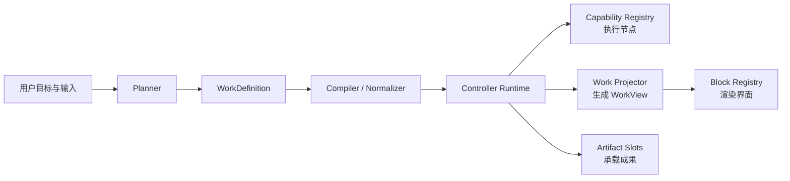

| 对象 | 职责 |
|---|---|
| Input | 文本、数字、日期、文件、选择、审批及其约束 |
| Node | 依赖、消费、产出、执行能力、重试和人工门 |
| Artifact Slot | 预期成果契约及生成状态 |
| Block | 运行状态的可视投影，使用 `kind + schemaVersion` 渲染 |
| Placement | `attention / primary / secondary / result`、顺序、跨度和折叠 |
| Policy | 完成、重试、审批、失效和外部副作用规则 |

典型工作由少量结构模式组合：Pipeline、Fan-out/Fan-in、Human Gate、Review Loop、Retry/Compensate、Monitor/Stream。

| 验证样本 | 模式组合 |
|---|---|
| 团建方案 | 并行检索 → 比较筛选 → 用户决策 → 生成方案 |
| 财务报表 | 采集汇总 → 归一校验 → 计算对账 → 异常确认 → 生成报表 |
| 软件工程 | 检查 → 规划 → 修改 → 验证循环 → 审批/交付 |

## 3. 界面与状态

页面顺序保持稳定：Work Header → Attention → Block 工作区 → 成果区。成果槽位从创建时就存在；Block 使用通用类型，如 table、chart、markdown、code、input、decision、approval、progress、artifact。

| 状态 | 界面行为 |
|---|---|
| 生成结构 | 展示执行图草稿、待生成成果槽位和必要问题 |
| 执行中 | 当前 Block 提升为 primary；进度和依据留在 secondary |
| 等待用户 | Input/Decision/Approval 提升到 attention，其他独立节点继续 |
| 可重试失败 | 保留局部结果，显示原因、影响范围和重试入口 |
| 完成 | 折叠执行过程，突出成果与结论 |

布局先按 slot 分组，再按 order 排序；span 由 Block 建议尺寸与容器宽度计算。只有 Definition 修订或 attention 状态变化才重排，避免运行中跳动。

## 4. 宽容并发与版本规则

| 标识 | 用途 |
|---|---|
| schemaVersion | 协议兼容；未知显示可降级，不安全写入才阻断 |
| workCursor | 事件排序和投影追赶，不作为普通写门槛 |
| definitionRevision | 只保护执行图及依赖该图的成果 |
| entityRevision | 只保护目标 Input、Block、Task 或 Artifact |
| executionToken | 识别迟到结果；迟到结果记为 stale，不中断 Work |
| intentId / intentDigest | 表达稳定用户意图，跨刷新和重试保持不变 |
| attemptId | 标识单次传输，便于观测和安全重试 |

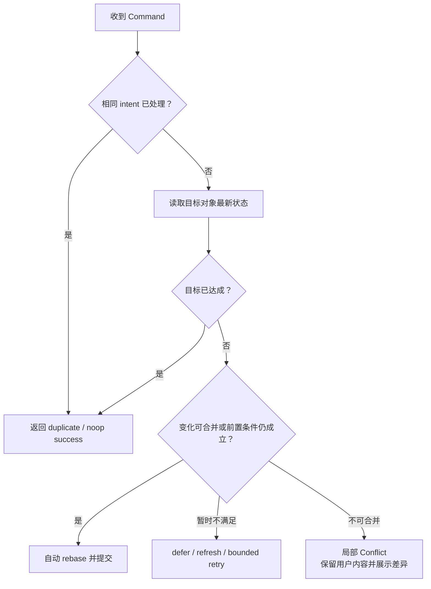

严格校验保留在 DAG、引用、成果生产者、Schema 和危险副作用；普通 revision 偏差由统一 Mutation Coordinator 自动恢复。写成功后响应直接返回目标快照、目标版本、Definition 版本、workCursor 和 receipt，UI 立即合入，不等待事件流刷新。

## 5. 视觉验证样本

以下九张图使用同一套成果区、Attention、通用 Block 和执行摘要，只改变 Definition、数据和运行状态。

### 团建方案

执行中：

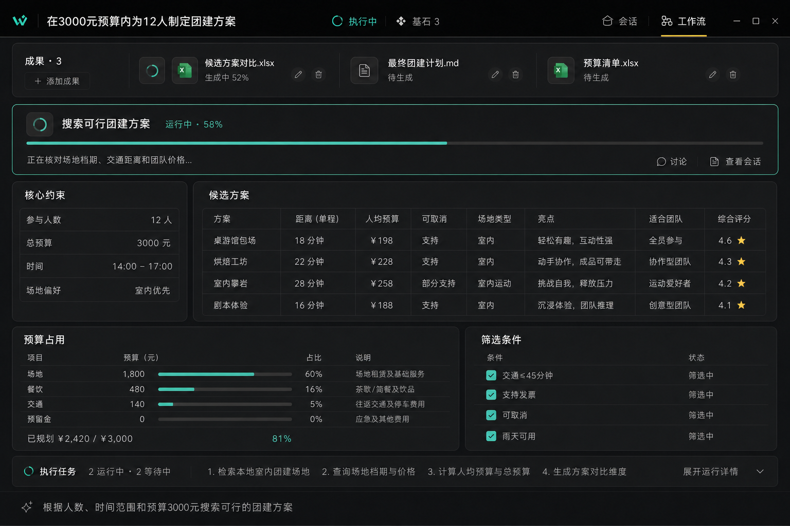

等待用户确认：

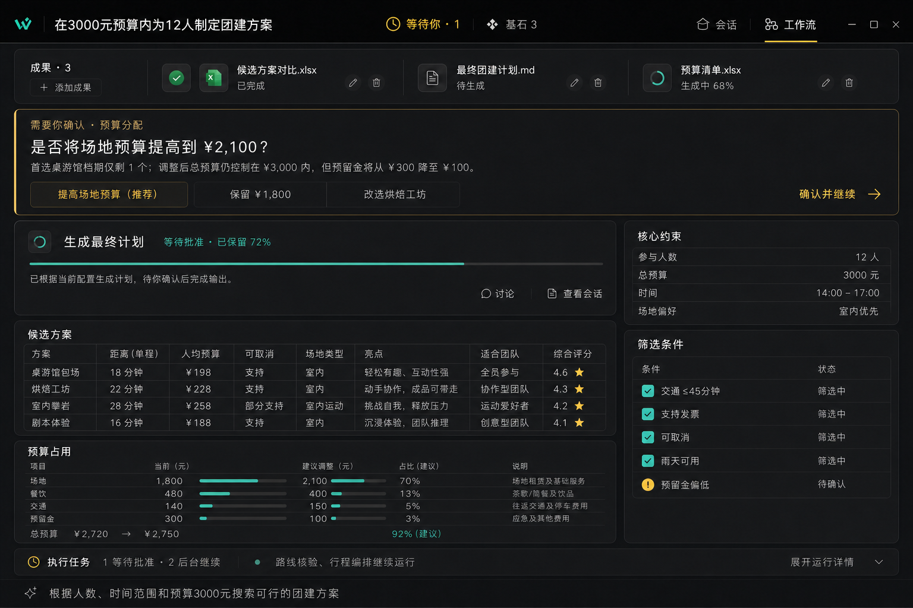

已完成：

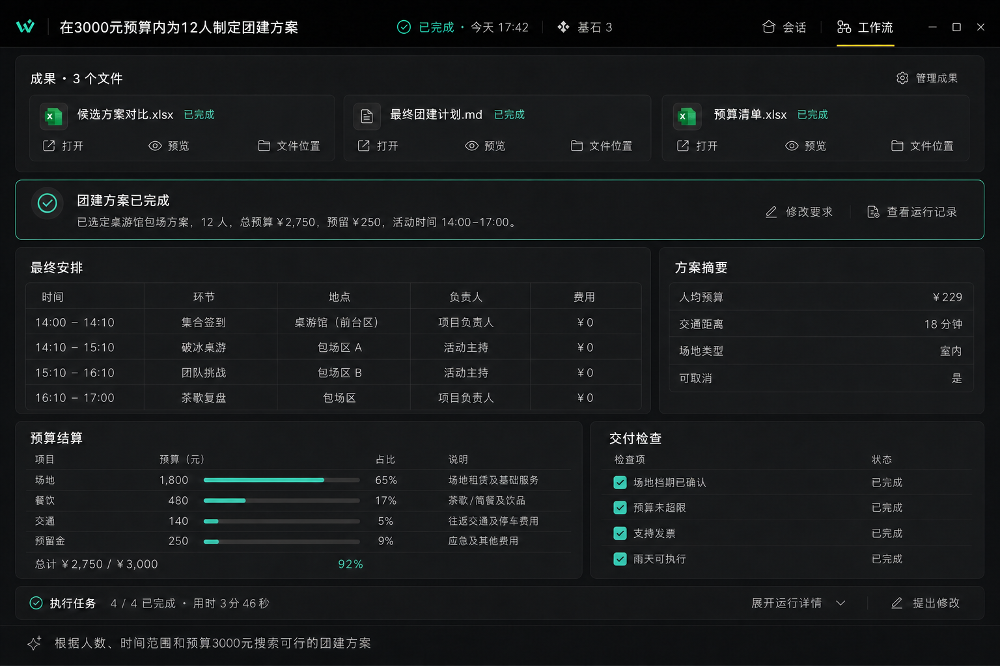

### 财务报表

执行中：

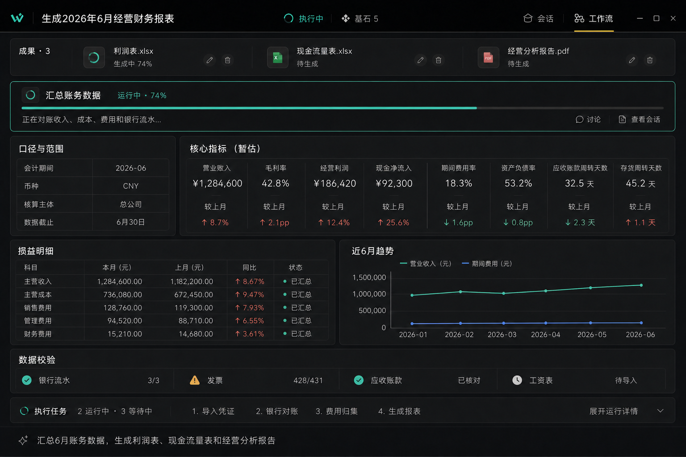

等待用户确认：

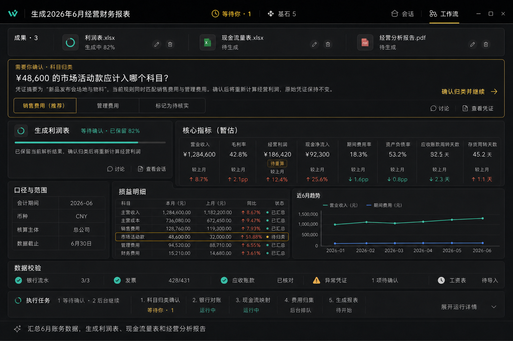

已完成：

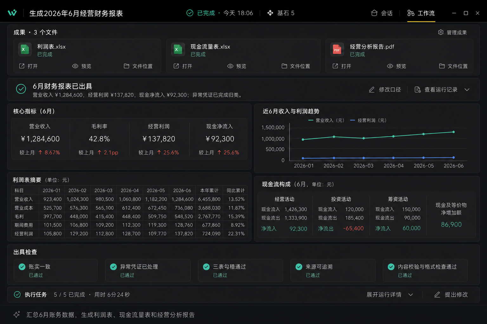

### 软件工程

执行中：

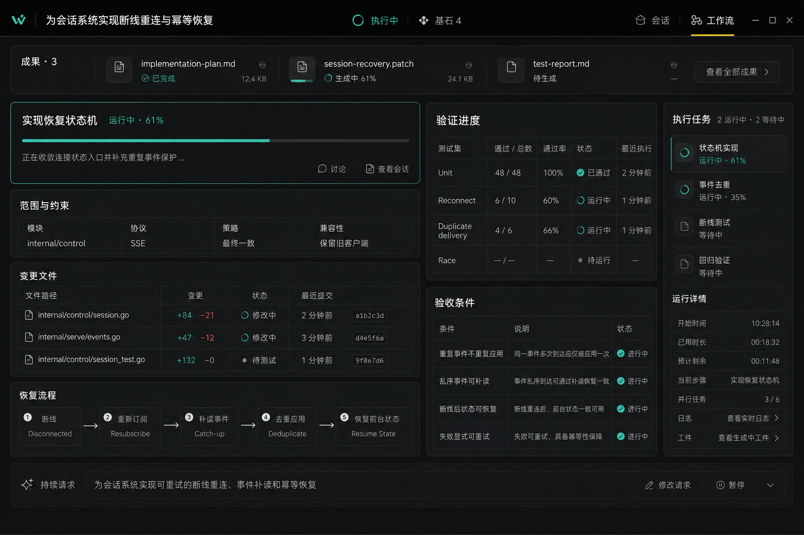

等待用户确认：

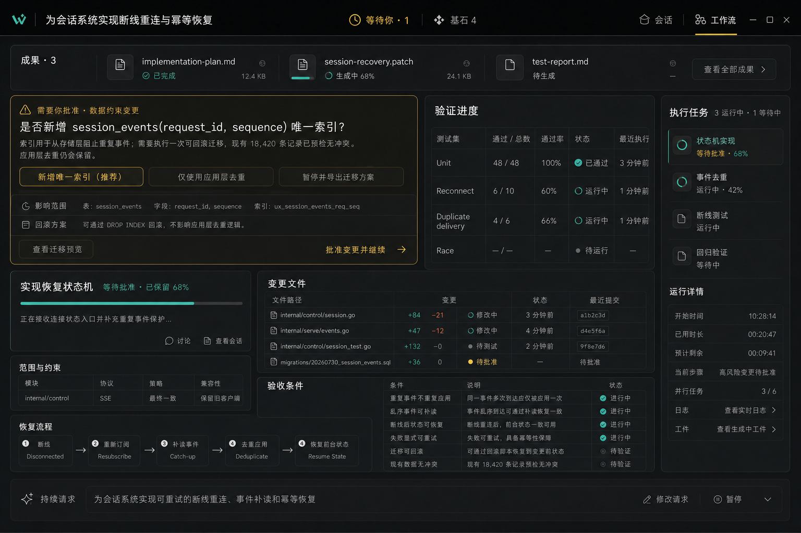

已完成：

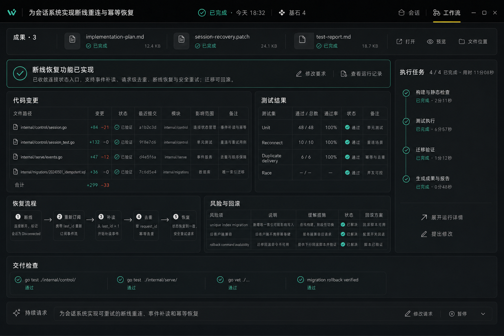

这些图片用于验证抽象覆盖能力，不定义领域模板或业务分支。
