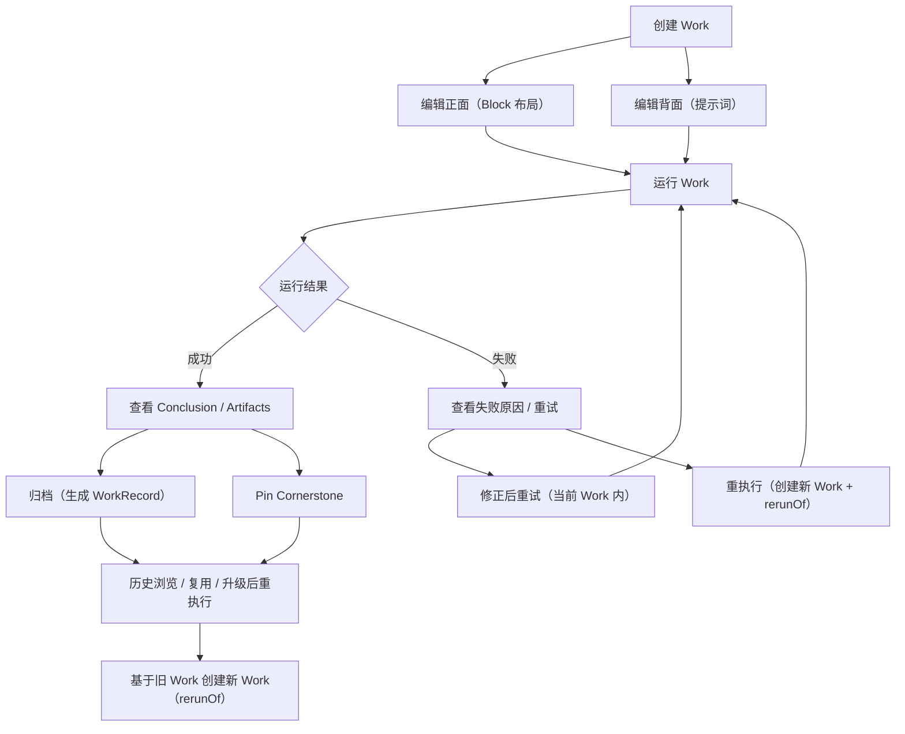
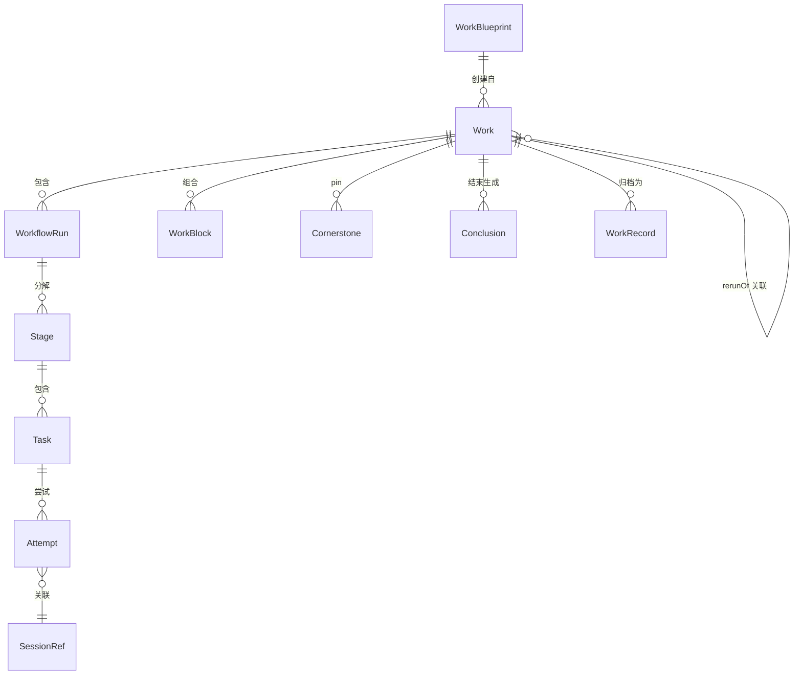
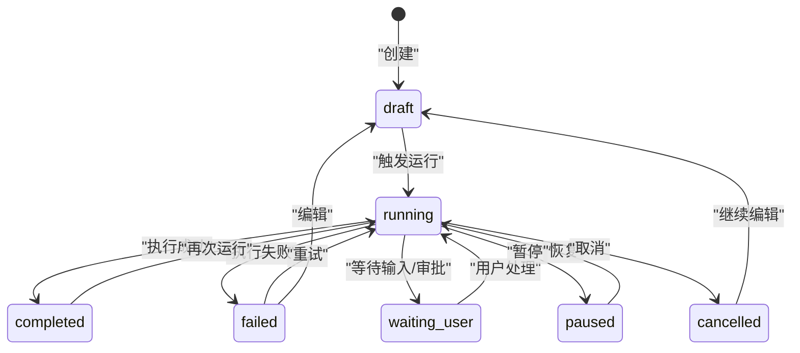
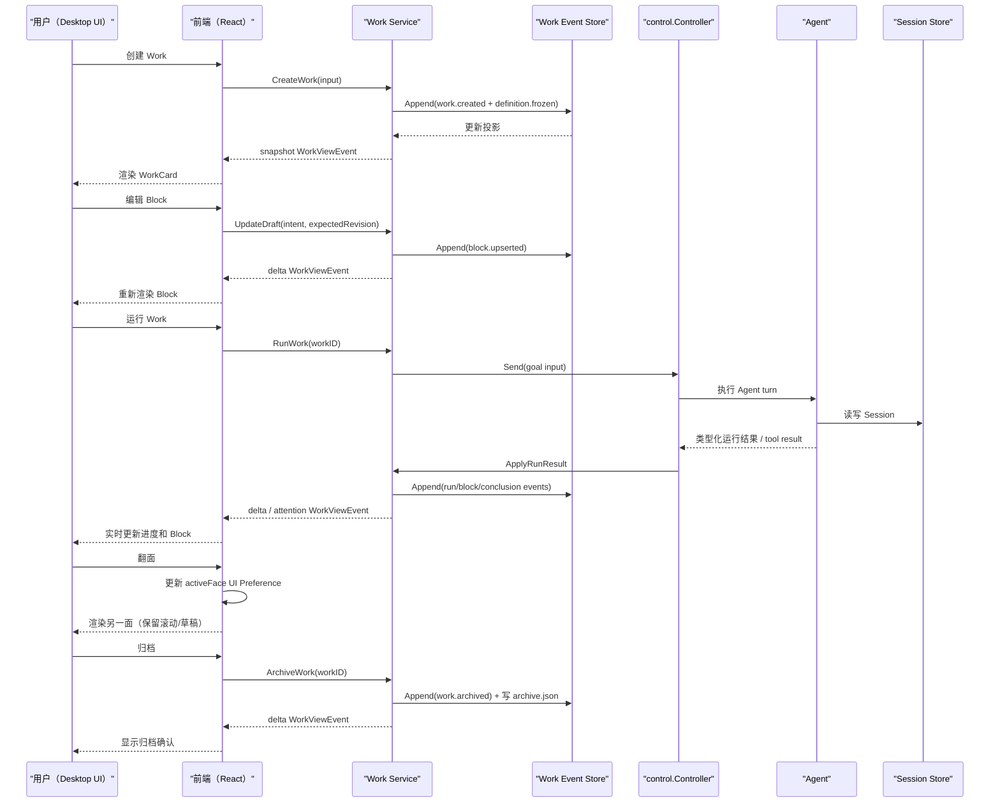

# Work 系统设计与开发文档

> 文档状态：**起草 v1**。本文定义 Work 系统（Work、WorkCard、WorkBlock、Cornerstone 等）的目标架构和产品行为。当前仓库已有 Session、Checkpoint、PinnedMemory、TaskMemory、Artifact、Run 和 AddOn Schema 等基础能力，但尚无统一的 Work 聚合、双面 WorkCard、Cornerstone 与 WorkBlock 协议；本文是后续设计和开发交付的基准。
>
> 与 WorkGround2 关系：Work 系统是 WorkGround2 上的一层产品抽象——`Work` 是用户可保存、历史查看、翻面交互、重执行的结构化工作单元；底层复用 WorkGround2 的 Controller、Session、Checkpoint、Memory、Tool Registry、AddOn 等能力。

---

## 目录

1. [文档状态、目标与非目标](#1-文档状态目标与非目标)
2. [术语定义](#2-术语定义)
3. [产品原则](#3-产品原则)
4. [信息架构与完整用户流程](#4-信息架构与完整用户流程)
5. [核心模型](#5-核心模型)
6. [版本兼容设计](#6-版本兼容设计)
7. [Cornerstone](#7-cornerstone)
8. [WorkBlock 协议](#8-workblock-协议)
9. [模板边界](#9-模板边界)
10. [持久化设计](#10-持久化设计)
11. [Controller-first API 草案](#11-controller-first-api-草案)
12. [Go / TypeScript 类型草案](#12-go--typescript-类型草案)
13. [事件与数据流](#13-事件与数据流)
14. [前后端组件与 Store 规划](#14-前后端组件与-store-规划)
15. [与现有代码映射](#15-与现有代码映射)
16. [分阶段开发计划](#16-分阶段开发计划)
17. [可观测性](#17-可观测性)
18. [风险与明确待定项](#18-风险与明确待定项)
19. [验收标准](#19-验收标准)

---

## 1. 文档状态、目标与非目标

### 1.1 文档目的

为 WorkGround2 的 Work 系统提供完整、可执行的中文设计文档，覆盖产品行为、核心模型、数据流、持久化、API、前后端组件和开发阶段。产品、设计、后端、前端和测试均可直接据此拆分任务。

### 1.2 状态

- **产品基线**：已确认双面 WorkCard、右上角翻面、Work 历史/重执行、Cornerstone 和动态内容机制。
- **技术状态**：本文提出 v1 数据协议、持久化、API 和分期方案；进入实现前需在 M0 用类型/golden fixture 固定契约。
- **实施状态**：尚未开始实现。第 16 章分阶段开发计划是实施入口。
- **版本追踪**：本文进入实施后，任何偏离必须先更新本文再改代码。

### 1.3 目标（Scope）

- 用户可以创建、命名、运行、翻面查看、保存、归档、历史浏览、复用和重执行 Work。
- Work 正面是版本化 WorkBlock 组合的结构化工作流视图；翻转背面是提示词和关联会话历史。
- Cornerstone 提供不受常规记忆压缩/清理影响的长期 pin 机制。
- 旧 Work 作为不可变历史快照保留，新版 Work 通过 `copiedFrom`、`rerunOf` 或 `referencedWorks` 表达复用关系。
- 系统复用 WorkGround2 Controller、Session 事件日志、Checkpoint、PinnedMemory、TaskMemory、Artifact 和 AddOn 面板能力。

### 1.4 非目标（Out of Scope）

- **不是**通用工作流引擎或 BPMN 运行时——不做条件分支 DSL、定时触发、外部 webhook 编排。
- **不是**多人实时协作编辑器——Work 属于单个用户，不设计 OT/CRDT 合并语义。
- **不是**模型训练数据管线——Cornerstone 不做 embedding、RAG 索引或向量存储。
- V1 不做 Work 间依赖图（Work A → Work B 触发器）或 Work 模板市场。

---

## 2. 术语定义

| 术语 | 定义 |
|---|---|
| **Work** | 用户根对象：一个可保存、可运行、可翻面查看的结构化工作单元。包含名称、描述、Blueprint 引用、状态、WorkBlock 实例、Cornerstone 集合、关联 Session 列表。 |
| **WorkBlueprint** | Work 的可复用定义：输入 schema、提示词模板、WorkflowDef、Block 槽位、基石要求、结论/产物类型和能力依赖。创建 Work 时冻结为 DefinitionSnapshot。 |
| **WorkflowDef** | Blueprint 内的工作流定义。V1 使用有序 Stage 和显式输入/审批门，不提供通用条件分支 DSL。 |
| **WorkCard** | 核心界面组件：一张双面卡片，正面显示结构化 WorkBlock 工作流，背面显示提示词和会话历史。右上角翻面按钮。 |
| **WorkBlock** | Work 正面上的一个版本化内容块：可以是条目列表、文件清单、Git 状态、可执行入口、图表、表格等。每种 block 有独立的 kind、schema、数据和 revision。 |
| **WorkflowRun** | Work 的一次执行记录：包含 Stage/Task/Attempt 层级、开始/结束时间、状态、关联的 Session 引用。 |
| **Stage** | WorkflowRun 中的一个阶段（如"准备→执行→验证"）。包含多个 Task。 |
| **Task** | Stage 中的一个具体任务。包含多个 Attempt。 |
| **Attempt** | Task 的一次尝试执行。关联一个 Session 或 Session 片段。 |
| **SessionRef** | 对一个 WorkGround2 Session 的轻量引用（session ID、branch ID、关键摘要），不持有 Session 全文。 |
| **Conclusion** | 有来源和证据的结构化结论，类型为 Fact、Finding、Decision、Outcome 或 Lesson；可处于 proposed、confirmed、superseded 状态。 |
| **Artifact** | Work 运行产生的文件、图片或数据产物。保存 host-validated 引用、状态和可选 snapshot digest，不假设固定产物目录。 |
| **Checkpoint/Event** | Work 业务状态的持久化事件和运行恢复锚点。它与现有 Session 文件快照 Checkpoint 分工，翻面等纯 UI 偏好不进入业务事件日志。 |
| **Cornerstone** | 用户 pin 的 Work 级类型化基石，可承载说明、文件、决策、结论、来源、策略和固定参数；不受常规记忆清理影响。 |
| **WorkRecord** | 已归档 Work 的历史快照（不可变），可保留成功、失败或取消结果；包含 DefinitionSnapshot、Block/fallback、Run、Conclusion 和 Artifact 引用。 |

---

## 3. 产品原则

以下原则约束所有 Work 系统设计决策：

1. **Work 是持久实体，不是临时会话包装。** 创建 Work 后即持久化；即使不运行，Work 本身存在且可编辑。
2. **历史不可变。** 已归档 Work 的 WorkRecord 永远不被新版定义原地改写。重执行创建新 Work，通过 `rerunOf` 链关联。
3. **翻面不中断。** 用户在 WorkCard 正面和背面之间翻转时，任何正在执行的操作不中断，滚动位置、草稿内容、展开状态保留。
4. **状态单源。** Work 事件日志是持久化事实源，Work 投影是运行时可信状态；UI 只订阅投影并提交意图，不直接修改持久化数据。
5. **幂等优先。** Work 创建、Block 更新、Cornerstone pin、状态变更均支持重复执行不产生错误副作用。
6. **失败显式暴露。** Work 执行失败必须有可观察状态、可重试路径、可恢复入口；错误信息持久化而非静默丢弃。
7. **版本兼容向前。** 旧版 Work 始终可查看/回放；未知或已移除的 Block 使用归档 fallback 降级显示。旧版本程序遇到未来 schema 时只读或导出，禁止擅自覆盖。
8. **AI/AddOn 只发数据，不发 UI。** AI 和 AddOn 只能发送 schema 数据（block 内容、action intent）；渲染器注册表决定如何展示。禁止 AI 生成任意 React/HTML/CSS。
9. **配置驱动真实变化。** 只有业务确有多个可配置维度时才配置驱动，避免无业务理由的参数表。

---

## 4. 信息架构与完整用户流程

### 4.1 信息架构

```
Workspace（最外层固定框架）
├── 全局标题栏（Work 名称、状态指示灯、分享、通知、全局操作按钮）
├── Cornerstone 入口（固定在 WorkCard 外层，两面都可访问）
├── 全局 AddOn 面板区（侧边或底部，固定不随翻面变化）
└── WorkCard（核心双面卡片）
    ├── 正面（Front）：结构化工作流视图
    │   ├── WorkBlock 列表（条目、文件、Git、执行入口、图表、表格...）
    │   ├── WorkflowRun 进度指示器
    │   └── 翻面按钮（右上角）
    └── 背面（Back）：提示词与会话
        ├── ConversationViewport / Transcript
        ├── 当前会话的 Run、审批、Ask、Artifact 与 Queue
        ├── Composer（提示词、附件、草稿和运行入口）
        ├── Session/Attempt 切换与历史引用
        └── 翻面按钮（右上角）
```

外层 Workspace 区域（标题栏、全局状态指示器、分享、通知、Cornerstone 入口、AddOn 面板）**不随翻面变化**，在 WorkCard 翻转时保持固定。背面直接复用现有会话交互结构，不再实现一套平行聊天系统。

### 4.2 用户流程总览



### 4.3 关键流程详述

#### 4.3.1 创建 Work

1. 用户点击"新建 Work"，选择 Blueprint（或空白模板）。
2. 系统从 Blueprint 拷贝默认 WorkBlock 布局和提示词，生成新 Work。
3. Work 初始状态 `draft`，正面展示默认 Block 布局，背面展示默认提示词。
4. 用户可以立即编辑名称、正面 Block、背面提示词，也可以直接运行。

#### 4.3.2 运行 Work

1. 用户在正面点击可执行入口（或背面点击"运行"）。
2. 系统创建 WorkflowRun（状态 `running`），初始化 Stage/Task 列表。
3. 每个 Task 对应一个 WorkGround2 Session（Agent 执行），Session 引用写入 WorkflowRun。
4. 执行期间 WorkCard 正面显示 WorkflowRun 进度指示器，Block 可展示实时状态。
5. 运行结束：生成 Conclusion 和 Artifact 引用；WorkflowRun 状态变为 `completed` 或 `failed`。

#### 4.3.3 翻面（Flip）

1. 用户点击 WorkCard 右上角翻面入口；正面入口显示“会话”，背面入口显示“工作流”。
2. `activeFace` 只切换视图，不写 Work 业务事件，也不创建 Session Checkpoint，更不打断正在执行的操作。
3. 当前面的滚动位置、展开/折叠状态和 Composer 草稿留在各自视图状态中；再次翻回时原样恢复。
4. 每个 Work 最后使用的一面持久化到 Desktop UI Preference，关闭再打开时恢复；像素级滚动位置只要求在当前打开周期内保持。
5. 标准翻面动效约 240ms；启用“减少动态效果”时改用淡入淡出。窄窗口中降级为右上角普通切换按钮，双面语义不变。
6. 深链、通知和 Attention 条目可以指定 `face + targetID`；打开 Work 后先切到目标面，再聚焦对应 Block、Conclusion、消息或审批。目标失效时显示原因并停留在可读的 Work 概览。

#### 4.3.4 归档

1. 用户在 Work 完成后（或手动）触发归档。
2. 系统创建不可变 WorkRecord：包含 DefinitionSnapshot、Block/fallback 最终状态、全部 WorkflowRun 摘要、Conclusion 和 Artifact 引用。
3. Work 的 `ArchiveState` 变为 `archived`，最后执行状态保持原值；归档后不可原地编辑或运行，但可以浏览和复用。
4. 归档 Work 的 Cornerstone 保持可用。

#### 4.3.5 历史查看与复用

1. 用户从历史列表中选择已归档的 Work。
2. 系统加载 WorkRecord 并以只读模式渲染 WorkCard（翻面可用）。
3. 用户可以：
   - 查看正面 Block 布局和背面提示词/会话。
   - 从 Blueprint 新建：复用定义，不复制运行数据。
   - 复制 Work：复制可复用输入和选定 Cornerstone，建立 `copiedFrom` 关联。
   - 按原定义或升级后重执行：创建新 Work，建立 `rerunOf` 关联。
   - 引用旧 Work 的 Conclusion、Artifact 或 Cornerstone：建立 `referencedWorks`/来源引用，不复制执行历史。

#### 4.3.6 重试（Retry）

- **Task 重试**：临时失败在当前 WorkflowRun 的同一 Task 下新增 Attempt；稳定 ID 和 request ID 保证重复触发不会生成两个 Attempt。
- **当前 Work 再运行**（仅限未归档且定义未变化）：用户明确重新启动时新增 WorkflowRun，旧 Run 保留。
- **按原定义重执行**：从 WorkRecord 创建新 Work，使用原 Blueprint 和 Block 布局的精确快照，新 Work 的 `rerunOf` 指向原 Work ID。
- **升级后重执行**：从 WorkRecord 创建新 Work，但使用当前最新 Blueprint 定义。系统检查 Blueprint 升级链，将旧 Block 迁移到新版 schema（降级不可识别部分）。`rerunOf` 指向原 Work ID + 标记 `upgraded: true`。
- **失败 Work 的恢复**：根据 Work 运行事件确定最后一个已提交 Stage/Task，从该 Task 新建 Attempt 或从头开始。现有 Session Checkpoint 只负责代码/会话回退，不能回滚网络、数据库、部署等外部副作用。

#### 4.3.7 版本升级场景（关联 4.3.6）

| 场景 | 行为 | 关联标记 |
|---|---|---|
| 查看历史 Work | 只读渲染，用原 Blueprint 版本的 WorkBlock schema 回放 | 无副作用 |
| 按原定义重执行 | 创建新 Work，使用 WorkRecord 快照的 Blueprint 版本 | `rerunOf: <原WorkID>`, `upgraded: false` |
| 升级后重执行 | 创建新 Work，使用最新 Blueprint；旧 Block 通过迁移链升级 | `rerunOf: <原WorkID>`, `upgraded: true`, `migrationPath: [v1→v2→v3]` |
| 缺失工具/文件/权限 | RerunPlan 显示阻塞项和允许的降级项；必需依赖不能被静默跳过 | 确认后的 plan 摘要写入新 Work provenance |

#### 4.3.8 Work 历史与重执行界面

Work 创建后即自动持久化，用户无需把它“另存为 Session”。历史区统一列出 active、archived 和 trash 中可恢复的 Work；默认视图优先显示归档 Work。

每个历史条目至少展示：Work 名称、最后执行结果、ArchiveState、Blueprint 名称/版本、归档时间、关键 Conclusion、Artifact 数量、Cornerstone 数量以及来源关系。打开条目只读取本地投影和归档 fallback，不刷新 Git、文件、URL 或 AddOn 数据，也不触发任何 action。

兼容徽标使用四种明确状态：

| 状态 | 含义 | 可用操作 |
|---|---|---|
| `ready` | 当前版本完整支持归档 schema、Block 和原定义依赖 | 查看、复制、预检重执行 |
| `degraded` | 某些 Renderer/可选依赖缺失，fallback 仍可完整阅读 | 查看、导出、修复依赖、预检 |
| `blocked` | 重执行所需定义、工具、必需基石或权限缺失 | 查看；修复后重新预检 |
| `future_schema` | 归档来自更高版本程序 | 只读元数据/fallback/原始导出；提示升级程序 |

点击“重执行”只打开 RerunPlanDrawer。用户选择“按原定义”或“升级到最新定义”，查看定义 diff、输入、Cornerstone 和副作用风险，再确认创建新 Work。取消预检不会写入源 Work，也不会创建半完成的新 Work。

---

## 5. 核心模型

### 5.1 模型总览



### 5.2 WorkBlueprint

Work 的版本化可复用定义，不持有运行时状态。`SchemaVersion` 表示序列化契约版本，`Version` 表示这份业务定义的版本，两者不可混用。

```go
// WorkBlueprint 定义一类 Work 的默认布局和行为。
type WorkBlueprint struct {
    SchemaVersion   int                `json:"schemaVersion"`
    ID              string             `json:"id"`      // "blueprint:code-review"
    Version         int                `json:"version"` // 同一 Blueprint 的业务定义版本
    Name            string             `json:"name"`
    Description     string             `json:"description"`
    Source          BlueprintSource    `json:"source"` // system | user | addon:<name>
    InputSchema     json.RawMessage    `json:"inputSchema,omitempty"`
    PromptTemplate  string             `json:"promptTemplate"`
    Workflow        WorkflowDef        `json:"workflow"`
    BlockSpecs      []BlockSpec        `json:"blockSpecs"`
    CornerstoneReqs []CornerstoneReq   `json:"cornerstoneRequirements,omitempty"`
    ConclusionKinds []ConclusionKind   `json:"conclusionKinds,omitempty"`
    ArtifactKinds   []string           `json:"artifactKinds,omitempty"`
    ToolContracts   []ToolContractRef  `json:"toolContracts,omitempty"`
    CreatedAt       time.Time          `json:"createdAt"`
}

// WorkflowDef 的 V1 语义是有序阶段和显式门，不引入通用规则引擎。
type WorkflowDef struct {
    Stages []StageSpec `json:"stages"`
}

type StageSpec struct {
    ID    string     `json:"id"`
    Title string     `json:"title"`
    Tasks []TaskSpec `json:"tasks"`
    Gate  string     `json:"gate,omitempty"` // "input" | "approval" | ""
}
```

创建 Work 时必须把 Blueprint 规范化后写入第一份 `DefinitionSnapshot`。用户编辑输入 schema、Prompt、WorkflowDef 或 BlockSpec 时采用 copy-on-write 生成新的不可变 definition revision；每个 WorkflowRun 记录自己实际使用的 definition digest。后续 Blueprint 更新只影响新建/升级重执行，当前 Work 和历史 Work 都不追随浮动版本。

```go
type WorkDefinitionSnapshot struct {
    SchemaVersion int               `json:"schemaVersion"`
    Revision      int64             `json:"revision"`
    BlueprintRef  BlueprintRef      `json:"blueprintRef"`
    InputSchema   json.RawMessage   `json:"inputSchema,omitempty"`
    PromptTemplate string           `json:"promptTemplate"`
    Workflow      WorkflowDef       `json:"workflow"`
    BlockSpecs    []BlockSpec       `json:"blockSpecs"`
    CornerstoneReqs []CornerstoneReq `json:"cornerstoneRequirements,omitempty"`
    ConclusionKinds []ConclusionKind `json:"conclusionKinds,omitempty"`
    ArtifactKinds []string          `json:"artifactKinds,omitempty"`
    ToolContracts []ToolContractRef `json:"toolContracts,omitempty"`
    Digest        string            `json:"digest"`
}

type ToolContractRef struct {
    Name            string `json:"name"`
    ContractVersion int    `json:"contractVersion"`
    Provider        string `json:"provider,omitempty"`
    SideEffectClass string `json:"sideEffectClass"` // read | workspace_write | external_write | destructive
    Required        bool   `json:"required"`
}

type BlueprintRef struct {
    ID            string `json:"id"`
    SchemaVersion int    `json:"schemaVersion"`
    Version       int    `json:"version"`
}
```

DefinitionSnapshot 只保存可重执行定义和契约，不保存 Provider 凭据或 Secret 明文。Secret 只记录用途/引用 ID，并在 RerunPlan 中重新校验。

### 5.3 Work / WorkRecord

```go
// Work 是用户根对象——一个可保存、运行、翻面的结构化工作单元。
type Work struct {
    SchemaVersion     int                    `json:"schemaVersion"`
    ID                string                 `json:"id"`
    Name              string                 `json:"name"`
    State             WorkState              `json:"state"` // draft | ready | running | waiting_user | paused | completed | failed | cancelled
    ArchiveState      WorkArchiveState       `json:"archiveState"` // active | archived | deleted
    BlueprintRef      BlueprintRef           `json:"blueprintRef"`
    Definition        WorkDefinitionSnapshot `json:"definitionSnapshot"`
    Inputs            map[string]any         `json:"inputs,omitempty"`
    Blocks            []BlockInstance        `json:"blocks"`
    Placements        []BlockPlacement       `json:"placements"`
    Prompt            string                 `json:"prompt"`
    Cornerstones      []Cornerstone          `json:"cornerstones"`
    Runs              []WorkflowRun          `json:"runs"`
    Conclusions       []Conclusion           `json:"conclusions,omitempty"`
    RerunOf           string                 `json:"rerunOf,omitempty"`
    CopiedFrom        string                 `json:"copiedFrom,omitempty"`
    ReferencedWorks   []string               `json:"referencedWorks,omitempty"`
    RerunUpgraded     bool                   `json:"rerunUpgraded,omitempty"`
    MigrationPath     []int                  `json:"migrationPath,omitempty"`
    CreatedWith       RuntimeFingerprint     `json:"createdWith"`
    CreatedAt         time.Time              `json:"createdAt"`
    UpdatedAt         time.Time              `json:"updatedAt"`
    ArchivedAt        *time.Time             `json:"archivedAt,omitempty"`
}

// WorkRecord 是已归档 Work 的不可变快照。
type WorkRecord struct {
    ArchiveSchemaVersion int                    `json:"archiveSchemaVersion"`
    WorkID               string                 `json:"workId"`
    Snapshot             Work                   `json:"snapshot"`
    RendererSetVersion   int                    `json:"rendererSetVersion"`
    FallbackBlocks       []BlockFallback        `json:"fallbackBlocks"`
    ArchivedAt           time.Time              `json:"archivedAt"`
}

type RuntimeFingerprint struct {
    WorkSchemaVersion  int               `json:"workSchemaVersion"`
    EventSchemaVersion int               `json:"eventSchemaVersion"`
    RendererSetVersion int               `json:"rendererSetVersion"`
    ToolContracts      []ToolContractRef `json:"toolContracts,omitempty"`
    Provider           string            `json:"provider,omitempty"`
    Model              string            `json:"model,omitempty"`
}

type SourceRef struct {
    Kind       string `json:"kind"` // work | session_turn | block | artifact | file | url
    WorkID     string `json:"workId,omitempty"`
    ObjectID   string `json:"objectId,omitempty"`
    Path       string `json:"path,omitempty"`
    URL        string `json:"url,omitempty"`
    Digest     string `json:"digest,omitempty"`
}
```

**WorkState 枚举**：
- `draft`：编辑中，尚未运行或运行后回到编辑。
- `ready`：输入和依赖预检通过，可执行。
- `running`：有 WorkflowRun 正在执行。
- `waiting_user`：正在等待输入、Ask 或 Approval。
- `paused`：运行已显式暂停，可恢复。
- `completed`：最后一次 WorkflowRun 成功完成。
- `failed`：最后一次 WorkflowRun 失败。
- `cancelled`：用户取消，结果可查看。

`ArchiveState` 独立表达 `active | archived | deleted`。这样归档不会覆盖最后一次真实执行结果；历史筛选也不需要从一个混合枚举反推状态。

**状态机**：



归档是独立状态机：`active → archived → deleted`；`deleted` 在宽限期内可恢复到 `archived` 或 `active`。归档不会改变上图的执行状态。

### 5.4 WorkflowRun / Stage / Task / Attempt

```go
type WorkflowRun struct {
    ID          string       `json:"id"`
    WorkID      string       `json:"workId"`
    DefinitionDigest string  `json:"definitionDigest"`
    State       RunState     `json:"state"`   // running | completed | failed | cancelled
    Stages      []Stage      `json:"stages"`
    StartedAt   time.Time    `json:"startedAt"`
    FinishedAt  *time.Time   `json:"finishedAt,omitempty"`
    Conclusion  *Conclusion  `json:"conclusion,omitempty"`
}

type Stage struct {
    Name        string       `json:"name"`
    State       RunState     `json:"state"`
    Tasks       []Task       `json:"tasks"`
    StartedAt   time.Time    `json:"startedAt"`
    FinishedAt  *time.Time   `json:"finishedAt,omitempty"`
}

type Task struct {
    Name        string       `json:"name"`
    State       RunState     `json:"state"`
    Attempts    []Attempt    `json:"attempts"`
}

type Attempt struct {
    Index       int          `json:"index"`
    State       RunState     `json:"state"`
    SessionRef  SessionRef   `json:"sessionRef"`
    StartedAt   time.Time    `json:"startedAt"`
    FinishedAt  *time.Time   `json:"finishedAt,omitempty"`
    Error       string       `json:"error,omitempty"`
}
```

### 5.5 SessionRef / Conclusion / Artifact / Event

```go
// SessionRef 轻量引用 WorkGround2 Session，不持有 session 全文。
type SessionRef struct {
    SessionPath string    `json:"sessionPath"` // <session>.jsonl 路径
    BranchID    string    `json:"branchId"`
    ModelRef    string    `json:"modelRef"`
    TurnCount   int       `json:"turnCount"`
    Preview     string    `json:"preview"`     // 前 200 字符摘要
    StartedAt   time.Time `json:"startedAt"`
}

type ConclusionKind string

const (
    ConclusionFact     ConclusionKind = "fact"
    ConclusionFinding  ConclusionKind = "finding"
    ConclusionDecision ConclusionKind = "decision"
    ConclusionOutcome  ConclusionKind = "outcome"
    ConclusionLesson   ConclusionKind = "lesson"
)

// Conclusion 是可追溯、可确认和可替代的结构化结论。
type Conclusion struct {
    ID          string         `json:"id"`
    Kind        ConclusionKind `json:"kind"`
    Status      string         `json:"status"` // proposed | confirmed | superseded
    Title       string         `json:"title"`
    Summary     string         `json:"summary"`
    Evidence    []SourceRef    `json:"evidence,omitempty"`
    Artifacts   []ArtifactRef  `json:"artifacts,omitempty"`
    NextSteps   []string       `json:"nextSteps,omitempty"`
    Supersedes  string         `json:"supersedes,omitempty"`
    GeneratedAt time.Time      `json:"generatedAt"`
}

// ArtifactRef 引用 Work 运行产生的产物。
type ArtifactRef struct {
    ID             string     `json:"id"`
    Name           string     `json:"name"`
    Type           string     `json:"type"`
    Status         string     `json:"status"` // available | stale | missing | failed
    Path           string     `json:"path,omitempty"`
    RelativePath   string     `json:"relativePath,omitempty"`
    BlobDigest     string     `json:"blobDigest,omitempty"`
    SourceRunID    string     `json:"sourceRunId,omitempty"`
    LastVerifiedAt *time.Time `json:"lastVerifiedAt,omitempty"`
    Error          string     `json:"error,omitempty"`
}

// WorkEvent 是 Work 操作的持久化事件日志条目。
type WorkEvent struct {
    SchemaVersion int             `json:"schemaVersion"`
    ID            string          `json:"id"`
    RequestID     string          `json:"requestId"`
    WorkID        string          `json:"workId"`
    Type          string          `json:"type"`
    Revision      int64           `json:"revision"`
    BaseRevision  int64           `json:"baseRevision"`
    Payload       json.RawMessage `json:"payload"`
    ContentDigest string          `json:"contentDigest"`
    WriterID      string          `json:"writerId"`
    CreatedAt     time.Time       `json:"createdAt"`
}
```

### 5.6 所有者与单一可信源

| 数据 | 所有者 | 可信源 |
|---|---|---|
| Work 定义、状态和关系 | `internal/work.Service` | `work.events.jsonl`；`projection.json` 是可重建投影 |
| WorkBlock 实例数据 | `internal/work.Service` | Block 事件；投影按 revision/tombstone 合并 |
| WorkflowRun 执行历史 | `internal/work.Service` | Run/Stage/Task/Attempt 事件 |
| Cornerstone 集合 | `internal/work.Service` | Cornerstone 事件；大内容写入内容寻址 blob |
| Session 对话全文 | WorkGround2 Session store | `<session>.jsonl` |
| Block 渲染器注册 | WorkGround2 Renderer Registry | 前端注册表（代码） |
| Work 事件日志 | Work Event Log | `work.events.jsonl`，持久化事实源 |
| WorkRecord 归档快照 | Work Archive Store | `<work-id>/archive.json`，冻结后不可变 |
| 提示词内容 | `internal/work.Service` | DefinitionSnapshot + Prompt 更新事件 |

**前端状态**：滚动位置、展开/折叠状态和未提交草稿属于每一面的 UI 状态，不进入 Work 业务投影；`activeFace` 作为按 Work ID 保存的 Desktop UI Preference 持久化。翻面本身不触发业务 Event 或 Checkpoint。

---

## 6. 版本兼容设计

### 6.1 核心策略

Work 系统的版本兼容分层处理：

1. **WorkRecord 不可变快照**：归档时冻结 DefinitionSnapshot、执行结果、Block 数据和 fallback，保证历史视图不追随当前模板。
2. **Archive schema**：`ArchiveSchemaVersion` 管理整个归档封装格式。
3. **Blueprint 双版本**：`SchemaVersion` 管序列化契约；`Version` 管同一 Blueprint 的业务定义演进。
4. **Block 双版本**：`SchemaVersion` 管该 kind 的数据格式；`Revision` 管同一个 BlockInstance 的状态更新和乱序合并。
5. **Event schema**：Work 事件独立版本化。未知未来事件或未来 schema 必须停止写入，允许只读原始查看/导出，避免旧程序破坏新数据。
6. **依赖指纹**：DefinitionSnapshot 记录 tool contract、renderer set 和必要能力版本；模型/provider 版本只用于来源说明，不承诺确定性复现。
7. **迁移链与 fallback**：迁移只产生新的运行投影或新的 Work，永不回写历史归档；未知 kind 使用归档 fallback 文本和原始 JSON 降级。

### 6.2 查看/回放 vs 重执行

| 操作 | 副作用 | 实现 |
|---|---|---|
| **查看历史 Work** | **无** | 加载 WorkRecord，用记录中的 Blueprint 版本和 Block schema 版本渲染。WorkRecord 是只读投影。 |
| **按原定义重执行** | 创建新 Work | 使用 WorkRecord 的 DefinitionSnapshot 和可复用输入创建新 Work，`rerunOf` 指向原 Work；不复制旧运行状态。 |
| **升级后重执行** | 创建新 Work + 迁移 | 先生成可审阅 RerunPlan 和版本差异，再用最新 Blueprint 与迁移后的输入/Block 创建新 Work。 |

**不承诺模型与外部世界完全复现**：重执行时运行环境、模型版本、网络状态、外部依赖可能与原始运行不同。文档和预检会提示差异，但不保证结果一致。

### 6.3 迁移链

```go
// BlockMigration 定义一种 block kind 从旧 schema 到新 schema 的迁移。
type BlockMigration struct {
    Kind        string
    FromVersion int
    ToVersion   int
    Migrate     func(data json.RawMessage) (json.RawMessage, error)
}
```

Blueprint 迁移和 Block schema 迁移分开注册。Blueprint 迁移负责输入、阶段、槽位和依赖变化；Block 迁移只负责某个 kind 的数据结构。升级预检先计算完整路径，再逐步应用：

```
Blueprint v1 → v2:  [BlockKind:checklist v1→v2, BlockKind:file_list v1→v2]
Blueprint v2 → v3:  [BlockKind:checklist v2→v3, BlockKind:gantt v1→v2]
```

重执行升级时，从 Work 的 `BlueprintRef.Version` 到目标 Blueprint `Version`，逐版本应用并在每一步校验输出 schema。任何必需字段迁移失败会阻止执行；可选 Block 迁移失败时保留原始数据和 fallback，并在 RerunPlan 中列为降级项。迁移结果只写入新 Work。

### 6.4 缺失处理

| 缺失类型 | 处理方式 |
|---|---|
| Block kind 无对应渲染器 | 渲染通用占位 Block（显示 kind 名称、revision、数据摘要） |
| 工具不在当前环境 | 必需工具缺失时阻止执行；可选工具只在 Blueprint 明确了降级路径时允许用户确认后继续 |
| 文件路径不存在 | 预检时列出缺失文件；用户可重新指定路径或跳过 |
| 权限不足 | 预检时报告；用户可授权、修改输入/定义或中止。系统不能靠跳过必需写操作假装完成 |
| Blueprint 已删除 | 使用 WorkRecord 中冻结的 Blueprint 快照（WorkRecord 内含完整定义） |
| 归档 schema 高于当前程序 | 禁止写入和重执行；提供只读元数据、fallback 视图和原始导出，并提示升级 WorkGround2 |

重执行必须先调用 `PrepareRerun`。返回的 RerunPlan 包含源/目标定义、工具契约、文件、权限、Secret 引用、Cornerstone、Block 兼容性和可见 diff，并带短期有效 `planToken`。真正执行时提交该 token；依赖已经变化则返回 `ErrPlanStale`，重新预检，避免用户确认过的内容与实际执行内容不一致。

---

## 7. Cornerstone

### 7.1 设计目标

Cornerstone 是用户显式 pin 的**类型化长期记忆碎片**，与 PinnedMemory（会话级、随 session 生命周期）不同：

- PinnedMemory 绑定到单个 Session，Session 删除后消失。
- Cornerstone 绑定到 Work，Work 归档后依然可用，不受常规记忆清理/压缩影响。
- Cornerstone 可表示说明、文件、决策、结论、来源、策略和固定参数；内容来源与保存模式分别建模。
- Cornerstone 入口位于 WorkCard 外层固定区域，正反两面都可查看、校验和 pin。

### 7.2 模型

```go
type Cornerstone struct {
    ID             string            `json:"id"`
    WorkID         string            `json:"workId"`
    Type           CornerstoneType   `json:"type"`
    Title          string            `json:"title"`
    Content        string            `json:"content,omitempty"` // 小型快照或最后已知内容
    Ref            CornerstoneRef    `json:"ref"`
    Mode           CornerstoneMode   `json:"mode"` // live_ref | snapshot
    Digest         string            `json:"digest"`
    Required       bool              `json:"required"`
    Status         CornerstoneStatus `json:"status"` // active | stale | missing | denied | invalid
    Tags           []string          `json:"tags,omitempty"`
    Provenance     SourceRef         `json:"provenance"`
    LastVerifiedAt *time.Time        `json:"lastVerifiedAt,omitempty"`
    PinnedAt       time.Time         `json:"pinnedAt"`
    UpdatedAt      time.Time         `json:"updatedAt"`
    Error          string            `json:"error,omitempty"`
}

type CornerstoneType string

const (
    CornerstoneInstruction  CornerstoneType = "instruction"
    CornerstoneFileRef      CornerstoneType = "file_ref"
    CornerstoneFileSnapshot CornerstoneType = "file_snapshot"
    CornerstoneDecision     CornerstoneType = "decision"
    CornerstoneConclusion   CornerstoneType = "conclusion"
    CornerstoneSource       CornerstoneType = "source"
    CornerstonePolicy       CornerstoneType = "policy"
    CornerstoneParameter    CornerstoneType = "parameter"
)

type CornerstoneRef struct {
    Kind       string `json:"kind"` // inline | session_turn | workspace_file | artifact | url
    SessionID  string `json:"sessionId,omitempty"`
    Turn       int    `json:"turn,omitempty"`
    Path       string `json:"path,omitempty"`
    ArtifactID string `json:"artifactId,omitempty"`
    URL        string `json:"url,omitempty"`
    BlobDigest string `json:"blobDigest,omitempty"` // snapshot 大内容
}

type CornerstoneMode string
const (
    CornerstoneLiveRef  CornerstoneMode = "live_ref"
    CornerstoneSnapshot CornerstoneMode = "snapshot"
)

type CornerstoneStatus string
const (
    CornerstoneActive  CornerstoneStatus = "active"
    CornerstoneStale   CornerstoneStatus = "stale"
    CornerstoneMissing CornerstoneStatus = "missing"
    CornerstoneDenied  CornerstoneStatus = "denied"
    CornerstoneInvalid CornerstoneStatus = "invalid"
)
```

### 7.3 live_ref vs snapshot

- **live_ref**：每次打开、运行或预检时重新解析 `session_turn`、`workspace_file`、`artifact` 或 `url`，比较 digest。目标变化标记 `stale`，缺失标记 `missing`，权限不足标记 `denied`；保留最后已知摘要，失败不会静默吞掉。
- **snapshot**：创建时复制规范化内容；大内容写入内容寻址 blob。后续来源变化不改变该快照，适合说明、策略、已确认决策和可复现输入。

默认创建策略：说明、策略、已确认决策和固定参数使用 `snapshot`；Workspace 文件使用 `live_ref` 并保存 digest，用户可以“冻结当前版本”转换为 `file_snapshot`；会话片段由用户选择“保持引用”或“保存快照”。

### 7.4 hash / 校验

- `Digest = SHA-256(normalized content)`；来源身份另用规范化 Ref 参与 Cornerstone 的稳定 ID 计算。
- 相同 Work、类型、Ref 和内容重复 pin 返回同一 Cornerstone，更新操作携带 expected revision/request ID。
- `live_ref` 校验比较当前 digest 与保存 digest；变化只更新状态和校验时间，除非用户显式接受新版本，否则不会自动替换基石内容。

### 7.5 上下文注入

运行 Work 时，Context Composer 在 cache-stable system prompt 之后、当前用户输入之前，临时组合活跃 Cornerstone。它沿用现有 PinnedMemory 的 transient block 思路，不修改 system prompt 前缀：

```
<cornerstone type="decision" id="cs-abc123" title="选择 PostgreSQL 作为主存储">
PostgreSQL 14+，主存储为 userdb，读写分离通过 pgpool-II...
</cornerstone>
```

注入器按 `required`、类型和最近使用排序，并有独立 token 预算。小型说明可内联；大型文件只注入标题、路径、digest 和必要摘要，执行器通过受权限约束的文件/Artifact 工具按需读取。任何必需 Cornerstone 无法解析时，Work 进入 `waiting_user` 或预检失败，不带着残缺上下文悄悄运行。

### 7.6 清理记忆边界

- WorkGround2 的 Memory Compiler、`/compact` 和“清理记忆”只处理 Session/Memory 内容，**不得**移除或改写 Cornerstone。
- 清理确认文案必须明确显示“本次不会清理 N 个 Work 基石”。
- 当关联资源不可达时，Cornerstone 保留并进入 `missing`/`denied`/`stale`，用户可修复引用、冻结最后已知内容或移除。
- 移除使用 tombstone 并支持撤销；归档时不会自动清理失效 Cornerstone。

### 7.7 重执行预检

重执行时检查所有 Cornerstone：
1. 必需的 `live_ref` 是否仍可达且权限足够？
2. 当前 digest 是否与已确认版本一致？
3. 是否存在 `stale`、`missing`、`denied` 或 `invalid` 基石？
4. snapshot blob 是否完整、可校验？

预检结果汇总在 Work 的预检报告中，用户决定继续或修正后继续。

---

## 8. WorkBlock 协议

### 8.1 设计原则

- **布局与语义分离**：Block 只携带语义数据、状态和 action；位置、跨度、优先级放在独立 `BlockPlacement`。
- **渲染器注册表**：前端维护 `kind → React Component` 映射；未知 kind 降级为通用占位组件。
- **AI/AddOn 只发数据**：AI 和 AddOn 生成 block 内容时发送 schema 数据（JSON），由渲染器注册表决定展示形式。**禁止** AI 生成任意 React 组件、HTML 或 CSS。
- **revision / tombstone**：每次 Block 数据更新递增 `revision`；删除操作为 Block 设置 `tombstone: true`（保留历史，不物理删除）。
- **数据来源可追溯**：Block 携带 `source` 字段（AI 生成 / 用户手动 / 工具输出 / AddOn 提供）。

### 8.2 模型

```go
// BlockInstance 是 Work 正面上一个 block 的运行时实例。
type BlockInstance struct {
    ID            string            `json:"id"`
    Kind          string            `json:"kind"`
    SchemaVersion int               `json:"schemaVersion"` // kind 数据契约版本
    Revision      int64             `json:"revision"`      // 实例更新序号
    Title         string            `json:"title,omitempty"`
    Status        BlockStatus       `json:"status"` // loading | ready | empty | stale | blocked | failed
    Data          json.RawMessage   `json:"data"`
    Actions       []BlockActionSpec `json:"actions,omitempty"`
    Source        BlockSource       `json:"source"`
    Freshness     *BlockFreshness   `json:"freshness,omitempty"`
    Fallback      BlockFallback     `json:"fallback"`
    Tombstone     bool              `json:"tombstone,omitempty"`
    CreatedAt     time.Time         `json:"createdAt"`
    UpdatedAt     time.Time         `json:"updatedAt"`
}

type BlockSource struct {
    Provider  string `json:"provider"` // user | ai | tool:<name> | addon:<name> | controller
    Ref       string `json:"ref,omitempty"`
    Mode      string `json:"mode"` // snapshot | query | stream
    Verified  bool   `json:"verified"`
}

type BlockStatus string

type BlockFreshness struct {
    CheckedAt   *time.Time `json:"checkedAt,omitempty"`
    ExpiresAt   *time.Time `json:"expiresAt,omitempty"`
    RetryAt     *time.Time `json:"retryAt,omitempty"`
    StaleReason string     `json:"staleReason,omitempty"`
}

type BlockPlacement struct {
    BlockID  string `json:"blockId"`
    Slot     string `json:"slot"` // primary | secondary | attention | result
    Order    int    `json:"order"`
    Span     int    `json:"span,omitempty"`
    Collapsed bool  `json:"collapsed,omitempty"`
}

type BlockActionSpec struct {
    ID              string          `json:"id"`
    Label           string          `json:"label"`
    Intent          string          `json:"intent"`
    Payload         json.RawMessage `json:"payload,omitempty"`
    Risk            string          `json:"risk"` // read | write | destructive | external
    ConfirmRequired bool            `json:"confirmRequired"`
}

type BlockFallback struct {
    Summary string          `json:"summary"`
    Data    json.RawMessage `json:"data,omitempty"`
}
```

同一 `ID` 的更新按 Revision 合并：小于当前 revision 的迟到事件丢弃；相同 revision 且 digest 相同视为重复；相同 revision 但内容不同进入冲突状态；更高 revision 的 tombstone 可以删除，旧事件不能把它复活。

### 8.3 核心 Block Kind（V1）

| Kind | 用途 | Data Schema（关键字段） | 渲染形式 |
|---|---|---|---|
| `item` / `list` | 单条信息或普通条目列表 | `{items: [{id, title, detail?, state?}]}` | 条目卡或列表 |
| `checklist` | 可勾选条目列表 | `{items: [{id, text, checked, detail?}]}` | 勾选框列表，支持展开详情 |
| `file_list` | 文件路径清单 | `{files: [{path, status, digest?, desc?}]}` | 文件树，带状态和预览 |
| `git_status` | Git 工作区状态 | `{branch, changes: [{file, staged, type}]}` | Git 状态面板，diff 预览 |
| `action_entry` | 可执行入口 | `{description, lastResult?}` + `actions[]` | 意图按钮；真实命令和权限由 Controller 解析 |
| `key_value` / `status` | 摘要、环境或运行状态 | `{items: [{key, label, value, state?}]}` | 键值/状态面板 |
| `progress` / `timeline` | 阶段进度和事件时间线 | `{items: [{id, label, state, time?}]}` | 进度条或时间线 |
| `chart` | 图表 | `{type: "bar"\|"line"\|"pie", series, axes?, legend?}` | 受信任图表 Renderer；具体库在实现阶段单独选型 |
| `table` | 表格 | `{columns: [{key, title, type?}], rows: [{}]}` | 可排序表格 |
| `graph` | 流程图或关系图 | `{format: "mermaid", source}` | 复用 MermaidDiagram |
| `code` | 代码块 | `{language, content, filename?}` | 语法高亮代码块 |
| `markdown` | Markdown 文档 | `{content}` | 渲染 Markdown |
| `artifact` | 产物预览 | `{artifactRef, previewType}` | 图片/文件预览卡片 |
| `decision` / `approval` / `input` | 需要用户处理的结构化交互 | 类型化问题、选项、上下文 | 复用 Ask/Approval 交互 |
| `notice` | 通知、警告、失败说明 | `{level, content, retryable?}` | 通知卡 |

### 8.4 BlockSpec（Blueprint 中的模板定义）

```go
// BlockSpec 在 Blueprint 中定义默认 block 布局，不含具体数据。
type BlockSpec struct {
    ID            string          `json:"id"`
    Kind          string          `json:"kind"`
    SchemaVersion int             `json:"schemaVersion"`
    Label         string          `json:"label"`
    Description   string          `json:"description,omitempty"`
    DefaultData   json.RawMessage `json:"defaultData,omitempty"`
    Placement     BlockPlacement  `json:"placement"`
    Editable      bool            `json:"editable"`
}
```

### 8.5 Renderer Registry

前端维护一个 `BlockRendererRegistry`：

```typescript
// 概念代码（TypeScript）
interface BlockRenderer {
  kind: string;
  supportedSchemaVersions: readonly number[];
  component: React.FC<BlockRendererProps>;
  validate: (schemaVersion: number, data: unknown) => ValidationResult;
  toFallback: (block: BlockInstance) => BlockFallback;
}

interface BlockRendererProps {
  block: BlockInstance;
  work: Work;
  readonly: boolean;
  onUpdate: (blockId: string, data: Record<string, unknown>) => void;
  onAction: (request: BlockActionRequest) => void;
}
```

注册方式：大型渲染器按需 lazy load，核心 kind 随系统版本注册。Renderer 只能渲染和派发结构化 intent，不拥有工具、文件、Git 或网络副作用。V1 AddOn 不能注入 React/HTML/CSS，也不能动态注册 Renderer。

### 8.6 数据刷新

Block 数据可以从多种来源刷新：

- **工具输出**：运行中 AI 调用 `block_update` 工具更新 Block 数据。
- **用户手动编辑**：在正面直接编辑 checklist 条目、table 单元格等。
- **AddOn 数据**：AddOn 查询/动作结果先进入 Controller，由 Controller 校验并转换为核心 kind 的 Block 数据。
- **轮询/订阅**：对于 `git_status`、`file_list` 等实时 Block，由 Controller 管理刷新、退避、离线和重连；前端不自行轮询业务源。

刷新冲突处理：使用 `Revision` 做乐观锁；更新时携带 `expectedRevision`，服务端校验不匹配则拒绝并返回最新数据。

### 8.7 Action Intent

可执行 Block（如 `action_entry`）通过 action intent 机制触发实际执行：

1. 前端渲染执行按钮。
2. 用户点击后，触发 `BlockAction` 事件。
3. Controller 只接收 work/block/action ID 和输入，从当前已校验 Block 中重新解析 intent、risk 和 payload，再决定执行或弹确认。
4. 执行结果通过 WorkBlock 数据更新回写。

```typescript
interface BlockActionRequest {
  workId: string;
  blockId: string;
  actionId: string;
  input?: Record<string, unknown>;
  requestId: string;
  expectedRevision: number;
}
```

### 8.8 确认 / 权限 / 重试

- `confirmRequired: true` 或风险为 write/destructive/external 的 action 进入统一审批策略；Block 自己不能降低系统要求的权限级别。
- 权限检查复用 WorkGround2 的 `permission.Policy` 和 `ApprovalRequest` 事件流。
- Controller 根据注册的 intent handler 解析动作，禁止把 Block 数据中的任意字符串直接当作命令执行。
- Action 重复提交由 `requestId` 幂等去重；失败时 Block 状态更新为 `failed`，保存可观察错误和安全重试入口。

### 8.9 归档 Fallback

归档 WorkRecord 中的 Block 数据完整冻结。查看归档 Work 时：
- 所有交互元素（checkbox、执行按钮）disabled。
- `chart` 使用归档时刻的数据渲染静态图。
- `git_status` 显示 `[已归档]` 标记，数据为冻结快照。
- Renderer 缺失或 schema 不支持时显示归档 `fallback.summary`、来源、时间和可复制的原始 JSON；单个 Block 降级不能阻断整个 Work。

---

## 9. 模板边界

### 9.1 三层模板概念

| 层 | 是什么 | 谁定义 | 何时解析 |
|---|---|---|---|
| **WorkBlueprint** | 整项工作的模板——默认 Block 布局、默认提示词、元数据 schema | 系统/用户 | 创建 Work 时拷贝 |
| **BlockRenderer** | 系统展示模板——给定 kind 如何渲染为 UI 组件 | 前端代码 | 渲染时查找注册表 |
| **BlockInstance** | 运行时数据——具体 Block 的 ID、kind、revision、data | Work Store | 持久化在 Work 中 |

这三层严格分离：

- Blueprint 不知道 React 组件；只知道输入、WorkflowDef、block kind、schema 版本、默认数据骨架和 placement。
- Renderer 不知道业务语义；只知道 kind + data → React 组件。
- BlockInstance 不携带布局信息；`BlockPlacement` 由 DefinitionSnapshot/Work 投影单独保存，前端容器按 slot、order、span 和响应式规则布局。

系统提供两类基础资产：

1. 一组小而稳定的核心 Renderer，覆盖列表、文件、Git、状态、操作入口、进度、表格、图表、关系图、Artifact 和用户决策等通用表达。
2. 少量内置 WorkBlueprint，例如空白工作、资料整理、代码/文件审查和报告生成。用户可把已验证的 Work 定义“保存为 Blueprint”，AddOn 也可提供 Blueprint。

AI 可以选择、组合和填充允许的 Block kind；它不能创建新的可执行 UI 类型。这样避免为每类 Work 建专页，也避免系统模板数量无限膨胀。

### 9.2 V1 AddOn 与 Block Kind

V1 AddOn 只能提供 Blueprint、数据源和后端 action intent handler，并把结果映射到核心 block kind。Schema 在 Controller 侧校验，前端继续使用系统 Renderer。AddOn 自定义 kind、动态 Renderer 和沙箱渲染延后到 V2 评估；未安装对应能力时仍可依赖 fallback 打开历史 Work。

### 9.3 Work 复用语义

| 操作 | 定义来源 | 复制内容 | 明确不复制 | 关系字段 |
|---|---|---|---|---|
| 从 Blueprint 新建 | 指定 Blueprint 版本并冻结 | 默认输入、WorkflowDef、BlockSpec、PromptTemplate | Runs、Conclusion、Artifact | `blueprintRef` |
| 复制 Work | 源 Work 的 DefinitionSnapshot | 用户选择的可复用输入、草稿和 Cornerstone | Runs、Attempt、运行状态、旧 Block 实时数据 | `copiedFrom` |
| 按原定义重执行 | 源 WorkRecord 的 DefinitionSnapshot | 可复用输入、必需 Cornerstone、Block 初始槽位 | 旧结果、旧 action receipt、终态 | `rerunOf` |
| 升级后重执行 | 最新 Blueprint + 迁移链 | 迁移后的输入、Cornerstone 映射、Block 槽位 | 无法迁移的必需数据 | `rerunOf` + `migrationPath` |
| 引用旧结果 | 当前 Work 自己的定义 | 只建立 Conclusion/Artifact/Cornerstone 的 SourceRef | 源 Work 执行历史 | `referencedWorks` |
| 保存为 Blueprint | 从当前 DefinitionSnapshot 提取 | WorkflowDef、可参数化 Prompt、BlockSpec、schema | 路径、Secret、运行数据、个人会话内容 | 新 Blueprint ID/version |

所有复制/重执行操作先创建完整的新 Work 目录并通过校验，再原子写入索引。中途失败删除临时目录或标记 cleanup-pending，不向历史列表暴露半完成 Work；相同 request ID 重试返回同一结果。

---

## 10. 持久化设计

### 10.1 目录结构草案

```
<project-data-dir>/                 # 由 config 按 Workspace root 路由，默认不污染 Git 工作区
├── works/
│   ├── index.json                  # Work 索引列表
│   ├── <work-id>/
│   │   ├── manifest.json           # 小型头部、schema、状态、关系和摘要
│   │   ├── definitions/            # 不可变 DefinitionSnapshot，按 digest 命名
│   │   │   └── <sha256>.json
│   │   ├── work.events.jsonl       # 追加式事件日志
│   │   ├── work.event-index.json   # 事件日志索引
│   │   ├── projection.json         # 可从事件日志重建的当前投影
│   │   ├── archive.json            # 归档时写入的不可变 WorkRecord
│   │   ├── blobs/                   # Cornerstone/Block 大内容，按 sha256 寻址
│   │   ├── work.lock               # 写入锁/lease
│   │   └── cleanup-pending.json    # 崩溃后可恢复的删除/迁移意图
│   └── blueprints/
│       ├── index.json              # Blueprint 索引
│       └── <blueprint-id>/<version>.json
├── sessions/                       # WorkGround2 现有 Session 目录
    └── <session>.jsonl ...
└── .trash/works/<work-id>/         # 可恢复软删除
```

`<project-data-dir>` 应复用现有 `config.ProjectSessionDir(root)` 的项目路由模式，规划新增 `config.ProjectWorkDir(root)`；不要默认在仓库内创建 `.workground2/`。如后续支持“随项目共享 Blueprint”，需单独配置并明确哪些文件可进入版本控制。

### 10.2 Work 投影格式（projection.json，节选）

```json
{
  "schemaVersion": 1,
  "id": "work-abc123",
  "name": "代码审查：PR #4512",
  "state": "completed",
  "archiveState": "active",
  "blueprintRef": {"id": "blueprint:code-review", "schemaVersion": 1, "version": 2},
  "definitionDigest": "sha256:...",
  "blocks": [
    {
      "id": "blk-001",
      "kind": "checklist",
      "schemaVersion": 1,
      "revision": 5,
      "status": "ready",
      "data": {"items": [{"id": "1", "text": "检查类型安全", "checked": true}]},
      "source": {"provider": "ai", "mode": "snapshot", "verified": false},
      "fallback": {"summary": "检查项：1/1 已完成"},
      "createdAt": "2026-07-20T10:00:00Z",
      "updatedAt": "2026-07-20T10:30:00Z"
    }
  ],
  "prompt": "审查 PR #4512，重点关注...",
  "cornerstones": [],
  "runs": [],
  "conclusions": [],
  "createdAt": "2026-07-20T10:00:00Z",
  "updatedAt": "2026-07-20T10:30:00Z"
}
```

### 10.3 事件日志 + 投影快照

Work 的持久化借鉴 WorkGround2 Session 事件日志的 revision、digest、lease、损坏尾部恢复和 compact 模式（参考 `internal/agent/session_events.go`），但 Work 事件类型与 Session 消息事件分开定义：

- **事件日志**（`work.events.jsonl`）：追加式写入，每条记录一个 Work 业务操作（创建、定义 revision、Block、Cornerstone、Run、Conclusion、归档等）。
- **投影快照**（`projection.json`）：从事件日志重建的当前状态，不是第二事实源。
- **索引**（`work.event-index.json`）：记录日志大小、revision、event count、digest 和 writer ID，加速启动与校验。

写入策略：
1. 追加事件到 `work.events.jsonl`（原子追加）。
2. 更新 `projection.json` 快照（原子写入）。
3. 更新 `work.event-index.json`。

如果步骤 1 成功但步骤 2 失败，下次加载时从事件日志重放修复快照（参考 `internal/agent/save.go` 的 `replace` + `append` 恢复模式）。

### 10.4 原子写入

复用 `internal/fileutil.AtomicWriteFile`（`internal/fileutil/atomicwrite.go`）：
- 写临时文件 → `fsync` → 原子 rename。
- `manifest.json`、`projection.json`、`archive.json` 和 index 使用 `fileutil.AtomicWriteFile`。
- `work.events.jsonl` 追加使用 `O_APPEND` + 行级 flush（与 Session 事件日志相同策略）。

### 10.5 损坏尾部恢复

事件日志的最后一条可能因崩溃不完整：
1. 从头或受信任 index offset 重放事件，校验 schema、base revision、digest 和事件类型。
2. torn tail、非法 JSON 或断链时保留最后合法投影并标记 `needs_repair`；持有写 lease 的恢复流程才可截断尾部并重建 projection/index。
3. 遇到未来 schema、未知事件类型或外部 writer 归属时硬错误并保持只读，禁止截断或覆盖。
4. 修复行为写入可观察日志；原损坏文件先复制到 recovery 位置，便于诊断和人工恢复。

### 10.6 引用和删除/回收策略

| 操作 | 行为 |
|---|---|
| 删除 Work | 把整个 Work 目录和独占 Session 所有权元数据移动到 `.trash/works/<id>`；保留宽限期并支持幂等恢复。 |
| 删除归档 Work | 默认只软删除；`archive.json` 与 fallback 随 Work 一起进入回收站。永久清理必须二次确认。 |
| 清理 Session | Session purge 检查 Work owner/ref。被现存 Work 引用的 Session 默认不物理删除；强制清理必须显示哪些 Work 的背面会失去会话，并保留 Work 正面归档投影。 |
| 共享 Session | 使用 owner/ref 计数或反向索引；只在没有 Work/Branch 引用且超出保留期时清理。 |
| Cornerstone 清理 | 普通记忆清理不触碰；用户移除产生 tombstone。snapshot blob 在无引用后由 GC 回收。 |
| Blob 清理 | 以 Work/WorkRecord/Cornerstone/Block 引用集对账；GC 可重复执行，部分失败后可继续。 |

---

## 11. Controller-first API 草案

### 11.1 设计原则

与 WorkGround2 现有 Controller 架构一致（`internal/control/controller.go`）：
- 所有前端（CLI、Desktop、HTTP/SSE、Bot）通过同一套 API 操作 Work。
- Controller 发出类型化事件流，前端订阅渲染。
- Work API 是 Controller 的扩展，不是独立进程或服务。

### 11.2 Work Controller API

```go
// WorkControl 是所有前端共享的意图级入口。internal/work.Service 负责业务细节，
// control.Controller 持有并转发这些能力。
type WorkController interface {
    CreateWork(ctx context.Context, input CreateWorkInput) (*Work, error)
    GetWork(ctx context.Context, workID string) (*WorkView, error)
    ListWorks(ctx context.Context, filter WorkFilter) (WorkPage, error)
    UpdateDraft(ctx context.Context, input UpdateDraftInput) (*WorkView, error)
    RunWork(ctx context.Context, workID, requestID string) (*WorkflowRun, error)
    RetryTask(ctx context.Context, input RetryTaskInput) (*Attempt, error)
    CancelRun(ctx context.Context, workID, runID, requestID string) error
    ArchiveWork(ctx context.Context, workID, requestID string) (*WorkRecord, error)
    RestoreWork(ctx context.Context, workID, requestID string) (*WorkView, error)
    DeleteWork(ctx context.Context, workID, requestID string) error

    PinCornerstone(ctx context.Context, workID string, input CornerstoneInput) (*Cornerstone, error)
    RefreshCornerstone(ctx context.Context, workID, cornerstoneID, requestID string) (*Cornerstone, error)
    RemoveCornerstone(ctx context.Context, workID, cornerstoneID, requestID string) error

    RefreshBlock(ctx context.Context, workID, blockID, requestID string) (*BlockInstance, error)
    ExecuteBlockAction(ctx context.Context, input BlockActionRequest) (*ActionReceipt, error)

    PrepareRerun(ctx context.Context, input PrepareRerunInput) (*RerunPlan, error)
    ExecuteRerun(ctx context.Context, planToken, requestID string) (*Work, error)
}
```

`UpdateWorkState`、`AddBlock`、`RemoveBlock`、`AppendEvent` 等细粒度方法属于 `internal/work.Service` 内部接口，不直接暴露给前端。状态迁移由 Run、Archive、Restore 等意图方法收敛，调用方无需记脆弱的调用顺序。

### 11.3 关键输入类型

```go
type CreateWorkInput struct {
    BlueprintRef BlueprintRef   `json:"blueprintRef"`
    Name         string         `json:"name"`
    Inputs       map[string]any `json:"inputs,omitempty"`
    RequestID    string         `json:"requestId"`
}

type WorkFilter struct {
    State        *WorkState        `json:"state,omitempty"`
    ArchiveState *WorkArchiveState `json:"archiveState,omitempty"`
    Blueprint    string            `json:"blueprint,omitempty"`
    Search       string            `json:"search,omitempty"`
    Cursor       string            `json:"cursor,omitempty"`
    Limit        int               `json:"limit"`
}

type CornerstoneInput struct {
    Type     CornerstoneType `json:"type"`
    Title    string          `json:"title"`
    Content  string          `json:"content"`
    Ref      CornerstoneRef  `json:"ref"`
    Mode     CornerstoneMode `json:"mode"`
    Required bool            `json:"required"`
    Tags     []string        `json:"tags,omitempty"`
    RequestID string         `json:"requestId"`
}

type PrepareRerunInput struct {
    RecordID string    `json:"recordId"`
    Mode     RerunMode `json:"mode"` // original_definition | latest_definition
}

type RerunPlan struct {
    PlanToken        string              `json:"planToken"`
    SourceDefinition BlueprintRef        `json:"sourceDefinition"`
    TargetDefinition BlueprintRef        `json:"targetDefinition"`
    DefinitionDiff   []ChangeSummary     `json:"definitionDiff,omitempty"`
    MissingTools     []ToolContractRef   `json:"missingTools,omitempty"`
    MissingFiles     []SourceRef         `json:"missingFiles,omitempty"`
    MissingSecrets   []string            `json:"missingSecrets,omitempty"`
    PermissionIssues []PermissionIssue   `json:"permissionIssues,omitempty"`
    CornerstoneIssues []CornerstoneIssue `json:"cornerstoneIssues,omitempty"`
    BlockIssues      []BlockCompatIssue  `json:"blockIssues,omitempty"`
    Blocking         bool                `json:"blocking"`
    Warnings         []string            `json:"warnings,omitempty"`
    ExpiresAt        time.Time           `json:"expiresAt"`
}
```

---

## 12. Go / TypeScript 类型草案

### 12.1 Go 端类型（`internal/work/` 包）

```go
// Package work 定义 Work 系统的核心类型和存储接口。不包含前端渲染逻辑。
package work

// --- 核心类型（已在第 5 章定义，此处汇总路径） ---
// Work, WorkRecord, WorkBlueprint, WorkflowRun, Stage, Task, Attempt
// WorkState, RunState, Conclusion, ArtifactRef, SessionRef
// Cornerstone, CornerstoneType, CornerstoneRef
// BlockInstance, BlockSpec, BlockSource, BlockMigration
// WorkEvent, RerunPlan
// WorkController interface

// WorkStore 定义 Work 持久化接口。
type WorkStore interface {
    LoadProjection(workID string) (*Work, error)
    LoadArchive(workID string) (*WorkRecord, error)
    Append(workID string, event WorkEvent) (int64, error)
    WriteProjection(workID string, work *Work, revision int64) error
    WriteArchive(workID string, record *WorkRecord) error
    List(filter WorkFilter) ([]WorkSummary, error)
    MoveToTrash(workID, requestID string) error
    RestoreFromTrash(workID, requestID string) error
}
```

### 12.2 TypeScript 端类型（`desktop/frontend/src/work/`）

```typescript
// --- 与 Go 端对应的类型定义 ---

type WorkState =
  | 'draft' | 'ready' | 'running' | 'waiting_user' | 'paused'
  | 'completed' | 'failed' | 'cancelled';
type WorkArchiveState = 'active' | 'archived' | 'deleted';

interface Work {
  id: string;
  name: string;
  state: WorkState;
  archiveState: WorkArchiveState;
  blueprintRef: { id: string; schemaVersion: number; version: number };
  definitionSnapshot: WorkDefinitionSnapshot;
  inputs?: Record<string, unknown>;
  blocks: BlockInstance[];
  placements: BlockPlacement[];
  prompt: string;
  cornerstones: Cornerstone[];
  runs: WorkflowRun[];
  conclusions: Conclusion[];
  rerunOf?: string;
  copiedFrom?: string;
  referencedWorks?: string[];
  rerunUpgraded?: boolean;
  migrationPath?: number[];
  createdAt: string;
  updatedAt: string;
  archivedAt?: string;
}

interface BlockInstance {
  id: string;
  kind: string;
  schemaVersion: number;
  revision: number;
  title?: string;
  status: 'loading' | 'ready' | 'empty' | 'stale' | 'blocked' | 'failed';
  data: unknown; // Renderer 必须先按 kind + schemaVersion 校验
  actions?: BlockActionSpec[];
  source: { provider: string; ref?: string; mode: 'snapshot' | 'query' | 'stream'; verified: boolean };
  freshness?: { checkedAt?: string; expiresAt?: string; staleReason?: string };
  fallback: { summary: string; data?: unknown };
  tombstone?: boolean;
  createdAt: string;
  updatedAt: string;
}

interface Cornerstone {
  id: string;
  workId: string;
  type:
    | 'instruction' | 'file_ref' | 'file_snapshot' | 'decision'
    | 'conclusion' | 'source' | 'policy' | 'parameter';
  title: string;
  content?: string;
  ref: {
    kind: 'inline' | 'session_turn' | 'workspace_file' | 'artifact' | 'url';
    sessionId?: string; turn?: number; path?: string; artifactId?: string;
    url?: string; blobDigest?: string;
  };
  mode: 'live_ref' | 'snapshot';
  digest: string;
  required: boolean;
  status: 'active' | 'stale' | 'missing' | 'denied' | 'invalid';
  tags: string[];
  pinnedAt: string;
  updatedAt: string;
  lastVerifiedAt?: string;
  error?: string;
}

// Renderer Registry
interface BlockRenderer {
  kind: string;
  supportedSchemaVersions: readonly number[];
  component: React.FC<BlockRendererProps>;
  validate: (schemaVersion: number, data: unknown) => ValidationResult;
  toFallback: (block: BlockInstance) => BlockFallback;
}

interface BlockRendererProps {
  block: BlockInstance;
  work: Work;
  readonly: boolean;
  onUpdate: (blockId: string, data: Record<string, unknown>, expectedRevision: number) => void;
  onAction: (blockId: string, action: BlockAction) => void;
}

interface BlockActionRequest {
  workId: string;
  blockId: string;
  actionId: string;
  input?: Record<string, unknown>;
  requestId: string;
  expectedRevision: number;
}

// 业务状态之外的 Desktop UI preference；activeFace 按 workId 持久化。
interface WorkCardLocalState {
  activeFace: 'front' | 'back';
  frontScrollTop: number;
  backScrollTop: number;
  expandedBlocks: Set<string>;
  promptDraft: string | null;
}
```

---

## 13. 事件与数据流

### 13.1 Work 事件类型

Work 有两类事件，不能混为一套：

- **持久化 WorkEvent**：写入 `work.events.jsonl`，用于事实重放、恢复和归档。
- **传输 WorkViewEvent**：由 `control.Controller` 转发给 CLI、Desktop、HTTP/SSE 和 Bot，用于更新 UI 投影。V1 使用独立 `work.Sink`/control port，避免把大量领域事件直接塞入 Agent turn 的 `event.Kind`。

```
Persisted: work.created, definition.frozen, draft.updated,
run.started, stage.changed, task.changed, attempt.changed,
block.upserted, block.removed, cornerstone.upserted, cornerstone.removed,
conclusion.upserted, artifact.linked, work.archived, work.deleted

Transport: snapshot, delta, attention, removed
```

纯 UI 的 `activeFace`、滚动位置、展开状态不属于持久化 WorkEvent。传输 delta 必须携带 `workID`、`revision`、`baseRevision` 和独立 `eventID`；前端遇到缺口时请求完整 snapshot，而不是猜测缺失状态。

### 13.2 数据流总览



### 13.3 数据流原则

1. **网络回包不直接操作 Panel**：Agent/Tool/AddOn 结果先进入 `internal/work.Service` → 持久化事件 → Work 投影 → 传输事件 → 前端订阅更新。
2. **事件携带完整上下文**：每个 delta 包含 `workID`、对象 ID、`eventID`、`revision`、`baseRevision` 和 request ID；前端不靠当前页、当前面或当前 tab 猜归属。
3. **有限乐观更新**：只有 Blueprint 标记为可编辑的草稿字段可乐观更新。工具结果、Git 状态、权限状态和终态一律等待 Controller 确认；冲突时加载服务端 snapshot 并保留用户草稿供重试。
4. **高频事件不复用静态对象**：每次事件创建新的 Event 结构体，避免字段残留或引用污染。

---

## 14. 前后端组件与 Store 规划

### 14.1 后端组件（Go）

| 组件 | 位置（规划） | 职责 |
|---|---|---|
| `Service` | `internal/work/service.go` | Work 聚合、状态机、意图处理和唯一写入口；偏业务，不依赖前端 |
| `WorkStore` (interface) | `internal/work/store.go` | 持久化接口定义 |
| `FileWorkStore` | `internal/work/store_file.go` | JSON 文件实现 |
| `WorkEventLog` | `internal/work/events.go` | 追加式事件日志（参考 `agent/session_events.go`） |
| `BlueprintRegistry` | `internal/work/blueprint.go` | Blueprint 加载、索引、版本管理 |
| `WorkRunner` | `internal/work/runner.go` | Work 执行编排（Stage → Task → Session 创建/管理） |
| `WorkBlockMigrator` | `internal/work/migrate.go` | Block 迁移链注册和执行 |
| `CornerstoneManager` | `internal/work/cornerstone.go` | Cornerstone pin/refresh/remove、digest、来源状态和 blob 校验 |
| `WorkPreflight` | `internal/work/preflight.go` | 重执行预检 |
| `control.WorkControl` | `internal/control/work.go` | Controller 对外端口、Work 事件转发和 Session 绑定 |
| `desktop Work bindings` | `desktop/works.go` | Wails 薄绑定，只调用 Controller，不承载业务规则 |

依赖方向必须固定为：`control → work`。`internal/work` 不导入 `internal/control`，它只依赖自己定义的 `TaskExecutor`、`SessionLookup`、`ToolCatalog`、`PermissionChecker` 等窄接口；`control`/`boot` 提供适配器并完成组装。实施前先运行目标包测试检查 import cycle，避免 WorkRunner 为了创建 Session 反向依赖 Controller。

### 14.2 前端组件（React/TypeScript）

| 组件 | 位置（规划） | 职责 |
|---|---|---|
| `WorkCard` | `desktop/frontend/src/components/work/WorkCard.tsx` | 双面卡片容器；业务状态来自同一 WorkView |
| `WorkCardFront` | `desktop/frontend/src/components/work/WorkCardFront.tsx` | 正面：Workflow、Attention、Conclusion、Artifact 与 BlockHost |
| `WorkCardBack` | `desktop/frontend/src/components/work/WorkCardBack.tsx` | 背面：复用现有 Transcript、RunBlock、Composer、Ask/Approval、ArtifactShelf 和 Queue |
| `WorkFlipControl` | `desktop/frontend/src/components/work/WorkFlipControl.tsx` | 右上角翻面、窄窗降级、reduced-motion 和可访问标签 |
| `BlockHost` | `desktop/frontend/src/components/work/blocks/BlockHost.tsx` | 按 kind + schemaVersion 校验并查找 Renderer，提供 fallback/error boundary |
| `blocks/ChecklistBlock` | `desktop/frontend/src/components/work/blocks/ChecklistBlock.tsx` | checklist kind 渲染器 |
| `blocks/ActionEntryBlock` | `desktop/frontend/src/components/work/blocks/ActionEntryBlock.tsx` | action_entry 渲染器；只派发 intent，不直接执行命令 |
| `blocks/*Block` | `desktop/frontend/src/components/work/blocks/` | 其他核心 kind 渲染器 |
| `CornerstoneDrawer` | `desktop/frontend/src/components/work/CornerstoneDrawer.tsx` | 位于卡片外层，两面可访问；pin、校验、冻结、修复和移除 |
| `WorkHistoryList` | `desktop/frontend/src/components/work/WorkHistoryList.tsx` | 历史 Work 列表、筛选、兼容状态和重执行入口 |
| `RerunPlanDrawer` | `desktop/frontend/src/components/work/RerunPlanDrawer.tsx` | 展示原定义/升级 diff、阻塞项和 planToken 失效状态 |
| `WorkRecordViewer` | `desktop/frontend/src/components/work/WorkRecordViewer.tsx` | 归档 Work 的只读查看器 |
| `RunProgressIndicator` | `desktop/frontend/src/components/work/RunProgressIndicator.tsx` | WorkflowRun 阶段/任务/Attempt 进度 |

### 14.3 Store 规划

前端延续现有 Zustand 模式，把业务投影和 UI 偏好分开：

```typescript
// WorkStore（前端 Zustand store 草案）
interface WorkStoreState {
  works: Record<string, WorkView>;
  revisions: Record<string, number>;
  applySnapshot: (work: WorkView) => void;
  applyDelta: (event: WorkViewEvent) => DeltaResult;
  removeProjection: (workId: string, revision: number) => void;
}

interface WorkUIStoreState {
  cardByWork: Record<string, WorkCardLocalState>;
  setActiveFace: (workId: string, face: 'front' | 'back') => void;
  patchOpenState: (workId: string, patch: Partial<WorkCardLocalState>) => void;
}
```

`applySnapshot/applyDelta` 只负责幂等、乱序和 tombstone 合并。Wails 调用集中在 `useWorkController` 适配层；Renderer 和 Zustand store 都不直接调用后端。

---

## 15. 与现有代码映射

### 15.1 复用项

| Work 系统概念 | 现有 WorkGround2 实现 | 映射方式 |
|---|---|---|
| WorkflowRun → Task → Session | `control.Controller` 会话生命周期 | WorkRunner 创建 Controller 实例执行 Task，Session 引用写入 Attempt |
| Work 事件日志 | `internal/agent/session_events.go` 的 schema/revision/digest/lease/compact/损坏尾部恢复 | 复用模式和底层帮助函数，不复用 Session 消息事件类型 |
| Session Checkpoint | `internal/checkpoint` + `<session>.ckpt/` | 继续用于代码/会话 rewind；Work 运行恢复另用 Stage/Task/Attempt 事件，外部副作用不宣称可回滚 |
| Cornerstone 注入基础 | `internal/control/pinned_memory.go` + `internal/control/input.go` | 复用稳定幂等 ID、原子 sidecar 和 transient context 组合思路；升级为 Work 级类型化实体 |
| Session 回访摘要 | `docs/task-memory-runtime.md` 描述的 TaskMemory revision/tombstone/乱序规则 | WorkView delta 和 Attention 状态复用 revision、session key、防迟到覆盖模式 |
| Session 引用与历史 | `internal/agent` Session/Branch 元数据 + `desktop/sessions.go` 回收站/恢复 | 增加 Work owner/ref 关系，防止仍被 Work 使用的 Session 被无提示物理清理 |
| Run 前端投影 | `desktop/frontend/src/store/run.ts` | 复用 eventId 幂等合并、terminal guard 和迟到事件防回退；扩展到 Stage/Task/Attempt |
| Artifact 前端投影 | `desktop/artifacts.go` + `desktop/frontend/src/store/artifacts.ts` | 复用 host path 校验、稳定 artifactId、stale/missing/failed 状态；由 Work 记录 ArtifactRef |
| AddOn Schema | `desktop/addon_panel_app.go` + `desktop/frontend/src/components/addons/AddonPanelRenderer.tsx` | 当前通用层主要支持 form/list/action；V1 AddOn 数据先经 Controller 映射到核心 WorkBlock，不把现有 Panel Schema 直接当 WorkBlock |
| Mermaid/Markdown | `desktop/frontend/src/components/MermaidDiagram.tsx` 与现有 Markdown 渲染 | 作为 graph/markdown 核心 Renderer 的复用基础 |
| 权限/审批 | `internal/permission` + `event.ApprovalRequest` | action intent 统一进入 Controller 权限和审批流 |
| 原子写入 | `internal/fileutil.AtomicWriteFile` | manifest/projection/archive/index 原子替换 |
| 工具注册/发现 | `internal/tool.Registry` | RerunPlan 校验当前工具存在性；工具执行仍由 Controller/Agent 管理 |

### 15.2 差距（需新建）

| 缺失部分 | 说明 | 新建位置 |
|---|---|---|
| Work 核心模型和状态机 | 仓库中无 Work/WorkflowRun/WorkBlock 等类型 | `internal/work/types.go` |
| Work Store 持久化 | 无 Work 专有的文件存储 | `internal/work/store_file.go` |
| Work Service/Controller port | Controller 没有 Work 聚合管理方法 | `internal/work/service.go` + `internal/control/work.go` |
| Blueprint 系统 | 无 Blueprint 定义和注册 | `internal/work/blueprint.go` |
| WorkBlock 迁移链 | 无 schema 迁移基础设施 | `internal/work/migrate.go` |
| WorkCard 前端组件 | 桌面端无 WorkCard UI | `desktop/frontend/src/components/work/` |
| BlockRenderer 注册表 | 前端无 WorkBlock kind → component 映射 | `desktop/frontend/src/components/work/blocks/registry.ts` |
| RunProgress 可视化 | 现有 RunBlock 没有 Work Stage/Task/Attempt 层级 | `desktop/frontend/src/components/work/RunProgressIndicator.tsx` |
| 重执行预检 | 无 RerunPlan/planToken 逻辑 | `internal/work/preflight.go` |
| Cornerstone | 现有 PinnedMemory 仅 Session 文本 | `internal/work/cornerstone.go` + `internal/control` transient context composition |
| Work 级 Session 保留关系 | 现有 Session 删除不知道 Work owner/ref | `internal/work/session_refs.go` + `internal/session`/desktop 删除协调 |

### 15.3 需要修改的现有组件

| 组件 | 修改内容 | 影响范围 |
|---|---|---|
| `control.Controller` / ports | 持有 Work Service、转发意图和 WorkViewEvent；Session 运行结果通过窄接口回写 Work | 中：所有前端共享，需先固定端口测试 |
| `control` 输入组合 | 在稳定 system prefix 之后组合 Cornerstone transient block | 中：影响模型上下文，需 cache-prefix 和 token-budget 回归测试 |
| `control.Options` | 新增 WorkStore/WorkSink 等可选依赖 | 低：nil-safe，未启用时保持现状 |
| `config` / `store` | 新增按 workspace 路由的 WorkDir、blob、trash 和 lease 路径 | 中：需 Windows 长路径、迁移和清理测试 |
| `internal/session` / Desktop 删除 | 增加 Work owner/ref 检查、可恢复删除协调 | 高：错误会造成历史背面丢失，必须故障注入测试 |
| `internal/boot` | 组装 Work Service 并注入 Controller | 中：保持 cache-stable prefix，不把动态 Work 定义塞入启动 prompt |
| `desktop/frontend` | Workspace 中央区域引入 WorkCard，背面复用现有会话组件 | 高：需要响应式、键盘、reduced-motion 与视觉回归验证 |

---

## 16. 分阶段开发计划

### M0：基础模型与持久化（预计 2-3 周）

**目标**：Work 可以创建、保存、加载、归档；事件日志和快照正常工作。

- 实现 `internal/work/types.go`：Work、DefinitionSnapshot、WorkflowDef、WorkBlueprint、WorkRecord、schema 版本头和关系类型。
- 实现 `internal/work/store_file.go`：Work 和 WorkRecord 的 JSON 文件存储。
- 实现 `internal/work/events.go`：追加式事件日志 + 索引 + 压缩 + 损坏恢复。
- 实现 `internal/work/blueprint.go`：内置 Blueprint 定义和加载。
- 实现 `internal/work/service.go` 和 `internal/control/work.go` 骨架：Create/Get/List/Archive/Restore/Delete。
- 建立不可修改的 `testdata/archive-v1/`、事件日志损坏尾部和未来 schema golden fixtures。
- 迁移/回滚：Work 能力置于 feature flag；关闭后现有 Session 流程完全不变。M0 只读旧数据，不迁移 Session 文件。
- 测试：覆盖 Create/Load/Archive/Restore、request ID 幂等、revision 断链、未来 schema 只读和损坏尾部恢复。`go test ./internal/work/...`

**验收**：
- 可以通过 API 创建 Work、保存到磁盘、关闭后重新加载。
- torn tail 可恢复到最后合法投影；未来 schema 不被旧版本覆盖。
- 归档生成不可变 WorkRecord，WorkRecord 可独立加载。

### M1：WorkBlock 与翻面（预计 3-4 周）

**目标**：Work 正面可组合 Block，背面可编辑提示词；WorkCard 双面 UI 完整。

- 实现 Service 内部 Block upsert/remove/placement API 和 UI 的 UpdateDraft/Refresh/ExecuteAction 意图入口。
- 实现 `schemaVersion + revision + tombstone` 校验、冲突和 snapshot 补拉。
- 实现核心 Renderer：list、checklist、file_list、git_status、action_entry、status、progress、markdown、code、table、artifact、notice；chart/graph 可按依赖成熟度进入后续小步。
- 实现 `BlockRendererRegistry`（前端）。
- 实现 `WorkCard` 双面容器 + `WorkCardFront` + `WorkCardBack`。
- 翻面状态管理：保留两面滚动、展开和草稿，按 Work ID 持久化最后一面；实现 240ms、reduced-motion 和窄窗降级。
- 实现全局 AddOn 面板固定区域。
- 迁移/回滚：未识别 Renderer 始终走 fallback；关闭 WorkCard feature flag 后仍能打开关联 Session。
- 测试：Block revision/tombstone/未知 schema 单元测试；使用现有 `tsx + jsdom` 风格测试 WorkCard、翻面和 fallback；运行 TypeScript typecheck/frontend build。

**验收**：
- 允许编辑的 Block 可创建/编辑/删除/排序；只读运行 Block 只能通过 Controller 刷新。
- 翻面不丢失状态，不会中断正在运行的操作。
- 所有核心 kind 渲染器正常工作。
- AddOn 面板在翻面时保持固定。

### M2：执行、Cornerstone 与历史（预计 3-4 周）

**目标**：Work 可以运行、生成 WorkflowRun、pin Cornerstone、浏览历史。

- 实现 `WorkRunner`：WorkflowRun → Stage → Task → Attempt 编排。
- 实现 Task 执行：Task 映射到 WorkGround2 Session（通过 `control.Controller`）。
- 实现 `CornerstoneManager`：pin/refresh/remove、digest、live_ref/snapshot、blob、状态和必需项校验。
- 在 `control` 输入组合阶段实现 transient `<cornerstone>`，验证 cache-stable system prefix 不变。
- 实现清理记忆边界和明确确认文案；Memory Compiler 不拥有 Cornerstone，无需新增跳过配置。
- 实现 Work owner/ref 与 Session 清理协调，默认保留仍被 Work 引用的会话。
- 实现 `WorkRecordViewer`：历史 Work 只读查看。
- 实现卡片外层 `CornerstoneDrawer` 和 Work 历史列表。
- 迁移/回滚：PinnedMemory 保持原行为；Cornerstone 是新增旁路。失败时可关闭 Work 上下文注入但仍保留数据和显式警告。
- 测试：默认使用 fake provider/tool 做 WorkRunner 集成；覆盖 Cornerstone 清理后保留、文件 stale/missing、Session owner/ref、上下文预算和历史 fallback。真实外部模型测试使用显式 build tag/环境变量 opt-in。

**验收**：
- Work 可以触发运行，生成 WorkflowRun 并在 UI 中显示进度。
- Cornerstone 可以 pin/unpin，上下文正确注入到 Agent 运行。
- 归档 Work 可以在历史列表中浏览，以只读模式查看。
- 来源变化/删除/无权限后 live_ref Cornerstone 正确进入 stale/missing/denied；普通记忆清理不影响 Cornerstone。

### M3：重执行、预检与版本兼容（预计 2-3 周）

**目标**：支持按原定义重执行、升级后重执行、预检、迁移链。

- 实现 `PrepareRerun + ExecuteRerun`：原定义和升级模式都先生成可审阅 RerunPlan/planToken。
- 预检工具契约、文件、权限、Secret 引用、Cornerstone、Block schema 和定义差异。
- 实现 `WorkBlockMigrator`：迁移链注册和 Block 数据升级。
- 实现降级渲染：未知 Block kind 占位组件。
- 实现 Blueprint 版本管理。
- 迁移/回滚：迁移只创建新 Work；原 Work/WorkRecord 不变。执行前依赖变化返回 `ErrPlanStale`，可以安全重新预检。
- 测试：原定义/升级路径、版本 diff、planToken 过期、迁移中途失败、缺失依赖、归档不可变和未知 Renderer fallback。

**验收**：
- 基于归档 Work 可以按原定义重执行（创建新 Work + rerunOf）。
- 升级 Blueprint 后 Block 通过迁移链正确升级。
- 预检正确报告缺失的工具、文件和失效 Cornerstone。
- 不认识的 Block kind 显示占位符而不崩溃。

### M4：打磨与可观测性（预计 1-2 周）

**目标**：错误处理、重试恢复、可观测性、性能。

- Work 执行失败恢复：从最后一个已提交 Stage/Task 新建 Attempt；Session Checkpoint 仅作为代码/会话 rewind 选项展示。
- Dashboard 可观测性：Work 计数、运行统计、失败率。
- 前端错误边界和加载/空/错误状态覆盖。
- 性能：大量 Block 的 WorkCard 渲染性能（虚拟滚动）。
- 文档更新：API 文档、用户指南条目。
- 测试：端到端测试；异常路径覆盖（崩溃恢复、并发编辑冲突）。
- 迁移/回滚：索引和 projection 均可从事件日志重建；GC/清理作业使用 request ID、cleanup-pending 和对账重试。

**验收**：
- 执行失败后可查看失败原因、重试或恢复。
- Work 统计 Dashboard 可查看运行历史和成功率。
- 包含 50+ Block 的 WorkCard 渲染不卡顿。
- E2E 测试覆盖主要用户流程。

### 测试策略

- **单元测试**：每个包独立测试（`internal/work/` 下 `*_test.go`）。M0 起即要求覆盖。
- **集成测试**：WorkRunner + Controller + fake Provider/Tool/Session，默认测试不访问外部模型或网络。M2 起。
- **前端组件测试**：沿用仓库的 `tsx + jsdom` 测试方式覆盖 WorkCard、BlockHost、翻面状态、revision 合并和 fallback。M1 起。
- **E2E/视觉检查**：完整用户流程（创建→运行→归档→重执行）使用桌面测试夹具和当前项目可用的浏览器/人工验证流程；如决定引入新的 E2E 框架，另行评审依赖和维护成本。
- **迁移/回滚测试**：版本升级路径、降级渲染、归档兼容性。M3。
- **故障注入测试**：原子写中断、torn tail、index 漂移、重复 request ID、迟到 delta、Session 被占用、blob 缺失、恢复作业重复执行。M0 起逐步补齐。

---

## 17. 可观测性

### 17.1 日志

- Work 操作使用 `slog` 记录，级别：Info（创建/更新/归档）、Warn（冲突/降级/预检失败）、Error（持久化失败/损坏恢复）。
- 关键日志携带 `workID`、`runID`、`taskID`、`attemptID`、`blockID`（如适用）、`revision`、`requestID` 和 `writerID`。日志不记录 Prompt、Cornerstone 正文、文件内容或 Secret。
- 恢复类日志明确给出损坏路径、最后合法 revision、恢复结果和可重试动作；不得只写一条 Warn 后继续假装成功。

### 17.2 指标

| 指标 | 描述 | 采集方式 |
|---|---|---|
| `work.create.count` | Work 创建数（按 Blueprint 分组） | Counter |
| `work.run.count` | Work 运行次数（按状态分组） | Counter |
| `work.run.duration` | Work 运行时长分布 | Histogram |
| `work.block.update.count` | Block 更新频率（按 kind 分组） | Counter |
| `work.cornerstone.count` | 活跃 Cornerstone 数 | Gauge |
| `work.rerun.count` | 重执行次数（按 upgraded 分组） | Counter |
| `work.preflight.fail.count` | 预检失败次数 | Counter |
| `work.eventlog.size` | 事件日志大小 | Gauge |
| `work.store.write.errors` | 持久化写错误数 | Counter |

这些指标默认本地、无内容；如未来上传遥测，必须沿用现有隐私开关和脱敏策略，不发送 Work 名称、路径、Prompt、Block 数据或 Cornerstone 内容。

### 17.3 健康检查

- Work Store 目录可写性（启动时检查）。
- 事件日志完整性（加载时校验 revision 连续性）。
- 损坏恢复计数（每次恢复记录）。
- future schema、缺失 blob、stale RerunPlan、Session owner/ref 不一致和 cleanup-pending 均有显式健康状态与修复入口。

---

## 18. 风险与明确待定项

### 18.1 风险

| 风险 | 概率 | 影响 | 缓解措施 |
|---|---|---|---|
| Work 与 Session 生命周期不一致（Session 提前清理） | 中 | 高 | owner/ref 索引、purge 前校验、trash 恢复和故障注入；强制删除明确展示受影响 Work。 |
| 大量 WorkBlock 导致 projection 或事件日志过大 | 中 | 中 | 大内容转内容寻址 blob、事件 compact、Block 虚拟化和可重复 GC 对账。 |
| Blueprint/Block 版本迁移失败 | 中 | 高 | 分层迁移、每步 schema 校验、golden fixture；必需数据失败时阻止执行，可选数据才允许 fallback。 |
| Cornerstone live_ref 大面积 stale/missing | 中 | 中 | 默认策略区分快照和引用；批量校验/冻结/修复；必需项进入预检阻塞。 |
| 翻面状态或草稿丢失 | 低 | 中 | activeFace 按 Work ID 持久化；两面组件不因翻面卸载；Composer 继续复用现有 draft 恢复机制。 |
| 前端 Renderer 注册表膨胀 | 中 | 低 | V1 只维护核心 kind，AddOn 只产出核心 schema；新 kind 需要产品复用证据和兼容策略。 |
| Action 重执行造成重复副作用 | 中 | 高 | request ID 幂等、RerunPlan、权限确认、Tool receipt 和显式“无法回滚外部副作用”提示。 |

### 18.2 明确待定项（V2+）

| 待定项 | 原因 |
|---|---|
| Work 间依赖图（Work A 完成后触发 Work B） | V1 不做工作流引擎。如有需求，优先使用 Work 的 Conclusion 中的 NextSteps 建议。 |
| Work 模板市场 / 社区分享 | V1 Blueprint 由系统内置 + 用户本地创建。分享需要安全审计和沙箱，V2 评估。 |
| 多人协作 Work（实时编辑） | V1 Work 属于单用户。协作需要 OT/CRDT 同步和权限模型，投入大。 |
| AddOn 自定义 Block kind 动态发现和沙箱渲染 | 安全风险高（XSS、数据泄露）。V2 评估 iframe 沙箱 + CSP 方案。 |
| Work 定时执行 / Cron 触发 | V1 手动触发。自动定时需要调度器基础设施。 |
| Work 的 Cornerstone 全文搜索 | 需要索引基础设施。V1 用 Tag 和标题匹配。 |

以下属于 M0/M1 必须定稿的实现参数，不改变本文架构：

| 参数 | 默认建议 | 定稿依据 |
|---|---|---|
| Work/Trash 保留期 | Work 默认永久保留；Trash 30 天 | 磁盘占用、用户恢复预期 |
| Cornerstone inline/token 上限 | 小内容内联，大内容按 digest + 摘要 + 按需读取 | 模型窗口和 prefix cache 回归数据 |
| 单 Block 内联大小 | 超过阈值转 blob | 启动时间、事件日志大小 |
| chart Renderer 技术选型 | 不在协议层绑定库 | Bundle 体积、无障碍、主题、许可证 |
| 用户 Blueprint 存储位置 | 默认 project data；显式选择才进入 workspace | 本地私密性与团队共享需求 |

---

## 19. 验收标准

### 19.1 文档质量

- [x] 文件存在：`docs/WORK_SYSTEM_DESIGN.zh-CN.md`
- [x] Markdown 语法正确（无未闭合 fence）
- [x] 4 个 Mermaid 图通过当前仓库 Mermaid 11.16.0 parser
- [x] 内容覆盖：文档状态、流程、核心模型、版本兼容、Cornerstone、WorkBlock、模板边界、持久化、API、类型、数据流、组件规划、代码映射、阶段计划（全部 11 项）
- [x] 无虚假实现声明（未将尚未实现的 Work 层能力描述为已存在）
- [x] 引用的现有代码路径可验证；规划路径明确标注为新建
- [x] whitespace/diff check 通过，只有当前文档被修改

### 19.2 可执行性

- [x] 产品可直接从第 2-4 章提取用户流程和交互规范
- [x] 设计可直接从第 5-9 章提取核心模型、WorkBlock schema 和 Cornerstone 类型
- [x] 后端可直接从第 11-12 章提取 API 签名和 Go 类型定义
- [x] 前端可直接从第 8、12、14 章提取组件规划和 TypeScript 类型
- [x] 测试可直接从第 16 章提取每阶段的测试策略和验收标准
- [x] 第 16 章每阶段有明确的改动范围、测试策略、迁移/回滚和验收标准
