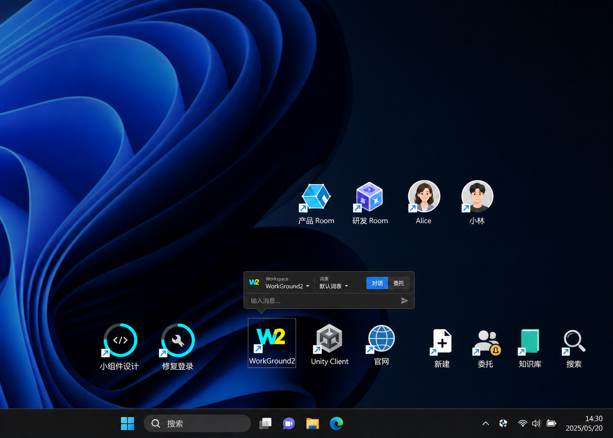
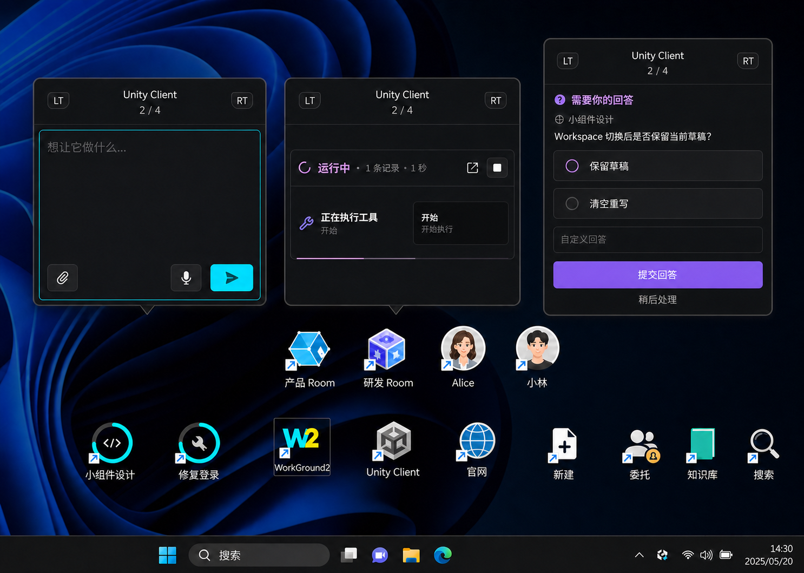
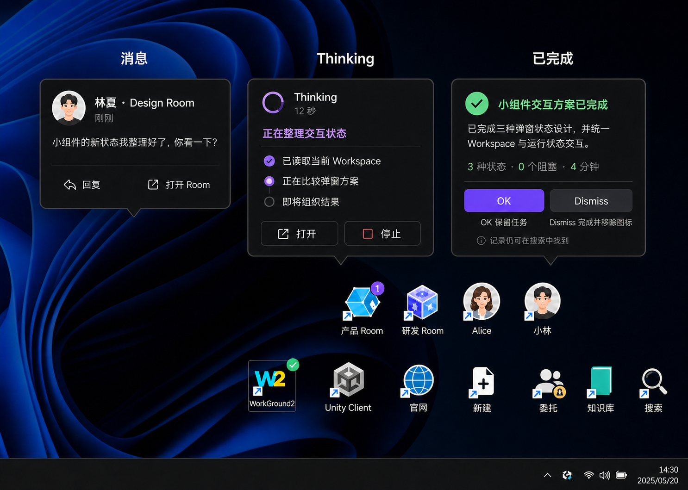

# WorkGround2 桌面图标小组件模式设计

状态：产品形态已确认，待交互原型与技术验证  
版本：V2 概念设计  
日期：2026-08-18  
适用端：WorkGround2 Desktop（Windows 优先）

> 本文描述新版本“桌面图标组”小组件。现有已实现的传呼机窗口方案保留在 [widget-mode-design.md](widget-mode-design.md)，两套方案分别演进。

## 1. 产品定义

小组件模式以一组 Windows 桌面快捷方式的形态常驻桌面右下角。每个图标代表一个可直接操作的真实对象：Room、个人、运行任务、常用 Workspace 或固定功能。

核心目标：

1. 用户不打开主窗口也能看到“谁在说话、什么在运行、哪里需要回答”。
2. 从桌面快速发起工作，只输入内容并选择 Workspace。
3. 把有限的高频、近期对象留在桌面，其余内容统一通过搜索找回。
4. 状态始终附着在来源图标上，不设置独立通知中心图标。

## 2. 桌面信息架构

图标固定为两排，上排靠近下排，整体贴近桌面右下角安全区。禁止加入中间第三排、共享 Dock、背景托盘或外层容器。

### 2.1 上排：Room 与个人

- Room 各自拥有独立图标，例如“产品 Room”“研发 Room”。
- 常联系的人各自拥有独立头像图标。
- 有新消息时，未读标记直接显示在来源图标上。
- 点击图标打开信息弹窗；双击或弹窗内“打开 Room”进入完整会话。

### 2.2 下排：运行任务、Workspace、固定功能

从左到右分为三个连续区域：

| 区域 | 内容 | 规则 |
|---|---|---|
| 运行区 | 正在运行的普通任务 | 每个非委托任务独享一个图标；运行时带动画 |
| Workspace 区 | 常用 Workspace | 每个常用 Workspace 独享一个图标 |
| 固定功能区 | 新建、委托、知识库、搜索 | 顺序稳定，始终靠右 |

补充规则：

- 委托任务不占用独立运行图标，由固定“委托”入口聚合展示状态与数量。
- 默认只保留有限数量的近期对象和近期会话；超出部分不继续堆叠图标，通过搜索访问。
- 图标排序变化应稳定、克制。任务完成后在用户处理完成弹窗前保持原位，避免图标突然跳动。

### 2.3 布局示意



图 1 只确认两排图标的空间关系与分组。图中的旧版快速发起内容已由第 3 节的交互方案替代。

## 3. 快速发起与搜索

点击“新建”或使用全局快捷键打开快速发起弹窗。

### 3.1 内容结构

- 主体为大面积对话输入框。
- 只允许用户填写“内容”和选择“Workspace”。
- 不显示“对话 / 委托”模式选择。
- 不显示词表选择；Workspace 切换时自动切换对应词表。
- 输入区可保留附件、语音和发送入口。

### 3.2 Workspace 切换

- 弹窗顶部显示当前 Workspace 与页码，例如 `Unity Client · 2 / 4`。
- 左右两侧使用 `LT` / `RT` 切换，形成游戏手柄翻页感。
- 键盘、鼠标和手柄均应支持切换。
- 切换后输入草稿保留，词表在后台同步更新。
- 发送时锁定所选 Workspace；重试复用同一请求 ID，防止重复创建任务。

### 3.3 搜索结果窗口

- 搜索结果窗口的最大可见高度固定为 `7` 行结果。
- 少于 7 条时按实际结果数量收缩；超过 7 条时窗口高度不再增长，在结果区内部滚动。

## 4. 任务弹窗

普通任务图标承载任务生命周期。单击图标打开当前状态弹窗；弹窗始终位于所属图标正上方，并通过底部小箭头指向来源图标。



### 4.1 运行中

- 图标外圈、光点或呼吸效果持续表达“正在运行”。
- 弹窗内显示缩小版运行卡，保留当前阶段、记录数、耗时和正在执行的工具。
- 只展示最近一条关键动作，避免把完整日志塞进桌面弹窗。
- 提供“打开任务”和“停止”操作。
- 异常和可重试失败必须显式显示；重试不得创建重复任务。

### 4.2 需要用户回答

- 标题明确显示“需要你的回答”。
- 先显示问题来源与问题正文。
- 所有建议答案纵向排列，每行一个，禁止横向并列。
- 最后一项为自定义回答输入框。
- 主操作为“提交回答”，次操作为“稍后处理”。
- 提交期间禁用重复点击；失败时保留选择与输入，允许安全重试。
- “稍后处理”只关闭弹窗，图标继续保留待处理标记。

## 5. Room / 个人信息弹窗

Room 和个人共用“有人说话”的信息弹窗，不设置独立通知图标。

内容从上到下为：

1. 头像、姓名或 Room 名称、时间。
2. 最新一条消息摘要。
3. “回复”和“打开 Room”。

交互规则：

- 弹窗保持短小，适合扫读一条消息。
- “回复”进入就地快速回复；“打开 Room”进入完整会话。
- 同一来源连续消息可更新现有弹窗和未读数量，不能生成多个重叠弹窗。
- 已读状态写回单一消息模型；重复或迟到事件不得让已读消息重新变为未读。

## 6. Thinking 弹窗

Thinking 表达模型仍在工作，同时向用户提供可理解的公开进度。

展示内容：

- 标题 `Thinking`、活动动画和已用时间。
- 当前阶段摘要，例如“正在整理交互状态”。
- 最多三条阶段状态：已完成、进行中、下一步。
- “打开”和“停止”操作。

进度文案只描述可公开的工作阶段，例如“已读取当前 Workspace”“正在比较弹窗方案”“即将组织结果”。不展示模型内部推理、隐藏思维链或未经整理的中间文本。

动效使用低频旋转、呼吸或进度点。开启 `prefers-reduced-motion` 时改为静态状态图标与文字更新。

## 7. 任务完成弹窗

完成态使用简明新闻体，让用户先看到结论，再决定是否清理桌面。



### 7.1 内容层级

1. 成功图标与任务标题，例如“小组件交互方案已完成”。
2. 一句话导语，直接概括交付结果。
3. 最多三个事实数据，例如“3 种状态 · 0 个阻塞 · 4 分钟”。
4. `OK` 与 `Dismiss` 两个操作。
5. 弱提示“记录仍可在搜索中找到”。

### 7.2 操作语义

| 操作 | 弹窗 | 任务状态 | 桌面图标 | 历史记录 |
|---|---|---|---|---|
| `OK` | 关闭 | 已完成、暂留 | 保留，显示绿色完成标记 | 保留，可搜索 |
| `Dismiss` | 关闭 | 确认完成 | 消失 | 保留，可搜索 |

`Dismiss` 只清理桌面入口，不删除任务和会话记录。重复执行 `OK` 或 `Dismiss` 必须幂等；客户端未收到确认时保留当前弹窗并允许重试。

## 8. 状态与通知规则

桌面图标是状态来源，所有提示都回到对应图标：

| 对象 | 空闲 | 新消息 / 待处理 | 运行中 | 已完成 |
|---|---|---|---|---|
| Room / 个人 | 普通图标 | 未读点或数量 | — | — |
| 普通任务 | — | 问号或紫色标记 | 动画外圈 | 绿色勾 |
| 委托 | 普通固定图标 | 聚合数量 | 聚合动画 | 聚合完成数量 |
| Workspace | 普通图标 | 可选上下文标记 | 可选活动提示 | — |

### 8.1 弹窗锚定

- 谁产生的信息，弹窗就出现在谁的图标正上方。
- 弹窗默认水平居中于图标，底部指针精确指向图标中心。
- 靠近屏幕边缘时允许弹窗水平内移，但指针仍指向来源图标；正常桌面布局不翻转到图标下方。
- 同一时刻只展开一个弹窗。切换图标时关闭前一个弹窗，再在新图标上方打开对应内容。
- 自动到达的新通知只更新来源图标和未读数，不抢走用户当前正在查看或操作的弹窗。

### 8.2 图标状态

图标同时表达运行状态和未读信息。Windows 快捷方式箭头继续保留，各状态使用固定位置避免互相遮挡：

| 状态 | 图标表现 | 动效 |
|---|---|---|
| 运行中 / Thinking | 紫色或青色外圈、活动光点 | 低频旋转或呼吸 |
| 成功 | 右下角绿色勾 | 首次完成时轻微出现动画，随后静止 |
| 失败 | 右下角红色感叹号或断裂外圈 | 到达时脉冲一次，随后静止 |
| 需要回答 | 紫色问号，并保留未读数 | 到达时脉冲一次 |
| 需要确认 | 黄色确认标记，并保留未读数 | 到达时脉冲一次 |

- 未读计数固定在图标右上角，状态标记固定在右下角，运行外圈围绕图标本体。
- 成功、失败和运行状态必须同时使用颜色与形状表达。
- 成功和失败都会生成一条未读信息，并显示对应的绿色勾或红色失败标记。
- 失败若需要用户补充信息，进入“需要回答”优先级；成功、普通失败以及只需重试 / 确认的失败默认进入“需要确认”优先级。

### 8.3 每图标未读计数

- 每个图标维护自己的信息队列和未读计数，不设置全局通知图标。
- 计数表示该对象尚未处理的信息条数；不同图标之间不合并。
- Room / 个人消息打开并完成可见阅读后记为已读。
- 需要回答和需要确认的内容在用户完成对应操作前持续计入未读。
- 运行 / Thinking 是实时状态流，不进入信息队列，也不产生未读计数；状态更新只替换当前进度与时间。
- 运行结束后，成功和失败都转化为离散事件并增加未读计数；需要回答和需要确认同样按各自事件增加未读。
- 重复投递和旧 revision 不增加计数；重启后从同一状态源恢复。

### 8.4 弹窗与通知优先级

同一图标存在多条信息或实时状态时，单击优先展示最高级内容。全局自动提示也使用同一顺序：

1. 用户刚刚发起的操作，例如新建会话、发送回答、执行快速操作。
2. 需要用户回答的内容。
3. 需要用户确认的内容，包括任务成功、失败和完成确认。
4. Room 和其他用户的消息。
5. 运行 / Thinking 实时状态；它不是未读通知，仅在没有更高优先级内容时作为状态兜底，同级时新的状态优先于旧的状态。

前四级同级信息按进入队列的时间稳定排序，避免旧的待处理项长期饿死。用户正在输入、选择或确认时，任何后台通知都不能抢占当前弹窗。

### 8.5 图标响应

| 输入 | 响应 |
|---|---|
| 悬停 | 立即播放轻微反馈动画；持续停留达到配置时长后显示只读状态预览 |
| 单击 | 有通知时展示该图标最高优先级通知；没有通知时展示快速操作面板；再次单击可关闭 |
| 双击 | 执行默认操作：打开该对象对应会话的完整界面 |
| 右键 | 打开该图标的选项菜单，例如打开、固定 / 取消固定、标记已读、完成、移除 |
| 拖动 | 改变图标位置；释放后吸附到两排网格并持久化 |

手势判定规则：

- 双击成立后取消尚未执行的单击动作，避免弹窗闪现后再打开主界面。
- 指针移动超过拖动阈值后进入拖动状态，并取消单击 / 双击候选。
- 右键菜单不改变未读状态；点击桌面空白处或按 `Esc` 关闭菜单。
- Room / 个人只在上排重排；任务、Workspace 和固定功能只在下排各自允许的区域重排，保持两排信息架构。
- 拖动结果写入单一布局状态；保存失败时恢复原位置并显式提示，可安全重试。

### 8.6 悬停状态预览

悬停分为即时反馈和延迟预览两个阶段：

1. 鼠标进入图标后立即播放一次轻微动画，例如图标上浮 `2px`、外圈提亮或状态光点轻扫。
2. 指针持续停留默认 `1.2 秒` 后，在该图标正上方显示只读状态预览。

状态预览保持一行或两行，按对象显示当前最重要的信息：

- 任务：运行 / Thinking 阶段、耗时，或成功 / 失败摘要。
- Room / 个人：未读数量与最新消息来源，不展开消息正文。
- Workspace：名称、当前词表和活动任务数量。
- 固定功能：功能名称与可用的主要操作。

交互约束：

- 悬停预览不标记已读、不改变通知优先级、不获取键盘焦点，也不包含按钮。
- 单击图标时，状态预览在同一锚点原位升级为通知弹窗或快速操作面板，避免位置跳动。
- 鼠标离开图标和预览区域后关闭；短暂跨越图标与预览之间的空隙不应闪烁。
- 弹窗、右键菜单或拖动已经激活时，不再启动悬停计时器。
- 图标内部的小范围移动不重置计时；离开命中区域、开始拖动或切换图标时取消计时。
- 键盘焦点进入图标时提供等价的状态预览；`Esc` 可关闭。
- `prefers-reduced-motion` 下取消位移和光扫，只保留静态提亮。

悬停延迟使用用户级配置 `hoverStatusDelayMs`，默认值为 `1200`。配置变更立即生效并持久化；设置为 `0` 时关闭延迟状态预览，但保留即时悬停反馈。

## 9. 概念状态模型

建议由单一桌面投影生成 UI，避免 Room、任务、Workspace 和红点各自维护平行状态。

```text
DesktopItem
├─ id / kind / sourceId
├─ title / icon / order
├─ status: idle | unread | thinking | running | needs_input | done | failed
├─ unreadCount / notifications[]
├─ runtimeStatus: phase / summary / elapsed / updatedAt
├─ badge / animation / position / hovered
└─ popup: message | quick_start | runtime | answer | confirm | thinking | completion
```

所有用户动作携带 `itemId + revision + requestId`。后端返回 `accepted`、`already_applied`、`stale`、`retryable_error` 或 `invalid`，UI 不靠日志猜测结果。

## 10. 可靠性与恢复

- 重启后恢复图标顺序、常用 Workspace、未读、运行、待回答和已完成暂留状态。
- 重启后恢复每个图标的位置、未读计数与各自的信息队列。
- 重复事件以 `itemId + revision` 去重。
- 迟到事件只能更新对应对象，不改变用户当前展开的弹窗。
- 网络失败显式显示，可使用同一请求 ID 重试。
- `Dismiss` 在服务端确认前不移除图标；确认丢失后可查询最终状态并自愈。
- 搜索索引与桌面显示解耦，图标消失不影响任务记录可检索性。

## 11. 视觉与可访问性

- 桌面图标遵循 Windows 快捷方式的尺度、标签和选中反馈。
- 弹窗使用深色石墨背景、细边框、轻阴影；紫色表达活动和待处理，绿色只表达完成。
- 弹窗宽度保持紧凑，箭头明确指向来源图标。
- 文字和按钮均使用真实 UI 组件，示意图中的文字不作为生产图片资源。
- 所有点击目标至少 `36 × 36px`，完整键盘可达。
- 状态不能只依赖颜色，必须同时使用图形和文字。
- Room / 个人消息使用 `aria-live="polite"`，失败和需要回答使用更明确的可访问提示。

## 12. MVP 验收标准

- 桌面右下角始终只有两排图标，上下排距离紧凑。
- 上排只包含 Room 与个人；下排顺序为运行任务、常用 Workspace、固定功能。
- 每个普通运行任务独享图标；委托任务由“委托”固定入口聚合。
- 没有独立通知图标，所有红点和弹窗都能追溯到来源对象。
- 快速发起只包含内容和 Workspace，Workspace 可用 `LT` / `RT` 切换，词表自动跟随。
- 搜索结果窗口最多显示 `7` 行高度，更多结果在窗口内部滚动。
- 运行中能看到缩小版执行卡；需要回答的选项纵向排列。
- Room / 个人消息、Thinking、完成三种弹窗均可从对应图标打开。
- 所有弹窗位于来源图标正上方，边缘避让后仍能明确指向来源。
- 每个图标独立显示未读计数，并按“用户操作 > 需要回答 > 需要确认 > Room / 个人消息 > 运行 / Thinking”选择内容；运行 / Thinking 不计入未读。
- 任务成功和失败都会产生未读，直到用户查看并完成对应确认。
- 单击、双击、右键和拖动互不误触；拖动后位置可恢复。
- 悬停立即有轻微反馈；默认停留 `1.2 秒` 后显示只读状态预览，延迟可配置。
- `OK` 保留已完成任务图标；`Dismiss` 标记完成并移除图标；两者都不删除可搜索记录。
- 重复、乱序、迟到事件和重试不会产生重复任务、重复回答或错误红点。

## 13. 待后续验证

- 两排图标在不同 Windows 缩放比例、分辨率和多显示器下的锚点策略。
- 同时出现大量运行任务时的图标上限、折叠规则和搜索衔接。
- 弹窗自动出现、仅更新图标或延迟出现的打扰阈值。
- 手柄 `LT` / `RT`、键盘和鼠标之间的焦点切换细节。
- `Dismiss` 是否支持短时撤销，以及撤销入口放在桌面还是搜索结果中。
