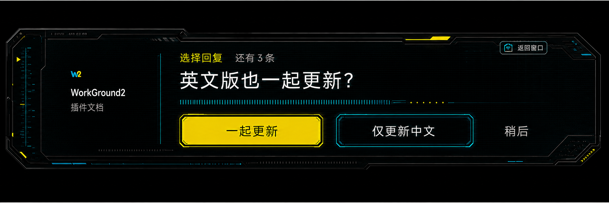
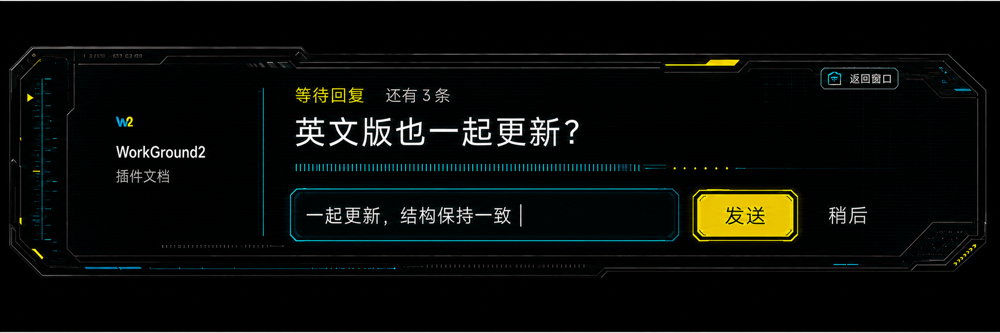
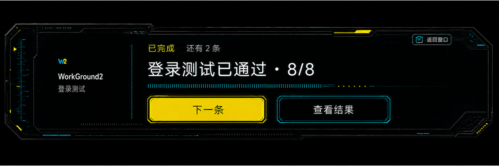
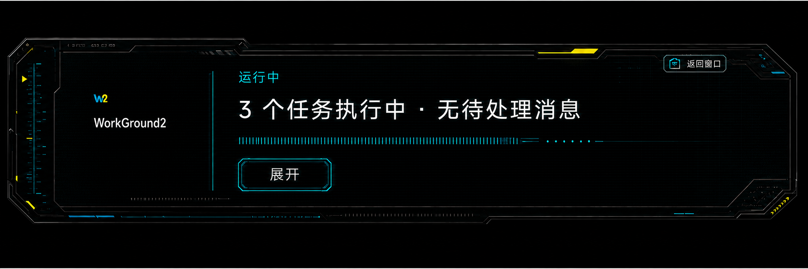

# WorkGround2 小组件模式设计

状态：已实现并通过视觉、交互与生产构建验收
适用端：Wails Desktop（Windows 优先，macOS / Linux 保留同一状态模型）
视觉基准：深色石墨机壳、青色 `#00F0FF`、酸性黄 `#FCEE09`、单条消息传呼机模型

## 1. 目标

把主窗口缩成一个常驻桌面的“传呼机”。小组件只负责三件事：

1. 显示当前最需要用户处理的一条信息。
2. 允许用户直接回复、点选或确认结果。
3. 没有重要信息时，显示聚合运行状态，并可直接发起新对话。

多任务可以同时运行，完成和待回复消息可以累计。界面同一时刻只展示一条主要信息；查看主要信息时，唯一允许同时出现的队列信息是“还有 N 条”。

## 2. 设计原则

- 单条优先：禁止消息列表、任务列表、轮播卡片和多条摘要并排。
- 上下文先行：项目名、任务名固定放在左侧身份区，用户扫一眼即可知道消息来源。
- 文字优先：图标保持小尺寸，主要空间交给消息和回复。
- 结果可跳过回复：完成结果只提供“下一条”和“查看结果”。
- 操作不丢消息：发送、确认、跳过均等待后端确认；失败后保留当前项并允许安全重试。
- 固定回主窗口：右上角始终显示带黄色模式图标的“主窗口 / FULL VIEW”控制，位置不随状态变化。
- 自动路由：新对话不展示 workspace 列表；系统按项目名、最近主题、当前工作区的顺序选择，并短暂显示选择结果与依据。
- 状态可恢复：主窗口几何、小组件几何、消息来源状态、已处理回执和“稍后”顺序互不覆盖；重启后从 Controller 与 attention sidecar 恢复。

## 3. 视觉参考

### 点选回复



### 文字回复



### 只看结果



### 无待处理消息



这些图用于视觉验收。实现时文字、按钮、输入框和 Lucide 图标都使用真实组件，不烘焙进底图。

## 4. 信息层级

从高到低：

1. 当前主要信息或聚合运行状态。
2. 当前信息的操作。
3. 状态类型和剩余主要信息数量。
4. 项目名和任务名。
5. 装饰性标尺、扫描线和信号分隔线。

### 左侧身份区

- W2 图素：左上偏置，默认高度 `28px`。
- 项目名：`20px / 600`，高对比白色，必须比任务名明显。
- 任务名：`14px / 400`，弱化灰色。
- 无消息运行状态不显示任务名，避免虚构当前上下文。

### 顶部状态行

- 状态：`15px / 600`。
- 有当前消息时，状态右侧显示 `还有 N 条`。
- `N` 表示当前项之后仍未查看的主要信息数量，不包含当前项。
- 无当前消息时不显示剩余数量。

### 主要信息

- 单行优先，`28–34px / 500`。
- 中文建议不超过 24 个字；英文建议不超过 64 个字符。
- 超长文本允许两行，第二行后省略；完整内容通过“返回窗口”查看。
- 消息内保留最少必要数字，例如 `登录测试已通过 · 8/8`。

## 5. 状态与操作

| 状态 | 主要内容 | 操作 | 是否显示剩余数 |
|---|---|---|---|
| `choice` | 一个问题 | 1 个主选项、最多 1 个次选项、`稍后` | 是 |
| `reply` | 一个问题 + 单行输入 | `发送`、`稍后` | 是 |
| `result` | 一条完成结果 | `下一条`、`查看结果` | 是 |
| `error` | 一条失败摘要 | `重试`、`查看详情` | 是 |
| `running` | 聚合运行状态 | `展开` | 否 |
| `idle` | `暂无运行任务` | `新对话` | 否 |
| `new` | 新对话单行输入 | `发送`、`取消` | 否 |
| `routed` | `已交给 {workspace}` | 无，短暂确认后进入运行状态 | 否 |

`返回窗口`属于固定窗口控制，不计入消息操作数量。

### 点选回复

- 选项总数最多 3 个。
- 主选项使用黄色实底。
- 次选项使用青色描边。
- `稍后`使用纯文字或低对比描边。
- 点击后立即禁用所有选项，显示短暂发送态；后端确认后才切换下一条。

### 文字回复

- 单行输入框；`Enter` 发送，`Esc` 保持消息并退出输入焦点。
- 输入为空时禁用“发送”。
- 发送失败保留原文，不清空输入。
- 重试复用同一 `requestId`，防止重复提交。

### 只看结果

- `下一条`确认已读并前进。
- `查看结果`返回主窗口并定位到对应任务；不改变已读状态，直到用户显式点“下一条”或结果详情确认已读。

### 无消息运行状态

- 文案格式：`{runningCount} 个任务执行中 · 无待处理消息`。
- 只显示聚合数量，不展示任务名称列表。
- 健康运行使用青色；黄色只保留在机壳装饰。
- 右下角只增加一个“新对话 / 自动选择工作区”入口；进入输入态后，运行状态被替换，仍只显示一条主要信息。

### 新对话与 workspace 自动选择

1. 用户在空闲/运行状态点击“新对话”，直接在小组件内输入任务。
2. 明确提到项目名或目录名时，路由到该项目。
3. 没有名称命中时，使用最近主题标题与输入的上下文重合度选择。
4. 仍无上下文命中时，优先当前项目；没有可用项目时落到 Global。
5. 创建后只显示一条确认：`已交给 {workspace}`，旁边显示 `名称匹配 / 历史上下文 / 当前工作区 / Global 兜底`。
6. 对话运行、提问、完成结果继续沿用同一小组件状态模型；完成消息优先显示助手最终回复的 110 字以内摘要。

发送使用稳定 `requestId`。后端先持久化路由和发送阶段回执，再创建空白 Tab、等待 Controller 就绪并提交。IPC 断开或应用重启后可使用同一 `requestId` 重试；若历史中已经存在完全一致的用户消息，则恢复为已发送，避免重复创建 turn。同一 `requestId` 携带不同文本会显式返回 `invalid`。

## 6. 多任务消息模型

小组件展示由单一 `WidgetSnapshot` 推导。React 不直接拼接网络回包或跨 Tab 猜测状态。

```go
type AttentionKind string

const (
    AttentionChoice AttentionKind = "choice"
    AttentionReply  AttentionKind = "reply"
    AttentionResult AttentionKind = "result"
    AttentionError  AttentionKind = "error"
)

type AttentionItem struct {
    ID          string
    Revision    int64
    RequestID   string
    ProjectID   string
    ProjectName string
    TaskID      string
    TaskName    string
    Kind        AttentionKind
    Priority    int
    Message     string
    Actions     []AttentionAction
    CreatedAt   time.Time
}

type WidgetSnapshot struct {
    Current        *AttentionItem
    RemainingCount int
    RunningCount   int
    Version        int64
}
```

### 排序

优先级从高到低：

1. 阻塞用户决策。
2. 需要用户回复。
3. 失败且可重试。
4. 完成结果。

同一优先级按 `CreatedAt` 先进先出。迟到消息使用事件时间排序，但已经展示过的当前项不被抢走；新高优先级项进入下一位，避免界面突然换题。

### 去重与合并

- `ID + Revision` 是幂等键。
- 重复投递只更新同一项，不增加剩余数量。
- 同一任务连续完成事件只保留最新 revision，结果文案合并为一条。
- 已确认消息再次到达时根据已读游标丢弃。
- 应用重启后从持久化队列恢复，当前项和剩余数保持一致。

### 消息简化

后端生成 `displayMessage`，UI 不自行截取业务含义：

- 保留对象、动作、结果三个核心元素。
- 去掉时间戳、日志前缀、重复项目名和实现细节。
- 错误只显示可行动摘要，例如 `构建失败 · 可重试`。
- 完整日志和工具输出只在主窗口中展示。

## 7. 状态入口与可靠性

实现复用了 `internal/control.Controller.PendingInteraction()`、`RuntimeStatus()` 与 Tab attention sidecar 作为单一可信源，把跨 Tab 聚合和原生窗口几何放在 `desktop`：

- `internal/control`：继续负责真实的运行状态、待确认和待回复，不新增平行队列。
- `desktop/widget_mode.go`：消息投影、排序、稳定当前项、幂等动作回执、“稍后”、进入/退出和独立几何。
- `desktop/widget_conversation.go`：新对话 workspace 路由、可恢复创建、Controller 就绪等待和幂等发送回执。
- `desktop/frontend/src/components/widget/`：纯展示和用户输入。

公共入口保持少而清楚：

```go
EnterWidgetMode() (WidgetWindowView, error)
ExitWidgetMode() error
GetWidgetSnapshot() WidgetSnapshot
ApplyWidgetAction(input WidgetActionInput) WidgetActionResult
StartWidgetConversation(input WidgetConversationInput) WidgetConversationResult
```

`ApplyWidgetAction`必须携带 `itemID`、`revision`、`requestID` 和动作值。`StartWidgetConversation`必须携带 `prompt` 与 `requestID`。后端返回 `accepted`、`already_applied`、`stale`、`retryable_error` 或 `invalid`，禁止只靠日志表达结果。

## 8. 窗口行为

项目当前使用 Wails `v2.12.0`，本地 runtime 已提供 `WindowUnmaximise`、`WindowSetSize`、`WindowSetPosition`、`WindowSetAlwaysOnTop`、`WindowShow` 和几何读取 API。

### 进入小组件

1. 若已经处于小组件模式，直接返回当前状态，重复调用无副作用。
2. 保存主窗口几何到 `desktop-window.json`。
3. 取消最大化。
4. 恢复上次小组件位置；首次进入放在当前显示器右下角安全区。
5. 设置原生窗口尺寸，默认 `590 × 142`；内部继续使用 `1180 × 284` 逻辑画布并整体缩放 `50%`，保证既有排版和九宫格比例不漂移。
6. 可配置置顶；默认开启。
7. 切换 React 根视图为 widget surface。

### 返回主窗口

1. 固定“主窗口 / FULL VIEW”模式控制调用 `ExitWidgetMode()`；黄色图标区与文字区共同点击。
2. 关闭置顶。
3. 恢复主窗口几何和最大化状态。
4. 如果由某条结果触发，主窗口定位到对应 `TaskID`。
5. 重复调用安全；中途失败保留可重试状态，并继续显示“返回窗口”。

### 几何持久化

主窗口和小组件必须使用两个文件：

```text
desktop-window.json
desktop-widget-window.json
```

现有 `useWindowStatePersistence` 在小组件模式下不能覆盖主窗口几何。保存入口应根据当前 surface 路由到对应文件。

## 9. 布局规格

底图设计空间为 `2132 × 512`。内部逻辑画布为 `1180 × 284`，再缩放到 `590 × 142` 原生窗口。运行时定义：

```text
assetScale = logicalHeight / 512
windowScale = 0.5
```

默认 `assetScale ≈ 0.555`，最终屏幕总缩放约为 `0.277`。窗口最小可缩到 `520 × 128`，旧版 `1180 × 284` 几何会自动失效并迁移到新默认值。

| 区域 | 设计坐标 | 说明 |
|---|---:|---|
| 标尺覆盖层 | `x 24–96` | 单独图素，不进入 9 宫格 |
| 身份区 | `x 120–540` | W2、项目名、任务名 |
| 固定分隔线 | `x ≈ 532` | 烘焙在左切片中 |
| 消息区 | `x 620–1800` | 状态、剩余数、消息、输入 |
| 主窗口模式控制 | `x 1770–2020`，`y 44–108` | 所有状态固定；黄色图标 + 双行文案 |
| 操作区 | `y 300–424` | 选项、发送、下一条 |

布局使用同一 CSS Grid，不因状态切换改变左区、消息区和窗口控制区的宽度。状态变化只替换中央内容。

## 10. 颜色与字体

组件使用独立 token，避免覆盖主应用主题：

```css
--widget-bg: #030708;
--widget-surface: #071013;
--widget-cyan: #00f0ff;
--widget-yellow: #fcee09;
--widget-text: #f4f6f7;
--widget-text-muted: #9aa4a8;
--widget-error: #ff4d5a;
--widget-font: var(--font-ui);
```

Windows 继续使用项目现有 `Segoe UI Variable Text / Microsoft YaHei UI` 字体链。按钮和正文不引入新字体，保证中文宽度与主应用一致。

## 11. 9 宫格底图

### 文件

- 完整底图：`desktop/frontend/src/assets/widget-mode/pager-shell.png`
- 切线元数据：`desktop/frontend/src/assets/widget-mode/pager-shell.9.json`
- 九个切片：`desktop/frontend/src/assets/widget-mode/pager-shell.9/*.png`
- 生成脚本：`desktop/frontend/scripts/build-widget-slices.ps1`

底图已移除文字、按钮、W2 和重复标尺。左侧标尺改为单独覆盖层，防止垂直拉伸破坏刻度间距。

### 切线

源图：`2132 × 512`

```json
{
  "left": 576,
  "top": 112,
  "right": 800,
  "bottom": 160
}
```

中心拉伸区：`x=576, y=112, width=756, height=240`。

右切片故意保留较宽，确保顶部黄色机壳装饰、右上控制区和右下切角不会被横向拉变形。左切片完整保留身份区和固定分隔线。中心切片只包含可安全缩放的暗色网格纹理。

### 渲染

推荐用三行三列 CSS Grid 放置九张图，图片 `width/height: 100%`，`pointer-events: none`。切片轨道先按高度计算统一比例，再把剩余宽高全部交给中心轨道：

```ts
const scale = height / 512;
const left = snap(576 * scale, dpr);
const right = snap(800 * scale, dpr);
const top = snap(112 * scale, dpr);
const bottom = snap(160 * scale, dpr);
const centerWidth = width - left - right;
const centerHeight = height - top - bottom;
```

`snap`需要对齐设备像素，减少切片接缝：

```ts
const snap = (value: number, dpr: number) => Math.round(value * dpr) / dpr;
```

最小尺寸必须保证 `centerWidth >= 220px` 且 `centerHeight >= 96px`。超出推荐范围时优先限制窗口尺寸，避免大幅拉伸顶部纹理。

九张切片已按原尺寸重组抽样验证，`8px` 步长像素不一致数为 `0`。

## 12. 独立图素

| 文件 | 用途 | 规则 |
|---|---|---|
| `calibration-rail.png` | 左侧非拉伸标尺 | 透明 PNG；高度随内容区缩放，保持纵横比 |
| `w2-mark.png` | 青黄 W2 标识 | 透明 PNG；默认高度 `28px`，不拉宽 |
| `pager-shell.png` | 完整机壳源图 | 只用于参考或 `border-image` 方案 |
| `pager-shell.9/*` | 生产 9 宫格 | 默认实现使用 |

按钮、输入框和“返回窗口”图标使用真实 UI 组件。图标从现有 `lucide-react` 选择 `PanelTopOpen` 或 `Maximize2`，尺寸 `14px`。按钮轮廓由组件样式控制，方便 hover、focus、disabled 和高 DPI 渲染。

## 13. 动效与声音

- 进入小组件：`160ms` 缩放和淡入。
- 切换消息：旧内容 `80ms` 淡出，新内容 `120ms` 淡入；机壳不移动。
- 完成累计：只更新“还有 N 条”，不连续弹跳。
- 新阻塞消息到达：一次轻微黄色脉冲，最多 `600ms`。
- `prefers-reduced-motion` 下关闭位移和脉冲，只保留瞬时透明度变化。
- 声音默认关闭；以后接入时按消息类别节流，同一批完成最多响一次。

## 14. 可访问性

- 当前消息容器使用 `aria-live="polite"`；失败使用 `role="alert"`。
- “还有 N 条”提供完整读屏文案：`当前消息之后还有 N 条待查看信息`。
- 键盘焦点顺序：当前输入/选项 → 次操作 → 返回窗口。
- 所有点击目标最小 `36 × 36px`。
- 黄色按钮文字使用近黑色，青色描边按钮文字使用白色。
- 焦点环使用 `2px #00F0FF`，不能只依赖颜色表达状态。

## 15. 验收标准

### 视觉

- 四种参考状态在同一窗口尺寸截图对比时，机壳、身份区、返回窗口和内容基线不跳动。
- W2 位于身份区左上，项目名明显强于任务名。
- 任意有消息状态只出现一条主要信息和一个剩余数量。
- 无消息状态不出现任务列表、剩余数量和虚构任务名。
- 9 宫格在 `520 × 128`、`590 × 142`、`720 × 180` 三档无明显接缝、切角变形或标尺拉伸。
- 四角必须透出桌面内容；WebView、页面根节点和小组件外层保持透明，机壳使用切角裁剪，不能留下矩形黑底。

### 行为

- 多任务同时完成时按顺序逐条查看，剩余数量正确递减。
- 重复事件不增加数量。
- 发送失败保留当前消息和输入，可使用同一 request ID 重试。
- “返回窗口”在所有状态可用，且不确认当前消息。
- 退出再进入小组件后队列、已读游标和窗口位置可恢复。
- 小组件几何不会覆盖主窗口几何。

### 测试建议

- Go：attention 去重、乱序、迟到、确认幂等、持久化恢复、窗口模式重复进入/退出。
- React：单消息约束、剩余数语义、每种状态操作、发送失败保留输入、固定返回按钮。
- 视觉：三档尺寸截图与本目录四张参考图对比，并在浅色背景上检查四角透明度。
- 资源：运行 `build-widget-slices.ps1` 后验证 manifest、九个文件尺寸和原尺寸无缝重组。

## 16. 实现顺序

1. 从现有 Controller / Tab 状态建立 `WidgetMessage` 投影和幂等确认接口。
2. 增加独立的小组件窗口状态持久化和 Wails 进入/退出接口。
3. 构建九宫格机壳、身份区和固定返回窗口控制。
4. 实现 `choice`、`reply`、`result`、`running`，随后补 `error` 和 `idle`。
5. 接入多 Tab 聚合、恢复和重试。
6. 按三档尺寸做视觉对比和交互测试。

## 17. 实现与验证记录

- 九宫格生产资源：`desktop/frontend/src/assets/widget-mode/pager-shell.9/`，原尺寸重组抽样像素差为 `0`。
- 后端：`desktop/widget_mode.go`；定向测试：`desktop/widget_mode_test.go`。
- 前端：`desktop/frontend/src/components/widget/WidgetMode.tsx` 与 `widget-mode.css`。
- 浏览器视觉检查：初版 `1180 × 284` 与 `960 × 260` 无横向/纵向溢出；选择、文字发送、结果、错误、运行状态均已截图验收。
- 2026-07-16 尺寸修正：原生窗口调整为 `590 × 142`，内部逻辑画布整体缩放 `50%`；Windows WebView 与窗口启用透明合成，机壳切角外区域真实透出桌面。
- 2026-07-16 新对话：空闲态增加单入口输入；后端自动选择 workspace、复用/创建空白 Tab 并通过现有 Controller 提交；发送阶段持久化、可重试、可恢复。返回窗口改为黄色模式图标与“主窗口 / FULL VIEW”双行控制。
- 交互检查：点选回复和键入发送均成功，失败信息保留输入并复用同一 `requestId`。
- 构建检查：前端 `npm.cmd run build` 通过；Wails Windows production build 通过。
- 全量桌面既有测试中仍有与本功能无关的 Windows 临时目录清理、Topic tree 时序失败；本功能定向测试全部通过。
